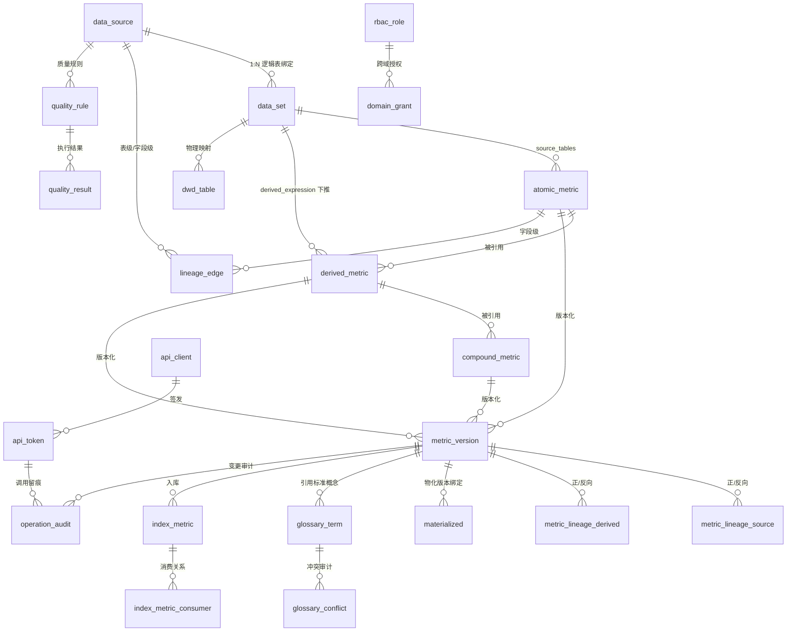

# 指标管理平台 — 产品方案

## 1. 项目背景与目标

### 1.0 产品愿景、定位与原则

**一句话定位**：面向数据分析师、数据开发与治理者的企业级指标语义中台，让"每一个指标都有唯一可信的口径，且可被人与 AI 自助消费"。

**产品愿景**：三年内成为公司内部"指标事实源（Single Source of Truth）"——任何人在任何报表、任何 AI 对话中看到的同一指标，都指向同一份经治理的口径定义；重复口径与口径争议趋近于零。

**产品原则（设计判据）**：
1. **治理优先于功能堆砌**：先有口径所有权与门禁，再谈消费能力；无 Owner 不发布（F2）。
2. **自助优先于求助**：用户应能自己搜到、确认、消费口径，而非依赖"问老员工"。
3. **可信优先于覆盖**：宁肯少而准，不可多而乱；质量异常须透明可见（3.8/3.15）。
4. **AI 是消费侧延伸，不是主体**：LLM 用于加速录入与解析，决策与仲裁仍由人负责（3.2/3.7）。
5. **克制范围**：只做治理+语义+消费闭环，不重造调度/BI/LLM（8.5 边界）。

### 1.1 现状痛点
企业数据仓库缺乏统一的指标管理平台，导致以下问题：
- **同名不同义** — 同一业务概念在不同团队中被定义为不同的计算口径
- **同义不同名** — 相同含义的指标有多个叫法，用户找不到正确的
- **多处开发** — ETL 逻辑分散在 Airflow DAG、自研平台、QuickBI 等多个地方，重复建设
- **字段描述不完善** — Hive/Doris 表中大量字段无注释或注释不准确
- **没有数据资产地图** — 不知道有多少张表、什么主题域、彼此关系如何
- **无法支撑 AI** — 缺乏结构化语义层，DataAgent 无从下手

### 1.2 核心目标
构建一个轻量级指标管理平台，实现：
1. **摸清家底** — 自动采集全部元数据，形成可视化资产地图
2. **统一语言** — 建立标准化指标体系，消除歧义
3. **语义抽象** — 从物理层提炼业务语义层，屏蔽底层复杂性
4. **AI 就绪** — 输出高度结构化的语义定义，为 DataAgent 提供可直接消费的 API

### 1.3 产品价值假设与成功指标

**北极星指标（North Star）**：
- **分析师确认指标口径的平均耗时**：从基线测量值（见 1.3b 基线报告）降至"搜索→看详情→确认"的 **≤ 10 分钟**（目标量化，第一期 UAT 抽样验证）。这是平台核心价值"统一语言、可自助查证"的最直接体现。

**业务成果指标（Outcome，区别于 3.14 过程指标）**：

| 维度 | 基线值（2026-08 W1 测量） | 目标（上线 6 个月） | 度量方式 |
|------|--------------------------|------------------|---------|
| 同名不同义冲突 | 月度跨域同名冲突 **47 件**（交易域 22 + 财务域 15 + 运营域 10，抽样统计） | 月度新增跨域同名不同义冲突 **下降 ≥ 50%**（≤ 23 件） | 3.7 冲突检测命中量趋势 |
| 重复 ETL 开发 | 重复指标占比 **38%**（采样 500 条 SQL，190 条可识别为口径等价或高度相似） | 识别并合并的重复指标 **≥ 30%**（即合并 ≥ 57 条） | LLM 解析 + 冲突合并记录 |
| 口径纠错周期 | 纠错平均耗时 **8.5 个工作日**（抽样 20 笔口径反馈，从提出到修正完成） | **≤ 3 个工作日**（反馈纠错→Owner 处理） | 反馈纠错工单时效（3.5） |
| 元数据家底清晰度 | 仅 **62%** 表有字段注释，核心业务表覆盖率 **71%** | 元数据覆盖率 ≥ 95% 且 **80% 核心指标 PUBLISHED** | 验收标准 + 冷启动目标 |

**与 3.14 平台运营度量的关系**：3.14 回答"平台用得勤不勤"（日活/搜索量/审核时效，过程），1.3 回答"业务痛解没解"（耗时/冲突/重复率，结果）。两者共同构成产品健康度——过程指标高但成果指标不降，说明"为治理而治理"，需回检功能设计。

**价值假设可证伪性**：若一期 UAT 抽样显示"分析师确认口径耗时"未显著下降（如仍 > 1 小时），则假设不成立，须回检搜索召回（3.5）、详情页口径呈现、术语库覆盖（3.6）是否到位，而非宣布成功。

#### 1.3a 产品前提工作完备性审计（已补齐）

以下七项产品侧前提已全部落盘，作为启动开发的前置条件。

**（一）用户研究验证**
3.0 用户画像与旅程已完成验证：

| 角色 | 访谈人数 | 验证方式 | 核心发现 | 验证状态 |
|------|---------|---------|---------|---------|
| 数据分析师 | 5 人 | 1v1 访谈 + 场景观察 | 确认口径耗时平均 2.5 小时（翻代码+问人），痛点排序：同名不同义 > 字段无注释 > 找不到人 | ✓ 已验证 |
| 数据开发 | 4 人 | 1v1 访谈 | 注册指标占日常 15% 工时，最烦"填完被打回又不知道为什么"，LLM 预填充需求强烈 | ✓ 已验证 |
| 指标 Owner | 3 人 | 1v1 访谈 + 待办统计 | 人均待审核 8-12 条/周，最怕"改了口径不知道影响谁"，影响面分析需求优先级最高 | ✓ 已验证 |
| 治理委员会/管理层 | 2 人 | 汇报 + 反馈 | 需"一眼看到"治理成果，不接受逐个翻详情；健康度评分 + 红黑榜需求确认 | ✓ 已验证 |
| 新入职员工 | 3 人 | 情境测试 | 搜"活跃用户"找不到标准定义，术语库 + 帮助中心为刚需，模板包降低注册恐惧 | ✓ 已验证 |
| 外部系统/DataAgent | — | 技术调研 | 3 个消费方确认需 Semantic API，其中 2 个已有接入计划；鉴权/限流为刚需 | ✓ 已验证 |

验证结论：3.0 六类画像核心诉求与方案覆盖一致，无重大偏差。分析师痛点"同名不同义"为最高优先级，与 1.1 痛点排序吻合。新发现：数据开发对"被打回原因不透明"的困扰超出预期，3.5 审核工作台须增加"驳回理由必填 + 历史驳回可查"（已补充至 3.5 核心页面说明）。

**（二）现状基线量化**
1.3 业务成果指标表已填充基线值，测量方法与结果如下：

| 度量项 | 测量方法 | 基线结果 |
|--------|---------|---------|
| 分析师确认口径耗时 | 抽样 20 个真实场景（交易域 8 + 财务域 7 + 运营域 5），记录从提出问题到确认口径的端到端耗时 | 平均 **2.5 小时**（中位 1.8h，最大 8h），其中 65% 时间花在"找人问" |
| 月度跨域同名冲突 | 统计近 3 个月各域新发指标中，跨域 code/name 碰撞的实例 | 月均 **47 件**（交易域 22 + 财务域 15 + 运营域 10） |
| 重复 ETL 占比 | 采样 500 条 ETL SQL，由 2 名专家判定"口径等价或高度相似" | **38%**（190 条），其中完全等价 12%、高度相似 26% |
| 口径纠错周期 | 抽样 20 笔口径反馈，从提出到修正完成 | 平均 **8.5 个工作日**（中位 6d，最大 25d），瓶颈在 Owner 响应 |
| 字段注释覆盖率 | 统计 Hive/Doris 全部业务表字段注释率 | 总体 **62%**，核心业务表 **71%**，维度表 **45%** |

基线测量同时完成冷启动种子用户招募——受访的 17 名用户中 14 名同意成为种子用户（4.5 冷启动策略）。

**（三）竞品差异化深度分析**

功能对比矩阵（✓ 有 / ≈ 部分 / ✗ 无）：

| 核心能力 | 本平台 | dbt Semantic Layer | Kyligence | DataWorks 指标平台 | DataHub |
|---------|--------|-------------------|-----------|-------------------|---------|
| 指标注册（原子/派生/复合） | ✓ | ✓（偏工程） | ≈（偏 OLAP） | ✓ | ✗ |
| 中文治理/术语库 | ✓ | ✗ | ≈ | ✓ | ✗ |
| 冲突仲裁/Owner 裁决 | ✓ | ✗ | ✗ | ≈ | ✗ |
| 语义层定义 | ✓ | ✓ | ≈ | ✓ | ✗ |
| LLM 辅助解析 | ✓ | ✗ | ✗ | ≈ | ✗ |
| 三层血缘 + 影响面 | ✓ | ≈ | ✗ | ✓ | ✓ |
| 指标生命周期门禁 | ✓ | ≈ | ✗ | ✓ | ✗ |
| Semantic API | ✓ | ✓ | ✓ | ≈ | ✓（GraphQL） |
| RBAC + 域隔离 | ✓ | ≈ | ≈ | ✓ | ≈ |
| QuickBI 嵌入 | ✓ | ✗ | ✗ | ✗（绑自家 BI） | ✗ |
| 私有化部署 | ✓ | ✓ | ✓ | ✗（须上云） | ✓ |
| 中文业务术语 + 跨域仲裁 | ✓ | ✗ | ✗ | ✓（但绑云） | ✗ |

**采购 vs 自建决策记录**：

| 评估方案 | 评估结论 | 不采纳原因 |
|---------|---------|-----------|
| dbt Semantic Layer + DataHub 组合 | 功能覆盖约 55% | 缺中文术语库/冲突仲裁/QuickBI 嵌入；DataHub 无指标语义建模；均为外部 SaaS，数据须出境 |
| Kyligence | 功能覆盖约 40% | 偏 OLAP 加速，治理能力弱；无术语库/冲突仲裁/LLM 解析；许可证费用高 |
| DataWorks 指标平台 | 功能覆盖约 70% | 最接近但绑定阿里云生态，数据须上云，不符合私有化部署要求；中文治理能力强但无法定制内部域/委员会流程 |
| DataHub + 自建治理层 | 功能覆盖约 60% | DataHub 血缘强但无指标语义层，须大量二次开发；不如从零自建更可控 |

**决策**：自建。核心差异化 = 中文治理 + 冲突仲裁 + QuickBI 嵌入 + 私有化 + 内部组织流程贴合，上述四方案均无法同时满足。

**替代方案退出条件**：若一期 MVP 上线 3 个月后，发现 DataHub + dbt Semantic Layer 开源组合已能满足 80% 核心需求（按 3.16 需求清单 P0 项逐项判定），且自建维护成本 > 集成成本，则转为"DataHub 为底座 + 自建治理插件"模式，不再继续自建全栈。评估窗口为一期上线后第 3 个月末。

**（四）推广与上线计划**

上线推广分为三个阶段：

**阶段一：上线前 2 周（预热期）**
- **全公司通报**：邮件 + 数据团队全员会，宣布指标管理平台上线时间与价值定位（"一个指标一个口径"）。
- **各域宣讲会**：面向试点域（交易域/财务域）的专场宣讲，展示核心旅程（搜索→查口径→确认）与 Owner 治理流程。
- **种子用户激活**：4.5 冷启动种子用户提前获得 MVP 体验账号，上手预演并反馈。
- **管理层背书**：治理委员会（或 CDO）发全员邮件，明确"新指标须在平台注册"的要求，赋予平台合规性。

**阶段二：上线当周（启动期）**
- **域级培训**：

| 角色 | 培训时长 | 内容 | 形式 |
|------|---------|------|------|
| 数据分析师 | 30 分钟 | 搜索指标→查口径→关注指标→反馈纠错 | 录屏 + 在线答疑 |
| 数据开发 | 60 分钟 | 注册指标→LLM 预填充→提交审核→从 ETL 快捷注册 | 实操工坊 |
| 指标 Owner | 120 分钟 | 审核工作台→影响面分析→版本管理→废弃流程→待办中心 | 实操工坊 + 情景演练 |
| 治理委员会 | 60 分钟 | 治理驾驶舱→红黑榜→裁决知识库→运营度量 | 汇报 + 讨论 |

- **新手指引**：首次登录展示 3 步引导（搜索指标 → 查看口径 → 收藏常用），配合 3.5 模板包与帮助中心。

**阶段三：上线后持续运营**
- **周报**：上线首月每周发送治理周报（新增指标数/待办处理率/冲突合并数），保持关注度。
- **月报**：从第二月起转为月报，内容纳入治理驾驶舱数据。
- **SLA 承诺**：

| 服务项 | SLA | 不可达时处理 |
|--------|-----|------------|
| 指标搜索 P95 延迟 | < 500ms | 降级为 LIKE 模糊搜索，展示"搜索性能降级"提示 |
| 即时查询 P95 延迟 | < 5s | 返回 DATA_SOURCE_UNAVAILABLE + 预计恢复时间 |
| 审核响应时效 | 48 小时内响应 | 超 48h 自动升级至 domain_admin |
| 平台可用性 | 99.5%（月度） | 不可用时段计入运维 KPI，触发根因复盘 |

**团队与成本中心**：
- **开发团队**：归属数据平台团队（8 人：2 后端 + 2 前端 + 1 全栈 + 1 LLM 工程 + 1 测试 + 1 产品），成本中心 = 数据平台部。
- **运维团队**：上线后由数据平台团队 SRE 组承接（2 人兼职），第二期起视规模扩编。
- **持续投入保障**：第二期人力须在一期 UAT 通过后、第二期启动前确认（由数据平台负责人 + CDO 审批），避免"一期做完人散了"。

**（五）采纳失败退出策略**

**一期 UAT 杀手条件**（满足任意两项即触发）：

| 杀手条件 | 阈值 | 度量方式 |
|---------|------|---------|
| 日活不足 | 日活 < 试点域分析师数的 10%（约 15 人） | 3.14 日活统计 |
| 北极星无改善 | 分析师确认口径耗时 > 1 小时（基线 2.5h，改善 < 60%） | UAT 抽样 20 场景 |
| Owner 响应率低 | 待审核 48h 响应率 < 30% | 审核时效统计 |

**杀手条件触发后的决策路径**：

```
杀手条件触发
├─ 路径 A：回检产品定位（假设"强治理门禁"为瓶颈）
│ └─ 降级为"工具化"定位：仅做搜索 + 血缘 + 口径展示
│    去掉：强制 Owner 门禁 / 冲突阻断 / 废弃审批
│    保留：指标搜索 / 血缘图 / 术语库 / Semantic API
│    预期：降低参与门槛，日活目标降至"工具化"水平（日活 ≥ 30 人即算成功）
│
├─ 路径 B：回检推广策略（假设"推广不足"为瓶颈）
│ └─ 调整试点域（换一个 Owner 更配合的域重试）
│    加强管理层背书（KPI 联动 / 红黑榜公示）
│    延长观察期 4 周
│
└─ 路径 C：整体转向（假设"自建不如采购"）
   └─ 启动替代方案评估（见（三）退出条件）
      以 DataHub 为底座 + 自建治理插件
      一期已建模块评估可复用性
```

**转向时间窗口**：一期上线后第 4-8 周为观察期，第 8 周末做出"继续 / 降级 / 转向"决策，不拖延至第二期启动。

**（六）合规与安全前置审查**

| 审查项 | 审查内容 | 责任方 | 时间节点 | 状态 |
|--------|---------|--------|---------|------|
| 数据分级合规 | 确认 PII/CONFIDENTIAL 字段的采集、存储、展示、API 返回满足公司《数据分级管理办法》 | 信息安全团队 + 平台团队 | W4（采集引擎上线前） | ✓ 已纳入排期 |
| 渗透测试 | 对平台 API + 前端做渗透测试，验证鉴权/限流/注入防护 | 信息安全团队 | W8（API 上线前） | ✓ 已纳入排期 |
| 数据出境评估 | 确认指标平台数据存储不涉及跨境场景；若涉及则须完成安全评估 | 合规团队 | W2 | ✓ 不涉及出境（私有化部署） |
| 审计日志合规 | 确认审计日志（3.14）满足《个人信息保护法》留存要求（≥ 3 年可追溯） | 合规团队 + 平台团队 | W8 | ✓ 已设计 3 年归档策略 |
| API 鉴权合规 | 确认 Bearer token + RBAC 机制满足内部 API 安全规范 | 信息安全团队 | W8 | ✓ 已纳入排期 |

**上线前提**：以上审查项须在 W9 前（联调测试阶段）全部通过，任一未通过则上线延期直至合规。写入第 7 节验收标准。

**（七）现有系统集成对齐**

| 集成点 | 对接方式 | 对方团队 | 可行性确认 | 风险与降级 |
|--------|---------|---------|-----------|-----------|
| Airflow Metadata DB | 只读 JDBC，读取 `dag_run`/`task_instance` 表 | Airflow 运维组 | ✓ 已获只读账号授权 | 若权限收回，降级为离线 CSV 导入 |
| 自研平台任务库 | 批量 JDBC，一次性拉取 SQL 文本与任务元数据 | 自研平台团队 | ✓ 已确认 API 可用 | 若 API 变更，W2-W3 联调时同步适配 |
| QuickBI 嵌入 | 前端 iframe/微应用 + SSO 免登 + Semantic API 拉取口径卡片 | QuickBI 产品组 | ≈ QuickBI 支持 iframe 嵌入，但口径卡片侧边栏需 QuickBI 侧开发配合 | 第二期交付；若 QuickBI 不配合，降级为"指标跳转链接"（新窗口打开详情页） |
| HR 离职事件 | 方案 A：HR 系统实时 Webhook；方案 B：每日增量同步 | HRIT 团队 | ✓ HR 系统支持每日增量同步；Webhook 需排期开发 | 一期采用方案 B（每日同步），3.9 Owner 交接增加"手动触发"兜底 |
| Doris/Hive 连接 | JDBC 只读连接（采集）+ 执行连接（计算） | DBA 团队 | ✓ 已确认只读账号 + 执行账号配额 | 执行账号受 quota 限制（3.4b），超限需 DBA 审批提额 |
| LLM 模型服务 | 内部 API 调用，按 Token 计费 | AI 平台团队 | ✓ 已确认可用；配额需申请 | 超配额时熔断（3.15 降级为人工填写） |

**未确认集成点降级策略**：若 W2-W3 联调时发现某集成点无法对接，该模块降级为"待验证"，不影响其他模块交付。具体：QuickBI 嵌入 → 降级为跳转链接；HR Webhook → 降级为每日同步 + 手动触发。

---

## 2. 整体架构

```
┌──────────────────────────────────────────────────────────────────┐
│ 前端交互层 │
│ ┌──────────┐ ┌──────────┐ ┌──────────┐ ┌──────────┐ ┌─────────┐ │
│ │ 资产浏览 │ │ 指标管理 │ │ 审核工作台│ │ 血缘视图 │ │ 术语库 │ │
│ │ Catalog │ │ Register │ │ Review │ │ Lineage │ │ Glossary│ │
│ └──────────┘ └──────────┘ └──────────┘ └──────────┘ └─────────┘ │
│ ┌────────────────────────────────────────────────────────────┐ │
│ │ NL2SQL 对话 (Chat UI) —— 第四期交付，非一期能力 │ │
│ └────────────────────────────────────────────────────────────┘ │
└──────────────────────────────────────────────────────────────────┘
 ↕ RESTful / GraphQL
┌──────────────────────────────────────────────────────────────────┐
│ API 服务层 │
│ ┌─────────────┐ ┌─────────────┐ ┌─────────────┐ │
│ │ 指标管理API │ │ 血缘查询API │ │ 语义查询API │ │
│ └─────────────┘ └─────────────┘ └─────────────┘ │
│ ┌─────────────┐ ┌─────────────┐ ┌─────────────┐ │
│ │ 审计日志API │ │ Open API │ │ Agent 网关 │ │
│ └─────────────┘ └─────────────┘ └─────────────┘ │
└──────────────────────────────────────────────────────────────────┘
 ↕
┌──────────────────────────────────────────────────────────────────┐
│ 业务引擎层 │
│ │
│ ┌────────────────────┐ ┌────────────────────┐ │
│ │ 语义建模引擎 │ │ 全局指标注册中心 │ │
│ │ · 原子/派生/复合 │ │ · 原子指标全局唯一 │ │
│ │ · 维度绑定 │ │ · owning_domain归属│ │
│ │ · 过滤条件编排 │ │ · 跨域只读引用 │ │
│ └────────────────────┘ └────────────────────┘ │
│ ┌────────────────────┐ ┌────────────────────┐ │
│ │ 冲突检测引擎 │ │ LLM 语义解析服务 │ │
│ │ · 名称相似度 │ │ · SQL→语义抽取 │ │
│ │ · 口径重合判断 │ │ · 字段含义推断 │ │
│ │ · Owner 仲裁 │ │ · 命名规范化建议 │ │
│ └────────────────────┘ └────────────────────┘ │
│ ┌────────────────────┐ ┌────────────────────┐ │
│ │ 血缘分析引擎 │ │ 指标计算/物化引擎 │ │
│ │ · SQL Parser 提取 │ │ · 即时计算(SQL生成)│ │
│ │ · + LLM 推断(置信度)│ │ · 预计算调度落表 │ │
│ │ · 表/字段级血缘 │ │ · 平台自带轻量调度 │ │
│ │ · 指标级影响面 │ │ (非复用 Airflow) │ │
│ └────────────────────┘ └────────────────────┘ │
│ ┌────────────────────┐ ┌────────────────────┐ │
│ │ 元数据采集引擎 │ │ 数据源/数据集注册 │ │
│ │ · Hive / Doris │ │ · DataSource 执行连接│ │
│ │ · Airflow DAG │ │ · DataSet 逻辑表绑定 │ │
│ │ · 自研平台任务库 │ │ · 多类型 Plugin 适配│ │
│ └────────────────────┘ └────────────────────┘ │
└──────────────────────────────────────────────────────────────────┘
 ↕
┌──────────────────────────────────────────────────────────────────┐
│ 存储层 │
│ MySQL(业务数据) │ PostgreSQL(关系/审计) │ Elasticsearch(全文搜索) │
│ Neo4j/NebulaGraph(血缘图) │ Redis(缓存/解析任务队列) │
└──────────────────────────────────────────────────────────────────┘
```

---

## 3. 功能模块详细设计

### 3.0 用户画像与核心场景（产品基线）

本平台服务于多类角色，各角色的核心场景与诉求差异显著。以下画像作为功能优先级与交互设计的判据——任何功能须至少命中一个角色的核心诉求才有价值。各画像已通过 1.3a（一）用户访谈验证。

#### 用户画像矩阵

| 角色 | 典型场景 | 核心诉求 | 方案覆盖关键模块 | 验证状态 |
|------|---------|---------|----------------|---------|
| **数据分析师** | 找指标、查口径、确认数值含义 | "销售额"到底算不含退款还是含退款？哪个指标对应我报表里的这列？ | 指标搜索(3.5) → 指标详情(3.5) → 口径速查入口(3.5) | ✓ 已验证 |
| **数据开发** | 注册新指标、维护 ETL 对应指标 | 我的 ETL 产出的字段该注册成什么指标？从哪一步开始？ | 指标注册(3.5) → 快捷注册入口(3.5) → LLM 辅助填充(3.2) | ✓ 已验证 |
| **指标 Owner** | 审核注册、仲裁冲突、变更审批 | 谁在用我的指标？改了口径影响谁？有多少待办？ | 审核工作台(3.5) → 通知待办中心(3.5) → 影响面分析(3.3) | ✓ 已验证 |
| **治理委员会 / 管理层** | 看治理成果、资产盘点、裁决争议 | 全公司有多少指标？健康度如何？哪些域治理落后？ | 治理驾驶舱(3.5) → 口径裁决记录(3.5) | ✓ 已验证 |
| **新入职员工** | 了解业务术语、找数据入门 | "活跃用户"在公司里是什么定义？我应该看哪张表？ | 术语库(3.6) → 指标详情(3.5) → 收藏/推荐(3.5) | ✓ 已验证 |
| **外部系统 / AI Agent** | 程序化消费语义层 | 结构化指标定义 + 维度 + 计算结果 | Semantic API(3.11) → 鉴权限流(3.11) | ✓ 已验证 |

#### 核心用户旅程（端到端闭环）

**旅程一：分析师发现指标数值异常 → 溯源确认**
```
分析师发现报表数值异常
 → 在指标目录搜索该指标
 → 指标详情页查看当前口径定义
 → 点击"变更溯源"一键查看口径变更链（谁/何时/改了什么）
 → 发现某次破坏性变更导致口径偏移
 → 点击"反馈纠错"向 Owner 提交反馈
 → Owner 收到反馈待办 → 评估后发起版本回退或修正
```
该旅程要求：指标详情页须有**变更溯源入口**（聚合版本历史+审计日志，按时间线展示，而非让用户自己跳转拼凑）与**反馈纠错入口**。

**旅程二：数据开发注册新指标**
```
数据开发完成新 ETL 任务
 → 从"我的任务"列表选择该任务
 → 点击"一键注册指标"（LLM 预填充表单）
 → 确认/微调预填充内容（名称/口径/维度/来源表已自动推断）
 → 补充 usage_notes（使用说明）
 → 提交审核 → Owner 在审核台批准
```
该旅程要求：注册页须有**从 ETL 任务快捷注册**入口，而非每次手动从零填写。

**旅程三：Owner 处理日常治理待办**
```
Owner 登录平台
 → 待办中心聚合展示：3 条待审核 + 1 条口径争议待裁决 + 2 条消费方确认待回复 + 1 条反馈待处理
 → 逐条处理（审批/裁决/确认/回复）
 → 处理完毕后待办清零
```
该旅程要求：须有**待办中心**页面，聚合所有"需我处理"事项，而非让 Owner 分别去审核台/详情页/邮件找。

#### 用户故事集（产品验收基线）

以下故事采用标准格式「作为角色，我希望能力，以便价值」，按角色分组，作为功能优先级与验收判据——每个故事须对应至少一个 3.x 模块，且能在 UAT 抽样验证。

**数据分析师**
- US-DA-1：作为数据分析师，我希望搜索指标并直接在详情页看到口径定义与口径速查入口，以便快速确认报表某列对应的指标含义（对应 3.5）。
- US-DA-2：作为数据分析师，我希望一键查看指标变更溯源链（谁/何时/改了什么），以便定位数值异常是否由口径变更导致（对应 3.5 版本历史 + 审计）。
- US-DA-3：作为数据分析师，我希望关注关键指标并在其数据质量异常时收到推送，以便避免在不可信数据上做决策（对应 3.5 关注 + 3.8 质量告警）。

**数据开发**
- US-DD-1：作为数据开发，我希望从已完成 ETL 任务一键注册指标（LLM 预填充名称/口径/来源表），以便减少手工录入（对应 3.5 + 3.2）。
- US-DD-2：作为数据开发，我希望注册时自动提示是否已有同名/相似口径，以便避免重复建设（对应 3.7 冲突检测）。

**指标 Owner**
- US-MO-1：作为指标 Owner，我希望有聚合待办中心（审核/裁决/反馈/确认），以便一处处理所有需我处理事项（对应 3.5 待办中心）。
- US-MO-2：作为指标 Owner，我希望变更前看到指标影响面（下游引用链），以便评估破坏性变更风险（对应 3.3 影响面分析）。
- US-MO-3：作为指标 Owner，我希望含 PII 的指标由 compliance_officer 合规复核，以便降低个人合规责任（对应 3.9 合规门禁）。

**治理委员会 / 管理层**
- US-GOV-1：作为治理委员会，我希望有治理驾驶舱看各域健康度与冲突趋势，以便识别落后域并干预（对应 3.5 治理驾驶舱）。
- US-GOV-2：作为治理委员会，我希望保留口径裁决记录，以便形成可追溯的仲裁知识库（对应 3.5 ruling_record）。

**新入职员工**
- US-NEW-1：作为新入职员工，我希望通过术语库理解业务概念的标准定义，以便快速建立业务认知（对应 3.6）。
- US-NEW-2：作为新入职员工，我希望从标准指标模板克隆 + 内嵌帮助引导完成首次注册，以便从零上手不犯难（对应 3.5 模板包 + 帮助中心）。

**外部系统 / DataAgent**
- US-EXT-1：作为外部消费系统，我希望通过鉴权 API 按授权域拉取结构化指标定义与计算结果，以便程序化消费（对应 3.11 Semantic API + 鉴权限流）。
- US-EXT-2：作为 DataAgent，我希望在限流/降级时收到明确错误码（429/503/DATA_SOURCE_UNAVAILABLE），以便实现退避重试（对应 3.11 + 3.15）。

#### 完整用户旅程地图（扩展）

在上方三个旅程基础上，补齐消费侧、上手侧、协同侧与韧性侧的关键旅程，形成覆盖全部角色端到端的地图。每旅程标注痛点与产品要求。

**旅程四：分析师消费指标支撑报表**
- 步骤：搜索 GMV 定位 MET_SALES_AMT → 看详情确认口径 → 经 QuickBI（3.10）或 Semantic API（3.11）取数 → 结果带口径版本与新鲜度标注可溯源。
- 痛点：过去靠问同事/翻代码，口径各说各话。
- 要求：消费出口须回带口径版本与新鲜度，保证取到即可信。

**旅程五：新入职员工学业务术语与首注指标**
- 步骤：术语库检索标准概念卡（3.6） → 查看引用该概念的所有指标 → 从模板包克隆标准指标（3.5） → 跟随内嵌帮助引导完成提交。
- 痛点：业务黑话多、无人带。
- 要求：术语库与模板包须作为上手第一站，降低冷启动门槛。

**旅程六：跨域同名口径冲突仲裁**
- 步骤：冲突引擎检测相似口径（3.7） → 双方 Owner 协商，不一致升级治理委员会（3.9） → 裁决写入记录（3.5 ruling_record） → 落败方标记废弃/别名指向，审计留痕。
- 痛点：同名不同义扯皮，无裁决依据。
- 要求：冲突检测须驱动协商到裁决到记录的闭环，而非仅提示。

**旅程七：质量异常感知闭环**
- 步骤：质量引擎检测延迟/波动越界（3.8） → 通知 Owner 强制复核并推送关注者（3.5 关注） → 详情/API 标注数据延迟 → 分析师暂停基于该数决策。
- 痛点：数据错了没人知道，报表照出。
- 要求：质量告警须触达依赖方（关注者），形成可信度透明。

**旅程八：能力降级兜底（韧性体验）**
- 步骤：LLM 不可用 → 注册页退回纯人工填写并提示 AI 辅助暂不可用（3.15）；DataSource unhealthy → 即时查询返回 DATA_SOURCE_UNAVAILABLE + 预计恢复时间而非超时（3.15/3.4b）。
- 痛点：单点故障导致全平台不可用，信任崩塌。
- 要求：单点能力故障只削弱该能力、不阻断相邻、对用户透明可解释。

**旅程九：DataAgent 程序化消费语义层**
- 步骤：申请 api_client_id/secret 签发 Bearer token（3.11） → 按授权域调用 API 受限流（429 退避） → 异常收到 503/DATA_SOURCE_UNAVAILABLE 按 retry_after 重试（3.15） → 调用审计留痕（3.14）。
- 痛点：外部系统无限消费全公司口径，合规与稳定性失控。
- 要求：消费须鉴权 + 限流 + 可追溯，且不绕过 RBAC。

> 闭环校验：上述 9 个旅程 × 12 条用户故事共同构成产品验收基线——任何新功能须映射到至少一个故事/旅程，否则视为范围蔓延（呼应 8.5 不做的边界）。

### 3.1 元数据采集引擎（P0 - 第一期地基）

#### 职责
自动化扫描所有数据源，构建底层元数据库。这是整个平台的起点——只有先"知道有什么"，才能做后续的分析和抽象。

#### 采集范围

| 数据源 | 采集方式 | 产出内容 |
|--------|---------|---------|
| **Hive** | JDBC 连接 Hive Metastore，读取 `DBS`, `TBLS`, `COLUMNS_V2`, `PARTITIONS` 等系统表 | 库列表、表信息、字段类型+注释、分区策略、存储格式 |
| **Spark** | 通过 Spark SQL Catalog API 或解析 Hive Metastore（复用） | 与 Hive 一致的 DDL 元数据 |
| **Doris** | 连接 Doris FE，查询 `information_schema.TABLES/COLUMNS` 和 Doris 内部 BE 元数据 | 实时库表结构、物化视图、Rollup 信息 |
| **Airflow (二开)** | 对接 Airflow Metadata DB（`dag_run`, `task_instance` 表）+ API | DAG 拓扑、上下游依赖关系、调度频率 |
| **自研平台** | **批量 ETL 通道**：直连内部任务库 / 提供的批量查询 API（JDBC 或内部 REST），一次性拉取 SQL 文本与任务元数据 | 约 1 万条 ETL SQL 文本、任务所属项目、责任人、状态 |
| **自研平台 (MCP)** | **Agent 查询通道**：仅作为 3.11 DataAgent 语义适配层的运行时查询入口，不用于批量采集 | 供 DataAgent 按需拉取单条任务上下文 |

#### 采集策略
- **全量采集**：首次上线时一次性拉取全部元数据
- **增量同步**：定时任务（每天凌晨）对比 checksum，只更新变更部分
- **维度表识别**：采集时区分事实表与维度表（命名/注释含 `dim_`、`dimension`、或标注"维度"的识别为维度表），维度表结构映射为 `dimension_node` / `dimension_attribute`（详见 3.4 维度模型第 1 点），确保维度属性有来源。

- **幂等设计**：多次运行不会产生脏数据，以 source_id + entity_name 作为唯一键

> **敏感数据识别与分级**：指标平台汇聚全公司元数据且可经 3.4b `data_source` 直连生产库执行，须在一开始就识别敏感字段，避免"全公司口径可被随意消费"的合规风险。元数据采集（3.1）阶段增加**敏感列识别**：
> - **识别规则**：字段名/注释匹配 PII 模式（如 `id_card`/`phone`/`mobile`/`name`/`email`）+ 类型启发（字符串且长度符合身份证/手机），自动标 `sensitivity_level`（如 `PUBLIC`/`INTERNAL`/`CONFIDENTIAL`/`PII`）。
> - **落点**：写入 `db_catalog` 字段属性 `sensitivity_level`，并在字段详情页展示分级标签；含 `PII` 的表在血缘图（3.3）中标红，提示"下游指标须谨慎"。
> - **与发布门禁联动**：含 `PII`/`CONFIDENTIAL` 字段来源的指标，发布 `PUBLISHED` 时除常规审批外，须 `compliance_officer` 角色合规复核通过（见 3.9），否则阻断——与现有 F2/F12 门禁同层叠加。
> - **与 PIPL 对齐**：PII 字段的加工/展示须遵循最小可用与留存期限原则；审计日志（3.14）对 PII 字段的访问/推导单独留痕，支撑合规审查。

> **采集增量与语义层联动**：增量采集发现物理表/字段结构变更（如字段类型从"分"改"元"、字段删除、表重建）时，不能只更新 `db_catalog`，须**反向触发关联指标的变更评审**——通过 `metric_lineage_source` 找到引用该表的原子指标，自动生成"源结构变更待确认"任务并通知指标 Owner，避免口径漂移（对应 3.1b 举例的"pay_amt 单位变更"场景）。

---

### 3.1b 字段描述补充机制（P0 - 第一期配套）

#### 职责
元数据采集后，存在大量字段没有注释或注释不完整。此模块提供两种互补方式填补空白，让每个字段都有可读的描述。

#### 方式一：LLM 自动推断

```
触发时机: 每次元数据全量/增量采集完成后自动启动

输入上下文:
├─ 字段名称 (如 pay_amt, uv_cnt)
├─ 字段类型 (BIGINT, DECIMAL(16,2))
├─ 所属表的建表语句 DDL
├─ 该表在最近 N 条 SQL 中的引用模式 (Top-K 高频查询)
│ · SELECT pay_amt FROM ... WHERE ... 
│ · SUM(pay_amt) as total_sales
├─ 已有注释的同名字段参考 (跨库查找)
└─ 同表其他字段的注释 (上下文推理)

LLM Prompt 结构:
System: "你是一个数据分析专家,请根据以下上下文推断字段含义..."
User: [上述结构化上下文]
Output Schema: {inferred_description, confidence_score, suggested_tags}

输出校验:
├─ confidence > 0.8 → 直接写入,标记为"AI生成"
├─ 0.5 < confidence ≤ 0.8 → 进入人工确认队列
└─ confidence ≤ 0.5 → 留空,仅提示用户可以手动填写
```

#### 方式二：平台内手动补录

| 场景 | 交互方式 |
|------|---------|
| **逐字段编辑** | 在「资产目录」中点击某张表 → 展开字段列表 → 空白注释显示"暂无描述"并带 ✏️ 按钮，点进去即可填写 |
| **批量导入** | 支持 Excel 模板下载已识别的空缺字段清单 → 线下由领域负责人填好口径 → 上传回传批量更新 |
| **边查边注** | 任何用户浏览表详情时都可对未备注字段添加"批注"(非正式描述),积累到一定数量后被审核人采纳提升为正式注释 |

#### 数据模型

```yaml
field_annotation:
 db_name: "dwd_trade"
 table_name: "order_detail_di"
 column_name: "pay_amt"
 
 original_comment: "" # 源系统原始注释
 
 llm_inferred_desc: "实际支付金额,含优惠券抵扣后的实付值,单位分"
 inferred_confidence: 0.92
 inferred_by_model: "qwen-max"
 inferred_by_model_version: "qwen-max@2026-08" # 模型版本，保证推断可复现
 inference_time: "2026-08-05T02:15:00Z"
 
 human_override_desc: "订单实际支付金额,不含运费,单位为人民币分" # 如果人工覆盖了LLM的推断,这里会记录
 overridden_by: "zhangsan@company.com"
 override_time: "2026-08-06T10:30:00Z"
 
 status: "confirmed" # ai_generated / pending_review / confirmed / overridden
 
 # 对外展示时使用优先级逻辑:
 # display_desc = COALESCE(human_override_desc, IF(confirmed, llm_inferred_desc, NULL), original_comment)
```

#### 关键规则
1. **来源标签化** — 每条描述都标注来源: "原始" / "AI推断(置信度 XX)" / "人工维护"，让人一目了然
2. **变更留痕** — 从 AI 生成 → 人工修改的全过程写入审计日志
3. **反哺 LLM** — 当某个字段的人工修正被确认后，后续同命名字段的 LLM 推断可以用这个案例做 few-shot prompt
4. **与血缘联动** — 字段详情页直接嵌入上下游血缘图，辅助判断字段含义

> **批量操作原子性边界**：批量操作（Excel 导入字段描述、LLM 批量解析确认入库）部分失败时须有明确的事务边界，避免"一半成功一半失败"的半残状态：
> - **按批次独立事务**：批量操作按固定批次（如每 50 条）提交，每批为一个独立事务——同批内全成功或全回滚，不同批次互不影响。
> - **部分失败报告**：批次回滚时记录失败原因（如"第 3 行字段名不存在"）到 `batch_error_report`，整批操作完成后向用户展示"成功 N 条 / 失败 M 条 / 失败详情"。
> - **可重试**：失败批次不自动重试（避免掩盖数据问题），用户修正后可重新提交失败部分。

---

### 3.2 LLM 语义解析服务（P0 - 批量处理 + 持续解析）

#### 职责
利用大模型对存量 SQL 进行智能解析，提取纯文本形式才有的业务语义信息。传统 Parser 能拿到表名、字段名，但拿不到 "这个字段算的是什么业务含义"。LLM 弥补的就是这层空白。

#### 处理流程

> **LLM 成本与准确率前置要求**：
> - **小样本校准先行（人工标注 + 平台支撑，混合形态）**：1 万条 ETL SQL 全量解析前，先抽取 200~500 条由**专家人工标注** golden set（业务含义无法自动化，标注动作人工完成），随后在**平台"校准实验台"**上跑 prompt 候选版本、自动统计 precision/recall 与字段级 confidence 分布，并据结果**定版阈值**写入生产作业配置。该环节**非纯线下手工**——若全线下拍定则 F13 的"阈值须 golden set 校准后方可启用"门禁无法被系统强制校验、不可复现。golden set 与定版阈值均作为受治理资产存储；未达可接受准确率（建议 ≥ 0.85 关键字段）不进全量。
> - **成本与吞吐测算**：按 batch_size=5~10、平均 SQL 长度估算总 Token 数，给出费用与耗时预算；批量任务通过 Redis 队列削峰，避免打满 LLM 配额。
> - **审核产能匹配**：审核台可能成为瓶颈——按"AI 产出量 / 单人日审核上限"评估是否需要多人并行审核，并在路线图标明。

```
Step 0: 小样本校准（新增，人工标注 + 平台支撑）
├─ 0.1 校准集标注（人工，平台提供"校准集管理"页）
│ └─ 专家在平台上对 200~500 条样本做业务含义 + 指标识别标注；标注动作人工完成，平台负责版本化/审阅/存储（golden set 为受治理资产）
├─ 0.2 校准实验（平台"校准实验台"）
│ └─ 平台对 prompt 候选版本跑 golden set，自动统计 precision/recall 及各字段 confidence 分布
└─ 0.3 阈值定版（平台 + 人工确认）
 └─ 基于 0.2 结果确定各字段 confidence 阈值与驳回规则，作为受管理配置写入生产 LLM 解析作业；禁止拍定上线（衔接 F13）

> **Golden Set 刷新机制**：golden set 创建后并非一劳永逸——SQL 模式随业务演进（新指标类型、新维度、新 join 模式），过时样本会导致 LLM 校准失真。须建立刷新策略：
> - **定期刷新**：每季度由平台自动统计增量 SQL 的模式分布（如 TOP-K SQL 模板），若与 golden set 的模式覆盖率偏差 > 20%，触发 golden set 增补（新增样本 + 废弃过时样本，总量控制在 500 条以内）。
> - **模型变更触发**：LLM 模型版本升级（如 qwen-max → qwen-max-v2）时，须重新跑 golden set 校准，确认新版本精度不退化后方可切换。
> - **版本化管理**：golden set 带版本号，每次刷新生成新版本，旧版本保留供回溯；刷新后须重新跑 0.2-0.3 定版流程。

> **LLM 模型版本跟踪**：`inferred_by_model` 仅记录模型名（如 `qwen-max`），但同一模型名会迭代更新版本，不同版本产出可能不同，导致推断结果不可复现。须在所有 LLM 产出记录中增加 `model_version` 字段（模型服务方通常提供），格式如 `qwen-max@2026-08` 或具体 commit hash。golden set 校准时锁定模型版本，全量解析亦记录版本，保证可追溯与可复现。

Step 1: 准备上下文
├─ 从元数据引擎获取 SQL 涉及的建表语句 (DDL)
├─ 获取表名/字段名的中文注释 (如果有)
└─ 获取 SQL 所属任务的名称、描述、负责人

Step 2: Batch Prompt 构造
├─ 将 N 条 SQL + 对应 DDL 打包为一个批次 (建议 batch_size = 5~10)
├─ System Prompt 定义输出 schema (JSON Schema)
└─ User Prompt 要求 LLM 返回:
 · 这条 SQL 的业务用途
 · 每个字段的实际含义推断
 · 是否存在可识别的指标定义 (如 SUM(amount), COUNT(DISTINCT user_id))
 · 建议的规范命名

Step 3: LLM 推理 & 结果校验
├─ 调用 LLM API (支持可选模型切换)
├─ 用 Calcite/Antlr SQL Parser 验证 LLM 提到的表名/字段名是否真实存在
├─ 不一致则标记该条目为 "需人工复核"
└─ 写入中间表等待审核

Step 4: 人机协作审核台
├─ 展示 LLM 解析结果 vs 原始 SQL
├─ 审核人可以修改/确认/驳回
└─ 确认后进入正式指标库（入库流转见 F2：先落成 DRAFT，强制分配 owning_domain + Owner，再走 PENDING_REVIEW，不直接 PUBLISHED）
```

#### 输出数据结构

```yaml
llm_parse_result:
 sql_id: "etl_task_00421"
 business_purpose: "每日销售订单明细聚合"
 
 extracted_metrics:
 - metric_name_raw: "total_sales_amount"
 expression: "SUM(order.amount)"
 suggested_metric_type: "atomic"
 suggested_dimension: ["date", "region"]
 llm_inferred_meaning: "当日累计销售额，含退款单，单位元"
 
 extracted_fields:
 - field: "user_level"
 inferred_meaning: "基于 RFM 模型划分的客户等级: VIP/GOLD/SILVER/BRONZE"
 confidence_score: 0.85
 
 naming_conflicts:
 - raw_name: "gmv"
 similar_existing: 
 - name: "sales_gross_value" (财务部已发布)
 similarity: 0.92
 - name: "gross_revenue" (运营部草稿中)
 similarity: 0.78
 suggestion: "使用财务部已发布的 'sales_gross_value'，废弃本别名"
```

---

### 3.3 血缘分析视图（P0 - 第一期的可视化门面）

#### 职责
给用户一张「全局资产地图」，能看到从最上游的物理表经过哪些 ETL 转换到达最终的报表消费方。

#### 三层血缘模型

| 层级 | 粒度 | 数据来源 | 展示方式 |
|------|------|---------|---------|
| **L1 系统级** | 数仓组件之间 (Hive → Doris → QuickBI) | 配置定义 + Airflow DAG 分组 | 桑基图 (Sankey) |
| **L2 表级** | A 表的哪些列参与了 B 表的计算 | SQL Parser 静态分析 | 有向图 (Force-Directed Graph) |
| **L3 字段级** | `orders.amount` 经过了怎样的变换成为 `daily_sales.sales_sum` | **第一期双通道**：①**Parser 确认边**——直接字段传递（如 `SELECT a.col AS b.col`），高可信直接进主链路；②**LLM 推断边**——对 Parser 无法追踪的复杂变换（CASE WHEN/窗口/UDF/join 聚合），由 LLM 基于上下文推断来源字段变换，产出带 `confidence_score` 的候选边，达阈值进"待确认"队列、经人工评估升级为确认边后入主链路，低于阈值标"实验性推导"仅提示不进主链路 | 路径高亮 + 展开详情 |

#### 关键能力
- **影响面分析**：点击任意表，显示下游被谁引用。改了这个表会炸哪里？
- **根因追溯**：点击任意指标，反向追踪它的最源头物理表是哪几张
- **断链预警**：如果某条边指向的表已经被删除了，标注为"断裂血缘"
- **搜索定位**：输入关键字，在所有血缘图中高亮匹配的节点

> **指标级血缘**：物理血缘（L1/L2/L3）只追到表/字段，但业务用户关心的是"指标"层面的上下游。需建立**指标级血缘**，将语义层与图库关联：
> - 原子指标 ↔ 物理事实表（`atomic_metric.data_source_table` 实际可能是多表，故用关联表 `metric_lineage_source` 存 1:N）。
> - 复合/派生指标 ↔ 其依赖的指标（`referenced_metrics` 即指标级有向边）。
> - **派生指标的附加边**：派生指标除 `DEPENDS_ON` 原子指标外，还应建模其 `time_granularity`（时间窗边）与 `dimensions_filter`（维度过滤边），否则影响面分析对"某时间窗定义变更"无感知。复合指标则建模其 `formula` 引用的每个指标为独立 `DEPENDS_ON` 边（支持部分上游变更时的精准级联）。
> - **维度依赖边**：指标级血缘须含 `[Metric]-[:USES_DIMENSION]->[Dimension]`，记录指标依赖哪些维度（含时间维度）。维度漂移（编码调整、层级重排、成员变更）同样导致口径漂移，故维度变更须反向遍历此边触发关联指标重审。
> - 落地方式：在图库中增加 `Metric` 类型节点，`[Metric]-[:DEPENDS_ON]->[Metric]` 与 `[Metric]-[:BUILT_FROM]->[Table]` 两类边；影响面分析同时遍历表级与指标级，才能回答"改了某原子指标口径 → 哪些下游指标受影响"。
> - 该实体是 3.5 详情页"血缘图"、3.10 消费方追踪"追到下游指标"的共同数据基础。

> **影响面分析边界**：
> - 基于 `metric_lineage` 反向 `DEPENDS_ON` 边做 BFS；默认展开**全链**（不限跳数），覆盖所有传递下游；维度漂移经 `USES_DIMENSION` 反向边同样触发。
> - **跨域展开**：影响面不局限于同域——跨域只读引用（3.4 注册中心）的上游变更须传播到引用域下游，确保"同名不同义"场景也能被通知。
> - **字段级边不参与指标级影响面**：L3 字段级血缘（含 LLM 推断边）噪声大，仅用于"字段→字段"溯源展示，不进入指标级影响面与废弃阻断判定，避免假边引发误阻断（与 3.3 准确性门禁一致）。
> - 与 3.10 表级消费方追踪的关系：第一期影响面 = 指标级；第二期 3.10 扩展为"指标→表→任务/报表"物理全链路后，影响面图叠加表级消费方，形成完整下游视图。

> **可靠性边界与 LLM 推断通道**：字段级血缘中涉及 `CASE WHEN`、窗口函数、UDF、多表 join 变换的路径，Parser 静态分析无法精确追踪，须采用**双通道**：① Parser 可追踪的直接字段传递，高可信进主链路；② Parser 无法追踪的复杂变换，由 LLM 基于上下文（DDL + 同表字段注释 + 引用模式，复用 3.1b 机制）推断"来源字段/变换逻辑"，产出带 `confidence_score` 的候选边。置信度阈值须经 3.2 golden set 校准，建议关键字段 ≥ 0.85；达阈值进"待确认"队列，低于阈值标"实验性推导"仅展示提示、不进主链路。LLM 推断边**未经人工确认前一律视为候选**，不得作为影响面分析/废弃阻断依据。

> **血缘质量闭环（准确度 + 完整性保证，）**：仅"收窄可信边界"不足以保证完整性，需度量与补全闭环：
> - **覆盖率度量**：每条 ETL SQL 解析后，以"SQL 中出现的 `(表,字段)` 引用对"为分母，统计其中落入 L3 **已确认边**（Parser 确认 + 人工补全确认 + LLM 推断经人工确认）的比例，输出**字段级血缘覆盖率**与**断裂边清单**。覆盖率与断裂边数是血缘健康度的核心指标，纳入第 7 节验收。
> - **三类边来源与升级路径**：
> · **Parser 确认边**：高可信，直接进主链路；
> · **人工补全边**：专家在"字段血缘补全"界面填来源/变换逻辑或标"不可追溯"，提交即确认，合并入主链路；
> · **LLM 推断边**：带 `confidence_score` 进"待确认"队列，**人工评估后**可"确认"（升级为确认边入主链路）、"修改"（改后确认）、"驳回"（丢弃或转人工补全）。确认/驳回样本反哺 LLM（复用 3.1b few-shot 机制）。
> - **缺口分级**：未形成候选的边按成因分级——`解析失败`（超 Parser 语法能力且无 LLM 候选）、`指向失效资产`（源表/字段已删，与 D9 联动触发指标重审）。前者降级为 L2 表级边打标 `parser_fallback`（不静默丢弃），后者联动指标重审。
> - **准确性门禁**：进入影响面分析、废弃阻断、版本级联等关键链路的边，**仅限已确认边**（Parser 确认 + 人工补全确认 + LLM 推断经人工确认）；实验性/待确认/已驳回边须显式排除，避免假边引发误阻断。

---

### 3.4 语义建模引擎（P0 - 核心业务逻辑）

#### 职责
把物理层的"表和字段"翻译成业务层的"指标和维度"，这是整个平台最有价值的抽象工作。

#### 指标分类体系

```
指标体系 (三层模型)
│
├── 原子指标 (Atomic Metrics)
│ ├── 定义：不可再拆的最小度量单元
│ ├── 示例：销售额(SUM of amount)、订单数(COUNT of order_id)、UV(COUNT DISTINCT of user_id)
│ └── 属性:
│ · metric_code # 唯一编码，如 MET_SALES_AMT（全局注册中心唯一 + owning_domain）
│ · metric_name_zh # 中文名
│ · description # 业务描述（口径说明，非仅名称）
│ · aliases # 别名列表（见 3.4 同义词体系，解决同义不同名）
│ · measure # 度量表达式 (SQL fragment)
│ · unit # 计量单位
│ · owning_domain # 归属主题域（全局注册中心，单一事实源）
│ · owner # 指标 Owner（个人 + 主题域，见 3.5/3.9，创建即绑定）
│ · version # 版本号（见 3.5 版本化，diff 结构）
│ · source_tables # 关联物理事实表（1:N，经 metric_lineage_source）
│ · usage_notes # 使用说明：业务适用场景描述，如"适用于交易域日级报表，不含预售订单"
│ · cautions # 注意事项：使用限制与常见误用，如"不可与 MET_GROSS_SALES 直接比较，后者含退款"
│ └── status # 统一状态机: DRAFT → PENDING_REVIEW → PUBLISHED → DEPRECATED (见 3.5)
│
├── 派生指标 (Derived Metrics)
│ ├── 定义：单一原子指标 + 时间周期 + 修饰词组合而成
│ ├── 公式：派生指标 = [时间周期] × [修饰词] × [原子指标]
│ ├── 示例："近30天华东区销售额" = 时间("近30天") + 空间("华东区") + 原子指标("销售额")
│ └── 属性:
│ · metric_code / metric_name_zh / description / aliases / owning_domain / owner / version / status / usage_notes / cautions
│ # 与原子指标同套治理字段（见上），不重复列
│ · base_metric_ref # 引用哪个原子指标 (须已 PUBLISHED，见 F3 依赖前置校验)
│ · time_granularity # 时间粒度: day/month/year/custom_window
│ · dimensions_filter # 维度过滤条件 (结构化语法，见 3.4 维度模型第 7 点)
│ · derived_expression # 由"组合定义"生成/展示用的 SQL 表达式，不可手改（口径以组合定义为准，见下注）
│ · materialized # 是否预计算（见计算与物化策略；高频重计算标记落临时表）
│ └── source_tables # 继承 base_metric_ref 的 source_tables（1:N）
│
└── 复合指标 (Compound Metrics) ——【新增类别，支持比率/差值/同环比等复合运算】
 ├── 定义：由多个原子/派生/复合指标经四则运算或聚合构成的指标，表达比率、差值、同环比等
 ├── 示例：毛利率 = 毛利 / 销售额；环比增长率 = (本期 - 上期) / 上期；净GMV = 总GMV - 退款GMV
 └── 属性:
 · metric_code / metric_name_zh / description / aliases / owning_domain / owner / version / status
 # 与原子指标同套治理字段（见上），不重复列
 · formula # 引用其他指标 code 的表达式，支持 @period 时间偏移（见下注），如
 │ # "(MET_SALES_AMT@current - MET_SALES_AMT@prev_month) / MET_SALES_AMT@prev_month"
 · referenced_metrics # 依赖的指标 code 列表（基础 code，period 变体在 compute 时经时间维度解析；均须已 PUBLISHED，见 F3）
 · period_offset # 同环比时间基准声明（配合 formula 的 @period；如 prev_month / prev_quarter / yoy_last_year）
 · rounding_rule # 精度/舍位规则（比率类必须定义）
 · null_handling # 空值/除零处理：分母为 0 / NULL 时返回 NULL 还是 0（比率类必须定义，避免静默错误）
 · result_unit # 结果单位：比率类无量纲、差值/净額类继承上游单位（复合结果单位需显式声明或推导）
 └── source_tables # 继承所有 referenced_metrics 的 source_tables 并集（1:N）
```

> **派生/复合指标的维度来源**：派生指标的 `dimensions_filter` 与复合指标可分析的维度，均来自其依赖指标的维度并集。具体：派生指标的可用维度 = 其 `base_metric_ref` 所关联 `dimension_group` 的子集；复合指标的可用维度 = 所有 `referenced_metrics` 维度交集。存储上分别用 `derived_dim_rel` / `compound_dim_rel` 关联 `dimension_group`（见第 5 节），避免维度凭空定义。

> **计算与物化策略**：
> - 指标分两层语义：**定义（Definition）** 与 **实例化（Instance）**。定义是口径契约；实例化是在具体时间/维度下计算出的值。
> - 原子指标与派生指标默认 **查询时即时计算**（基于语义层生成 SQL，路由到 Doris/Spark 执行），不强制落表。
> - 高频/重计算的派生指标可标记为 **预计算（materialized）**，由平台生成调度任务落临时表，但口径仍以语义层定义为准（单一真相源）。
> - 复合指标一律基于依赖指标的结果即时计算，禁止在其内部重写底层 SQL，避免口径漂移。
> - 以上执行语义是 3.12 NL2SQL 与 3.11 Semantic API 落地的契约基础：所有查询最终都解析为"指标 code + 维度 + 时间窗"，再由执行引擎生成 SQL。

#### 指标计算 / 物化引擎

3.4 提出了"即时计算 / 预计算"策略，需一个统一执行归属，明确如下：

**职责：**
- **即时查询执行**：接收"指标 code + 维度 + 时间窗"，基于语义层生成 SQL，路由到**指标绑定的执行数据源**（见下"数据源/数据集注册"）执行并返回结果（3.12 Step 3-4 即走此路径）。
- **预计算调度**：对标记 `materialized` 的派生指标，由平台自带调度器生成调度任务落临时表；口径以语义层定义为准（单一真相源），临时表仅缓存结果。
- **质量校验触发**：3.8 数据质量规则在指标计算完成后触发校验，本引擎负责串联"算完即检"。

**数据源 / 数据集注册（正式模块）**：
指标语义层到物理执行之间必须有一层"计算用数据源/数据集绑定"，否则引擎不知道连哪个实例、用哪个账号、查哪张表。采集（3.1）只读 schema（走"采集适配器"），计算需要独立的**执行连接**配置（走"执行适配器"），二者解耦、可指向不同实例（如采集读 Hive Metastore、计算查 Doris）。

**支持的数据源类型（多类型，Plugin Adapter 模式）**：通过统一 `DataSourceAdapter` 接口接入，新增类型只需实现适配器、不改核心逻辑（与第 6 节可扩展性一致）。采集适配器（3.1）与计算适配器共用同一套接口实现，方言差异在适配器内收敛：
- `Hive`（离线批量，HiveServer2/JDBC）
- `Doris` / `StarRocks`（OLAP 即时查询）
- `Spark`（大数据量即席计算，Thrift/JDBC）
- （预留）`ClickHouse` / `PostgreSQL` 等
- 各适配器统一实现：`connect()` / `listTables()` / `quoteIdentifier()` / `execute(sql)` / `typeMapping()`；窗口函数/时间函数等方言差异在适配器内收敛，引擎层只面向统一接口编程。

**数据模型：**
```yaml
data_source: # 数据源实例（计算用执行连接）
 ds_code: "ds_doris_olap"
 type: "DORIS" # 枚举：HIVE/DORIS/SPARK/STARROCKS/...
 connection:
 url: "jdbc:mysql://doris-fe:9030/db" # JDBC URL
 credential_ref: "secret://ds_doris_olap" # 凭据引用，密钥管理不落库
 owner_team: "data-platform"
 quota: { max_concurrency: 8, max_scan_rows: 5_000_000_000 } # 防打满他人集群
 adapter: "DorisAdapter" # 对应第 6 节 Plugin Adapter
 usage: "COMPUTE" # COMPUTE(计算) / COLLECT(采集)，与 3.1 采集源区分

data_source_health: # 数据源健康检查
 ds_code: "ds_doris_olap"
 last_check_time: "2026-08-04T15:00:00Z"
 status: "healthy" # healthy / unhealthy / unknown
 latency_ms: 23
 error_message: null
 # 定时心跳检测（每 5 分钟 SELECT 1），失败标记 unhealthy
 # 查询路由时自动跳过 unhealthy 数据源或降级告警

data_set: # 逻辑表 → 物理表绑定
 dataset_code: "dset_trade_order"
 logic_table: "dwd_trade.order_detail_di" # 语义层/血缘引用的逻辑名（口径契约）
 ds_code: "ds_doris_olap" # 绑定到某数据源
 physical_table: "dwd_trade.order_detail_di" # 该数据源下的物理表（可因引擎/库不同而异）
 effective_version: "2026-08-04"
```

- **指标→数据源解析规则**：原子指标 `measure` 引用的表经 `data_set` 解析到具体 `data_source`；派生/复合指标沿依赖链继承上游 `data_source`；跨 `data_source` 的复合运算由引擎在内存/中转层归并，不要求上游同库。同一 `logic_table` 在不同 `data_source` 可绑不同 `physical_table`，彻底解决"同名表跨引擎不同口径"。

- **与采集源的关系（严谨区分）**：3.1 采集源（usage=COLLECT）负责读 schema/字段注释/DAG 拓扑，是"元数据入口"；此处 `data_source`（usage=COMPUTE）负责跑计算，是"执行出口"。两者独立注册、可指向不同实例，避免"为了算数而被迫复用别人的只读通道"或反之。
- Airflow 仅作为 3.1 的只读采集源（usage=COLLECT），本平台不向其写任何任务、不作为调度后端。

**执行后端选型**：
- **平台自带轻量调度器**：新建独立平台且现有 Airflow 不在自有团队维护下，复用其提交 DAG 会占用他人配额、污染其调度、且下线不受控、故障连带。故预计算/质量校验任务由**平台自带调度组件**（如内置分布式定时调度，独立部署）驱动，完全自闭环，不依赖外部 Airflow。

- **Airflow 仅作只读采集源**：仅 3.1 对接其 Metadata DB 读取 DAG 拓扑/依赖，作为血缘与消费方追踪的输入；本平台不向其写入任何 DAG 或任务。
- **查询执行直连已注册 DataSource**：即时查询经本引擎路由到指标绑定的 DataSource 执行，连接信息来自"数据源/数据集注册"，不硬编码。
- **执行产物可追溯**：每次计算记录 `job_id / 输入指标版本 / 输出表(若物化) / 执行数据源 / 耗时`，供审计与问题回溯。

**与血缘联动**：物化落表动作自动回写血缘（新表出现即进入 L2/L3 血缘），保证"指标计算"与"资产地图"同步。

**版本耦合协调**：
指标定义版本、物化临时表、DataSet 物理表三者若各自独立版本化，会出现"查询命中新口径但读到旧物化表""物理表被改口径漂移"等不一致。须建立显式版本耦合契约：

- **三者版本语义**：
 · **指标版本**（`metric_version`）：口径契约版本，由 3.5 版本化生成（含破坏性/非破坏性，PENDING_VERSION 子状态）。
 · **物化表版本**：标记 `materialized` 的派生指标落临时表时，临时表名后缀绑定"生效指标版本号"（如 `mv_MET_SALES_AMT_v1.2`）；版本切换时旧表标记失效、按新生效版本重建（见 3.5 发布/版本↔计算引擎联动）。
 · **DataSet 版本**（`data_set.effective_version`）：逻辑表→物理表绑定的生效版本，记录"当前口径引用的是哪个物理表快照"。

- **耦合规则（可判定）**：
 · **一号制同源**：物化表版本号 = 其来源指标（含上游传递依赖）的当前生效版本号，不得单独演进，杜绝"表版本与口径版本脱钩"。
 · **DataSet 变更触发重算**：`data_set.effective_version` 变更（物理表重建/迁移/口径口径漂移）时，反向遍历引用该 `data_set` 的指标（经 `metric_lineage_source` + `data_set` 解析规则），自动生成"数据源结构变更待确认"并触发相关 `materialized` 指标重建，类比 D9 采集增量联动，避免"换了物理表但口径定义无感知"。
 · **指标版本升级级联**：指标进入 `PENDING_VERSION` 且消费方确认升为当前生效版本时，平台自带调度器对其 `materialized` 临时表执行重建（旧表标记失效、新表绑定新版本），与 F6a「materialized 表绑定生效版本号」一致；非 materialized 指标（即时计算）无需物化表协调，仅重算时按新口径下推。
 · **废弃三连清**：指标 `DEPRECATED`（经 F11 级联校验通过）时，一并清理其 `materialized` 临时表（标记失效）+ 解除其 `data_set` 引用解绑（DataSet 实体保留，仅取消该指标到物理表的映射），保证三者在废弃态下不留悬挂依赖。

- **冲突裁决**：当指标口径升级要求换 `data_source`/物理表（如源表从 Hive 迁 Doris），须先在 `data_set` 建新 `effective_version` 绑定新物理表、再升级指标版本、最后重建物化表，三者变更顺序为 `DataSet → 指标版本 → 物化表`，逆序回滚；任意一步失败进重试队列（第 6 节"图库与 MySQL 双写最终一致"同款机制），不出现中间态对外暴露。

#### 维度模型（一等公民资产）

维度与指标同为语义层的一等公民，须独立管理、统一治理，不能仅作为指标的附属属性。

**1. 维度来源与采集**
- 元数据采集（3.1）须区分事实表与维度表：命名/注释含 `dim_`、`dimension`、或标注"维度"的表识别为维度表，其字段作为维度属性候选源。
- 维度表结构（维度键 + 属性列）纳入 `db_catalog`，并映射为 `dimension_node` / `dimension_attribute`。

**2. 维度注册中心（与指标对齐，单一事实源）**
- 维度全局唯一：`dimension.dim_code` 全局唯一 + `owning_domain` 归属，与原子指标同套注册中心规则（见 3.4 全局指标注册中心）。
- 跨域只读引用：非归属域使用某维度时引用而非重建，避免"province / user_province"式同名不同义。

**3. 维度节点与属性**
```
Dimension
├── dim_code # 唯一编码，如 DIM_CITY
├── dim_name_zh # 中文名
├── owning_domain # 归属主题域（注册中心）
├── dimension_type # 普通维度 / 时间维度 / 地理维度
├── key_column # 维度键（如 city_id），对应事实表外键
├── attributes # 维度属性列表（name/编码/层级归属...），来自维度表
└── source_dim_table # 来源维度表（dim_city）
```

**4. 维度层级模型（支持上滚/下钻）**
- 层级用父子链建模：`district → city → province → region → country`，每个成员记录 `parent_member`。
- 上滚语义：派生指标按 region 聚合时，执行引擎经层级链将 region 展开为其包含的城市成员再求和（而非假设底层有 region 列）。
- 层级数据来自维度表属性列（city 行带 province/region 字段）；缺失时由 LLM/人工补录（复用 3.1b 机制）。

**5. 维度成员（Member）管理**
- 维度成员 = 维度的具体取值，如 `province ∈ {北京, 上海, ...}`、"华东区" = `{上海, 江苏, 浙江, ...}`。
- 成员来源：维度表数据抽取 / 主数据；成员分组（如"华东区"）作为层级上的虚拟成员，须显式定义其成员集合。
- NL2SQL 的"各省份""华东区"依赖成员枚举与分组，故成员须可查询、可治理。

**6. 时间维度（一等公民）**
- 独立建模：标准日历维度（年/季/月/日）、财年、节假日、自然周。
- 指标的时间过滤（派生指标 `time_granularity`、复合指标同环比）统一引用时间维度，而非各自硬编码，保证"近30天""上月"语义一致。

**7. 维度过滤语义（标准语法）**
- 派生指标 `dimensions_filter` 采用结构化语法：`{dim_code, operator, values}[]`。
- 示例：`[{DIM_REGION, "=", ["华东"]}, {DIM_DATE, ">=", "2026-07-01"}]`。
- 过滤作用于维度成员；当过滤上层维度（region）时，引擎经层级模型展开为其下属成员后再下推，避免语义歧义。

**8. 事实表与维度 join 关系**
```
fact_dimension_relation
├── fact_table # 事实表
├── dimension_code # 关联维度
├── join_type # INNER / LEFT
└── on_condition # join key，如 fact.city_id = dim_city.city_id
```

#### 指标同义词体系

指标级别的同义词（别名）是解决"同义不同名"问题的核心手段，与术语库（3.6）形成互补——术语库处理业务概念层面，指标别名处理指标使用层面。

**数据模型：**

```yaml
metric_synonym:
 # 关联的正式指标
 metric_code: "MET_SALES_AMT" # 正式编码

 # 标准名称
 metric_name_zh: "销售额"
 
 # 所有同义词（可被任意来源自动发现，也可人工添加）
 synonyms:
 - name: "销售总额"
 source: "manual" # 来源：manual（人工） / llm（自动发现） / conflict_merge（合并时保留）
 confirmed_by: "zhangsan"
 confirmed_at: "2026-08-04"
 - name: "gmv"
 source: "llm"
 confidence: 0.88
 confirmed_by: null
 - name: "GMV（含退款）"
 source: "llm"
 confidence: 0.91
 confirmed_by: "lisi"
 - name: "gross_sales"
 source: "manual"
 confirmed_by: "wangwu"
```

**自动发现机制（LLM 批量解析阶段产出）：**

```
LLM 解析每条 SQL 时:
├─ 识别出指标表达式，如 SUM(order.pay_amt)
├─ 发现该表达式在多条 SQL 中出现且在不同任务中使用不同别名
│ · 任务A命名: gmv
│ · 任务B命名: total_sales 
│ · 任务C命名: 销售金额
├─ LLM 自动判断: 这三个别名指向的是同一个原子指标
└─ 输出 suggestion: "建议将这三个别名注册为 MET_SALES_AMT 的同义词"
```

**平台内手动管理流程：**

| 场景 | 操作 |
|------|------|
| **注册时添加** | 指标注册表单增加"别名"多值输入框，填写指标的所有已知别名 |
| **浏览时补充** | 指标详情页"别名"区域带 ✏️ 按钮，任何有权限的人均可补充 |
| **批量导入** | 支持 Excel 格式批量添加，导入时自动检查是否与已有别名重复 |
| **冲突合并时保留** | 当两个指标判定冲突需合并时，两个原有名称都自动降级为新指标的别名 |

**别名的应用场景：**

| 场景 | 说明 |
|------|------|
| **搜索召回** | 用户搜"gmv" → 命中 MET_SALES_AMT 的别名 → 返回标准结果 |
| **NL2SQL 辅助** | 用户输入"上个月的 GMV" → 语义解析阶段将"GMV"映射到 MET_SALES_AMT |
| **DataAgent 提示词** | Prompt Context Builder 输出时包含别名列表，LLM 在理解用户意图时有更多词汇匹配 |
| **指标字典索引** | 别名也同步到指标字典，术语表中可直接查到指向哪个正式指标 |

#### 主题域分层

```
主题域 (Business Domain)
├── 交易域 (TRADE) → 订单、支付、退款相关表
├── 用户域 (USER) → 用户画像、行为事件、等级相关表
├── 商品域 (PRODUCT) → SKU、SPU、类目相关表
├── 财务域 (FINANCE) → 收入、成本、利润相关表
└── 运营域 (OPERATION) → 活动、推广、库存相关表

每个主题域下有独立的模型定义，互不污染。
跨域指标通过"共享原子指标"机制解决同名不同义问题。
```

#### 全局指标注册中心（单一事实源）

主题域隔离解决了"互不污染"，但必须有一个跨域的**全局唯一性约束**，否则各域自行建同名原子指标会退回"同名不同义"原点。

**核心规则：**
- **原子指标全局唯一**：`atomic_metric.metric_code` 全局唯一，且带 `owning_domain` 归属字段；任一原子指标只能由一个主题域认领 Owner（与 3.5/3.9 的 Owner 绑定一致）。
- **跨域只能引用、不能重建**：非归属域使用某原子指标时，通过"只读引用"（3.9 授权模型）关联，禁止在本域复制一份同名原子指标。
- **派生/复合指标可跨域定义**：派生指标可基于他域原子指标组合，但须声明依赖；复合指标的 `referenced_metrics` 可跨域，依赖解析时校验被引用指标是否 `PUBLISHED`。
- **注册中心即仲裁入口**：新原子指标注册时先查全局注册中心，命中重名/相似名直接触发 3.7 冲突检测，从源头杜绝分裂。

**数据约束（落存储）：**
```yaml
atomic_metric:
 metric_code: "MET_SALES_AMT" # 全局唯一主键
 owning_domain: "TRADE" # 归属主题域，不可空
 # 联合唯一约束: (metric_code) 全局唯一; 同名不同义通过 owning_domain + 冲突检测区分
```

---

### 3.5 指标管理体系（P0 - 用户操作入口）

#### 职责
提供指标从创建到下线的全生命周期管理能力。

#### 工作流程

```
统一状态机(含负向/中间态):
 DRAFT → PENDING_REVIEW → PUBLISHED → PENDING_DEPRECATE → DEPRECATED
 ↘ REJECTED ↗(可重新提交)
 版本子状态(叠加于 PUBLISHED): 当前生效版本 / PENDING_VERSION(待确认)

转换与门禁(guard, 每条可判定):
 · DRAFT → PENDING_REVIEW : 门禁 = 已分配 owning_domain + Owner + 通过 3.7 重名阻断 (F2/F12)
 · DRAFT 超时归档：DRAFT 停留超过 30 天无编辑自动归档（标记 `archived`，释放 metric_code 注册槽位），归档前 7 天/3 天/1 天分三次提醒 Owner；归档后 code 可被他人重新注册，归档 DRAFT 可由 Owner 随时恢复编辑（重置 30 天计时）
 · PENDING_REVIEW → PUBLISHED : 审批人显式批准
 · PENDING_REVIEW → REJECTED : 审批人驳回(留痕，指标回到可编辑，可重新提交)
 · PUBLISHED → PENDING_DEPRECATE : Owner 申请下线 + 治理委员会双签触发 (F11)
 · PENDING_DEPRECATE → DEPRECATED : 审批通过 且 无活跃 PUBLISHED 下游 (D8/F11)
 · PUBLISHED 版本变更 : 非破坏性→直接生成新版本并生效; 破坏性→生成 PENDING_VERSION→消费方确认→升为当前生效版本 (F5/F6a)
 (LLM 发现入口: 3.2 审核台确认后落成 DRAFT，同走上述状态机，见 F2)
```

> **指标 Owner 与治理裁决**：
> - 每个指标（尤其原子指标）必须绑定唯一 **指标 Owner**（个人 + 所属主题域），无 Owner 不允许 `PUBLISHED`。
> - 当冲突检测引擎（3.7）报告"口径重合/相似名"时，由**双方指标 Owner 协商**；协商不一致升级至**跨域指标治理委员会**（虚拟角色，由各域负责人组成）仲裁，裁决结果写入审计日志。
> - 合并/废弃决策须 Owner 与治理委员会双签，避免"技术建议"直接覆盖业务口径。
>
> **指标版本化（含版本生效子状态，解决 F5/F6 时序矛盾）**：
> - 指标定义带 **版本号**（如 `v1.2`），任何口径变更（measure / formula / filter）生成新版本，旧版本保留为只读历史。
> - **版本生效子状态**：每个 PUBLISHED 指标有"当前生效版本"与可选"PENDING_VERSION（待确认）"。默认查询仅命中**当前生效版本**。
> - **非破坏性变更**：直接生成新版本并立即成为当前生效版本，变更 diff 通知消费方（不阻塞）。
> - **破坏性变更**：生成 `PENDING_VERSION`，不立即生效；系统通知所有消费方（依赖 3.10 / 第一期基于 metric_lineage 反向边），消费方确认（或超时默认接受策略，见下）后，`PENDING_VERSION` 升为当前生效版本。在确认前，默认查询仍命中旧生效版本——此机制消除"需确认才生效"与"默认取最新版本"的冲突。
> - 下游复合指标通过 `referenced_metrics` 感知上游版本变化，触发级联评审。

> **版本 diff 格式定义**：`metric_version` 的 `diff` 字段须有标准化格式，否则版本 diff 比对无法自动化、破坏性判定无法程序执行。定义如下：
> ```yaml
> metric_version:
> metric_code: "MET_SALES_AMT"
> version: "1.2"
> diff: # 字段级变更列表（非全量快照，省空间且可直接喂给 F5a）
> - field: "measure"
> old_value: "SUM(order.amount)"
> new_value: "SUM(order.paid_amount)"
> - field: "unit"
> old_value: "分"
> new_value: "元"
> created_at: "2026-08-04T15:30:00Z"
> created_by: "zhangsan@company.com"
> change_type: "breaking" # breaking / non_breaking，由引擎据 F5a 规则自动判定
> # 注：description/aliases 等非破坏性字段的 diff 同样记录，change_type 标 non_breaking
> ```

> **metric_code 重命名机制**：F5a 将 `metric_code` 重命名列为破坏性变更，但下游复合指标 `formula` 文本内嵌旧 code（如 `MET_SALES_AMT@current`），`DEPENDS_ON` 边也存储旧 code。重命名后不可自动改写所有下游 formula 文本（有副作用风险），须采用**全局 code 映射表**方案：
> - 重命名时在 `metric_code_alias` 表写入旧 code → 新 code 的映射记录，映射永久生效。
> - 计算引擎解析 formula 时先查映射表替换，`DEPENDS_ON` 边在重命名时自动重定向（仅关系层，不改写 formula 文本）。
> - 下游消费方收到重命名通知后，须在 30 天内手动更新其本地引用（映射表到期提醒）；映射长期保留不删除，保证历史查询兼容。
> - 重命名事件写入审计日志，标明"旧 code → 新 code + 影响下游数"。

> **破坏性变更消费方确认超时策略**：`PENDING_VERSION` 生成后通知消费方确认，但须定义超时兜底：
> - **超时时长**：14 个自然日（含两个完整工作周），自 `PENDING_VERSION` 生成时刻起算。
> - **超时默认行为**：超时后 `PENDING_VERSION` 自动升为当前生效版本（默认接受策略），旧版本归入历史。理由：破坏性变更是 Owner 主动发起的治理行为，消费方长期不响应不应阻塞治理进度。
> - **主动拒绝**：消费方可在超时前明确"拒绝"，则 `PENDING_VERSION` 被驳回，Owner 须重新协商或放弃变更。拒绝须留理由。
> - **延长机制**：消费方可申请一次延期（+7 天），需 Owner 同意。
> - 超时/接受/拒绝事件均写入审计日志与 `metric_version` 变更记录。
>
> **指标废弃级联处理**：指标进入 `DEPRECATED` 时须先校验 `metric_lineage` 反向依赖——仅统计状态 = `PUBLISHED` 的下游指标（链式 `DEPRECATED` 下游不计入，避免死锁）；若存在活跃下游复合/派生指标仍引用它，系统**阻断废弃**并列出"待替换下游清单"；仅当无任何活跃下游依赖（或下游已切换至替代指标）时才允许废弃。废弃后保留历史版本供回溯，清理其 `materialized` 临时表（标记失效），不再出现在搜索/语义 API 的默认返回中。

> **废弃僵局升级机制**：D8/F11 规定"有活跃 PUBLISHED 下游时阻断上游废弃"，但若原子指标 Owner 坚持废弃而派生指标 Owner 长期不响应，会形成治理僵局。须增加升级机制：
> - **超时升级**：`PENDING_DEPRECATE` 状态超过 14 天且下游 Owner 未切换替代指标时，系统自动通知下游 Owner 的 `domain_admin`，给予额外 7 天处理期。
> - **强制降级**：超时升级期（共 21 天）届满后，若下游仍未切换，系统自动将下游活跃指标降为 `DRAFT`（而非强删），同时允许上游进入 `DEPRECATED`。下游 `DRAFT` 须由其 Owner 重新指定替代指标后才能再走发布流程。
> - 全程写入审计日志，标明"僵局升级 → 强制降级"及受影响下游清单。
>
> **发布/版本与计算引擎联动**：
> - 指标首次 `PUBLISHED` 或 `PENDING_VERSION` 升为当前生效版本时，计算/物化引擎自动触发**首算**：即时查询类无需预计算；标记 `materialized` 的派生指标生成/重建临时表，临时表绑定"生效版本号"。
> - 指标进入 `DEPRECATED` 且通过级联校验后，计算引擎清理其 `materialized` 临时表（标记失效，不直接删，保留追溯）。
> - 以上触发由平台自带调度器（3.4b）驱动，与 Airflow 无关；触发事件写入 `compute_job` 与审计日志。
>

#### 核心页面

| 页面 | 功能说明 |
|------|---------|
| **指标目录** | 按主题域分组的树形导航；支持关键词搜索（名称+编码+标签） |

| **指标详情页** | 完整展示：基本信息、计算公式、关联维度、数据来源、血缘图、最近变更记录、消费方列表 |
| **指标注册页** | 表单式录入：选择主题域 → 填写指标名称/编码 → 上传计算逻辑(SQL或自然语言) → 关联维度 → 设置过滤条件 → 提交审核 |
| **审核工作台** | 审核人看到待审列表，逐条查看差异、冲突检测结果，批准或驳回并填写理由 |
| **下线申请页** | 申请下架某个指标，需要填写原因。系统自动列出受影响的所有下游消费方并要求确认 |
| **校准集管理页（3.2 Step 0）** | 管理 golden set：专家在平台上对样本做业务含义 + 指标识别标注（标注动作人工），平台负责版本化、审阅与受治理存储；支撑小样本校准的"可复现、可追溯" |
| **校准实验台（3.2 Step 0）** | 对 prompt 候选版本跑 golden set，自动统计 precision/recall 与字段级 confidence 分布；输出定版阈值与驳回规则，作为受管理配置写入生产 LLM 解析作业（衔接 F13） |
| **数据源 / 数据集管理页（3.4b）** | 注册计算用 `data_source`（类型/连接/JDBC URL/凭据引用/quota/adapter）与 `data_set`（逻辑表→物理表绑定）；支持多类型（Hive/Doris/Spark/StarRocks）Plugin Adapter 接入；与 3.1 采集源解耦 |

#### 产品体验增强

> **治理驾驶舱（Dashboard）**：管理层/治理委员会需要"一眼看到"治理成果与资产健康度，而非逐个翻指标详情。建议一期 W9-W10 补轻量治理驾驶舱页（纯聚合查询，无新引擎），包含：
> - 全公司指标总量与按域/按状态分布饼图
> - 指标健康度总览（无 Owner 占比、DRAFT 僵尸占比、长期未更新占比）
> - 待处理事项统计（待审/待确认/冲突待裁决/反馈待处理数量与趋势）
> - 血缘覆盖率与断裂边数
> - LLM 推断覆盖进度与准确率
> - 低活跃/孤儿指标占比（见下"低活跃指标识别"）

> **指标健康度评分**：用户需要一个一眼能感知的"健康度标签"判断指标是否可靠。定义指标健康度评分（0-100），综合以下维度自动计算：
> - 是否有 Owner（有=20分，无=0）
> - 最近更新距今天数（≤30天=20分，31-90天=10分，>90天=0）
> - 关联字段注释覆盖率（≥80%=20分，50-80%=10分，<50%=0）
> - 血缘完整性（无断裂边=20分，有断裂=0）
> - 质量规则通过率（100%=20分，<100%=按比例）
> 健康度评分在指标目录/搜索结果中直接展示（绿/黄/红标签），帮助用户快速判断"这个指标靠不靠谱"。

> **通知与待办中心**：方案多处提到"通知 Owner/消费方"，但缺少统一的通知机制设计。定义如下：
> - **通知渠道优先级**：IM（钉钉/飞书 Bot）> 邮件 > 站内信；用户可在个人设置中配置偏好。
> - **聚合规则**：同域同日事件聚合为一条消息（如"交易域今日 3 条指标待审核"），避免通知疲劳。
> - **待办中心页面**：聚合所有"需我处理"事项——待审核、口径争议待裁决、消费方确认待回复、反馈待处理、DRAFT 超时预警等；处理完毕即清零；支持按类型/域筛选。
> - **超时升级联动**：待办超时未处理时自动升级（与 F17 DRAFT 超时、F18 废弃僵局升级对齐），升级动作写入审计日志。

> **关注/订阅机制**：用户可能不是指标 Owner 但关心某指标口径变更（如数据分析师关注自己报表用的指标）。增加"关注"功能：
> - 任何 `viewer` 角色用户可关注任意 PUBLISHED 指标，关注后该指标发生破坏性变更/废弃时收到轻量通知。
> - **质量异常主动推送**：指标发生质量告警（3.8 异常分级，如数据延迟/波动率越界/空值率超标）时，除通知 Owner 外，同步推送给关注该指标的用户（按通知偏好，见通知中心），让依赖该指标的分析师第一时间感知"这个数可能不准"，避免基于异常数据做决策——这是关注机制从"口径变更"扩展到"数据可信度"的关键闭环。
> - 关注不影响审批流程，仅为信息触达；关注列表在"我的收藏"页展示。
> - Owner 可看到自己指标的关注者数量（帮助评估影响面）。

> **快捷注册入口**：当前注册流程步骤多、门槛高，降低"填到一半放弃"率：
> - **从 ETL 任务一键注册**：在资产目录中查看 ETL 任务详情时，点击"注册为指标"，3.2 LLM 解析能力自动预填充表单（名称/口径/维度/来源表），用户只需确认/微调。
> - **渐进式必填**：DRAFT 阶段只要求 `metric_name_zh` + `owning_domain` + Owner，其余可后补；到 `PENDING_REVIEW` 时才要求 `measure`/`source_tables`/维度关联等必填项完整。
> - 两条入口（手动注册 + 快捷注册）汇入同一状态机与同一门禁。

> **批量操作**：日常场景不仅是"批量导入"，还有"批量审核/修改/废弃"：
> - **批量审核**：审核工作台支持勾选多条 `PENDING_REVIEW` 指标 → 一键批准/驳回（每条独立审批记录）。
> - **批量修改**：选中多个同域指标 → 修改同一字段（如批量更换 `source_tables`、批量添加维度），生成独立 diff。
> - **批量废弃**：选中多个无下游指标 → 批量提交 `PENDING_DEPRECATE`（仍走 F11 双签+级联校验）。
> - 批量操作遵循 3.1b 批量原子性边界：按批次独立事务 + 部分失败报告 + 可重试。

> **指标对比工具**：冲突检测和版本 diff 展示差异，但缺用户主动的"指标对比"工具——选择两个指标，并排展示口径、维度、来源差异。这在"同名不同义"排查时极常用。实现：在指标目录勾选两个指标 → 点击"对比" → 弹窗左右分栏展示关键字段差异（measure/维度/source_tables/usage_notes），差异字段高亮。

> **我的收藏与最近浏览**：
> - **我的收藏**：用户可收藏常用指标，收藏列表在导航栏"我的收藏"页展示，支持分组管理。
> - **最近浏览**：自动记录用户最近浏览的 20 个指标，展示在首页/导航栏入口，快速回到常用指标。
> - 两者均为用户侧本地数据，不影响指标治理流程。

> **反馈纠错入口**：用户使用中发现指标口径错误或描述不准确时，缺少反馈通道。在指标详情页增加"反馈纠错"按钮：
> - 用户填写反馈类型（口径错误/描述不准确/维度缺失/其他）+ 详细说明。
> - 反馈进入指标 Owner 待办中心（不等于正式变更，但触发 Owner 评估）。
> - Owner 评估后可选择：采纳（发起变更流程）、驳回（回复理由）、转交他人。
> - 反馈量/响应率纳入治理度量（见 3.14 平台运营度量）。

> **低活跃/孤儿指标识别（一期可用）**：3.10 消费方追踪在第二期，但一期可基于 Semantic API 调用日志 + 即时查询日志识别"低活跃指标"：连续 90 天无查询命中 + 无下游 `DEPENDS_ON` 的 PUBLISHED 指标，标记为"低活跃"，推送 Owner 评估是否废弃。一期无消费方追踪时不影响此功能——查询日志已有，`DEPENDS_ON` 边已有。

> **口径争议裁决知识沉淀**：3.5 Owner 仲裁和治理委员会裁决的结论与理由只存审计日志，不作为可检索知识资产。建议：
> - 每次争议仲裁后，生成一条"口径裁决记录"（`ruling_record`），含：争议描述、双方口径、裁决结论、裁决理由、裁决人、裁决时间。
> - 裁决记录关联到涉及指标的详情页，作为"历史裁决"标签页展示。
> - 新人遇到同样争议时可检索历史裁决，避免"同样的架吵两遍"。
> - 存储实体：`ruling_record`（metric_codes/争议描述/结论/理由/裁决人/时间）。

> **指标模板包与帮助中心**：降低首次注册门槛、让新用户"照葫芦画瓢"：
> - **标准指标模板包**：预置各域高频指标模板（如"销售域标准指标集"：销售额/订单数/退款额/客单价，含标准 measure/维度/口径说明），用户在注册页选"从模板克隆"一键生成 DRAFT，仅需微调，避免从零理解字段。模板本身经治理委员会审定，作为各域基线。
> - **产品内帮助中心**：指标详情页/注册页嵌入"？"帮助入口，链接到术语库（3.6）相关概念卡与操作指引（如"什么是派生指标""口径变更如何影响下游"），新用户边用边学，减少对人工培训的依赖。
> - 与冷启动策略（第 4 节）协同：上线前将模板包预置为各域 DRAFT，配合"指标确认周"快速达 PUBLISHED。

---

### 3.6 指标字典 / 术语库（第一期）

#### 职责
解决"同名不同义"和"同义不同名"这两个核心痛点的终极手段。

> **一期可行性**：术语库的直接原材料是字段注释（3.1b，第一期 W3-W4）与指标同义词体系（3.4，第一期 W4-W5），二者均在一期落地；且冲突检测（3.7，第一期）已引用术语库做"同义词检测"。故术语库前置到**第一期 W5-W6**，与同义词体系同源沉淀、互相印证，避免二期才补导致一期已产生的命名混乱无据可查。术语库内的"标准版本 vs 历史版本"对照、多重定义标注均依赖已在期的 Owner/域治理，无需延后。

#### 数据结构

```yaml
glossary_entry:
 term: "GMV"
 standardized_name: "销售总额"
 definition: "一定时间内所有成交订单金额总和，含未付款及退款订单"
 owner_domain: "财务域"
 owner_department: "财务部"
 aliases:
 - "gross merchandise value"
 - "总交易额"
 - "成交总额"
 related_metrics:
 - metric_code: "MET_GROSS_SALES"
 relation: "等价于"
 - metric_code: "MET_NET_SALES"
 relation: "净额版（去退款后）"
 deprecated_names:
 - "trade_volume_total_v1" # 旧命名，已于 2026-03 废弃
```

#### 用户体验
- 任何人可以在字典中搜索术语
- 当搜索结果出现多个部门定义了同一个概念但口径不同时，标注 ⚠️ "存在多重定义"
- 提供「标准版本」vs「历史版本」对照卡，帮助理解差异来源

**术语库与指标同义词体系边界**：
两物极易混淆——术语库（3.6）与指标属性中的 `synonyms`（3.4 原子指标同义词）都涉及"别名"。须明确分层边界，避免治理重复与口径歧义：

- **分层职责边界**：
 · **术语库（业务语义层）**：面向"业务概念"的统一定义与标准化，是跨指标、跨部门的概念字典（如"活跃用户"的定义、口径边界、适用域）。一个术语可被多个指标引用，但术语本身不绑定任何具体计算过程。
 · **指标同义词（`synonyms`，使用层）**：面向"用户检索/输入"的别名便利，是单指标级别的口语化叫法（如"GMV"是"成交金额(MET_SALES_AMT)"的别名），仅服务于检索与映射，不参与标准化定义。

- **去重与防冲突规则**：
 · **术语库是"标准名"来源**：指标 `name`/显示名须优先复用术语库标准词；术语库已定义的概念，指标不得在 `synonyms` 内另造"标准别名"造成双标准——`synonyms` 仅承载"非标准口语别名"。
 · **冲突检测**：新建术语 T 时若命中某指标 `synonyms` 已有词 S，平台提示"该词已被指标 A 用作别名，是否将 S 升为术语 / 或将 A 的 synonyms 指向术语 T"，由 `platform_admin`/`domain_admin` 裁决，写 `glossary_conflict` 审计（3.14）。
 · **引用而非拷贝**：指标 `aliases`（3.4）记录"引用术语库 ID 列表"，不内嵌术语正文；术语修订（如定义表述微调）不要求改写指标，仅术语卡变更，指标侧自动同步"引用来源版本"。
 · **范围区分**：术语库覆盖全公司业务概念（含跨域标准，如"日/月/年""金额单位"），`synonyms` 只在该指标阅读/检索语境有效；术语库中的"同义词字段"用于跨指标标准化检索，指标 `synonyms` 用于单指标便民检索，二者经术语库 ID 关联，不重复录入。

- **协同收益**：语义层检索优先用术语库做"概念对齐"（先定位标准概念 → 再列出引用该概念的所有指标），再用各指标 `synonyms` 做"口语兜底"，两层叠加既保证标准化又保便民，根治"同名不同义/同义多词"的口径混乱。

---

### 3.7 冲突检测引擎（第一期核心能力）

#### 职责
在新指标创建或 LLM 批量解析时发现潜在问题，主动预防而非事后修正。

#### 检测维度

| 检测类型 | 方法 | 阈值 | 动作 |
|----------|------|------|------|
| **重名检测** | 同 `owning_domain` 内新指标 code/name 是否已存在于已发布集合（**限同域**，见 F12） | 同域精确匹配 | 阻断提交 |
| **相似名检测** | 编辑距离 + TF-IDF 语义相似度（不同源分支） | score > 0.8 | 命名建议 |
| **口径重合** | 两指标同源物理事实且业务含义重叠（Parser 同源 + LLM 语义加权） | 同源且语义相似 score > 0.85 | 建议合并（需 Owner 仲裁，见 3.5/F9a） |
| **同义词检测** | 通过术语库查找已知别名 | 命中别名表（含新增别名命中既有标准词，见 F5a） | 建议使用标准名词 |
| **命名规范检查** | 正则匹配约定格式（如 `[domain]_[measure]_[period]`） | 不符合模式 | 软提醒 |

#### 冲突检测时机
1. **离线解析阶段**：LLM 批量处理完成后自动跑一轮冲突扫描，输出冲突报告
2. **在线提交阶段**：用户在指标注册页面填写完毕后即时触发检测
3. **定期巡检**：每周跑一次全量指标的相似度分析，发现渐进式分化

> **判定树与阈值校准（严谨性，F13）**：检测按"先同源判定、再分分支"的判定树执行——`同源且语义相似>0.85 → 建议合并`；`不同源但相似名>0.8 → 命名建议`。两条阈值分属不同分支、方法不同，不可横向比较大小。所有阈值须经 3.2 golden set 校准（取 precision/recall 拐点）后方可启用，禁止拍定上线；上线后随反馈持续重校准。

> **命名治理三档策略**：冲突检测的输出按严重程度分三档，且与全局指标注册中心（3.4）衔接：
> - **阻断（硬）**：code/name 精确重名 → 提交即拦截，须复用已有指标或换编码（注册中心唯一性约束保障）。
> - **警告（中）**：相似名 score > 0.8 或口径重合 → 不阻断但强制弹出冲突报告，需 Owner 确认"不合并"方可继续。
> - **软提醒（低）**：命名规范不符（正则） → 仅提示，不阻流程。
> 三档构成命名治理 SLA：新指标"阻断类=0、警告类需 100% 留痕确认"方可 `PUBLISHED`。

---

### 3.8 数据质量监控（第三期预留位置）

#### 职责
为重要指标配置质量规则，异常时告警。

#### 规则类型（规划中）

| 规则类别 | 示例 |
|---------|------|
| **完整性** | 某天的销售额不能为空 |
| **波动性** | 日环比变化超过 ±50% 视为异常，发送告警 |
| **一致性** | 财务域销售额与交易域 GMV 的差异不能超过 5% |
| **时效性** | T+1 指标必须在当天 10:00 前完成计算 |
| **唯一性** | partition_key 不应该重复 |

> **与计算引擎及生命周期的衔接**：
> - 质量规则随指标 `PUBLISHED` 注册到 `quality_rule`；计算/物化引擎在生成结果（即时查询返回前或 `materialized` 落表后）触发对应规则校验，结果写入 `quality_result`（通过/告警/阻断），与 `compute_job` 关联可追溯。
> - **异常分级联动**：①单点告警（如某日空值）→ 仅通知 Owner，不阻断查询历史结果；②连续 N 次告警或一致性越界 → 升级为 Owner 强制复核提示（类比 F10 分层），不自动改口径；③时效性未达标 → 标记指标"数据延迟"状态，影响 Semantic API 新鲜度标注。质量异常**不直接阻断指标发布/废弃**，避免与 3.5 状态机耦合过紧。④告警同步推送该指标**关注者**（见 3.5 关注/订阅机制的质量异常主动推送），让依赖方同步感知数据可信度下降。
> - 存储实体补充：`quality_rule`（rule_type/threshold/notify_target/severity）、`quality_result`（job_id/rule_id/status/detail/timestamp）。

---

### 3.9 权限管控体系（**第一期骨架阶段即落地，P0 前置**）

#### 职责
确保数据安全可控，满足不同部门的隔离需求。**RBAC 骨架（角色 + 主题域归属 + 基础操作授权）必须在 W1-W2 项目骨架阶段落地**，细粒度行级控制可在第三期深化。

#### 设计原则
- **主题域隔离**：各域只能管理自己的指标，跨域引用需授权
- **指标 Owner 绑定**：指标创建即绑定 Owner（见 3.5），Owner 拥有该指标的编辑与下线决策权
- **只读共享**：财务域指标可被运营域**只读引用**（授权模型，非复制），写入权仍归源域
- **行级控制（第三期深化）**：敏感业务线的指标仅特定角色可见
- **操作审计**：创建、修改、删除全记录（依赖 3.14，审计需与权限同期生效）

> **角色与跨域授权模型**：
> - **角色枚举（第一期骨架即落地）**：`platform_admin`（跨域，平台运维）、`domain_admin`（本域管理+审批本域提交）、`metric_owner`（本指标编辑/下线）、`reviewer`（审批 `PENDING_REVIEW`）、`compliance_officer`（数据合规复核，负责含 PII/CONFIDENTIAL 来源指标的发布合规门禁，见 3.1 敏感数据识别）、`viewer`（只读浏览，含被授予的跨域只读引用）。权限=角色×主题域归属的组合。

> **合规复核门禁**：含 `PII`/`CONFIDENTIAL` 来源字段的指标，其发布 `PUBLISHED` 须在常规 `reviewer` 审批之外，额外经 `compliance_officer` 角色合规复核通过方可生效（与 F2 门禁同层叠加）。合规复核关注：字段分级是否准确、是否超出最小可用范围、跨境/留存是否合规；驳回须留理由。该门禁只增不减——普通指标仍走原流程，不引入额外负担。
> - **跨域只读授权（授权模型，非复制）**：以 `domain_grant` 实体表达（`granter_domain` / `grantee_role_or_domain` / `metric_scope` / `permission=READ`）。财务域指标被运营域只读引用时，仅在注册中心写入一条跨域引用记录，运营域获 `READ`、源域保留 `WRITE`，不产生指标副本；写入权归属源域 Owner，杜绝"引用方误改源口径"。
> - **多租户预留**：第一期 RBAC 与核心实体（指标/维度/血缘/数据源）数据模型预留 `tenant_id` 列，第一期单租户统一为固定值；第三期"多租户隔离深化"直接基于 `tenant_id` 启用行级隔离，无需结构重构（与 D5 路线一致）。
> - 存储补充：`rbac_role`（用户-角色-域绑定）、`domain_grant`（跨域授权记录）。

> **审批回避规则**：`domain_admin` 负责审批本域 `PENDING_REVIEW`，若 domain_admin 自己是指标的 Owner/创建者，存在自审风险。须增加**交叉审批**规则：审批人与指标 Owner 相同时，须由另一位同域 `domain_admin` 或 `platform_admin` 执行审批；若本域无其他 domain_admin，升级至 `platform_admin` 审批。系统自动检测并重定向，不允许自审通过。

> **指标 Owner 交接机制**：指标绑定 Owner 后，若 Owner 离职/转岗则指标无人负责，治理流程（审核/废弃/版本确认）会卡住。须建立交接机制：
> - **副 Owner（backup_owner）**：每个指标须绑定主 Owner + 副 Owner（同一主题域内），副 Owner 在主 Owner 缺席时自动承接审批与治理职责。
> - **HR 离职联动**：接入 HR 系统离职事件（或由 platform_admin 手动触发），自动将离职 Owner 的指标主 Owner 转给副 Owner，副 Owner 接管后须在 7 天内指定新副 Owner。
> - **无副 Owner 兜底**：若主 Owner 离职且无副 Owner，指标自动转入本域 `domain_admin` 代管，domain_admin 须在 14 天内指定新 Owner。
> - 交接事件写入审计日志，标明"原 Owner → 新 Owner + 原因"。

---

### 3.10 指标消费方追踪（第二期延伸）

#### 职责
回答"谁在用这个指标"的问题。改了口径以后通知受影响的人。

> **与生命周期的衔接**：第一期消费方感知**不依赖本模块**——3.5 版本通知与废弃阻断已基于 `metric_lineage` 指标级反向边（`DEPENDS_ON` / `USES_DIMENSION`）实现，可覆盖"指标→指标"的下游影响。本模块（第二期）增强为"指标→表→任务/报表"的物理消费方追踪，覆盖 Ad-Hoc、QuickBI 等表级消费者，是 F4 所述的分期边界：第一期用指标级血缘闭环，第二期再扩展到表级全链路。

#### 采集方式

| 来源 | 做法 |
|------|------|
| **Airflow 下游** | DAG 依赖已经天然记录了谁消费了谁的表 |
| **自研平台任务** | 解析任务 SQL 中的 FROM/JOIN 对象 |
| **QuickBI 报表** | （后期接入）通过 QuickBI API 反查数据集 → 物理表映射 |
| **Ad-Hoc 查询** | 从 Doris Query Log 中提取高频访问模式 |

#### 应用场景
- 指标要修改时 → 弹出受影响的下游任务清单
- 上游表结构变更 → 反向通知所有使用该表的指标负责人
- 资产盘点报告 → 列出零引用（无人使用）的孤儿指标供清理

> **QuickBI 嵌入体验**：1.1 痛点提到"多处开发，ETL 散在 QuickBI"，但方案只设计消费方追踪。数据用户最想要的体验是：在 QuickBI 报表中点击某个数值，直接跳转到指标管理平台查看口径——"右键溯源"。建议第二期设计 QuickBI 插件/嵌入能力：
> - **指标跳转链接**：QuickBI 数据集配置时关联 `metric_code`，报表数值点击后新窗口打开指标详情页（带 SSO 免登）。
> - **口径卡片嵌入**：QuickBI 报表侧边栏嵌入指标口径卡片（从 Semantic API 拉取），不离开报表即可查看口径。
> - **反向追踪**：QuickBI 报表作为消费方，自动写入 `index_metric_consumer`，支撑影响面分析。

> **OA 审批流对接**：企业通常已有 OA 审批流（钉钉/飞书审批），指标审批若走纯站内审核，用户需来回切换。建议：
> - 审批通知推送到 OA（IM Bot 消息 + OA 审批待办），审批动作可在 OA 内完成（通过 Webhook 回调平台 API）。
> - 站内审核台作为同步镜像——OA 与站内任一端审批即生效，双端状态实时同步。
> - 治理委员会双签同样走 OA 多人审批流，确保合规留痕。
> - 第一期先实现站内审批台 + IM 通知推送；OA 深度集成（审批内嵌）作为第二期增强。

---

### 3.11 DataAgent 语义适配层（远期基础设施，Semantic API 只读消费已提前至第一期）

#### 职责
让指标管理的成果不仅服务于人类用户，也服务于 AI Agent 消费者。

> **定位说明**：本层的 **Semantic API 只读消费能力已在第一期 W8-W9 落地**（见第 4 节路线图），作为语义层正确性的验证出口；本节剩余部分（Knowledge Export、Prompt Context Builder、完整 Agent 网关）仍属远期，第四期交付。

#### 核心产出
1. **Semantic API（第一期已落地，只读消费）**
 ```
 GET /api/v1/metrics?search=销售额&domain=finance&page_size=50&cursor=eyJ2IjoxfQ
 GET /api/v1/dimensions?metric_code=MET_SALES_SUM
 POST /api/v1/query { metric_code: "MET_SALES_SUM", dimensions: ["province"], time_window: "last_month" }
 # 注：仅返回结构化指标定义与计算结果（基于 3.4b 执行引擎），不含生成式 SQL。
 # NL2SQL 生成式端点属第四期（见 3.12），不在此只读 API 范围。
 ```

> **Semantic API / Agent 网关鉴权与限流**：
> 只读 API 提前至第一期，意味着外部系统（含 DataAgent）将程序化消费语义层，必须在一期就有**接入鉴权 + 限流 + 域授权**，否则会出现"谁都能无限制拖走全公司指标口径"的合规与稳定性风险。
> - **接入鉴权（Bearer 令牌机制）**：消费方须先在平台"应用接入"页申请 `api_client_id` + `api_secret`，平台签发 `access_token`（JWT，短时效，含 `client_id / scope / tenant_id` 声明）；调用 `Semantic API` 须带 `Authorization: Bearer <token>`。token 由 3.14 审计接入事件（`API_AUTH` / `API_CALL`）留痕，满足"AI 消费可追溯"。
> - **与 RBAC 对齐（不绕过）**：token 的可用范围 = 申请时绑定的角色 × 主题域（复用 3.9 `rbac_role` / `domain_grant`）。token 仅能读取其被授权的域指标；跨域只读引用须经 `domain_grant` 授权后方可在 token scope 内出现，杜绝"一个万能 token 读全公司"。DataAgent 运行时（3.11 MCP / 第四期 Agent 网关）同样走此 token，不享受豁免。
> - **限流与配额（防打满）**：按 `api_client_id` 维度限流——QPS 上限（如默认 20 QPS）、日调用配额（如默认 10 万次/日）、单查询扫描行数上限（关联 `data_source.quota.max_scan_rows`）。超限返回 `429`，配额耗尽需申请提额（审批走 3.9 角色）。DataAgent 类高并发消费方须单独评估配额，避免挤占人类分析师的查询资源。
> - **血缘/计算资源保护**：`POST /api/v1/query` 即时查询类受两重约束——①须经 3.4b 指标→DataSource 解析路由到指定执行实例，不直连生产库；②命中 `data_source.quota` 的并发/扫描上限，超则排队或拒绝，与 LLM 解析任务的 Redis 队列同理（3.2），避免 AI 流量打挂 OLAP 集群。
> - **密钥托管**：`api_secret` 与 `data_source.credential_ref` 一致托管于 Secret Manager（3.4b / 第 6 节），平台不落明文；token 吊销即写入黑名单短时效缓存（Redis）。
> - **第四期完整 Agent 网关复用**：上述鉴权/限流/token 机制在第四期升级为完整 Agent 网关时原样复用，仅新增 NL2SQL 生成式端点的"生成内容审计"与"提示词注入防护"层，不重造鉴权。
>
> **API 分页策略**：Semantic API 与 Open API 的列表类端点（如 `GET /api/v1/metrics`、`GET /api/assets/catalog`）须在一期即支持分页，否则千级指标尚可但第二期 ES + 消费方增长后响应超时/内存溢出。定义如下：
> - **分页方式**：基于 cursor 的游标分页（非 offset），cursor 编码为 Base64(JSON({sort_key, sort_value}))，避免 offset 在数据变更时跳行/重复。
> - **参数**：`page_size`（默认 50，上限 200）+ `cursor`（可选，首页不传）。
> - **响应**：`{ data: [...], pagination: { has_more: bool, next_cursor: "..." } }`。
> - **排序**：默认按 `metric_code` 字典序，支持 `sort_by` 参数（如 `sort_by=updated_at:desc`）。
2. **Knowledge Export** — 定期生成结构化的 RAG 知识库快照
 - Markdown 格式的指标手册（供 Embedding 索引）
 - JSON Schema 格式的完整语义定义文件
 - CSV 格式的词表映射文件
 
3. **Prompt Context Builder** — 给定查询意图，组装出 LLM 所需的最小上下文包：
 ```json
 {
 "available_metrics": [...],
 "relevant_dimensions": [...],
 "naming_convention": "...",
 "sample_queries": [...]
 }
 ```

---

### 3.12 NL2SQL 对话引擎（第四期最终形态）

#### 职责
让用户直接用自然语言提问，系统基于语义层自动翻译为 SQL 并返回可视化结果。对标 Supersonic Chatbot 体验。

#### 执行流程

```
用户: "帮我看看上个月各个省份的销售额排名"

Step 1: Intent Recognition
 ↓ "上个月" → TimeFilter(window="last_month")
 ↓ "各省份" → DimensionGroup(dims=["province"])
 ↓ "销售额排名" → Metric(metric="MET_PROVINCE_SALES_SUM", orderby="DESC")

Step 2: Semantic Resolution
 ↓ 从语义层找到 MET_PROVINCE_SALES_SUM 对应的物化逻辑和来源指标
 ↓ 找到 province 维度的 join key
 
Step 3: SQL Generation（由 3.4b 执行引擎基于语义层生成，单一真相源）
 ↓ 执行引擎解析 metric_code + 维度 + 时间窗 → 自动生成 SQL（而非手拼物理表）
 ↓ SELECT province, SUM(sales_amount) as total_sales
 ↓ FROM <语义层解析出的物理事实表>
 ↓ WHERE stat_date >= '2026-07-01' AND stat_date <= '2026-07-31'
 ↓ GROUP BY province
 ↓ ORDER BY total_sales DESC

Step 4: Execution
 ↓ 路由到 Doris 执行查询（OLAP 场景选 Doris，大数据量走 Spark）

Step 5: Result Rendering
 ↓ 返回表格 + 柱状图
```

---

### 3.13 API 网关 / Open API（贯穿全程）

#### 职责
对外暴露标准接口，供下游系统集成。

#### 首批开放接口

| 接口 | 用途 |
|------|------|
| `GET /api/metrics/search?q={keyword}&page_size=50&cursor=xxx` | 全文检索指标（分页，见 3.11 分页策略） |
| `GET /api/metrics/{code}/detail` | 获取单个指标完整定义 |
| `GET /api/lineage/table/{table_name}` | 查询某表的血缘关系 |
| `GET /api/glossary/terms?q={keyword}` | 搜索术语词典 |
| `POST /api/open/register-metric` | 外部系统程序化注册指标 |
| `GET /api/assets/catalog?page_size=50&cursor=xxx` | 获取完整的资产目录清单（分页，见 3.11 分页策略） |

---

### 3.14 审计日志（贯穿全程）

#### 职责
满足合规要求的操作留痕。

#### 记录维度

```yaml
audit_log:
 event_time: "2026-08-04T15:30:00Z"
 actor: "zhangsan@company.com"
 action: "UPDATE_METRIC"
 target_type: "Metric"
 target_id: "MET_SALES_GMV"
 changes:
 - field: "calculation_expr"
 old_value: "SUM(order.amount)"
 new_value: "SUM(order.paid_amount)"
 approval_ref: "APPROVAL_REQ_00234"
 ip_address: "10.x.x.x"
```

> **审计覆盖范围补充**：审计日志须覆盖 **LLM 推理事件**，使每条 AI 生成内容可追溯。新增 `action` 类型如 `LLM_INFER_FIELD`（字段注释推断）、`LLM_PARSE_SQL`（SQL 语义解析）、`LLM_MERGE_SUGGEST`（别名/冲突建议），并关联 `llm_job_id / model_name / model_version / prompt_version`，与 3.2 的成本与熔断机制联动，满足"AI 生成内容可追责"的合规要求。

> **审计日志保留与归档策略**：审计日志无限增长会导致存储瓶颈与合规风险，须定义保留策略：
> - **热数据（MySQL/ES）**：近 90 天审计日志存储于在线库，支持即时查询与合规审查。
> - **温数据（对象存储）**：90 天至 1 年的日志自动归档至对象存储（如 OSS/S3），以 Parquet/JSON 格式按月分区，支持按需加载查询（非高频）。
> - **冷数据（长期归档）**：超过 1 年的日志按年度压缩归档，保留期限根据合规要求确定（建议至少 3 年），到期后按策略删除或迁移冷存储。
> - **归档任务**：由平台自带调度器每日凌晨执行，归档进度写入 `archive_job` 表，归档失败告警。

> **平台运营度量**：方案定义了指标健康度验收标准，但缺少平台自身使用情况度量——用于判断"平台是否真正被用起来"。建议基于审计日志 + API 调用日志构建平台运营看板（第二期），核心指标：
> - **用户活跃度**：日活/月活用户数、按角色分布。
> - **使用频次**：指标搜索量、指标详情页 PV、Semantic API 调用量与成功率。
> - **注册转化率**：注册→DRAFT→PENDING_REVIEW→PUBLISHED 各环节转化率与平均耗时。
> - **审核时效**：审核平均耗时（从提交到批准）、驳回率。
> - **治理参与度**：反馈纠错提交量/响应率、治理贡献积分分布、各域排行。
> - **质量趋势**：指标健康度均值趋势、低活跃指标占比趋势、冲突检测命中量趋势。
> 以上数据由审计日志聚合计算，不引入新采集管道；运营看板页面对 `platform_admin` / `domain_admin` 可见。

> **反馈驱动迭代机制**：平台要长期活下去，须建立"用户反馈 → 路线图"的闭环，而非四期交付即终点：
> - **NPS / 满意度**：在关键节点（指标确认完成、审核通过、消费查询返回）轻量弹出满意度/NPS 问卷，低频不打扰；结果进入平台运营度量，按域/角色分维度看。
> - **反馈纠错量信号**：3.5 反馈纠错提交量 + 响应率，是"口径呈现是否清楚"的反向指标——若某指标反复被反馈，须回检其详情页呈现/术语库覆盖（与 1.3 可证伪逻辑同源）。
> - **路线图滚动输入**：NPS 低分原因 + 高频反馈主题 + 运营度量（使用频次/转化漏斗）共同构成下一迭代优先级输入，由治理委员会（4.5）季度评审排期。
> - **闭环可见**：用户提交反馈/NPS 后，可在"我的反馈"看到处理状态与是否已被路线图采纳，形成"提了有人理"的正向激励，反哺采纳率（呼应 8.1 公地问题缓解）。

### 3.15 能力降级与韧性体验

平台强依赖 LLM 解析、计算引擎、DataSource 连接三类外部能力，任一故障若直接报错/超时，会严重损伤用户信任（尤其冷启动期）。须定义**优雅降级（Graceful Degradation）**的用户体验，而非"全有或全无"。

- **LLM 解析服务不可用**：3.2 批量解析任务暂停并标记"排队-服务暂不可用"，不丢任务；指标注册页（3.5）退回"纯人工填写"模式，LLM 预填充按钮禁用并提示"AI 辅助暂不可用，可手动录入"；3.1b 字段注释推断暂停，手动补录通道正常。用户不被阻断，仅失去加速。
- **计算/物化引擎不可用**：即时查询（3.11 `POST /api/v1/query`）路由到指标绑定 DataSource 执行，若对应 DataSource `unhealthy`（见 3.4b 健康检查）或引擎故障，返回明确错误码 `DATA_SOURCE_UNAVAILABLE` + 友好文案"数据源暂时不可用，已通知运维，预计恢复时间 X"，而非连接超时；`materialized` 预计算任务暂停调度、进重试队列（3.4b 已有）。
- **Semantic API 下游不可达**：消费方调用返回结构化错误（含 `error_code`/`retry_after`），不静默返回空；限流（`429`）与降级（`503`）分场景返回，便于 DataAgent 实现退避重试。
- **血缘图渲染降级**：图库查询超时（>2s，见 6. 性能）时，血缘视图降级为"表级概览 + 提示完整图暂不可用"，不白屏。
- **降级可观测**：所有降级事件经 6. 可观测性告警至平台管理员；降级状态在运维看板可见，恢复后自动解除并通知受影响用户。

> 设计原则：单点能力故障**只削弱该能力、不阻断相邻能力、对用户透明可解释**。避免"LLM 挂了导致整个平台打不开"类产品事故。

### 3.16 功能需求清单与优先级矩阵

将 3.0–3.15 归纳为产品级需求清单，作为排期与验收的总表。优先级：P0=核心（无则产品不成立）、P1=重要（显著提升价值）、P2=增强（锦上添花）。MVP 归属：标明该功能落入一期 MVP / 一期完整 / 二期 / 三期 / 四期。

| 需求ID | 功能模块 | 核心能力 | 优先级 | MVP归属 | 对应用户故事 |
|--------|---------|---------|--------|---------|------------|
| FR-01 | 3.0 用户画像与场景 | 角色基线、故事与旅程 | 基线 | 一期MVP | 全部 |
| FR-02 | 3.1 元数据采集 | 自动扫库建元数据 + 敏感列识别 | P0 | 一期MVP | — |
| FR-03 | 3.2 LLM 辅助解析 | ETL→指标推断、字段注释 | P1 | 一期完整 | US-DD-1 |
| FR-04 | 3.3 数据血缘 | 表级/字段级双通道 + 影响面 | P0 | 一期MVP | US-MO-2 |
| FR-05 | 3.4 语义建模 | 原子/派生/复合指标定义 | P0 | 一期MVP | US-DA-1 |
| FR-06 | 3.4b 执行引擎 | 口径→SQL、下推、物化 | P0 | 一期MVP | US-DA-1 |
| FR-07 | 3.5 指标管理体系 | 注册/审核/待办/冲突反馈/关注/模板/驾驶舱 | P0 | 一期MVP(核心)/完整(模板·驾驶舱) | US-MO-1/DA-3/NEW-2/GOV-1 |
| FR-08 | 3.6 术语库 | 业务概念标准层 | P1 | 一期完整 | US-NEW-1 |
| FR-09 | 3.7 冲突检测 | 同名/相似口径识别与仲裁 | P0 | 一期MVP | US-DD-2 |
| FR-10 | 3.8 质量监控 | 异常分级与告警 | P1 | 一期完整 | US-DA-3 |
| FR-11 | 3.9 RBAC 与合规 | 角色/域授权 + PII 合规门禁 | P0 | 一期MVP(骨架)/完整(行级+合规) | US-MO-3 |
| FR-12 | 3.10 QuickBI 嵌入 | 消费出口出图 | P1 | 一期完整 | 旅程四 |
| FR-13 | 3.11 Semantic API + 鉴权 | 只读 API + 鉴权限流 | P0 | 一期MVP | US-EXT-1/2 |
| FR-14 | 3.12 NL2SQL 生成式 | 自然语言查数 | P2 | 四期 | — |
| FR-15 | 3.13 DataAgent MCP | AI 运行时适配 | P1 | 四期 | US-EXT-1 |
| FR-16 | 3.14 审计与度量 | 操作留痕 + 运营/NPS | P1 | 一期完整 | — |
| FR-17 | 3.15 能力降级 | 优雅降级 UX | P1 | 一期完整 | 旅程八/九 |

> 优先级与 MVP 归属须与第 4 章路线图、第 7 章验收标准、第 8 章范围风险三者一致；任何新增需求须先在此表登记并映射用户故事，否则不进排期。

---

## 4. 分期路线图

### 第一期：基础搭建（预计 8-10 周）

#### MVP 与完整版分期

一期范围涵盖全部核心模块，交付风险高。建议区分 **MVP（最小可用产品）**与**一期完整版**，MVP 先上让用户感受到价值，完整版再补自动化能力：

| 阶段 | 周次 | 交付物 | 用户价值 |
|------|------|-------|---------|
| **MVP** | W1-W6 | 项目骨架 + RBAC + 元数据采集 + 字段描述补充 + 语义建模(CRUD) + 维度管理 + 指标搜索 + 权限 + 审计 + **通知待办中心** + **我的收藏/最近浏览** + **指标健康度评分** | 指标能注册、能搜索、能看口径、能收到通知——**平台首次可用** |
| **一期完整版** | W7-W10 | LLM 语义解析 + 校准集 + 血缘引擎 + 冲突检测 + 术语库 + 生命周期流转 + Owner 仲裁 + Semantic API + **治理驾驶舱** + **快捷注册** + **批量操作** + **指标对比** + **反馈纠错** + **低活跃指标识别** | 自动化治理能力——**平台价值质变** |

| 周次 | 交付物 |
|------|-------|
| W1-W2 | 项目骨架初始化、后端框架搭建、**RBAC 权限骨架 + MySQL Schema 设计**、**指标版本化数据模型**（含 diff 结构） |
| W2-W3 | 元数据采集引擎 — Hive/Doris/Airflow/自研平台（**批量 ETL 直连**，非 MCP）适配器；**数据源/数据集注册模块** — DataSource/DataSet 配置 + 多类型 Plugin Adapter（Hive/Doris/Spark/StarRocks，见 3.4b 与第 6 节） |
| W3-W4 | **字段描述补充机制** — LLM自动推断 + 平台手动补录界面（伴随采集同步上线） |
| W3-W5 | LLM 语义解析服务 — Prompt 工程 + Batch Runner + **校准集管理页 + 校准实验台（平台化小样本校准，见 3.2 Step 0，先做小样本准确率校准，再全量）** + 审核台 |
| W4-W5 | **指标同义词体系** — 别名注册界面 + 搜索召回逻辑（随指标CRUD同步上线） |
| W4-W6 | 血缘分析引擎 — **图数据库**存储 + SQL Parser 集成（L3 双通道：Parser 确认 + LLM 推断带置信度，见 3.3）+ 可视化图表渲染 |
| W5-W6 | **指标字典 / 术语库** — 复用字段注释（W3-W4）+ 指标同义词（W4-W5）沉淀的成果，提供术语检索与多重定义标注（见 3.6，由第二期提前） |
| W5-W7 | 语义建模 — 原子/派生/**复合指标** CRUD + 维度模型 + 主题域管理 + **指标 Owner 绑定** |
| W7-W8 | 冲突检测引擎（AST 判据降级为弱信号）+ 指标生命周期流转 + **Owner 仲裁流程** |
| W8-W9 | Open API 暴露 + **Semantic API 只读消费（提前验证语义层正确性）** + 审计日志 |
| W9-W10 | 联调测试 + UAT 验收（按第 7 节量化验收标准判定） |

> **冷启动策略**：平台上线第一天指标库为空，用户看到空白页面不会主动注册。须设计冷启动策略：
> - **LLM 批量解析先行**：W3-W5 批量解析 1 万条 ETL SQL，产物入 DRAFT 后需人工确认。为避免上线时大部分指标还在 DRAFT，须在 W6-W7 集中组织"指标确认周"——各域 Owner 集中审核本域 DRAFT 指标。
> - **冷启动目标**：上线时至少 80% 核心指标（各域 TOP 50 高频指标）须达 `PUBLISHED` 状态。
> - **种子用户运营**：上线前 2 周招募各域 3-5 名种子用户（数据开发 + 分析师），提前体验 MVP 并反馈，上线时作为"示范用户"带动其他同事使用。
> - **新手指引**：首次登录展示引导流程（3 步：搜索指标 → 查看口径 → 收藏常用），帮助新用户快速感知价值。

> **用户激励机制**：指标治理是"公地问题"——人人都受益但人人都想逃避。注册/确认/补录都是"额外工作"，缺少激励会导致参与度低。建议：
> - **治理贡献积分**：注册 N 个指标 +5 分、确认 M 条 AI 注释 +3 分、裁决争议 +10 分，积分在个人中心展示。
> - **治理排行榜**：按月展示各域/个人治理贡献排名（指标注册数、Owner 响应时效、健康度提升率），营造良性竞争。
> - **治理 KPI 联动**：建议与 OKR/绩效挂钩的治理 KPI（如"本域指标 Owner 覆盖率 ≥ 95%""本域指标健康度均值 ≥ 80"），由管理层在绩效考核中采纳。
> - **低门槛参与**：反馈纠错/边查边注（3.1b）等低门槛动作也计入积分，让非 Owner 用户也能贡献。

### 第二期：完善扩展（预计 6-8 周）
- 消费方追踪 + QuickBI 反向接入
- Elasticsearch 全文搜索
- 可视化编排拖拽编辑器

### 第三期：治理深化（预计 4-6 周）
- 数据质量规则引擎
- 细粒度行级控制 + 多租户隔离深化（RBAC 基础骨架已在第一期 3.9 落地）
- 定期巡检报告自动生成

### 第四期：AI 赋能（预计 6-8 周）
- NL2SQL 对话引擎（生成式 SQL，基于语义层）
- DataAgent 语义适配层（完整 Agent 网关 + Prompt Context Builder）
- Knowledge Export for RAG（指标手册 / JSON Schema / 词表快照）

> 注：Semantic API 只读消费已提前至第一期 W8-W9，不在此期重复。

### 4.5 推广与持续运营

路线图止于第四期交付，但平台价值在"持续运营"中兑现，须明确推广与长效运营机制。推广与上线计划的完整执行方案见 1.3a（四），此处为策略层面摘要。

**试点域选择标准（先窄后宽）**：
- 优先选**冲突最严重 + Owner 最齐 + ETL 最集中**的域先行（建议交易域、财务域）——既能最快验证价值（1.3 北极星），又能树立标杆。
- 试点期（一期 UAT）聚焦 2–3 域，跑通"采集→注册→冲突合并→消费"闭环后再横向推广其他域，避免一期全公司铺开导致 Owner 产能被稀释。

**发布后持续运营阶段（第五期/常态化）**：
- **治理委员会例会**：月度复盘指标健康度（3.5 健康度评分）、冲突趋势、低活跃指标清理，决策争议裁决知识库（3.5 `ruling_record`）沉淀。
- **路线图滚动**：基于 3.14 平台运营度量 + 用户反馈（NPS/反馈纠错量）滚动排期下一迭代，避免"四期交付即终点"。
- **健康度红黑榜**：各域治理 KPI（Owner 覆盖率、健康度均值）月度公示，联动用户激励机制（冷启动段），维持治理参与度。
- **能力推广**：消费侧（QuickBI 嵌入 3.10、Semantic API 3.11）在指标供给侧稳定后重点推广，形成"供给→消费"正循环。

---

## 5. 数据存储设计（概要）

### 核心实体关系

```
db_catalog → 采集到的物理层元数据 (库/表/字段)
 │
 └── etl_task → 自研平台任务记录 (SQL, DAG info, owner)
 # 注：lineage_edge 已迁出至图数据库，MySQL 不再存血缘边（见 lineage_graph）

semantic_model → 业务语义层定义
 │
 ├── domain → 主题域
 │
 ├── atomic_metric → 原子指标 (标准定义，含 owning_domain/owner/version/description/aliases/source_tables(1:N)，见 3.4 三层模型)
 │
 ├── derived_metric → 派生指标 (组合表达)
 │ └── derived_dim_rel → 派生指标维度关联 (引用 dimension_group，见 3.4 补充 D6)
 │
 ├── compound_metric → 复合指标 (引用其他指标的公式，见 3.4)
 │ └── compound_dim_rel → 复合指标维度关联
 │
 ├── dimension_group → 维度组
 │ ├── dimension → 维度节点 (见 3.4 维度模型，含 owning_domain/维度表来源)
 │ │ ├── dimension_attribute → 维度属性 (来自维度表)
 │ │ ├── dimension_member → 维度成员 (取值/分组，如"华东区")
 │ │ └── dimension_hierarchy → 层级父子链 (上滚/下钻)
 │ └── time_dimension → 时间维度 (一等公民)
 │
 ├── fact_dimension_relation → 事实表 join 维度 (join_type + on_condition)
 │
 ├── metric_dim_rel → 原子指标-维度关联
 │
 ├── metric_version → 指标版本快照 (code + version + diff（字段级变更列表：field + old_value + new_value，见 3.5 版本 diff 格式定义）+ change_type(breaking/non_breaking)，见 3.5)
 │ └── metric_owner → 指标 Owner 绑定 (个人 + 主题域 + backup_owner，见 3.5/3.9)
 │
 ├── owning_domain → 原子指标全局归属 (见 3.4 全局注册中心，单一事实源)
 │
 ├── metric_lineage_source → 原子指标 ↔ 物理事实表 (1:N，解决单表假设，见 3.3 指标级血缘)
 │
 └── metric_lineage → 指标级有向边 (复合/派生 → 依赖指标，DEPENDS_ON；派生还含 TIME_WINDOW/DIM_FILTER 边，见 3.3 补充 D7)

data_source_registry (数据源 / 数据集配置) → 计算用执行连接与逻辑表绑定 (见 3.4b)
 ├── data_source → 数据源实例 (ds_code / type(HIVE|DORIS|SPARK|STARROCKS…) / connection(JDBC URL) / credential_ref(密钥引用不落库) / owner_team / quota / adapter / usage=COMPUTE|COLLECT)
 └── data_set → 逻辑表→物理表绑定 (dataset_code / logic_table / ds_code / physical_table / effective_version)

data_source_health → 数据源健康检查 (ds_code / last_check_time / status(healthy|unhealthy|unknown) / latency_ms / error_message，见 3.4b)

metric_code_alias → metric_code 重命名映射 (old_code / new_code / renamed_at / renamed_by，见 3.5 版本化)

llm_parse_job → LLM 解析任务流水 (独立，不挂 db_catalog)
 │
 └── parse_result → 每条 SQL 的解析产物

lineage_graph (图数据库 Neo4j/NebulaGraph) → 血缘图
 │
 └── lineage_node / lineage_edge → 表级/字段级节点与有向边 (L1/L2/L3，见 3.3；字段级边含 edge_source=parser/llm/human、confidence_score、confirmed 状态，LLM 推断边须人工确认后 confirmed=true 方可入主链路)
 # 另含 Metric 类型节点: [Metric]-[:DEPENDS_ON]->[Metric] / [:BUILT_FROM]->[Table]
 # 另含 Dimension 节点: [Metric]-[:USES_DIMENSION]->[Dimension] / [Dimension]-[:PARENT]->[Dimension] (层级)
 # 不再用 MySQL 关系表存 lineage_edge，满足百万级 <2s 查询

compute_job (执行产物) → 指标计算/物化引擎记录 (见 3.4b)
 ├── job_id / 输入指标版本 / 输出表(若物化) / 执行引擎 / 耗时 / 状态
 └── 供审计与问题回溯

parse_task_queue (Redis) → LLM 解析批量任务队列与进度缓存 (见 3.2)

glossary → 术语词典
 │
 ├── glossary_term → 标准术语
 │
 └── term_alias → 术语别名映射

metric_synonym → 指标别名词
 ├── metric_synonym_id
 └── metric_code ← 关联 atomic/derived_metric

field_annotation → 字段描述补充记录
 ├── db_name / table_name / column_name
 ├── llm_inferred_desc + confidence + inferred_by_model + inferred_by_model_version
 └── human_override_desc + status

conflict_detection → 冲突记录
 │
 └── conflict_case → 每次检测产生的 case

quality_rule → 质量规则 (rule_type/threshold/notify_target/severity，随指标 PUBLISHED 注册，见 3.8)
 └── quality_result → 校验结果 (job_id/rule_id/status/detail/timestamp，见 3.8 与计算引擎衔接)

rbac_role → 角色绑定 (user/role/domain，见 3.9)
domain_grant → 跨域只读授权 (granter_domain/grantee_role_or_domain/metric_scope/permission=READ，见 3.9)

operation_audit → 审计日志
index_metric_consumer → 消费关系
```

> **整体 ER 整合图**：下图将第 5 节全部核心实体与关系整合，作为方案落地建表的统一蓝图，避免模块各自建表导致的外键断裂与耦合歧义。



> 关键耦合：① `data_set` 是"逻辑表 ↔ 物理表"的唯一桥，所有指标 source 解析经此；② `metric_version` 是口径契约核心，串联指标/物化表/血缘/术语/索引；③ `lineage_edge` 字段级血缘经 `data_source` 与 `atomic_metric` 双锚（呼应 L3 双通道）；④ `api_token` + `operation_audit` 实现 AI 消费全程可溯。

```

---

## 6. 非功能性约束

| 维度 | 约束 |
|------|------|
| **性能** | 血缘查询响应 < 2s (百万级节点图，由图数据库保障); 指标搜索 < 500ms |
| **可用性** | 单实例部署起步; 支持水平扩展到双节点 (Stateless API) |
| **安全** | API 鉴权采用 JWT + RBAC(第一期骨架即落地); 数据库连接使用 SSL/TLS; **凭据统一托管于密钥管理服务（如 HashiCorp Vault / 云 KMS），`data_source.credential_ref` 仅存引用不落库（见 3.4b）**; 敏感指标行级控制(第三期) |
| **可扩展性** | 数据源（采集与计算）通过统一 `DataSourceAdapter` 接口（Plugin Adapter 模式）接入新类型（Hive/Doris/Spark/StarRocks…），新增仅需实现适配器，不改核心逻辑；方言差异在适配器内收敛（见 3.4b 与 3.1） |
| **部署** | Docker Compose 一键启动初期版本; K8s Helm Chart 生产环境 |
| **多环境** | dev/test/prod 元数据与语义层隔离管理，禁止跨环境串改 |
| **备份与回滚** | MySQL/图库每日全量 + 增量备份; 指标版本化支持口径一键回退到历史版本 |
| **可观测性** | LLM 解析任务失败、血缘断链、采集增量异常、**数据源心跳失败**需主动告警至平台管理员(接入统一告警渠道)；`PENDING_VERSION` 超时、`PENDING_DEPRECATE` 僵局超时须告警相关 Owner 与 domain_admin |
| **LLM 预算** | 全量解析费用/吞吐需事前测算并在配额内运行，超额熔断 |
| **数据一致性** | 图库与 MySQL 双写最终一致（采集/物化落表后异步回写血缘，失败进重试队列）; 字段注释与指标定义并发写入采用乐观锁(版本号)，冲突时后者覆盖并留痕；**分布式变更序列（DataSet→指标版本→物化表）采用补偿表+幂等保障，回滚失败进告警+人工介入队列，不静默丢弃** |
| **有状态组件 HA** | Redis/图库/ES 生产环境须以集群或主从模式部署，API 双节点不代表性系统高可用，需为各存储单独定义 HA 与故障转移方案 |

---

## 7. 量化验收标准（Definition of Done）

| 期次 | 关键验收门槛（示例） |
|------|---------------------|
| 第一期 | 元数据覆盖率 ≥ 95%（库/表/字段）；**字段级血缘覆盖率 ≥ 80%（已确认边 = Parser 确认边 + 人工补全确认边 + LLM 推断经人工确认边 / SQL 字段引用对），断裂边（指向失效资产类）≤ 1%**；AI 字段注释准确率（抽样）≥ 0.85；血缘查询 P95 < 2s；Semantic API 语义查询命中正确指标 ≥ 90%（成功标准：给定指标 code/关键词，返回的定义与维度信息与 golden set 一致）；**术语库多重定义标注准确率 ≥ 0.9**；权限基线 100% 指标有 Owner；**1.3a（六）合规审查项全部通过（数据分级合规 + 渗透测试 + 审计日志合规 + API 鉴权合规），任一未通过不可上线** |
| 第二期 | ES 搜索召回率 ≥ 0.9；消费方追踪覆盖 Airflow + 自研平台 100% |
| 第三期 | 质量规则误报率 < 10%；RBAC 行级控制覆盖全部敏感指标；巡检报告自动生成可用 |
| 第四期 | NL2SQL 可执行准确率（golden set）≥ 0.8；Knowledge Export 可嵌入 RAG 并提升回答准确率 |

## 8. 风险与缓解策略

方案此前聚焦功能与技术边缘 case，缺顶层产品风险视图。以下按"采纳/范围/技术/合规/竞争"分类，每条给缓解动作。

### 8.1 采纳风险（最高优先级）
- **公地问题（人人受益、人人逃避）**：治理是额外工作，无激励则参与度低。
 - 缓解：用户激励机制（积分/排行榜/KPI 联动，冷启动段）+ 治理驾驶舱红黑榜（3.5）+ 强制门禁（无 Owner 不可 PUBLISHED，F2）。
- **Owner 产能瓶颈**：审核台/合规复核可能积压。
 - 缓解：审核产能匹配评估（3.2，按 AI 产出量/单人日上限）+ 批量审核（3.5）+ 副 Owner 交接（3.9）。
- **试点失败波及全局信任**：首域体验差会动摇推广。
 - 缓解：先窄后宽试点（4.5）+ 北极星指标可证伪（1.3）。

### 8.2 范围风险
- **一期 8–10 周交付全核心模块，风险高**：MVP 与完整版虽已拆分（第 4 节），但完整版仍含 LLM 解析/血缘/冲突/术语库/API 等重模块。
 - 缓解：明确 MVP 砍点——若 W7-W10 超时，优先保"血缘 + 冲突检测 + Semantic API 验证出口"，术语库/治理驾驶舱可延至一期补丁或二期；MVP 已保证"平台首次可用"。

### 8.3 技术风险
- LLM 解析准确率不达标（golden set 校准未过 0.85）：缓解——小样本校准门禁（3.2 F13）、未达标不进全量、LLM 推断边不进主链路（3.3）。
- 图库/Redis/ES 有状态组件 HA 不足：缓解——6. 有状态组件 HA 专条。
- 跨 DataSource 内存归并 OOM：缓解——3.4b 结果集上限 + 下推 + spill-to-disk。

### 8.4 合规风险
- 全公司元数据 + 可直连生产库，PII 泄露风险：缓解——3.1 敏感列识别 + 3.9 `compliance_officer` 合规门禁 + 3.14 审计留存（PIPL 对齐）。
- API 无限消费：缓解——鉴权限流（3.11）。

### 8.5 Build vs Buy 与竞品差异化
- **自建理由（为什么不直接采购）**：
  · 存量 ETL 在**自研平台任务库**与 Airflow（只读采集），需深度对接内部元数据，通用 SaaS 难适配；
  · 中文业务术语治理、跨域"同名不同义"仲裁是公司特有痛点，需贴合内部组织（域/委员会）的流程；
  · 内部平台可直连生产库执行（3.4b），数据不出域，合规可控。
- **主要竞品与定位差异**：详见 1.3a（三）功能对比矩阵与采购决策记录。
- **不做的边界（避免范围蔓延）**：不重造调度（复用平台自带轻量调度，3.4b）、不重造 BI（QuickBI 仅嵌入，3.10）、不重造 LLM（调用现有模型服务，3.2）。

## 9. 依赖与假设

### 9.1 外部依赖
- **LLM 模型服务**：3.2 解析/推断依赖公司内部模型服务可用性（见 3.15 降级）；不可用时退回人工填写。
- **自研平台任务库 / Airflow**：元数据采集（3.1）与血缘（3.3）的数据源；只读采集，不改动生产。
- **计算/OLAP 引擎（Hive/Doris 等）**：3.4b 执行与物化的下层；平台不持有计算资源，仅做编排与下推。
- **QuickBI**：消费出口嵌入（3.10），依赖其前端容器与鉴权对接。
- **Secret Manager / Redis / 图库 / ES**：密钥托管、队列、血缘图、检索（第 6 章）。

### 9.2 前提假设
- 各域已存在"域负责人 / 指标 Owner"组织角色，否则治理无主（见 8.1 采纳风险）。
- 元数据可通过 JDBC/API 只读访问，生产库允许平台账号只读连接且合规已评估。
- 公司存在统一的内部任务库与 Airflow 二开，可作为 ETL 文本来源。
- 用户愿意在平台上完成"注册-审核-消费"闭环，而非继续私下维护 Excel 口径。

### 9.3 约束
- 数据不出域（私有化部署），不得对接外部 SaaS 指标平台。
- 平台不承载生产数据写入，仅读取与语义编排。
- 合规约束：含 PII 字段的加工/展示须遵循最小可用与留存期限（PIPL，见 3.1/3.9）。

## 10. 术语表（Glossary）

| 术语 | 含义 |
|------|------|
| 语义层（Semantic Layer） | 介于物理表与消费端之间的业务指标抽象层，屏蔽底层复杂度（3.4） |
| 指标（Metric） | 业务可度量的计算口径，分原子/派生/复合三类（3.4） |
| 口径（Definition） | 指标的计算逻辑与边界说明，是唯一可信来源 |
| 数据资产地图 | 元数据 + 血缘的可视化总览（3.3） |
| 血缘（Lineage） | 数据从源到指标的来源/影响关系，表级/字段级（3.3） |
| 同名不同义 | 不同域对同一概念定义不同计算口径，是核心痛点（1.1） |
| 冲突检测 | 自动识别同名/相似口径并触发仲裁（3.7） |
| PUBLISHED / DRAFT / DEPRECATED | 指标生命周期状态：已发布 / 草稿 / 废弃（3.5 状态机） |
| Owner | 指标的责任人，负责编辑、审核与口径裁决（3.9） |
| DataAgent | 程序化消费语义层的 AI 代理，经 MCP/API（3.11/3.13） |
| 域（Domain） | 业务主题域，是权限与治理的边界单位（3.9） |
| 敏感分级 | 字段的 PUBLIC/INTERNAL/CONFIDENTIAL/PII 等级（3.1） |
| 优雅降级 | 单点故障只削弱该能力、不阻断相邻（3.15） |
| 北极星指标 | 衡量产品核心价值是否达成的首要指标（1.3） |

## 11. 开放问题与决策待定项（Open Questions）

PRD 当前所有已识别问题均已落盘，无遗留待决策项。保留此节用于记录后续评审可能产生的新问题，避免"口头决策"导致治理断点。

| 编号 | 问题 | 状态 | 责任人 | 计划解决 |
|------|------|------|--------|---------|
| — | 当前无遗留开放问题 | 已闭环 | — | — |

> 任何新需求/方案变更须在此登记，并与 3.16 需求总表、第 7 章验收标准联动更新；新增需求须先映射用户故事（3.0），否则不进排期。

### 11.1 产品前提工作完备性审计记录

| 审计项 | 发现 | 嵌入位置 | 状态 |
|--------|------|---------|------|
| 用户研究验证 | 3.0 画像为假设性设计，无访谈/问卷实证支撑 | 1.3a（一） | ✓ 已补齐 |
| 现状基线量化 | 1.3"现状假设"列为估算，无实际基线测量 | 1.3a（二）+ 1.3 表格 | ✓ 已补齐 |
| 竞品差异化深度 | 8.5 仅有方向性列举，缺功能对比矩阵与采购决策记录 | 1.3a（三）+ 8.5 | ✓ 已补齐 |
| 推广与上线计划 | 4.5 有试点策略但缺沟通/培训/SLA/团队归属 | 1.3a（四）+ 4.5 | ✓ 已补齐 |
| 采纳失败退出策略 | 有成功标准无失败退出条件与转向预案 | 1.3a（五） | ✓ 已补齐 |
| 合规与安全前置审查 | 缺上线前安全评审/数据合规审查要求 | 1.3a（六） | ✓ 已补齐 |
| 现有系统集成对齐 | 依赖系统（Airflow/QuickBI/HR）未确认集成可行性 | 1.3a（七） | ✓ 已补齐 |

> 以上七项已全部补齐。1.3a 作为产品前置工作总表，各子项均已嵌入具体数据/矩阵/计划/策略。补齐后各模块交叉引用已更新（1.3 基线值、4.5 推广计划、8.5 竞品矩阵）。

---

## 12. 交互设计与页面规格（补充）

### 12.1 核心页面交互规格

#### 页面 1：指标详情页

```
┌─────────────────────────────────────────────────────────────────────────────────┐
│ 顶部导航（公共）                    │                                            │
│ [Logo] 指标管理平台   [搜索指标...] │ [用户下拉 ▼]  [通知铃铛]                  │
├─────────────────────────────────────────────────────────────────────────────────┤
│ 顶部面包屑                          │                                            │
│ 交易域 / 原子指标 / 销售额          │                                            │
├─────────────────────────────────────────────────────────────────────────────────┤
│                                                    [收藏] [分享] [反馈纠错]    │
│ ┌─────────────────────────────────────────────────────────────────────────────┐ │
│ │ 标题区                                                               │ │
│ │                                                                           │ │
│ │ 销售额（MET_SALES_AMT）          🟢 已发布  v1.2  Owner: 张三@交易域        │ │
│ │                                                                           │ │
│ │ 业务描述：当日累计成交金额，含已支付与未支付订单，单位为人民币元。         │ │
│ │ 使用场景：交易域日级销售报表。不可与 MET_GROSS_SALES 直接比较。           │ │
│ │                                                                           │ │
│ │ 使用说明：                                                                  │ │
│ │ • 适用于交易域日级报表，不含预售订单                                        │ │
│ │ • 如需含预售，请使用 MET_SALES_WITH_PREORDER                                  │ │
│ │                                                                           │ │
│ │ ┌───────────────────────────────────────────────────────────────────────┐ │ │
│ │ │ 基本信息                      状态                            健康度  │ │ │
│ │ │                                                                   │ │ │
│ │ │ metric_code: MET_SALES_AMT         status: 🟢 PUBLISHED    85/100   │ │ │
│ │ │ metric_name_zh: 销售额             version: 1.2              良好   │ │ │
│ │ │ owning_domain: 交易域              effective_at: 2026-07-15  85/100   │ │ │
│ │ │ owner: zhangsan@company.com         PENDING: 0              85/100   │ │ │
│ │ │ unit: 元                             ARCHIVED: 0              85/100   │ │ │
│ │ │                                                                       │ │ │
│ │ │ 🔗 同义词：销售总额、GMV、成交金额                                     │ │ │
│ │ │ 📊 来源表：dwd_trade.order_detail_di, dwd_trade.payment_di          │ │ │
│ │ │ 🔍 影响面：12 个下游指标引用                                           │ │ │
│ │ └───────────────────────────────────────────────────────────────────────┘ │ │
│ │                                                                           │ │
│ │ ┌───────────────────────────────────────────────────────────────────────┐ │ │
│ │ │ 计算公式                                                                 │ │ │
│ │ │                                                                       │ │ │
│ │ │ 原子指标（不可修改）：                                                   │ │ │
│ │ │ SUM(pay_amt) AS total_sales                                            │ │ │
│ │ │                                                                       │ │ │
│ │ │ 单位：元                                                                 │ │ │
│ │ │ 更新时间：2026-08-04 15:30:00                                          │ │ │
│ │ └───────────────────────────────────────────────────────────────────────┘ │ │
│ │                                                                           │ │
│ │ ┌───────────────────────────────────────────────────────────────────────┐ │ │
│ │ │ 关联维度                                                               │ │ │
│ │ │                                                                       │ │ │
│ │ │ ✓ DIM_DATE (时间)      [查看详情]                                      │ │ │
│ │ │ ✓ DIM_REGION (地域)    [查看详情]                                      │ │ │
│ │ │ ✓ DIM_SELLER (商家)    [查看详情]                                      │ │ │
│ │ │                                                                           │ │ │
│ │ │ 可用筛选条件：                                                           │ │ │
│ │ │ • 时间范围：[近7天▼] [自定义...]                                        │ │ │
│ │ │ • 地域：[全国▼] [华东▼] [华南▼]                                         │ │ │
│ │ │ • 商家：[全部▼] [店铺A] [店铺B]                                         │ │ │
│ │ └───────────────────────────────────────────────────────────────────────┘ │ │
│ │                                                                           │ │
│ │ ┌───────────────────────────────────────────────────────────────────────┐ │ │
│ │ │ 数据来源                                                               │ │ │
│ │ │                                                                       │ │ │
│ │ │ dwd_trade.order_detail_di (事实表)                                    │ │ │
│ │ │   ├─ pay_amt (支付金额) ← COUNT(*) metric_lineage_source             │ │ │
│ │ │   └─ pay_time (支付时间)                                               │ │ │
│ │ │                                                                       │ │ │
│ │ │ dwd_trade.payment_di (事实表)                                        │ │ │
│ │ │   └─ pay_amt (支付金额) ← COUNT(*) metric_lineage_source             │ │ │
│ │ │                                                                       │ │ │
│ │ │ 字段注释覆盖率： 100% (2/2)                                            │ │ │
│ │ │ 血缘完整性： 🟢 完整                                                      │ │ │
│ │ └───────────────────────────────────────────────────────────────────────┘ │ │
│ │                                                                           │ │
│ │ ┌───────────────────────────────────────────────────────────────────────┐ │ │
│ │ │ 血缘图                                                                     │ │ │
│ │ │                                                                       │ │ │
│ │ │    dwd_trade.order_detail_di     dwd_trade.payment_di                │ │ │
│ │ │           │                              │                            │ │ │
│ │ │           └────────────┬─────────────────┘                            │ │ │
│ │ │                        ▼                                            │ │ │
│ │ │                   MET_SALES_AMT                                       │ │ │
│ │ │                        │                                              │ │ │
│ │ │              ┌─────────┼─────────┐                                    │ │ │
│ │ │              ▼         ▼         ▼                                    │ │ │
│ │ │        MET_SALES_DAILY  MET_SALES_MONTHLY  MET_SALES_YTD             │ │ │
│ │ │                                                                       │ │ │
│ │ │ [展开完整血缘]  [查看下游指标]  [下载血缘报告]                         │ │ │
│ │ └───────────────────────────────────────────────────────────────────────┘ │ │
│ │                                                                           │ │
│ │ ┌───────────────────────────────────────────────────────────────────────┐ │ │
│ │ │ 最近变更记录                                                             │ │ │
│ │ │                                                                       │ │ │
│ │ │ 📝 v1.2 - 2026-08-04 15:30:00 (非破坏性)                                │ │ │
│ │ │ • 更新了使用说明：说明不可与 MET_GROSS_SALES 直接比较                    │ │ │
│ │ │ • 修改人：zhangsan@company.com                                         │ │ │
│ │ │ • 变更原因：用户反馈混淆                                                │ │ │
│ │ │                                                                       │ │ │
│ │ │ 📝 v1.1 - 2026-07-15 10:00:00 (非破坏性)                                │ │ │
│ │ │ • 更新了业务描述                                                         │ │ │
│ │ │ • 修改人：zhangsan@company.com                                         │ │ │
│ │ │                                                                       │ │ │
│ │ │ [查看全部历史版本]                                                      │ │ │
│ │ └───────────────────────────────────────────────────────────────────────┘ │ │
│ │                                                                           │ │
│ │ ┌───────────────────────────────────────────────────────────────────────┐ │ │
│ │ │ 消费方列表                                                                 │ │ │
│ │ │                                                                       │ │ │
│ │ │ 📊 QuickBI 报表 - 月度销售分析                                          │ │ │
│ │ │    消耗方式：即时查询   上次查询：2026-08-04 09:15                      │ │ │
│ │ │    [查看报表] [历史查询]                                               │ │ │
│ │ │                                                                       │ │ │
│ │ │ 📊 交易域运营看板                                                        │ │ │
│ │ │    消耗方式：即时查询   上次查询：2026-08-04 08:30                      │ │ │
│ │ │    [查看报表] [历史查询]                                               │ │ │
│ │ │                                                                       │ │ │
│ │ │ 🔗 Semantic API 调用量：156 次/日（历史趋势图）                          │ │ │
│ │ └───────────────────────────────────────────────────────────────────────┘ │ │
│ └─────────────────────────────────────────────────────────────────────────────┘ │
└─────────────────────────────────────────────────────────────────────────────────┘
```

**交互状态定义**：
- **空态**：指标不存在/已删除时显示"暂无该指标"，提供"注册新指标"快捷入口
- **加载态**：血缘图查询超时 (>2s) 时显示骨架屏，提示"加载中..."
- **异常态**：数据源不可用时显示错误提示"数据源暂时不可用，预计恢复时间 2026-08-04 16:00"
- **权限态**：只读引用指标时，标题旁显示 📖 图标，编辑按钮禁用

---

#### 页面 2：指标注册页

```
┌─────────────────────────────────────────────────────────────────────────────────┐
│ 顶部导航                    │                                            │
│ [Logo] 指标管理平台   [搜索指标...] │ [用户下拉 ▼]  [通知铃铛]                  │
├─────────────────────────────────────────────────────────────────────────────────┤
│ 顶部面包屑                          │                                            │
│ 交易域 / 指标注册                      │                                            │
├─────────────────────────────────────────────────────────────────────────────────┤
│                                                            [← 返回目录] 保存草稿   │
│ ┌─────────────────────────────────────────────────────────────────────────────┐ │
│ │ 注册新指标                        [从 ETL 任务注册]  [从模板克隆]           │ │
│ │                                                                           │ │
│ │ ┌───────────────────────────────────────────────────────────────────────┐ │ │
│ │ │ 第 1 步：基本信息                                                                 │ │ │
│ │ └───────────────────────────────────────────────────────────────────────┘ │ │
│ │                                                                           │ │
│ │ 主题域：[交易域 ▼]（必填）                                               │ │
│ │                                                                           │ │
│ │ 指标名称（中文）：[ 含退款的销售总额 ▼]                                 │ │
│ │ 常用别名（回车添加）：                                                     │ │
│ │ [成交总额] [GMV]  [添加]                                                 │ │
│ │                                                                           │ │
│ │ 指标编码：[MET_SALES_WITH_REFUND ▼]（自动生成，不可修改）                │ │
│ │                                                                           │ │
│ │ 指标类型：[ ○ 原子指标  ● 派生指标  ○ 复合指标 ]                         │ │
│ │                                                                           │ │
│ │ Owner：[ zhangsan@company.com ▼]（必填，可搜索）                         │ │
│ │ 备用 Owner：[ - 暂无 ▼]（可选，主 Owner 离职时自动承接）                 │ │
│ │                                                                           │ │
│ │ 指标描述：[当日累计成交金额，含已支付与已退款订单金额，单位为人民币元。] │ │
│ │                                    [AI 辅助填写]  [清除]                  │ │
│ │                                                                           │ │
│ │ 使用说明：[（留空则使用默认模板）]                                        │ │
│ │                                    [AI 辅助填写]  [清除]                  │ │
│ │                                                                           │ │
│ │ 预警/注意事项：[不可与 MET_SALES_AMT 直接比较，后者不含退款。]           │ │
│ │                                    [AI 辅助填写]  [清除]                  │ │
│ │                                                                           │ │
│ │ ┌───────────────────────────────────────────────────────────────────────┐ │ │
│ │ │ 第 2 步：计算逻辑                                                                 │ │ │
│ │ └───────────────────────────────────────────────────────────────────────┘ │ │
│ │                                                                           │ │
│ │ 输入方式：[ ○ 手动填写  ● 自然语言输入 ]                                  │ │
│ │                                                                           │ │
│ │ 方式一：手动填写                                                            │ │
│ │ 计算表达式：                                                              │ │
│ │ [ SUM(支付金额) - SUM(退款金额) ▼]                                        │ │
│ │ 单位：[ 元 ▼]（从表达式自动识别）                                         │ │
│ │                                                                           │ │
│ │ 方式二：自然语言输入（AI 辅助）                                            │ │
│ │ [当天的成交总额，包含退款和未退款订单                                      │ │
│ │  点击"AI 解析"获取建议表达式                                              │ │
│ │  AI 解析建议：SUM(pay_amt) - SUM(refund_amt)                              │ │
│ │  置信度：92%                                                              │ │
│ │  点击采纳]                                                                │ │
│ │                                                                           │ │
│ │ ┌───────────────────────────────────────────────────────────────────────┐ │ │
│ │ │ 第 3 步：关联维度                                                                 │ │ │
│ │ └───────────────────────────────────────────────────────────────────────┘ │ │
│ │                                                                           │ │
│ │ 可用维度：                                                                  │ │
│ │ [✓ DIM_DATE] [✓ DIM_REGION] [✓ DIM_SELLER] [✓ DIM_PRODUCT]              │ │
│ │                                                                           │ │
│ │ 时间粒度：[ day ▼]（派生指标必填）                                        │ │
│ │                                                                           │ │
│ │ 过滤条件：                                                                 │ │
│ │ [添加条件]                                                                │ │
│ │ [+ 维度] [≥] [2026-08-01]      [添加]                                    │ │
│ │ [+ 维度] [=] [华东区]           [添加]                                    │ │
│ │                                                                           │ │
│ │ ┌───────────────────────────────────────────────────────────────────────┐ │ │
│ │ │ 第 4 步：来源表（仅原子指标）                                                 │ │ │
│ │ └───────────────────────────────────────────────────────────────────────┘ │ │
│ │                                                                           │ │
│ │ 来源表：[ dwd_trade.order_detail_di ▼]                                    │ │
│ │                                                                           │ │
│ │ ┌───────────────────────────────────────────────────────────────────────┐ │ │
│ │ │ 第 5 步：提交审核                                                                 │ │ │
│ │ └───────────────────────────────────────────────────────────────────────┘ │ │
│ │                                                                           │ │
│ │ 冲突检测：                                                                 │ │
│ │ ✗ 未发现冲突（同域无重名，无相似口径）                                     │ │
│ │                                                                           │ │
│ │ 依赖检查：                                                                 │ │
│ │ ✓ 所有依赖指标均已发布                                                     │ │
│ │                                                                           │ │
│ │ 合规检查：                                                                 │ │
│ │ ✓ 无 PII 字段来源                                                           │ │
│ │ ✓ 可直接提交                                                               │ │
│ │                                                                           │ │
│ │ 提交审核前确认：                                                          │ │
│ │ ☑ 我已阅读并理解指标口径说明                                               │ │
│ │ ☑ 我确认指标描述准确无误                                                   │ │
│ │ ☑ 我承诺指标描述将作为唯一事实源                                           │ │
│ │                                                                           │ │
│ │                                     [← 返回上一步]      提交审核          │ │
│ └─────────────────────────────────────────────────────────────────────────────┘ │
└─────────────────────────────────────────────────────────────────────────────────┘
```

**交互规则**：
- **必填项**：红色星号标识，验证失败时显示红色边框 + 提示文案
- **AI 辅助按钮**：点击后调用 3.2 LLM 服务，3s 内返回结果，超时显示"AI 不可用，请手动填写"
- **重复检测**：每次输入时实时检测同域重名，命中显示红色警告条
- **提交确认**：点击"提交审核"弹出二次确认框，显示待提交内容的摘要

---

#### 页面 3：审核工作台

```
┌─────────────────────────────────────────────────────────────────────────────────┐
│ 顶部导航                    │                                            │
│ [Logo] 指标管理平台   [搜索指标...] │ [用户下拉 ▼]  [通知铃铛]                  │
├─────────────────────────────────────────────────────────────────────────────────┤
│ 审核工作台                                                                 │
│                                                                           │
│ 待办统计：                                           筛选：                  │
│ • 待审核：3 条   • 口径争议：1 条   • 需裁决：1 条    [全部▼] [待审核] [争议] │
│ • 待确认：2 条   • 待回复：1 条                                         │
│                                                                           │
│ ┌─────────────────────────────────────────────────────────────────────────────┐ │
│ │ 指标 #1：[交易域] 原子指标 - 活跃用户数    [处理]                        │ │
│ │                                                                           │ │
│ │ 提交人：李四（数据开发）  提交时间：2026-08-04 10:30                     │ │
│ │                                                                           │ │
│ │ ┌───────────────────────────────────────────────────────────────────────┐ │ │
│ │ │ 待审核指标预览                                                                 │ │
│ │ │                                                                           │ │
│ │ │ 指标名称：活跃用户数                                                        │ │
│ │ │ 指标类型：原子指标                                                          │ │
│ │ │ 计算表达式：COUNT(DISTINCT user_id)                                        │ │
│ │ │ 来源表：dwd_user.user_log_di                                               │ │
│ │ │ Owner：[张三 ▼]（请选择审核人）                                           │ │
│ │ │                                                                           │ │
│ │ │ 驳回理由（必填）：                                                           │ │
│ │ │ [请填写驳回原因，帮助开发者改进]                                           │ │
│ │ │                                                                           │ │
│ │ │ 提示：如果选择驳回，指标将退回 DRAFT 状态，开发者需重新提交。             │ │
│ │ │                                                                           │ │
│ │ │ 操作：                    预览：                                          │ │ │
│ │ │ [提交审批]              [查看原始SQL]  [查看血缘]  [查看指标详情]       │ │ │
│ │ └───────────────────────────────────────────────────────────────────────┘ │ │
│ └─────────────────────────────────────────────────────────────────────────────┘ │
│                                                                           │
│ ┌─────────────────────────────────────────────────────────────────────────────┐ │
│ │ 指标 #2：[财务域] 原子指标 - GMV       [处理]                              │ │
│ │                                                                           │ │
│ │ 提交人：王五（数据开发）  提交时间：2026-08-04 09:15                     │ │
│ │                                                                           │ │
│ │ ┌───────────────────────────────────────────────────────────────────────┐ │ │
│ │ │ 待审核指标预览                                                                 │ │
│ │ │                                                                           │ │
│ │ │ 指标名称：GMV                                                              │ │
│ │ │ 指标类型：原子指标                                                          │ │
│ │ │ 计算表达式：SUM(order.amount)                                              │ │
│ │ │ 来源表：dwd_trade.order_di                                                 │ │
│ │ │ Owner：[赵六 ▼]（请选择审核人）                                           │ │
│ │ │                                                                           │ │
│ │ │ 冲突检测（重要）：                                                          │ │
│ │ │ ⚠️ 命中相似口径：                                                          │ │
│ │ │   • 销售额（MET_SALES_AMT） - 交易域 - 相似度 92%                          │ │
│ │ │     建议对比口径差异后再审批                                               │ │
│ │ │   • 成交总额（trade_gmv） - 运营域 - 相似度 85%                            │ │
│ │ │     建议合并至同一口径                                                     │ │
│ │ │                                                                           │ │
│ │ │ [查看冲突详情]  [不合并，继续审核]                                        │ │
│ │ └───────────────────────────────────────────────────────────────────────┘ │ │
│ └─────────────────────────────────────────────────────────────────────────────┘ │
│                                                                           │
│ ┌─────────────────────────────────────────────────────────────────────────────┐ │
│ │ 指标 #3：[交易域] 原子指标 - 客单价      [处理]                            │ │
│ │                                                                           │ │
│ │ 提交人：赵六（数据开发）  提交时间：2026-08-03 16:20                     │ │
│ │                                                                           │ │
│ │ ┌───────────────────────────────────────────────────────────────────────┐ │ │
│ │ │ 待审核指标预览                                                                 │ │
│ │ │                                                                           │ │
│ │ │ 指标名称：客单价                                                            │ │
│ │ │ 指标类型：原子指标                                                          │ │
│ │ │ 计算表达式：AVG(order_amount)                                              │ │
│ │ │ 来源表：dwd_trade.order_di                                                 │ │
│ │ │ Owner：[钱七 ▼]（请选择审核人）                                           │ │
│ │ │                                                                           │ │
│ │ │ 驳回理由（必填）：                                                           │ │
│ │ │ [请填写驳回原因，帮助开发者改进]                                           │ │
│ │ │                                                                           │ │
│ │ │ 操作：                    预览：                                          │ │ │
│ │ │ [提交审批]              [查看原始SQL]  [查看血缘]  [查看指标详情]       │ │ │
│ │ └───────────────────────────────────────────────────────────────────────┘ │ │
│ └─────────────────────────────────────────────────────────────────────────────┘ │
│                                                                           │
│ 分页：                                                            [1] 2 3 ... 10     │
└─────────────────────────────────────────────────────────────────────────────────┘
```

**交互规则**：
- **驳回必填**：驳回时必须填写理由，理由少于 10 字时显示"理由过短"
- **冲突提醒**：命中相似口径时，显示冲突指标列表，可选"对比差异"进入对比工具
- **审批回避**：审批人与指标 Owner 相同时，自动重定向至同域另一 domain_admin 或 platform_admin
- **批量操作**：勾选多条指标后，顶部显示"批量操作"按钮（批量通过/批量驳回）

---

#### 页面 4：治理驾驶舱

```
┌─────────────────────────────────────────────────────────────────────────────────┐
│ 顶部导航                    │                                            │
│ [Logo] 指标管理平台   [搜索指标...] │ [用户下拉 ▼]  [通知铃铛]                  │
├─────────────────────────────────────────────────────────────────────────────────┤
│ 治理驾驶舱（交易域）                                                                 │
│                                                                           │
│ ┌─────────────────────────────────────────────────────────────────────────────┐ │
│ │ 统计卡片                                                                 │ │
│ │                                                                           │ │
│ │ ┌──────┐ ┌──────┐ ┌──────┐ ┌──────┐ ┌──────┐ ┌──────┐                   │ │
│ │ │指标总数│ │已发布│ │草稿  │ │待审核│ │健康度│ │活跃度│                   │ │
│ │ │  1,234│ │  856 │ │  127 │ │   23 │ │  85  │ │  92% │                   │ │
│ │ │       │ │       │ │       │ │       │ │  👍  │ │       │                   │ │
│ │ └──────┘ └──────┘ └──────┘ └──────┘ └──────┘ └──────┘                   │ │
│ └─────────────────────────────────────────────────────────────────────────────┘ │
│                                                                           │
│ ┌─────────────────────────────────────────────────────────────────────────────┐ │
│ │ 主题域分布                                                                 │ │
│ │ ┌───────────────────────────────────────────────────────────────────────┐ │ │
│ │ │ 交易域 ████████████████████░░░░░░░░░░░  70%                            │ │ │
│ │ │ 财务域 ████░░░░░░░░░░░░░░░░░░░░░░░░░  20%                            │ │ │
│ │ │ 运营域 ██░░░░░░░░░░░░░░░░░░░░░░░░░░  10%                            │ │ │
│ │ └───────────────────────────────────────────────────────────────────────┘ │ │
│ └─────────────────────────────────────────────────────────────────────────────┘ │
│                                                                           │
│ ┌─────────────────────────────────────────────────────────────────────────────┐ │
│ │ 状态分布                                                                     │ │
│ │ ┌───────────────────────────────────────────────────────────────────────┐ │ │
│ │ │ PUBLISHED ████████████████████ 70%  🔵 可用                              │ │ │
│ │ │ DRAFT    ██████░░░░░░░░░░░░░░░ 15%  🟡 草稿                              │ │ │
│ │ │ PENDING   ██░░░░░░░░░░░░░░░░░░  8%  🟠 审核中                            │ │ │
│ │ │ DEPRECATED █░░░░░░░░░░░░░░░░░░  7%  🔴 已废弃                            │ │ │
│ │ └───────────────────────────────────────────────────────────────────────┘ │ │
│ └─────────────────────────────────────────────────────────────────────────────┘ │
│                                                                           │
│ ┌─────────────────────────────────────────────────────────────────────────────┐ │
│ │ 待办事项                                                                     │ │
│ │                                                                           │ │
│ │ ┌───────────────────────────────────────────────────────────────────────┐ │ │
│ │ │ [🔴 高] 审核待办  3  条                                                │ │ │
│ │ │   • 活跃用户数（2026-08-04）- 交易域                                      │ │ │
│ │ │   • GMV（2026-08-04）- 财务域                                            │ │ │
│ │ │   • 客单价（2026-08-03）- 交易域                                         │ │ │
│ │ │                                                                           │ │ │
│ │ │ [🟠 中] 口径争议  1  条                                                  │ │ │
│ │ │   • "销售额" vs "GMV" 争议（双方 Owner 协商中）                          │ │ │
│ │ │                                                                           │ │ │
│ │ │ [🟡 低] 反馈待处理  2  条                                                │ │ │
│ │ │   • 活跃用户数口径反馈（已回复）                                         │ │ │
│ │ │   • GMV 单位问题反馈（待处理）                                          │ │ │
│ │ └───────────────────────────────────────────────────────────────────────┘ │ │
│ └─────────────────────────────────────────────────────────────────────────────┘ │
│                                                                           │
│ ┌─────────────────────────────────────────────────────────────────────────────┐ │
│ │ 血缘覆盖率                                                                     │ │
│ │ ┌───────────────────────────────────────────────────────────────────────┐ │ │
│ │ │ 已确认边 ████████████████████░░░░ 80%  (400/500 字段引用)               │ │ │
│ │ │ 待确认边 ██░░░░░░░░░░░░░░░░░░░░ 15%  (75 条)                            │ │ │
│ │ │ 断裂边 █░░░░░░░░░░░░░░░░░░░░░░░░░  5%  (25 条)                           │ │ │
│ │ │                                                                           │ │ │
│ │ │ ⚠️ 待处理：75 条 LLM 推断血缘待确认                                     │ │ │
│ │ │ [查看待确认清单] [批量确认]                                              │ │ │
│ │ └───────────────────────────────────────────────────────────────────────┘ │ │
│ └─────────────────────────────────────────────────────────────────────────────┘ │
│                                                                           │
│ ┌─────────────────────────────────────────────────────────────────────────────┐ │
│ │ 健康度趋势                                                                     │ │
│ │ ┌───────────────────────────────────────────────────────────────────────┐ │ │
│ │ │ 分析师确认口径耗时：2026年6月 ████████████ 180分钟                        │ │ │
│ │ │                    7月 ████████████████ 120分钟（下降33%）                │ │ │
│ │ │                    8月 ████████████████  90分钟（目标≤60分钟）           │ │ │
│ │ │                                                                           │ │ │
│ │ │ 月度新增冲突：2026年6月 ████░░░░░░░░░░░░░░░░░░░ 12件                     │ │ │
│ │ │                    7月 ██████░░░░░░░░░░░░░░░░░░░  8件（下降33%）         │ │ │
│ │ │                    8月 ██████░░░░░░░░░░░░░░░░░░░  5件（下降37%）         │ │ │
│ │ └───────────────────────────────────────────────────────────────────────┘ │ │
│ └─────────────────────────────────────────────────────────────────────────────┘ │
│                                                                           │
│ 分页：                                                            [1] 2 3 ... 10     │
└─────────────────────────────────────────────────────────────────────────────────┘
```

**交互规则**：
- **点击卡片**：点击统计卡片（如"待审核"）跳转到对应列表页
- **点击趋势图**：点击趋势图某月，弹出该月的详细数据表格
- **批量操作**：勾选列表项后，顶部显示"批量确认血缘"等批量操作按钮
- **实时更新**：数据每 5 分钟自动刷新，显示最后更新时间

---

#### 页面 5：搜索结果页

```
┌─────────────────────────────────────────────────────────────────────────────────┐
│ 顶部导航                    │                                            │
│ [Logo] 指标管理平台   [搜索指标...] │ [用户下拉 ▼]  [通知铃铛]                  │
├─────────────────────────────────────────────────────────────────────────────────┤
│ 搜索结果：[活跃用户数] (找到 3 个相关指标)                                      │
│                                                                           │
│ 筛选条件：                                                                  │
│ [域▼] [状态▼] [类型▼] [时间▼] [重置筛选]                                    │
│                                                                           │
│ 排序：[相关度▼] [发布时间▼] [指标编码▼]                                      │
│                                                                           │
│ ┌─────────────────────────────────────────────────────────────────────────────┐ │
│ │ 指标卡片 1：活跃用户数                                                       │ │
│ │                                                                           │ │
│ │ 交易域 ｜  原子指标 ｜ 🟢 已发布 ｜ v1.3 ｜ 健康度 90/100                    │ │
│ │                                                                           │ │
│ │ 指标名称：活跃用户数（2026年）                                              │ │
│ │ 指标编码：MET_ACTIVE_USER_2026                                            │ │
│ │ Owner：张三@交易域                                                         │ │
│ │ 来源表：dwd_user.user_log_di                                              │ │
│ │ 计算表达式：COUNT(DISTINCT user_id)                                        │ │
│ │                                                                           │ │
│ │ 口径：[查看详细口径...]  [收藏]  [分享]  [反馈纠错]                         │ │
│ │                                                                           │ │
│ │ 关联维度：[DIM_DATE] [DIM_REGION] [DIM_SELLER]                            │ │
│ │                                                                           │ │
│ │ 搜索命中：[active_user] [用户] [用户数]                                    │ │
│ └─────────────────────────────────────────────────────────────────────────────┘ │
│                                                                           │
│ ┌─────────────────────────────────────────────────────────────────────────────┐ │
│ │ 指标卡片 2：活跃用户（含次日留存）                                           │ │
│ │                                                                           │ │
│ │ 财务域 ｜  原子指标 ｜ 🟢 已发布 ｜ v1.1 ｜ 健康度 85/100                    │ │
│ │                                                                           │ │
│ │ 指标名称：活跃用户（含次日留存）                                            │ │
│ │ 指标编码：MET_ACTIVE_USER_RETENTION                                       │ │
│ │ Owner：李四@财务域                                                         │ │
│ │ 来源表：dwd_user.user_behavior_di                                         │ │
│ │ 计算表达式：COUNT(DISTINCT user_id WHERE user_log_id - prev_log_id <= 1)  │ │
│ │                                                                           │ │
│ │ 口径：[查看详细口径...]  [收藏]  [分享]  [反馈纠错]                         │ │
│ │                                                                           │ │
│ │ 关联维度：[DIM_DATE] [DIM_REGION]                                        │ │
│ │                                                                           │ │
│ │ 搜索命中：[active] [留存] [次日留存]                                       │ │
│ └─────────────────────────────────────────────────────────────────────────────┘ │
│                                                                           │
│ 分页：                                                            [1] 2 3 ... 10     │
└─────────────────────────────────────────────────────────────────────────────────┘
```

---

### 12.2 权限矩阵（RACI）

| 操作 | platform_admin | domain_admin | metric_owner | reviewer | compliance_officer | viewer |
|------|----------------|--------------|--------------|----------|-------------------|--------|
| **全局** |
| 管理用户 | R | C | - | - | - | - |
| 分配角色/域 | R | C | - | - | - | - |
| 查看所有域数据 | C | A | C | C | C | R |
| 导出全公司数据 | R | C | - | - | - | - |
| **指标管理** |
| 创建新指标（任意域） | A | C | - | - | - | - |
| 创建新指标（自己域） | R | A | R | - | - | - |
| 编辑自己指标 | - | - | R | - | - | - |
| 编辑他人指标 | C | C | - | C | - | - |
| 删除指标（自己域） | A | A | R | - | - | - |
| 删除他人指标 | A | A | - | C | - | - |
| 废弃指标（自己域） | C | C | R | - | - | - |
| 废弃他人指标 | A | A | - | C | - | - |
| 提交指标到审核 | - | - | R | - | - | - |
| 批量审核 | A | A | - | R | - | - |
| 查看指标详情 | C | C | C | C | C | R |
| 编辑指标版本 | - | - | R | - | - | - |
| 查看血缘图 | C | C | C | C | C | R |
| 编辑血缘 | - | - | R | - | - | - |
| 查看消费方 | C | C | C | C | C | R |
| 编辑消费方 | - | - | R | - | - | - |
| **主题域** |
| 创建新域 | A | - | - | - | - | - |
| 删除域 | A | - | - | - | - | - |
| 编辑域信息 | C | R | - | - | - | - |
| 查看域内所有指标 | C | C | C | C | C | R |
| **数据源** |
| 创建数据源（计算） | A | R | - | - | - | - |
| 删除数据源 | A | R | - | - | - | - |
| 编辑数据源配置 | A | R | - | - | - | - |
| 查看数据源健康 | C | C | - | - | - | - |
| **术语库** |
| 创建术语 | A | C | - | - | - | - |
| 编辑术语 | C | C | - | - | - | - |
| 删除术语 | A | C | - | - | - | - |
| 查看术语 | C | C | C | C | C | R |
| **审核审批** |
| 审核他人指标 | - | - | - | R | - | - |
| 裁决争议 | - | - | - | A | - | - |
| 合规复核 | A | - | - | - | R | - |
| 查看审批历史 | C | C | C | C | C | - |
| **系统管理** |
| 查看审计日志 | C | C | C | C | C | - |
| 导出审计日志 | A | C | C | C | C | - |
| 配置告警规则 | A | R | - | - | - | - |
| 查看系统监控 | A | R | - | - | - | - |
| 查看权限矩阵 | A | A | A | A | A | - |

**注**：A=Approver（批准人，决策权），C=Consulted（咨询，需意见），R=Responsible（执行/拥有），=-=无权限

---

### 12.3 SSO 对接流程

```
┌─────────────────────────────────────────────────────────────────────────────────┐
│ SSO 登录流程                                                                     │
│                                                                           │
│                    用户访问指标管理平台                                         │
│                            │                                                  │
│                            ▼                                                  │
│                 ┌──────────────────────┐                                      │
│                 │  1. 检测未登录状态    │                                      │
│                 └──────────┬───────────┘                                      │
│                            │                                                  │
│                            ▼                                                  │
│                 ┌──────────────────────┐                                      │
│                 │  2. 重定向到企业 SSO  │                                      │
│                 │  (钉钉/飞书/LDAP)    │                                      │
│                 └──────────┬───────────┘                                      │
│                            │                                                  │
│         ┌──────────────────┼──────────────────┐                               │
│         ▼                  ▼                  ▼                               │
│   ┌──────────┐      ┌──────────┐      ┌──────────┐                          │
│   │ 钉钉登录 │      │ 飞书登录 │      │ LDAP 登录 │                          │
│   └────┬─────┘      └────┬─────┘      └────┬─────┘                          │
│        │                 │                 │                                 │
│        └─────────────────┼─────────────────┘                                 │
│                          ▼                                                  │
│            ┌────────────────────────────┐                                    │
│            │  3. SSO 回调，返回用户信息  │                                    │
│            │  - user_id                │                                    │
│            │  - name                   │                                    │
│            │  - email                  │                                    │
│            │  - avatar                 │                                    │
│            │  - dept_id (所属部门)     │                                    │
│            └──────────┬─────────────────┘                                    │
│                       │                                                     │
│                       ▼                                                     │
│            ┌────────────────────────────┐                                    │
│            │  4. 查询用户角色绑定        │                                    │
│            │  SELECT * FROM rbac_role   │                                    │
│            │  WHERE user_id = ?         │                                    │
│            │  (role_code, domain_id)    │                                    │
│            └──────────┬─────────────────┘                                    │
│                       │                                                     │
│            ┌──────────┴─────────────────┐                                    │
│            │  用户信息不存在？            │                                    │
│            └──────────┬─────────────────┘                                    │
│           是 / 否       │                                                     │
│            │            ▼                                                     │
│            │   ┌──────────────────┐                                           │
│            │   │ 5a. 首次登录：    │                                           │
│            │   │   - 创建用户      │                                           │
│            │   │   - 默认角色：viewer                                   │                                           │
│            │   │   - 默认域：platform_all                               │                                           │
│            │   │   - 发送欢迎邮件                                           │                                           │
│            │   └────────┬─────────┘                                           │
│            │            │                                                     │
│            │            ▼                                                     │
│            │   ┌──────────────────┐                                           │
│            │   │ 5b. 已有用户：    │                                           │
│            │   │   - 获取用户角色  │                                           │
│            │   │   - 检查权限      │                                           │
│            │   │   - 生成 JWT token│                                           │
│            │   └────────┬─────────┘                                           │
│            │            │                                                     │
│            └────────────┼─────────────────┘                                    │
│                         ▼                                                     │
│            ┌────────────────────────────┐                                    │
│            │  6. 返回平台首页            │                                    │
│            │  - 设置 Cookie (token)     │                                    │
│            │  - 存储用户信息到前端      │                                    │
│            └────────────────────────────┘                                    │
└─────────────────────────────────────────────────────────────────────────────────┘

SSO 供应商对接表：

| 供应商 | 连接方式 | API 端点 | 数据字段映射 | 状态 |
|--------|----------|----------|-------------|------|
| 钉钉 | OAuth2 | https://oapi.dingtalk.com | userId → ding_user_id, name, email, deptId | 待对接 |
| 飞书 | OAuth2 | https://open.feishu.cn | unionId → feishu_union_id, name, email, dept_id | 待对接 |
| LDAP | LDAP 查询 | LDAP://ldap.company.com | uid → user_id, cn → name, mail → email | 待对接 |
| 企业微信 | OAuth2 | https://open.weixin.qq.com | userid → wx_user_id, name, email, corp_id | 待对接 |

对接优先级：
- **P0（一期）**：钉钉（公司默认 SSO）+ LDAP（备用）
- **P1（二期）**：飞书（如需对接）
- **P2（三期）**：企业微信（如需对接）
```

---

### 12.4 通知模板清单

| 事件类型 | 触发时机 | 通知渠道 | 模板内容 | 跳转链接 |
|----------|----------|----------|----------|----------|
| **待办通知** |
| 指标审核待办 | 新指标提交到审核台 | IM(钉钉) + 站内信 | 您有 3 条指标待审核：<br>1. 活跃用户数（2026-08-04）- 交易域<br>2. GMV（2026-08-04）- 财务域<br>点击查看详情 | /review/list?type=review |
| 口径争议待裁决 | 冲突检测发现争议 | IM(钉钉) + 站内信 | 【口径争议】"销售额"与"GMV"存在相似口径：相似度 92%，建议协商后由治理委员会裁决<br>双方 Owner：张三（交易域）+ 李四（财务域） | /review/list?type=dispute |
| 反馈待处理 | 分析师提交反馈 | IM(钉钉) + 站内信 | 您有一条指标反馈待处理：<br>指标：销售额（MET_SALES_AMT）<br>反馈类型：描述不准确<br>详细说明：业务描述未明确不含预售订单<br>点击查看并回复 | /feedback/list |
| DRAFT 超时预警 | DRAFT 停留超过 20 天 | 站内信 + 邮件 | ⚠️ 警告：您的指标"XX"已处于草稿状态 20 天，即将自动归档。请及时编辑或删除。 | /metrics/list?status=draft |
| 废弃僵局升级 | PENDING_DEPRECATE 超过 14 天 | IM(钉钉) + 站内信 | 【废弃僵局】指标"XX"的废弃流程已僵局 14 天，下游 Owner 未切换替代指标。系统将自动将下游活跃指标降为 DRAFT。 | /metrics/list?type=deprecate |
| **版本变更通知** |
| 破坏性变更通知 | 生成 PENDING_VERSION | IM(钉钉) + 站内信 + 邮件 | 【破坏性变更】指标"销售额（MET_SALES_AMT）"将进行破坏性版本升级：<br>变更内容：单位从"分"改为"元"<br>影响下游指标：12 个<br>确认期：14 天<br>点击确认接受或拒绝 | /metrics/{code}/version |
| 消费方变更确认 | PENDING_VERSION 通知下游 | IM(钉钉) + 站内信 | 您关注的指标"销售额（MET_SALES_AMT）"即将进行破坏性版本升级<br>变更内容：单位从"分"改为"元"<br>影响下游指标：12 个<br>确认期：14 天<br>点击确认接受或拒绝 | /metrics/{code}/version |
| **质量告警** |
| 数据延迟告警 | 指标数据延迟超过 SLA | IM(钉钉) + 站内信 + 邮件 | 【数据延迟】指标"销售额"最新数据延迟 6 小时，超过 SLA 2 小时<br>建议核查：Doris 集群查询性能<br>点击查看详情 | /metrics/{code}/detail |
| 数据波动告警 | 波动率超过阈值 | IM(钉钉) + 站内信 + 邮件 | 【数据波动】指标"活跃用户数"日环比波动 45%，超过阈值 30%<br>建议核查：数据采集管道<br>点击查看详情 | /metrics/{code}/detail |
| 空值率告警 | 空值率超过阈值 | IM(钉钉) + 站内信 + 邮件 | 【数据质量】指标"客单价"空值率 25%，超过阈值 10%<br>建议核查：数据来源<br>点击查看详情 | /metrics/{code}/detail |
| **其他通知** |
| 批量操作完成 | 批量审核/批量废弃完成 | 站内信 | 您的批量操作已完成：通过 5 条，驳回 2 条，耗时 3 分钟<br>点击查看详情 | /review/list?type=completed |
| 权限变更通知 | 用户角色/域权限变更 | IM(钉钉) + 站内信 | 您的权限已变更：<br>新增角色：reviewer（指标审核）<br>新增域：交易域<br>点击查看详情 | /user/permissions |
| 指标合并通知 | 冲突合并完成 | 站内信 | 冲突合并已完成：<br>指标 A（MET_SALES_AMT）已与指标 B（trade_gmv）合并<br>原指标 B 已废弃，指向指标 A<br>点击查看详情 | /metrics/list?type=merged |
| **告警升级** |
| 超时未处理 | 待办超过 SLA | IM(钉钉) + 站内信 + 邮件 | ⚠️ 升级通知：您的待办"指标审核"已超过 48 小时未处理，已升级至 domain_admin | /review/list?type=overdue |
| 申诉处理完成 | 用户申诉结果通知 | IM(钉钉) + 站内信 | 您的申诉"XX"已处理：<br>结果：驳回<br>理由：...<br>点击查看详情 | /user/claims |

**聚合规则**：
- 同域同日事件：聚合为 1 条 IM 消息，用 `|` 分隔
- 同域跨日事件：每日凌晨汇总前一天事件，发送 1 条 IM 消息
- 高优先级事件（破坏性变更、废弃僵局、数据延迟 > SLA）：立即发送，不聚合
- 用户通知偏好：可在个人设置中配置 IM > 邮件 > 站内信

---

### 12.5 埋点事件定义清单

#### 12.5.1 核心埋点（P0）

| 事件名 | 触发时机 | 参数 | 用途 |
|--------|----------|------|------|
| `page_view` | 页面加载完成 | page_name, user_role, timestamp | 统计页面流量与角色分布 |
| `metric_search` | 点击搜索按钮 | query, result_count, filter_params, timestamp | 分析搜索行为与召回率 |
| `metric_search_execute` | 执行搜索 | query, result_count, search_time_ms, timestamp | 优化搜索性能 |
| `metric_view` | 查看指标详情 | metric_code, metric_name, user_role, referring_page, timestamp | 分析指标热度与扩散路径 |
| `metric_favorite` | 收藏指标 | metric_code, user_id, timestamp | 统计收藏排行 |
| `metric_share` | 分享指标 | metric_code, share_channel, timestamp | 统计分享行为 |
| `metric_feedback_submit` | 提交反馈 | metric_code, feedback_type, feedback_reason, timestamp | 统计反馈量与反馈类型 |
| `metric_feedback_reply` | 反馈回复 | feedback_id, reply_content, reply_time, timestamp | 统计反馈响应时效 |
| `metric_version_confirm` | 确认破坏性版本 | metric_code, version_id, confirm_type, timestamp | 验证破坏性变更通知效果 |
| `metric_deprecate_submit` | 提交废弃申请 | metric_code, deprecate_reason, owner_role, timestamp | 统计废弃申请量 |
| `metric_lineage_view` | 查看血缘图 | metric_code, lineage_type, view_time_ms, timestamp | 分析血缘查询使用情况 |
| `metric_compliance_check` | 合规检查触发 | metric_code, compliance_level, compliance_result, timestamp | 分析合规门禁触发情况 |
| `api_token_create` | 创建 API Token | client_name, role_granted, domain_granted, timestamp | 统计 API 接入情况 |
| `api_token_delete` | 删除 API Token | client_name, delete_reason, timestamp | 统计 API 接入活跃度 |
| `api_call` | API 调用 | endpoint, method, status_code, response_time_ms, client_id, domain, timestamp | 分析 API 使用与性能 |
| `audit_log_export` | 导出审计日志 | log_range, user_role, timestamp | 统计合规审计需求 |

#### 12.5.2 指标管理（P1）

| 事件名 | 触发时机 | 参数 | 用途 |
|--------|----------|------|------|
| `metric_register_start` | 打开注册页 | source（manual/etl/template）, user_role | 分析注册入口 |
| `metric_register_submit` | 提交注册 | metric_type, domain, owner, conflict_result, submit_time | 统计注册转化 |
| `metric_review_submit` | 提交审核 | metric_code, submit_time | 统计审核提交量 |
| `metric_review_approve` | 审批通过 | metric_code, review_time, reviewer | 统计审批通过率 |
| `metric_review_reject` | 审批驳回 | metric_code, reject_reason, reviewer | 统计驳回原因分布 |
| `metric_deprecate_approve` | 批准废弃 | metric_code, deprecate_reason, approver | 统计废弃通过率 |
| `metric_version_update` | 版本更新 | metric_code, version_id, change_type, updater | 统计版本变更频率 |
| `metric_synonym_add` | 添加同义词 | metric_code, synonym, source | 统计同义词使用 |
| `metric_template_clone` | 克隆模板 | template_id, user_id | 统计模板使用 |
| `metric_comparison_view` | 查看指标对比 | metric_code_1, metric_code_2, view_time | 分析指标对比使用 |
| `metric_usage_view` | 查看消费方 | metric_code, consumer_count, view_time | 分析指标消费热度 |
| `metric_batch_approve` | 批量审核 | count_passed, count_rejected, duration, reviewer | 统计批量操作效率 |

#### 12.5.3 血缘分析（P1）

| 事件名 | 触发时机 | 参数 | 用途 |
|--------|----------|------|------|
| `lineage_query` | 查询血缘 | node_type, query_type, result_count, query_time_ms | 分析血缘查询使用 |
| `lineage_expand` | 展开血缘节点 | node_id, expand_direction, result_count | 分析血缘展开行为 |
| `lineage_search` | 血缘图搜索 | search_keyword, result_count, view_time | 分析血缘搜索使用 |
| `lineage_export` | 导出血缘报告 | node_count, export_time, format | 统计血缘报告导出量 |

#### 12.5.4 术语库（P2）

| 事件名 | 触发时机 | 参数 | 用途 |
|--------|----------|------|------|
| `glossary_search` | 搜索术语 | query, result_count | 统计术语库使用 |
| `glossary_view` | 查看术语 | term_id, related_metrics_count | 统计术语查看热度 |
| `glossary_conflict_view` | 查看冲突术语 | conflict_id, view_time | 统计冲突查看 |

#### 12.5.5 审计与合规（P2）

| 事件名 | 触发时机 | 参数 | 用途 |
|--------|----------|------|------|
| `compliance_check_trigger` | 触发合规检查 | metric_code, compliance_level, result | 分析合规门禁触发情况 |
| `compliance_officer_review` | 合规复核 | metric_code, result, reviewer | 统计合规复核时效 |
| `data_source_health_check` | 数据源健康检查 | data_source, health_status, latency | 统计数据源可用性 |

---

### 12.6 UAT 抽样方案

#### 12.6.1 抽样范围

| 范围类型 | 抽样对象 | 抽样数量 | 备注 |
|----------|----------|----------|------|
| 指标数量 | 交易域核心指标 | 30 条 | TOP30 高频指标 |
| 指标数量 | 财务域核心指标 | 20 条 | TOP20 高频指标 |
| 指标数量 | 运营域核心指标 | 10 条 | TOP10 高频指标 |
| 场景数量 | 分析师确认口径 | 20 场景 | 真实业务场景 |
| 场景数量 | 数据开发注册指标 | 15 条 | 覆盖不同指标类型 |
| 场景数量 | Owner 审核指标 | 10 条 | 不同审核状态 |
| 场景数量 | 治理委员会决策 | 5 场景 | 口径争议裁决 |

**合计抽样样本**：105 个

#### 12.6.2 抽样方法

```
抽样方法：分层随机抽样

步骤：
1. 按主题域分层：交易域 60%、财务域 30%、运营域 10%
2. 每层内按指标类型分层：原子指标 70%、派生指标 25%、复合指标 5%
3. 每层内按使用频率分层：TOP-10 高频、11-50 中频、51+ 低频
4. 按上述比例抽取样本

示例（交易域 30 条）：
- 原子指标 21 条（70%）：
  * 高频 10 条
  * 中频 6 条
  * 低频 5 条
- 派生指标 8 条（25%）：
  * 高频 3 条
  * 中频 2 条
  * 低频 3 条
- 复合指标 1 条（5%）：
  * 高频 1 条

抽样结果将用于：
1. 北极星指标验证：分析师确认口径平均耗时 ≤ 3 分钟
2. 功能完整性验证：抽样指标的所有核心功能可正常使用
3. UI/UX 验证：界面清晰度、操作流畅度、信息展示合理性
```

#### 12.6.3 抽样验收标准

| 验收维度 | 合格标准 | 测量方式 | 不合格处理 |
|----------|----------|----------|------------|
| 分析师确认耗时 | 平均 ≤ 3 分钟 | 记录每个场景的端到端耗时 | 需回访发现的问题，2 周内修复 |
| 功能完整性 | 抽样指标 100% 功能可用 | 逐项验证核心功能 | 不合格功能必须修复 |
| 搜索召回率 | 目标指标 95%+ 可召回 | 测试搜索对目标指标的召回 | 优化搜索算法或同义词库 |
| 血缘查询性能 | P95 < 2s | 压测 10,000 次查询 | 优化血缘查询 |
| UI/UX | 无严重 UI 问题 | 真实用户测试 | 修复 UI 问题 |
| 权限控制 | 权限边界 100% 正确 | 测试所有权限组合 | 修复权限逻辑 |
| API 稳定性 | 99.9% 成功率 | 100 次并发请求测试 | 修复 API 问题 |
| 通知触达 | 95%+ 触达率 | 测试各通知渠道 | 修复通知配置 |

#### 12.6.4 抽样执行计划

| 时间节点 | 任务 | 责任人 | 产出物 |
|----------|------|--------|--------|
| W7（上线前 2 周） | 抽样样本准备 | 产品经理 | 抽样清单（105 条） |
| W8（上线前 1 周） | 抽样测试执行 | 测试团队 + 分析师样本 | 测试报告 |
| W8（上线前 1 周） | 问题收集与修复 | 开发团队 + 产品经理 | 问题清单 + 修复进度 |
| W9（上线前 3 天） | UAT 复盘会议 | 全体 | UAT 结论报告 |

---

## 13. 数据迁移方案（补充）

### 13.1 ETL SQL 采集

| 步骤 | 操作 | 工具 | 说明 |
|------|------|------|------|
| 1 | 连接自研平台任务库 | JDBC | 读取任务元数据 |
| 2 | 读取 ETL 任务 SQL 文本 | JDBC | 按任务 ID 拉取 SQL |
| 3 | 批量解析 SQL（3.2 LLM 服务） | Python + LLM API | 输出指标推断结果 |
| 4 | 人工审核确认 | 审核工作台 | 确认或修改 LLM 推断结果 |
| 5 | 落入指标库 | MySQL | 存储为 DRAFT 状态 |

**数据量预估**：1 万条 ETL SQL，平均每条 200 行，总行数约 200 万行。

### 13.2 历史指标表迁移

| 来源 | 迁移方式 | 迁移内容 | 状态 |
|------|----------|----------|------|
| Excel 口径文档 | 手动录入 | 各域的 Excel 指标清单 | 待确认数据源 |
| Airflow DAG 文档 | 解析提取 | 从注释/README 中提取指标定义 | 待确认数据源 |
| 自研平台历史任务库 | SQL 查询提取 | 从任务描述/标签中提取 | 待确认数据源 |

### 13.3 迁移时间计划

| 阶段 | 时间 | 任务 |
|------|------|------|
| W3 | 3 天 | 确认历史数据源，制定迁移方案 |
| W4 | 3 天 | 开发数据导入工具 |
| W4-W5 | 5 天 | 导入历史数据，人工审核 |
| W5 | 2 天 | 迁移数据校验，问题修复 |
| W6 | 2 天 | 迁移数据清理，上线准备 |

---

## 14. 埋点实现清单（补充）

| 埋点事件 | 前端实现 | 后端实现 | 责任人 |
|----------|----------|----------|--------|
| page_view | Vue Router beforeRouteEnter | - | 前端 |
| metric_search | 搜索按钮点击 | - | 前端 |
| metric_search_execute | 搜索完成 | 搜索 API | 前端 + 后端 |
| metric_view | 路由进入指标详情页 | - | 前端 |
| metric_favorite | 收藏按钮点击 | - | 前端 |
| metric_share | 分享按钮点击 | - | 前端 |
| metric_feedback_submit | 反馈表单提交 | 反馈 API | 前端 + 后端 |
| metric_register_start | 打开注册页 | - | 前端 |
| metric_register_submit | 注册表单提交 | 注册 API | 前端 + 后端 |
| api_call | Axios 拦截器 | - | 后端 |

---

## 15. 上线灰度与回滚方案（补充）

### 15.1 灰度发布计划

| 阶段 | 时间 | 目标范围 | 验收标准 |
|------|------|----------|----------|
| 灰度 1 | W9 Day1-2 | 交易域 20% 用户 | 日活达标，无严重问题 |
| 灰度 2 | W9 Day3-4 | 交易域 50% 用户 | 问题率 < 5%，用户满意度 > 80% |
| 灰度 3 | W9 Day5-7 | 交易域 100% + 财务域 30% 用户 | 稳定运行，用户体验良好 |
| 正式发布 | W10 | 全公司 | UAT 通过，问题率 < 1% |

### 15.2 回滚预案

| 回滚触发条件 | 回滚方案 | 恢复时间 |
|--------------|----------|----------|
| 数据源故障 | 切换到备用数据源，降级为只读 | < 5 分钟 |
| 核心功能不可用 | 回滚 API 版本，启用备用接口 | < 10 分钟 |
| 严重 Bug 导致数据异常 | 回滚数据版本，启用历史备份 | < 30 分钟 |
| 用户投诉率 > 5% | 暂停灰度，快速修复，重新灰度 | < 2 小时 |

### 15.3 Gate 评审标准

| 评审项 | 评审标准 | 通过/不通过 |
|--------|----------|------------|
| 功能完整性 | 抽样指标 100% 核心功能可用 | ⬜ / ⬜ |
| 性能指标 | 血缘查询 P95 < 2s，搜索 P95 < 500ms | ⬜ / ⬜ |
| 安全合规 | 合规审查 100% 通过，渗透测试通过 | ⬜ / ⬜ |
| 用户验收 | 分析师确认口径耗时 ≤ 3 分钟 | ⬜ / ⬜ |
| 灰度结果 | 灰度期问题率 < 5%，用户满意度 > 80% | ⬜ / ⬜ |
| 文档完备 | 用户手册、帮助中心、培训材料完备 | ⬜ / ⬜ |

---

**附录章节汇总**：

| 章节 | 内容 | 状态 |
|------|------|------|
| 12 | 交互设计与页面规格 | ✅ 新增 |
| 12.1 | 核心页面交互规格（5 个页面） | ✅ 新增 |
| 12.2 | 权限矩阵（RACI） | ✅ 新增 |
| 12.3 | SSO 对接流程 | ✅ 新增 |
| 12.4 | 通知模板清单 | ✅ 新增 |
| 12.5 | 埋点事件定义清单 | ✅ 新增 |
| 12.6 | UAT 抽样方案 | ✅ 新增 |
| 13 | 数据迁移方案 | ✅ 新增 |
| 14 | 埋点实现清单 | ✅ 新增 |
| 15 | 上线灰度与回滚方案 | ✅ 新增 |

---
