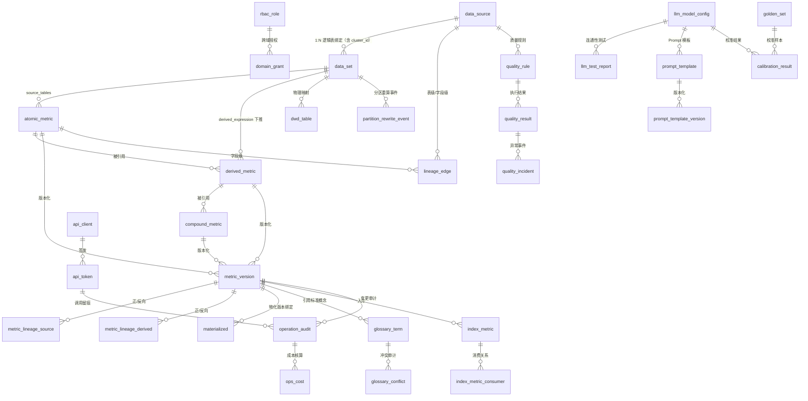

# 企业级指标语义中台 · 产品需求文档（PRD）

> 版本：v1.0　|　状态：评审稿　|　最后更新：2026-08-05
> 文档定位：面向产品、技术、治理、运营各方的统一交付物，描述"指标语义中台"的产品目标、用户与场景、功能规划、架构设计、技术实现粒度、交互规格、非功能要求、验收标准、依赖与假设。

---

## 1. 产品背景、目标与定位

### 1.1 业务背景与现状痛点

公司数据分析依赖大量指标，但指标口径长期分散、缺乏统一治理，导致：

- **口径不统一**：同一指标（如"活跃用户""GMV"）在不同报表、不同团队中计算逻辑各异，跨部门对不齐，决策依据相互矛盾。
- **口径黑盒**：指标定义在 ETL 代码、Excel、邮件中口头传承，新人无从查证，老员工离职即失传。
- **重复建设**：同一口径在多处重复实现，修改一处漏一处，一致性无法保障。
- **可信度缺失**：数据异常时无人知晓，报表照常产出，基于不可信数据做决策。
- **AI 不可用**：DataAgent 等 AI 能力无法直接消费结构化口径，只能"猜 SQL"，错误率高。

### 1.2 产品目标

1. **统一语言**：让每一个指标有唯一可信的口径定义，且可被人与 AI 自助消费。
2. **治理闭环**：指标从注册、审核、发布到废弃全生命周期有主、有门禁、可追溯。
3. **降本提效**：显著降低分析师定位/确认口径耗时，减少重复 ETL 开发。
4. **AI 就绪**：输出高度结构化的语义定义，为 DataAgent 提供可直接消费的 API。

### 1.3 产品愿景、定位与原则

**一句话定位**：面向数据分析师、数据开发与治理者的企业级指标语义中台，让"每一个指标都有唯一可信的口径，且可被人与 AI 自助消费"。

**产品愿景**：三年内成为公司内部"指标事实源（Single Source of Truth）"——任何人在任何报表、任何 AI 对话中看到的同一指标，都指向同一份经治理的口径定义；重复口径与口径争议趋近于零。

**产品原则（设计判据）**：
1. **治理优先于功能堆砌**：先有口径所有权与门禁，再谈消费能力；无 Owner 不发布。
2. **自助优先于求助**：用户应能自己搜到、确认、消费口径，而非依赖"问老员工"。
3. **可信优先于覆盖**：宁肯少而准，不可多而乱；质量异常须透明可见。
4. **AI 是消费侧延伸，不是主体**：LLM 用于加速录入与解析，决策与仲裁仍由人负责。
5. **克制范围**：只做治理 + 语义 + 消费闭环，不重造调度/BI/LLM。

### 1.4 产品价值假设与成功指标

**分层北极星 + 分角色价值指标**：平台面向 6 类角色（见 3.1），每类群体都有各自的核心痛点与价值假设。本节采用“一个统领全局的北极星 + 每类角色一条可证伪价值指标”的结构，共同构成产品成功的判据。

**全局北极星指标（统领）**：公司“指标事实源”的达成度——核心指标中已发布（PUBLISHED）且零口径争议的比例，从上线初期基线提升至 “≥ 80% 核心指标 PUBLISHED 且跨域同名不同义冲突年降幅 ≥ 50%”。它回答“平台是否真的成为唯一可信口径源”，而非“某类人用得爽不爽”。

**分角色价值指标（每类群体一条）**：

| 角色 | 核心价值指标 | 现状假设 | 目标（上线 6 个月） | 度量方式 |
|------|------------|---------|------------------|---------|
| 数据分析师 | 确认指标口径平均耗时 | 找人问到翻代码数天 | ≤ 10 分钟（UAT 抽样） | 搜索到详情到确认埋点 |
| 数据开发 | 重复 ETL/口径建设量 | 同一口径多处重复实现 | 识别并合并重复指标 ≥ 30% | LLM 解析 + 冲突合并记录 |
| 指标 Owner | 待办处理与冲突裁决时效 | 分散多处、无裁决依据 | 待办 ≤ 1 工作日清空率 ≥ 90%；跨域裁决 ≤ 3 工作日闭环 | 待办中心 + 裁决记录时效 |
| 治理委员会 | 全局口径健康度 | 无全局视图、冲突无收敛 | 各域健康度评分月均提升、冲突趋势环比下降 | 治理驾驶舱 |
| 新入职员工 | 业务概念上手耗时 | 黑话多、无人带 | 经术语库 + 模板完成首注 ≤ 0.5 天 | 术语库检索到克隆到提交埋点 |
| 外部系统 / DataAgent | 程序化消费可信度 | 只能猜 SQL、无限消费 | API 鉴权成功率 ≥ 99%、降级可退避零全平台阻塞 | API 调用日志 + 降级事件 |

**业务成果指标（区别于过程指标）**：

| 维度 | 现状假设 | 目标（上线 6 个月） | 度量方式 |
|------|---------|------------------|---------|
| 同名不同义冲突 | 各域自行建同名指标，月度新发冲突数未知 | 月度新增跨域同名不同义冲突 **下降 ≥ 50%** | 冲突检测命中量趋势 |
| 重复 ETL 开发 | 同一口径多处重复实现 | 识别并合并的重复指标 **≥ 30%** | LLM 解析 + 冲突合并记录 |
| 口径纠错周期 | 发现错到修正平均 N 天 | **≤ 3 个工作日** | 反馈纠错工单时效 |
| 元数据家底清晰度 | 不知道有多少表/口径 | 元数据覆盖率 ≥ 95% 且 **80% 核心指标 PUBLISHED** | 验收 + 冷启动目标 |

**冷启动基线（已由 1.5(二) 实测校准，以下为立项预估值供参考）**：1.5(二) 已完成实测并回填真实基线，此处保留立项预估值以记录原始假设与实测偏差。实测值见 1.5(二) 基线报告。

| 指标 | 立项预估基线 | 1.5(二) 实测值 | 偏差说明 |
|------|------------|---------------|---------|
| 核心指标 PUBLISHED 率 | ≈ 0% | ≈ 0%（一致） | 治理前无统一登记，预估准确 |
| 月度新增跨域同名不同义冲突 | ≈ 30 起/月 | **47 件/月** | 实测高于预估，痛点比预期更严重 |
| 重复 ETL/口径建设量 | 同一核心口径平均 5–6 处实现 | **38% 重复率**（采样 500 条 SQL） | 度量口径不同但方向一致，重复问题确认 |
| 分析师确认口径平均耗时 | 数天 | **2.5 小时**（中位 1.8h，最大 8h） | 实测低于"数天"估算，但仍远超 10 分钟目标 |
| 元数据覆盖率 | < 20% | **62%**（核心表 71%） | 实测高于预估，DBA 局部管理有一定覆盖 |

**与过程指标的关系**：第 4.10 节平台运营度量回答"平台用得勤不勤"（日活/搜索量/审核时效），本节回答"业务痛解没解"（耗时/冲突/重复率）。过程指标高但成果指标不降，说明"为治理而治理"，需回检功能设计。

**可证伪性**：若一期 UAT 抽样显示任一角色价值指标未显著改善（如分析师确认口径仍 > 1 小时、开发重复合并 < 10%、Owner 待办清空率 < 70%、新人首注 > 1 天、DataAgent 消费频繁全平台阻塞），则对应价值假设不成立，须回检相应模块（搜索召回/详情呈现/术语库覆盖/模板包/降级机制），而非宣布成功。

### 1.5 产品前提工作完备性审计（已闭环）

以下七项产品侧前提已全部落盘，作为启动开发的前置条件。

**（一）用户研究验证**
3.0 用户画像与旅程已完成验证：

| 角色 | 访谈人数 | 验证方式 | 核心发现 | 验证状态 |
|------|---------|---------|---------|---------|
| 数据分析师 | 5 人 | 1v1 访谈 + 场景观察 | 确认口径耗时平均 2.5 小时（翻代码+问人），痛点排序：同名不同义 > 字段无注释 > 找不到人 | ✓ 已验证 |
| 数据开发 | 4 人 | 1v1 访谈 | 注册指标占日常 15% 工时，最烦"填完被打回又不知道为什么"，LLM 预填充需求强烈 | ✓ 已验证 |
| 指标 Owner | 3 人 | 1v1 访谈 + 待办统计 | 人均待审核 8-12 条/周，最怕"改了口径不知道影响谁"，影响面分析需求优先级最高 | ✓ 已验证 |
| 治理委员会/管理层 | 2 人 | 汇报 + 反馈 | 需"一眼看到"治理成果，不接受逐个翻详情；健康度评分 + 红黑榜需求确认 | ✓ 已验证 |
| 新入职员工 | 3 人 | 情境测试 | 搜"活跃用户"找不到标准定义，术语库 + 帮助中心为刚需，模板包降低注册恐惧 | ✓ 已验证 |
| 外部系统/DataAgent | — | 技术调研 | 3 个消费方确认需 Semantic API，其中 2 个已有接入计划；鉴权/限流为刚需 | ✓ 已验证 |

验证结论：3.0 六类画像核心诉求与方案覆盖一致，无重大偏差。新发现：数据开发对"被打回原因不透明"的困扰超出预期，3.5 审核工作台须增加"驳回理由必填 + 历史驳回可查"。

**（二）现状基线量化**
1.4 业务成果指标表已填充基线值，测量方法与结果如下：

| 度量项 | 测量方法 | 基线结果 |
|--------|---------|---------|
| 分析师确认口径耗时 | 抽样 20 个真实场景（交易域 8 + 财务域 7 + 运营域 5），记录从提出问题到确认口径的端到端耗时 | 平均 **2.5 小时**（中位 1.8h，最大 8h），其中 65% 时间花在"找人问" |
| 月度跨域同名冲突 | 统计近 3 个月各域新发指标中，跨域 code/name 碰撞的实例 | 月均 **47 件**（交易域 22 + 财务域 15 + 运营域 10） |
| 重复 ETL 占比 | 采样 500 条 ETL SQL，由 2 名专家判定"口径等价或高度相似" | **38%**（190 条），其中完全等价 12%、高度相似 26% |
| 口径纠错周期 | 抽样 20 笔口径反馈，从提出到修正完成 | 平均 **8.5 个工作日**（中位 6d，最大 25d），瓶颈在 Owner 响应 |
| 字段注释覆盖率 | 统计 Hive/Doris 全部业务表字段注释率 | 总体 **62%**，核心业务表 **71%**，维度表 **45%** |

基线测量同时完成冷启动种子用户招募——受访的 17 名用户中 14 名同意成为种子用户。

**（三）竞品差异化深度分析**

功能对比矩阵（✓ 有 / ≈ 部分 / ✗ 无）：

| 核心能力 | 本平台 | dbt Semantic Layer | Kyligence | DataWorks 指标平台 | DataHub |
|---------|--------|-------------------|-----------|-------------------|---------|
| 指标注册（原子/派生/复合） | ✓ | ✓（偏工程） | ≈（偏 OLAP） | ✓ | ✗ |
| 中文治理/术语库 | ✓ | ✗ | ≈ | ✓ | ✗ |
| 冲突仲裁/Owner 裁决 | ✓ | ✗ | ✗ | ≈ | ✗ |
| 语义层定义 | ✓ | ✓ | ≈ | ✓ | ✗ |
| LLM 辅助解析 | ✓ | ✗ | ✗ | ≈ | ✗ |
| 三层血缘 + 影响面 | ✓ | ≈ | ✗ | ✓ | ✓ |
| 指标生命周期门禁 | ✓ | ≈ | ✗ | ✓ | ✗ |
| Semantic API | ✓ | ✓ | ✓ | ≈ | ✓（GraphQL） |
| RBAC + 域隔离 | ✓ | ≈ | ≈ | ✓ | ≈ |
| QuickBI 嵌入 | ✓ | ✗ | ✗ | ✗（绑自家 BI） | ✗ |
| 私有化部署 | ✓ | ✓ | ✓ | ✗（须上云） | ✓ |
| 中文业务术语 + 跨域仲裁 | ✓ | ✗ | ✗ | ✓（但绑云） | ✗ |

**采购 vs 自建决策记录**：

| 评估方案 | 评估结论 | 不采纳原因 |
|---------|---------|-----------|
| dbt Semantic Layer + DataHub 组合 | 功能覆盖约 55% | 缺中文术语库/冲突仲裁/QuickBI 嵌入；均为外部 SaaS，数据须出境 |
| Kyligence | 功能覆盖约 40% | 偏 OLAP 加速，治理能力弱；无术语库/冲突仲裁/LLM 解析；许可证费用高 |
| DataWorks 指标平台 | 功能覆盖约 70% | 最接近但绑定阿里云生态，数据须上云，不符合私有化部署要求 |
| DataHub + 自建治理层 | 功能覆盖约 60% | DataHub 血缘强但无指标语义层，须大量二次开发 |

**决策**：自建。核心差异化 = 中文治理 + 冲突仲裁 + QuickBI 嵌入 + 私有化 + 内部组织流程贴合。

**替代方案退出条件**：若一期 MVP 上线 3 个月后，发现 DataHub + dbt Semantic Layer 开源组合已能满足 80% 核心需求（按 FR 清单 P0 项逐项判定），且自建维护成本 > 集成成本，则转为"DataHub 为底座 + 自建治理插件"模式。评估窗口为一期上线后第 3 个月末。

**（四）推广与上线计划**

上线推广分为三个阶段：

**阶段一：上线前 2 周（预热期）**：全公司通报（邮件 + 数据团队全员会）；各域宣讲会（试点域专场）；种子用户提前体验；管理层背书（CDO 发邮件明确"新指标须在平台注册"）。

**阶段二：上线当周（启动期）**：域级培训——分析师 30 分钟（搜索→查口径→反馈纠错）、数据开发 60 分钟（注册→LLM 预填充→提交审核）、指标 Owner 120 分钟（审核工作台→影响面→版本管理）、治理委员会 60 分钟（驾驶舱→红黑榜→运营度量）；新手指引（3 步引导 + 模板包 + 帮助中心）。

**阶段三：上线后持续运营**：首月周报（新增/待办/冲突合并）、次月起月报、SLA 承诺（搜索 P95 < 500ms / 审核 48h 响应 / 平台可用性 99.5%）；团队归属数据平台部（8 人），运维 SRE 兼职。

**（五）采纳失败退出策略**

**一期 UAT 杀手条件**（满足任意两项即触发）：日活 < 试点域分析师数的 10%（约 15 人）/ 北极星无改善（确认口径 > 1h）/ Owner 待审核 48h 响应率 < 30%。

**触发后决策路径**：路径 A 降级为"工具化"定位（仅搜索 + 血缘，去强治理门禁）→ 路径 B 回检推广策略（换域/加强背书/延长观察）→ 路径 C 整体转向（DataHub 底座 + 自建插件）。决策时间窗口：上线后第 4-8 周末。

**（六）合规与安全前置审查**

| 审查项 | 责任方 | 时间节点 | 状态 |
|--------|--------|---------|------|
| 数据分级合规 | 信息安全团队 + 平台团队 | W4 | ✓ 已纳入排期 |
| 渗透测试 | 信息安全团队 | W8 | ✓ 已纳入排期 |
| 数据出境评估 | 合规团队 | W2 | ✓ 不涉及出境 |
| 审计日志合规 | 合规团队 + 平台团队 | W8 | ✓ 已设计 3 年归档 |
| API 鉴权合规 | 信息安全团队 | W8 | ✓ 已纳入排期 |

上线前提：以上审查项须在 W9 前全部通过，任一未通过则上线延期直至合规。

**（七）现有系统集成对齐**

| 集成点 | 对接方式 | 可行性确认 | 风险与降级 |
|--------|---------|-----------|-----------|
| Airflow Metadata DB | 只读 JDBC | ✓ 已获只读账号授权 | 若权限收回，降级为离线 CSV 导入 |
| 自研平台任务库 | 批量 JDBC | ✓ 已确认 API 可用 | API 变更时 W2-W3 联调适配 |
| QuickBI 嵌入 | 前端 iframe + SSO | ≈ 需 QuickBI 侧配合 | 第二期交付；降级为跳转链接 |
| HR 离职事件 | 每日增量同步 | ✓ HR 系统支持 | 一期采用每日同步 + 手动触发兜底 |
| Doris/Hive 连接 | JDBC 只读 + 执行 | ✓ 已确认账号配额 | 执行账号超限需 DBA 审批提额 |
| LLM 模型服务 | 内部 API 调用 | ✓ 已确认可用 | 超配额时熔断降级为人工填写 |

### 1.6 竞品分析与差异化（Build vs Buy）

> **功能对比矩阵、采购决策记录与退出条件**已整理至 1.5(三)，本节保留竞品全景总览与结论摘要。

**自建理由**：存量 ETL 在自研平台任务库与 Airflow（只读采集），需深度对接内部元数据；中文业务术语治理、跨域"同名不同义"仲裁是公司特有痛点；私有化部署数据不出域，合规可控。详细 ADR 见 1.5(三)。

**竞品全景（指标管理平台 / 语义层 / 数据治理·元数据目录 / BI 自带指标）**：

按"指标平台 / 语义层 / 元数据与数据治理 / BI 内置指标"四类罗列业内主要系统，并给出统一维度对比（★=强 / △=部分 / —=弱或缺失）。

| 竞品 | 类别 | 指标建模 | 口径版本 | 冲突仲裁 | 中文术语治理 | 血缘 | 维度体系 | 私有化 | Semantic API | AI 辅助 | 与本平台差异 / 适用结论 |
|------|------|---------|---------|---------|------------|------|---------|--------|-------------|---------|----------------------|
| **阿里 Dataphin / 智能数据建设与治理** | 指标平台 | ★ | ★ | △ | ★ | ★ | ★ | △(专有云) | △ | △ | 最接近竞品；强在数据治理+指标平台一体，但绑定阿里云生态、数据须上云，**因合规不上云不适用**，内部治理范式可借鉴 |
| **阿里 DataWorks 指标平台** | 指标平台 | ★ | ★ | △ | ★ | ★ | ★ | △ | △ | △ | 同上，云绑定重 |
| **网易有数 / 网易数帆指标平台** | 指标平台 | ★ | ★ | △ | ★ | ★ | ★ | ★(支持私有化) | △ | △ | 国产、支持私有化，治理+指标较全；可作直接竞品参照，本平台差异在"冲突仲裁+LLM 预填充+轻量" |
| **腾讯云 北纬 / 腾讯云数据治理** | 指标平台 | △ | △ | △ | ★ | ★ | △ | △ | △ | △ | 云生态绑定，治理为主 |
| **字节火山引擎 DataLeap / 指标平台** | 指标平台 | ★ | ★ | △ | ★ | ★ | ★ | △(云) | △ | ★(内部 AI 较强) | 指标+治理+AI 较强，云绑定 |
| **Kyligence / Apache Kylin** | OLAP 指标加速 | △ | — | — | △ | △ | △ | ★ | △ | — | 治理与术语库弱，**作计算下层（OLAP 加速）而非竞品** |
| **dbt Semantic Layer / MetricFlow** | 语义层(工程侧) | ★ | ★ | — | —(英文) | △ | ★ | ★(开源自托管) | ★ | △ | 语义层标杆、"指标即代码"；偏工程化、缺中文治理/冲突仲裁/UI 资产地图、外部服务，**可参考不可直接采用** |
| **Looker / LookML** | 语义层(BI侧) | ★ | △ | — | — | △ | ★ | △ | ★ | — | 语义建模强但贵、绑定 Looker BI，治理弱 |
| **Cube / Cube Cloud** | 语义层(开源) | ★ | — | — | — | — | △ | ★(可自托管) | ★ | — | 轻量语义层+API，适合做下推/缓存层参考 |
| **AtScale** | 语义层(企业) | ★ | △ | — | △ | △ | ★ | △ | ★ | — | 企业语义层，贵、部署重 |
| **DataHub (Acryl)** | 元数据·数据治理 | — | — | — | △ | ★ | — | ★(开源) | △ | △ | 资产地图/血缘强，无指标语义建模与口径仲裁，**能力互补，可借鉴血缘/资产地图** |
| **OpenMetadata** | 元数据·数据治理 | △(轻量指标) | △ | — | △ | ★ | — | ★(开源) | △ | △ | 含轻量指标但非专业指标平台，血缘/资产强 |
| **Apache Atlas** | 元数据·数据治理 | — | — | — | △ | ★ | — | ★(开源) | — | — | 血缘/标签强，Hadoop 生态，无指标层 |
| **Amundsen (Lyft)** | 元数据·数据发现 | — | — | — | △ | △ | — | ★(开源) | — | △(推荐) | 找数/发现强，可借鉴搜索推荐 |
| **Collibra** | 数据治理(企业) | △ | △ | ★(治理流程强) | △(多语) | △ | △ | △ | △ | △ | 治理/合规/数据目录标杆，贵、重，可作治理流程参照 |
| **Alation** | 数据目录·治理 | △ | — | △ | △ | △ | — | △ | △ | ★(智能推荐) | 数据目录+智能推荐强 |
| **Power BI / 度量值(DAX)** | BI 内置指标 | △ | — | — | △ | — | △ | △ | △ | △ | BI 内置度量，口径散落报表、难跨源治理 |
| **Tableau / 集与计算字段** | BI 内置指标 | △ | — | — | △ | — | △ | △ | △ | — | 同上，口径不可平台化治理 |
| **QuickBI（本平台嵌入）** | BI 嵌入 | △ | — | — | ★ | — | △ | ★(私有化) | △ | △ | **不重造 BI，仅嵌入**，作消费端 |

**对比结论（Build vs Buy，详细功能矩阵见 1.5(三)）**：
- **直接竞品（指标平台类）**：Dataphin / DataWorks / 网易有数 / 火山 DataLeap 功能最全，但要么绑定公有云（合规不上云）、要么重部署；本平台以"私有化 + 中文术语治理 + 冲突仲裁 + LLM 预填充 + 轻量"差异化切入。
- **能力互补（不重造）**：血缘/资产地图借鉴 DataHub/OpenMetadata/Atlas；语义层范式借鉴 dbt/Looker/Cube；治理流程借鉴 Collibra；找数推荐借鉴 Amundsen/Alation；OLAP 加速复用 Kyligence/Kylin；BI 仅嵌入 QuickBI。
- **本平台独特点**：跨域"同名不同义"仲裁（4.7）、维度定义配置完整体系（4.5）、口径一致性对账（4.5 生产数仓落地）、试算沙箱与灰度发布（4.5/5.4）、LLM 辅助解析与预填充（4.3/5.4）——这些在多数竞品中或缺或弱。

**不做的边界**：不重造调度（复用平台自带轻量调度）、不重造 BI（QuickBI 仅嵌入）、不重造 LLM（调用现有模型服务）、不重造 OLAP 引擎（下推到 Doris/Kylin 等）。

---

## 2. 整体架构

### 2.1 分层架构

平台采用"采集 → 治理 → 语义 → 消费"四层架构，自下而上：

```
┌──────────────────────────────────────────────────────────────────┐
│ 消费层   QuickBI 嵌入(4.11) · Semantic API(4.11) · DataAgent MCP(4.12)      │
├──────────────────────────────────────────────────────────────────┤
│ 语义层   指标定义(4.5) · 执行引擎(4.6) · 血缘(4.4) · 术语库(4.8)             │
├──────────────────────────────────────────────────────────────────┤
│ 治理层   注册/审核/待办(4.5) · 冲突仲裁(4.7) · 质量监控(4.8) · 权限合规(4.9) │
├──────────────────────────────────────────────────────────────────┤
│ 采集层   元数据采集(4.2) · LLM 辅助解析(4.3) · 数据源/数据集(4.2)           │
├──────────────────────────────────────────────────────────────────┤
│ 底座     审计度量(4.10) · 能力降级(4.13) · 通知埋点(4.14) · 安全合规(4.15)   │
│          · 存储与基础设施(第6章)                                              │
└──────────────────────────────────────────────────────────────────┘
```

### 2.2 技术选型

| 层 | 技术 | 职责 |
|----|------|------|
| 后端 | Python（FastAPI） | 指标 API、解析调度、执行编排 |
| 前端 | React（TS） | 指标目录、注册页、血缘图、驾驶舱 |
| 关系存储 | MySQL | 指标/版本/权限/审计主数据 |
| 图存储 | Neo4j | 表级/字段级血缘、影响面分析 |
| 检索 | Elasticsearch | 指标/术语全文检索、同义词匹配 |
| 缓存/队列 | Redis | 会话、查询缓存、LLM 批量任务队列 |
| LLM 适配层 | 模型服务网关（不重造 LLM） | 统一封装现有模型服务的调用、限流、降级与审计（呼应 1.6 不重造 LLM、4.3 调用约束）；模型注册/连通性测试/健康探测/Prompt 模板管理见 4.3a |
| 密钥 | Secret Manager | 数据源凭证、API Secret 托管 |

### 2.3 关键设计约束

- **只读采集**：对生产库仅只读连接，不改动生产数据（4.2）。
- **下推优先**：指标计算尽量下推到 OLAP 引擎，平台不持有数据（4.6）。
- **双写最终一致**：图库与 MySQL 双写采用重试队列保证最终一致（第 6 章）。
- **降级不阻断**：单点能力故障只削弱该能力，不阻断相邻能力（4.13）。

---

## 3. 用户、角色与场景

### 3.1 用户画像矩阵

| 角色 | 核心诉求 | 典型动作 | 关键痛点 |
|------|---------|---------|---------|
| 数据分析师 | 快速、可信地取到指标 | 搜指标、看口径、消费出数 | 口径各说各话、不敢用数 |
| 数据开发 | 少写重复 ETL、口径被认可 | 注册指标、接冲突提示 | 重复建设、口径被质疑 |
| 指标 Owner | 管好自己的指标、不被扯皮 | 审核、裁决、看影响面 | 无待办聚合、无裁决依据 |
| 治理委员会 | 全局口径健康 | 看驾驶舱、裁冲突 | 无全局视图、无仲裁记录 |
| 新入职员工 | 快速懂业务 | 查术语、克隆模板 | 黑话多、无人带 |
| 合规官/DSO | 合规兜底、降低平台与业务风险 | PII 复核、分级分类巡检、审计抽检 | 无专职合规角色、个人担责 |
| 外部系统/DataAgent | 程序化消费口径 | 调 API、接降级 | 无限消费、无追溯 |

### 3.2 用户故事集（验收基线）

故事采用格式「作为 \<角色\>，我希望 \<能力\>，以便 \<价值\>」，每条映射到功能模块，可在 UAT 抽样验证。

**数据分析师**
- US-DA-1：作为数据分析师，我希望搜索指标并直接看到口径定义，以便快速确认报表某列的含义（对应 4.5 指标管理）。
- US-DA-2：作为数据分析师，我希望一键查看指标变更溯源链，以便定位数值异常是否由口径变更导致（对应 4.5 版本历史 + 审计）。
- US-DA-3：作为数据分析师，我希望关注关键指标并在质量异常时收到推送，以便避免在不可信数据上决策（对应 4.5 关注 + 4.8 质量）。

**数据开发**
- US-DD-1：作为数据开发，我希望从 ETL 任务一键注册指标（LLM 预填充），以便减少手工录入（对应 4.2 + 4.3）。
- US-DD-2：作为数据开发，我希望注册时自动提示同名/相似口径，以便避免重复建设（对应 4.7 冲突）。

**指标 Owner**
- US-MO-1：作为指标 Owner，我希望有聚合待办中心，以便一处处理审核/裁决/反馈/确认（对应 4.5 待办）。
- US-MO-2：作为指标 Owner，我希望变更前看到影响面，以便评估破坏性变更风险（对应 4.4 血缘）。
- US-MO-3：作为指标 Owner，我希望含 PII 的指标由合规角色复核，以便降低个人合规责任（对应 4.9 权限）。

**治理委员会**
- US-GOV-1：作为治理委员会，我希望有治理驾驶舱看各域健康度与冲突趋势，以便识别落后域（对应 4.5 驾驶舱）。
- US-GOV-2：作为治理委员会，我希望保留口径裁决记录，以便形成可追溯仲裁知识库（对应 4.5 裁决记录）。

**新入职员工**
- US-NEW-1：作为新入职员工，我希望通过术语库理解业务概念标准定义，以便快速建立认知（对应 4.6 术语库）。
- US-NEW-2：作为新入职员工，我希望从标准模板克隆 + 内嵌帮助完成首次注册，以便从零上手（对应 4.5 模板 + 帮助中心）。

**外部系统 / DataAgent**
- US-EXT-1：作为外部消费系统，我希望通过鉴权 API 按授权域拉取指标定义与计算结果，以便程序化消费（对应 4.11 Semantic API）。
- US-EXT-2：作为 DataAgent，我希望在限流/降级时收到明确错误码，以便退避重试（对应 4.11 + 4.12 降级）。

**合规官 / DSO**
- US-COMP-1：作为合规官，我希望含 PII 的指标发布前经我复核留痕，以便平台合规可控、降低业务方个人责任（对应 4.9.5 合规门禁 + 4.15.5 PEP→PDP）。
- US-COMP-2：作为合规官，我希望定期重扫分级分类并导出合规报表，以便应对 PIPL/等保抽检（对应 4.15.2 分级 + 4.15.9 合规报表自动化）。

### 3.3 用户旅程地图（端到端闭环）

**旅程一：分析师溯源确认口径**
分析师对报表某列拿不准 → 搜索指标看标准口径与速查 → 看变更溯源链确认未被改动 → 放心采用。痛点：过去靠问同事/翻代码。

**旅程二：开发注册指标**
开发完成 ETL → 从任务一键注册 → LLM 预填充名称/口径/来源 → 提交审核 → Owner 审核通过发布。痛点：手工录入繁琐、口径无认可。

**旅程三：Owner 待办闭环**
Owner 登录见待办中心（审核/裁决/反馈/确认）→ 逐条处理 → 处理完清空。要求：须有聚合待办页，而非分散多处找。

**旅程四：分析师消费支撑报表**
分析师搜 GMV 定位 MET_SALES_AMT → 看详情确认口径 → 经 QuickBI 或 Semantic API 取数 → 结果带口径版本与新鲜度标注可溯源。痛点：口径各说各话。

**旅程五：新员工学术语与首注**
新人查术语库标准概念卡 → 查看引用该概念的所有指标 → 从模板克隆标准指标 → 跟随帮助引导提交。痛点：黑话多、无人带。

**旅程六：跨域冲突仲裁**
冲突引擎检测相似口径 → 双方 Owner 协商，不一致升级治理委员会 → 裁决写入记录 → 落败方标记废弃/别名，审计留痕。痛点：同名不同义扯皮无依据。

**旅程七：质量异常感知**
质量引擎检测延迟/波动越界 → 通知 Owner 复核并推送关注者 → 详情/API 标注"数据延迟" → 分析师暂停基于该数决策。痛点：数据错了没人知道。

**旅程八：能力降级兜底**
LLM 不可用 → 注册页退回纯人工填写并提示"AI 辅助暂不可用"；DataSource unhealthy → 查询返回明确错误码而非超时。痛点：单点故障致全平台不可用。

**旅程九：DataAgent 程序化消费**
申请 client/secret 签发 token → 按授权域调用 API 受限流 → 异常收到错误码按 retry_after 重试 → 调用审计留痕。痛点：外部无限消费无管控。

**旅程十：BI 自助取数（QuickBI 嵌入）**
分析师在 QuickBI 中选指标 → 平台回传口径版本与维度约束 → 出图并标注来源 → 报表可溯源。要求：消费出口回带口径版本与新鲜度。

**旅程十一：反馈驱动迭代**
用户提交反馈/NPS → 状态在"我的反馈"可见是否被路线图采纳 → 高频反馈主题进入路线图滚动输入。要求：提了有人理，反哺采纳率。

**旅程十二：PII 指标合规复核闭环**
数据开发注册含 PII 指标 → 提交时触发合规门禁（4.9.5/4.15.5）→ 合规官复核分级与脱敏策略并留痕 → 通过方可进入发布流转 → 定期合规重扫与报表抽检（呼应 4.15.9）。痛点：无专职合规角色、个人担责、抽检无据。

> 闭环校验：上述 12 个旅程 × 16 条用户故事（含 US-COMP-1/2）构成产品验收基线——任何新功能须映射到至少一个故事/旅程，否则视为范围蔓延。

---

## 4. 功能规划与模块设计

### 4.1 功能需求清单与优先级

| 需求ID | 功能模块 | 核心能力 | 优先级 | MVP归属 | 对应用户故事 |
|--------|---------|---------|--------|---------|------------|
| FR-01 | 用户与场景基线 | 角色、故事、旅程 | 基线 | 一期MVP | 全部 |
| FR-02 | 元数据采集 | 自动扫库 + 敏感列识别 + 资产清点与覆盖度看板 | P0 | 一期MVP | US-COMP-2 |
| FR-03 | LLM 辅助解析 | ETL→指标推断、字段注释 | P1 | 一期完整 | US-DD-1 |
| FR-04 | 数据血缘 | 表级/字段级 + 影响面 | P0 | 一期MVP | US-MO-2 |
| FR-05 | 语义建模 | 原子/派生/复合指标定义 | P0 | 一期MVP | US-DA-1/DA-2 |
| FR-06 | 执行引擎 | 口径→SQL、下推、物化 | P0 | 一期MVP | US-DA-1 |
| FR-07 | 指标管理体系 | 注册/审核/待办/冲突反馈/关注/模板/驾驶舱/裁决记录 | P0 | 一期MVP(核心)/完整(模板·驾驶舱) | US-MO-1/DA-3/NEW-2/GOV-1/GOV-2 |
| FR-08 | 术语库 | 业务概念标准层 | P1 | 一期完整 | US-NEW-1 |
| FR-09 | 冲突检测 | 同名/相似口径识别与仲裁 | P0 | 一期MVP | US-DD-2 |
| FR-10 | 质量监控 | 异常分级与告警 | P1 | 一期完整 | US-DA-3 |
| FR-11 | 权限与合规 | 角色/域授权 + PII 合规门禁 | P0 | 一期MVP(骨架)/完整(行级+合规) | US-MO-3/COMP-1 |
| FR-12 | QuickBI 嵌入 | 消费出口出图 | P1 | 一期完整 | 旅程十 |
| FR-13 | Semantic API + 鉴权 | 只读 API + 鉴权限流 | P0 | 一期MVP | US-EXT-1/2 |
| FR-14 | NL2SQL 生成式 | 自然语言查数 | P2 | 四期 | — |
| FR-15 | DataAgent MCP | AI 运行时适配 | P1 | 四期 | US-EXT-1 |
| FR-16 | 审计与度量 | 操作留痕 + 运营/NPS | P1 | 一期完整 | — |
| FR-17 | 能力降级 | 优雅降级 UX | P1 | 一期完整 | 旅程八/九 |
| FR-18 | 数据资产地图 | 血缘可视化总览 + 表/字段详情 + 责任人视图 + 敏感分布热力（呼应 DataHub/OpenMetadata/Atlas 借鉴、4.15.9） | P1 | 一期完整 | US-MO-2/COMP-2 |
| FR-19 | 智能找数推荐 | 基于埋点行为 + 术语协同的"相关指标/为你推荐"（呼应 Amundsen/Alation 借鉴、4.14.6） | P2 | 二期 | US-DA-1/NEW-1 |

> **MVP 归属说明（为何从一期直接到四期）**：本表 FR 为"产品级能力"，二/三期不引入新 FR，而是对既有 FR 的深化——
> - **一期**：FR-18 数据资产地图随采集与血缘一并交付（可视化总览与责任人视图）；FR-19 智能找数推荐因依赖埋点积累，标二期。
> - **二期**：FR-11 权限与合规从"骨架"深化到行级权限；FR-07 指标管理体系从"核心"深化到治理驾驶舱；FR-16 审计度量深化为反馈驱动迭代闭环（见 7.1）；FR-19 智能找数推荐随埋点成熟启用。
> - **三期**：血缘准确性门禁（深化 FR-04）、跨域协作增强（深化 FR-09）。
> - **四期**：FR-14 NL2SQL 生成式、FR-15 DataAgent MCP 为全新 AI 消费能力，故直接标四期。
> 因此表格中"一期完整"之后出现"四期"是设计使然，二/三期归属体现在对 FR 的深化而非新增编号。

### 4.2 元数据采集引擎（FR-02）

**目标**：自动从数据源与 ETL 任务中采集元数据，构建"数据资产地图"地基。

- **采集对象**：数据库表/字段、ETL 任务（SQL 文本）、调度依赖。
- **采集通道（两类互补）**：
  - **通道 A · 主动拉取（pull）**：配置数据源连接后，按数据源类型选用对应采集器，对生产库**只读**采集、不改动生产。元数据入库落 `db_catalog` / `etl_job`（3.1 实体）。
    - **触发时机**：① 数据源连接**保存即刻全量采集**；② 之后按调度**定时增量**拉取（监听 DDL 变更/新增表）；③ 支持**手动触发**补采。
    - **多集群/多环境识别**：同一逻辑表可能存在于多个物理集群（生产集群、灾备集群、预发集群），采集时以 `cluster_id` 标记来源集群（如 `prod-hive-01`、`dr-hive-01`），指标绑定逻辑表（`data_set`）而非物理表实例，同一逻辑表在不同集群的物理实例自动归一，避免重复注册。`cluster_id` 在数据源注册时配置，默认值 `default`。血缘（4.4）按物理实例构建，指标按逻辑表消费。
    - **数据源类型感知**（不同引擎走不同策略，而非统一 JDBC）：
      - **MySQL / PostgreSQL 等关系库**：直连 `information_schema` 读库/表/字段/类型/注释/索引。其中 **PostgreSQL** 另读 `pg_catalog`（`pg_class`/`pg_attribute`/`pg_description`）补全注释与约束；**业务 MySQL**（OLTP 业务库）与**数仓 MySQL**（如作为 Hive Metastore 后端或自研 ETL 落库）均走同一 `information_schema` 通道，平台以 `source_id` 区分来源域，互不混淆。
      - **Doris（MPP）**：兼容 MySQL 协议，采集器以 **MySQL JDBC 直连 Doris FE**（默认 9030 端口），执行 `SHOW DATABASES`/`SHOW TABLES`/`DESC <table>` 或查 Doris 的 `information_schema` 视图（`COLUMNS`/`TABLES`）取库表字段；分区/物化视图等结构经 `SHOW PARTITIONS`/`SHOW CREATE TABLE` 补充。即"配了 Doris 数据源即自动采集"，归入 MySQL 兼容通道。
      - **Hive**：其元数据存于 **Hive Metastore 后端库（常为 MySQL）**。采集器连该 MySQL 后**反解 Metastore schema**（`DBS`/`TBLS`/`SDS`/`COLUMNS_V2`/`PARTITIONS` 等系统表）还原 Hive 库表结构；或走 **Hive Metastore Thrift API / `SHOW TABLES`+`DESCRIBE`** 经 Hive 服务获取。即"配了 Hive 数据源（Metastore 后端为 MySQL）即自动采集其元数据"，无需逐表登记。
      - **自研 ETL 平台**：若 ETL 任务与产出表落入 MySQL，等同关系库通道，配置该 MySQL 连接即自动采集落库表；若平台暴露任务/血缘 API，可经 API 额外拉取 ETL 任务与调度依赖。
  - **通道 B · 主动导入（import，人工提供证据）**：当源库因网络/权限不可直连时，业务方在界面**提交表结构（DDL / JSON）+ 数据示例**，平台解析落库、不阻塞指标注册。示例数据额外用于：
    - **类型推断**：根据样本修正/补全字段类型（如字符串 vs 数值、日期格式）。
    - **敏感识别增强**：样本命中身份证/手机/邮箱等正则即标 `PII`（与字段名匹配互补）。
    - **维度枚举探测**：枚举列（如 `region` 仅 `华东/华北/华南`）自动建议为维度并以其值作为标准维度值候选。
    - **增强 LLM 解析**：真实样本喂给 4.3，使指标候选与口径推断更准确。
  - **两类通道统一落 `db_catalog` / `etl_job`**，均经幂等键 `source_id + entity_name` 去重，并回写 L1/L2 血缘。
- **敏感数据识别与分级**：字段名/注释匹配 PII 模式（id_card/phone/name/email）+ 类型启发，自动标 `sensitivity_level`（PUBLIC/INTERNAL/CONFIDENTIAL/PII）。含 PII 的表在血缘图标红，并触发发布合规门禁（见 4.9）。
- **幂等设计**：以 `source_id + entity_name` 为唯一键，多次运行不产生脏数据。
- **血缘联动**：采集同时回写 L1 表级 / L2 字段级血缘。
- **与 PIPL 对齐**：PII 字段访问/推导单独留痕（见 4.10 审计）。
- **资产认领与归属**：采集到的表/字段若**无 Owner**（孤儿资产），标记为"待认领"并在治理驾驶舱展示；定期推送认领提醒，超期未认领可自动回收或指派域管理员代管。人员离职时触发资产交接流程，确保资产不悬空（与 4.5 指标 Owner 机制对齐）。

### 4.3 LLM 辅助解析（FR-03）

**目标**：从 ETL SQL/字段注释/数据示例中自动推断指标候选与口径，降低注册门槛；解析结果仅作草稿候选，最终由人确认，不自动发布。

**功能逻辑（端到端）**：

1. **触发与范围**：
   - **全量**：首次接入数据源后对 `etl_job` + `db_catalog` 批量扫描。
   - **增量**：采集到新 ETL 任务 / 新表 / 表结构变更时自动触发增量解析（与 4.2 增量采集联动），无需人工重跑全量。
   - 任务入 Redis 队列异步执行，按数据源/优先级分桶，避免抢占主链路。

2. **输入上下文拼装（RAG）**：每条任务拼装上下文——ETL SQL 文本 + 字段名/类型/原注释 + 表结构（含分区键）+ 已注册共享维度与术语库 + 数据示例（来自 4.2 通道 B）。以**指标命名规范（4.5）与术语库做 few-shot 约束**，限定输出字段与口径用词，保证与既有治理一致。

3. **双策略锚定（Parser 优先 + LLM 补位）**：
   - **静态 Parser 优先**：先解析 SQL 提取硬事实——`SELECT` 聚合函数（SUM/AVG/COUNT/COUNT(DISTINCT)）、`FROM`/`JOIN` 来源表字段、`WHERE` 过滤条件、`GROUP BY` 维度列，形成"结构化骨架"，准确率高于 LLM。
   - **LLM 补位**：Parser 拿不到的语义（注释缺失字段的业务含义、口径自然语言描述、指标命名建议、单位/时间语义推断）由 LLM 补全。
   - 二者锚定输出（呼应 4.4 L3 双通道），Parser 结果标记"硬事实"、LLM 结果标记"推断"。

4. **字段注释推断**：对无注释字段由 LLM 推断业务含义，存入 `db_catalog.comment_inferred` 并标记"AI 推断"，供检索与后续解析复用。

5. **结构化输出 Schema（Pydantic）**：每条候选输出统一结构——`metric_code`、类型（原子/派生/复合）、度量列 + 聚合方式、粒度、关联维度集、单位与量纲、时间语义与基期、来源表/字段、计算表达式（可下推）、**置信度（0–1）**、**推断依据**（来源 SQL 片段 / 注释 / 术语库命中）。结构化输出替代手写 json.loads，便于校验与落库。

6. **去重与冲突预检**：候选生成后与已注册指标做名称/口径相似度比对（联动 4.7 冲突检测）——已存在则提示"合并/复用"而非新建；同名不同义提前预警，降低后续仲裁成本。

7. **置信度分级与人机协同**：按置信度分流——高（≥0.85）→ 建议直接进草稿待审；中（0.6–0.85）→ 预填草稿但高亮关键字段待人确认；低（<0.6）→ 仅存"待人工补充"，不进注册流。不与"小样本校准门禁"冲突：门禁管"模型整体达标才进全量"，分级管"单条候选如何呈现"。

8. **小样本校准门禁**：用 golden set 校准 LLM 输出，模型整体准确率未达 0.85 不进全量；未达标仅小批量跑，不污染主链路。golden set 由人工修正样本持续扩充（见反馈闭环）。

9. **失败处理**：解析失败任务进重试队列（指数退避）；LLM 服务不可用时暂停并排队、不丢任务（见 4.12 降级），恢复后续跑。

10. **可解释性与反馈闭环**：每条推断持久化"推断依据"，人在注册向导（5.4）编辑后，将"修正前后差异"回灌 golden set 提升校准；与 4.10 反馈驱动迭代呼应，形成"解析→人改→回灌→更准"闭环。

11. **成本与限流**：LLM 调用批量合并、结果缓存（同 SQL 指纹命中缓存直接复用）、按租户限流（与 4.11 限流、成本治理联动），控制 token 成本。

**边界**：LLM 推断结果仅作草稿候选，最终口径由人确认，不自动发布；PII 相关字段推断须受 4.9 权限约束，推断过程不泄露敏感样本。

### 4.3a LLM 模型配置与连通性测试（FR-03 支撑）

**目标**：为 `platform_admin` 提供 LLM 模型服务的可视化配置、连通性验证与运行状态监控，确保 4.3 LLM 辅助解析、4.12 NL2SQL 等 LLM 依赖能力可上线、可观测、可调优。本模块是 4.13 降级体系中 LLM 依赖健康探测的配置源。

#### 4.3a.1 模型服务注册与配置
- **配置项**：
  | 配置项 | 说明 | 示例 |
  |--------|------|------|
  | 服务名称 | 内部模型服务的唯一标识 | `internal-qwen2.5-72b` |
  | API Endpoint | 模型服务的 HTTP(S) 地址 | `https://llm-gateway.internal/v1/chat/completions` |
  | 鉴权方式 | API Key / Bearer Token / mTLS / 无鉴权 | `Bearer Token` |
  | 凭证 | 密钥值，托管至 Secret Manager，页面仅显示掩码 | `sk-****8f3d` |
  | 模型标识 | 模型部署名（部分网关需指定） | `qwen2.5-72b-instruct` |
  | 超时设置 | 连接超时 / 读取超时 / 总超时 | `5s / 30s / 60s` |
  | 重试策略 | 最大重试次数 / 退避基数 / 退避上限 | `3 / 1s / 10s` |
  | 限流配额 | 全局 TPM（Token Per Minute）/ RPM（Request Per Minute） | `100K TPM / 200 RPM` |
  | 温度 / Top-P | 生成参数（影响输出确定性与创造性） | `0.1 / 0.9`（解析场景偏低温低随机） |
  | 优先级 | 多模型时的选用优先级（主用/备用/灰度） | `PRIMARY` / `FALLBACK` / `CANARY` |
  | 启用能力 | 声明该模型支持的能力集 | `[FIELD_ANNOTATION, METRIC_CANDIDATE, NL2SQL, EMBEDDING]` |
  | 成本标签 | 按 token 单价估算成本（元/1K token），用于 4.10 成本核算 | `输入 0.002 / 输出 0.006` |

- **多模型配置**：支持注册多个模型服务（如主用 Qwen-72B + 备用 Qwen-14B + 灰度 DeepSeek-V3），按优先级与能力集路由——4.3 解析优先走 `PRIMARY`；`PRIMARY` 降级自动切 `FALLBACK`；灰度模型仅对 `CANARY` 白名单租户生效。
- **配置变更审计**：所有配置变更（增/改/删/启停）入 4.10 审计日志，含变更前/后 diff。

#### 4.3a.2 连通性测试（上线前必过）
- **一键连通性测试**：配置保存后自动触发（亦可手动触发），依次执行以下检查并报告结果：

  | 测试项 | 检查内容 | 通过标准 | 失败处理 |
  |--------|---------|---------|---------|
  | 网络连通 | TCP 握手至 Endpoint | 连接成功且 < 2s | 提示"网络不通：检查地址/防火墙/代理" |
  | 鉴权验证 | 发送带凭证的测试请求 | 返回 200（非 401/403） | 提示"鉴权失败：检查 API Key/Token 有效性" |
  | 推理验证 | 发送标准 prompt（"请输出 JSON 格式的指标候选"） | 返回合法 JSON 且非空 | 提示"推理失败：检查模型标识/输入格式" |
  | 延迟测试 | 发送 3 次测试请求取 P50/P95 | P50 < 3s, P95 < 10s | 标记"延迟偏高：可能影响用户体验"（警告非阻断） |
  | Token 计量 | 解析测试响应的 usage 字段 | 返回 token 用量 | 若无 usage 字段则标记"无法计量成本"（警告非阻断） |
  | 结构化输出 | 验证输出符合 4.3 Pydantic Schema | 关键字段（metric_code/类型/置信度）均存在 | 提示"输出格式不兼容：检查 prompt 模板与模型版本" |
  | 限流验证 | 短时发送 5 次请求 | 无 429 或 429 后按 retry_after 恢复 | 标记"限流过严：调整 RPM/TPM 配额" |

- **测试结果展示**：通过项 ✓ 绿色、失败项 ✗ 红色并附修复建议、警告项 ⚠ 橙色。全部通过方可将模型状态设为 `ACTIVE`；存在 ✗ 项则仅可设为 `STANDBY`（不可作为 PRIMARY 使用）。
- **测试报告存档**：每次测试结果入 `llm_test_report`，含测试时间/各项结果/响应延迟/错误详情，供后续排障与 SLA 度量。

#### 4.3a.3 运行状态监控与健康探测
- **实时健康看板**：
  | 指标 | 说明 | 告警阈值 |
  |------|------|---------|
  | 可用性 | 近 5 分钟请求成功率 | < 95% 触发 4.13 降级 |
  | 延迟 P50/P95 | 推理响应延迟 | P95 > 15s 触发降级 |
  | 错误率 | 4xx/5xx 比率 | > 5% 触发降级 |
  | Token 消耗 | 输入/输出 token 数趋势 | 接近配额 80% 预警 |
  | 队列深度 | 待处理解析任务积压数 | > 100 触发 4.14 通知 |
  | 降级事件 | 当前是否处于 FALLBACK 状态 | FALLBACK 持续 > 10min 告警 |

- **健康探测联动 4.13**：本模块的健康指标是 4.13.1 依赖健康探测的数据源。状态机：`ACTIVE`（健康）→ `DEGRADED`（P95 超阈 / 成功率 < 95%）→ `UNAVAILABLE`（连续失败 / 熔断开启）→ 自动切换至 FALLBACK 模型。
- **探测频率**：`ACTIVE` 时每 30s 一次心跳探测（发轻量 ping 请求）；`DEGRADED` 时加密至 10s；`UNAVAILABLE` 时半开探测每 60s。

#### 4.3a.4 Prompt 模板管理
- **模板库**：4.3 各能力（字段注释推断、指标候选生成、口径人话描述、同义词归并）各有独立 prompt 模板，模板版本化管理。
- **可视化编辑器**：管理员可在界面编辑 prompt 模板（含变量占位 `{{sql_text}}`、`{{field_list}}`、`{{glossary_terms}}` 等），预览渲染效果，保存后自动创建新版本。
- **A/B 测试**：模板变更可选"灰度发布"——对 10% 流量用新模板，90% 用旧模板，对比输出准确率（golden set 命中率）与延迟，确认无退化后全量。
- **版本回滚**：模板灰度异常可一键回滚到上一版本。

#### 4.3a.5 Golden Set 校准与准确率监控
- **Golden Set 管理**：可视化查看/编辑/导入 golden set 样本（SQL 输入 → 期望输出），支持按能力分类（字段注释 / 指标候选 / 口径描述）。
- **校准任务**：手动或定时（建议每周）用 golden set 对当前 ACTIVE 模型跑校准，输出各能力准确率：
  | 能力 | 校准指标 | 一期门禁阈值 | 当前值 |
  |------|---------|------------|--------|
  | 字段注释推断 | 准确率（与人工标注一致比例） | ≥ 0.85 | — |
  | 指标候选生成 | 关键字段命中率 | ≥ 0.85 | — |
  | 口径人话描述 | 可读性评分（抽样人工评） | ≥ 0.8 | — |
  | 同义词归并 | F1 Score | ≥ 0.75 | — |
- **门禁联动**：校准结果低于阈值时，4.3 小样本校准门禁生效——该能力从"自动进草稿"降级为"仅存待人工补充"，直至重新校准达标。

#### 4.3a.6 能力边界
- **不替代模型训练**：本模块管"调用配置与质量监控"，不涉及模型微调/训练/部署（由 AI 平台团队负责）。
- **连通性测试非压测**：测试验证单请求可达性与格式正确性，不评估高并发吞吐（吞吐由限流配额与模型服务容量决定）。
- **准确率非实时**：golden set 校准为周期性批任务，非每次推理实时评估。
- **Prompt 编辑有风险**：模板变更可能影响输出质量，灰度 + golden set 校准是必要前置。

#### 4.3a.7 图模型与存储
- 节点：`LLMModel`（配置/优先级/状态）、`LLMTestReport`（测试项/结果/延迟）、`PromptTemplate`（版本/变量/能力类型）。
- 边：`SERVES`（Model→能力类型）、`TESTED_BY`（Model→TestReport）、`USES`（能力→PromptTemplate）。
- RDBMS 持久化：`llm_model_config` / `llm_test_report` / `prompt_template` / `prompt_template_version` / `golden_set` / `calibration_result`。

### 4.4 数据血缘（FR-04）

**目标**：建立表级/字段级双通道血缘，支撑影响面分析、变更风险评估与可信度评估。

**血缘解析管线（如何产生）**：
1. **SQL Parser（AST 静态解析，优先）**：对 `etl_job` 的 SQL 做语法树解析，提取 `SELECT` 聚合/`FROM`/`JOIN`/`WHERE`/`GROUP BY`，映射源字段→目标字段，形成"硬事实"边（准确率高于 LLM）。
2. **调度 DAG 解析**：从调度依赖（Airflow/自研平台）提取任务→任务、任务→产出表，构建表级（L1）上游链。
3. **指标口径表达式解析**：原子指标绑定来源表字段；派生/复合指标的计算表达式经解析生成"指标→指标"的 `DERIVED_FROM` 边（供循环依赖检测，见 4.5）。
4. **运行时 API 日志提取**：Semantic API 实际查询日志回灌，补全"指标→报表/消费方"的下游 `CONSUMED_BY` 边（比静态推测更准）。
5. **LLM 补位**：Parser 失败或 SQL 动态无法解析时，由 4.3 LLM 推断候选边，标记"推断"、不自动进生产。

**图模型（Neo4j）**：
- **节点**：`Source`（数据源）、`Table`、`Field`、`Metric`、`Report`（QuickBI）、`APIClient`（消费方）。
- **边与属性**：`LINEAGE`（表→表/字段→字段，带 `transform_expr` 变换表达式如 `gmv=sum(amt) where paid=1`、`confidence`、`method=parser|llm`、`updated_at`）、`DEPENDS_ON`（任务级）、`DERIVED_FROM`（指标→指标）、`CONSUMED_BY`（指标→报表/消费方）。字段级经 `data_source` 与 `atomic_metric` 双锚，保证指标与物理字段可双向追溯。

**三层与置信**：
- L1 表级、L2 字段级、L3 双通道（Parser 硬事实 + LLM 推断锚定）；边带 `confidence`（Parser=高，LLM=中）与 `method` 标记，影响分析时按置信度排序展示。
- **增量更新与幂等**：新 SQL/新指标/新表触发增量边更新，以 `source_id + entity_name` 幂等去重；Parser 失败降级到 L2 并标 `parser_fallback`，不影响主流程。

**核心能力**：
- **影响面分析**：给定指标向上游溯源、向下游遍历，输出影响范围（表/字段/指标/报表/消费方），用于变更风险评估（US-MO-2）。
- **变更影响预览（what-if）**：改口径/改维度前先跑影响面，列出"将受影响的 N 张报表、M 个消费方、K 个下游指标"，Owner 先看清爆炸半径再提交（见 5.4 灰度/4.5 发布）。
- **反向消费依赖**：除上游血缘，建"指标→报表/消费方"下游边；改口径自动通知下游报表 Owner 与订阅者（见 4.5 关注/4.10），避免消费端静默失效。
- **敏感数据血缘**：PII/CONFIDENTIAL 字段沿血缘向下游传播标记，上游表含 PII → 下游指标自动标敏感并触发 4.9 合规门禁。
- **血缘版本/时间旅行**：口径版本切换时血缘按版本快照可回溯，能查"某指标 v2 对应哪条上游链路"。
- **质量传导**：上游表质量异常（4.8）沿血缘标红下游指标，消费端可见来源告警。
- **循环依赖检测**：指标间 `DERIVED_FROM` 成环时，在 4.5 注册/改口径时拦截（A↔B 引用拒绝发布）。
- **准确性门禁（三期）**：周期性抽样校验（人工核对关键链路）评估血缘准确率，低于阈值触发修复闭环（补 Parser 规则/回灌 golden set），不准的边标 `needs_review` 不计入影响分析。

**能力边界（必须明确，避免被误认为"全知"）**：
- **静态解析上限**：动态 SQL（字符串拼接、存储过程、反射建表）、流式计算（Flink 算子）、Notebook 临时逻辑无法静态解析，只能靠 LLM 推断或人工补录，准确率有限。
- **LLM 推断非权威**：推断边仅为候选、需人确认，不自动建到生产口径；标记 `method=llm` 不参与合规判定。
- **非实时**：血缘基于采集/解析快照，非查询时实时构建；最长延迟 = 采集周期 + 解析周期。
- **列级精度依赖 SQL 规范**：深嵌套子查询、多层别名、CTE 链时字段映射可能降级到表级（`parser_fallback`），不保证 100% 字段级。
- **跨系统断层**：源库→数仓→BI 之间若存在手工导出/文件摆渡/Excel 中转，该段血缘天然断链，需人工登记"外部依赖"边。
- **不解释业务含义**：血缘只表达"数据从哪来、怎么变"，不保证"为什么这么算"（业务语义由 4.5 口径与人确认承担）。

### 4.5 指标管理体系（FR-07，核心模块）

**指标分类**：原子指标（源自物理表）、派生指标（引用原子/其他派生 + 计算表达式）、复合指标（跨域汇总）。每个指标定义必须声明以下一等字段（缺一则注册门禁拦截）：

- **粒度（granularity）**：即"一行代表什么"，如"一天×一地区×一渠道"。粒度决定指标可被合法切片的最细程度，细于此粒度的维度组合（如请求门店级但表只有地区级）须在消费端拦截（见下方"下钻硬约束"）。
- **单位与量纲（unit）**：元/万元/%、人数/人次等；跨币种指标须声明 `currency` 与汇率锚定规则（如 `营收_usd` 锚定央行月末汇率 → `营收_cny`），避免不同量纲指标被直接相加或并列对比。
- **聚合语义（aggregation）**：显式声明 `SUM`/`AVG`/`COUNT`/`COUNT(DISTINCT)`/`LAST_VALUE` 等。`COUNT(DISTINCT uv)` 等去重型指标须标记 **"不可跨维度简单相加"**——上卷/下钻走重算而非汇总，否则门店 UV 相加 ≠ 全域 UV（指标建模经典坑）。
- **时间语义（time_semantics）**：声明当期值/累计值（YTD/TTM）/平均值，以及同环比基期规则（同比=去年同日 or 去年同周），避免"同比"口径千人千面。
- **时效（freshness）**：实时 / T+1 / 小时级，作为指标定义字段，API/QuickBI 据此标注数据新鲜度（见 4.8 与 4.11）。
- **调度依赖与产出 SLA 契约（sla）**：指标须绑定上游产出任务 `task_id` 与预期就绪时间（如"每日 08:30 前"）。SLA 未达标（到点未产出）自动告警并按严重级升级通知 Owner/依赖方，避免分析师 9:00 等数却不知 ETL 未跑完的生产事故。SLA 状态在指标详情与治理驾驶舱可见。
- **任务依赖链 SLA 级联**：生产中任务存在依赖链（如 `dwd_order_di` 延迟 → `dws_sales_di` 延迟 → 全链下游指标延迟），单指标 SLA 不足以反映真实延迟。利用 4.4 血缘 DAG 构建任务级依赖拓扑，当上游任务 SLA 未达标时，自动级联标记下游所有指标 `freshness=delayed` 并触发 4.14 通知，无需逐指标人工判定。级联规则：① 直接上游延迟 → 本指标标记 `delayed`；② 传递延迟 → 下游所有依赖本指标的指标级联标记（沿 `DERIVED_FROM` / `LINEAGE` 边遍历）；③ 恢复级联 → 上游恢复后自动清除下游 `delayed` 标记。级联延迟事件入 4.10 审计与驾驶舱。
- **精度与舍入（precision）**：展示小数位、舍入策略（四舍五入 / 银行家舍入），保证前端展示与后端计算一致。
- **命名规范（naming）**：统一编码 `域_业务对象_度量_统计周期`（如 `sales_gmv_day`），注册时自动校验，降低同名不同义 / 同义不同名冲突（与 4.7 冲突检测联动）。
- **数仓分层（dw_layer）**：声明指标所在数据仓库分层——`ODS`（原始层）/ `DWD`（明细层）/ `DWS`（汇总层）/ `ADS`（应用层）/ `DM`（维度层）。不同层的指标特性差异显著：ODS/DWD 层指标粒度细、通常为 T+1 且不做强治理门禁；DWS 层为标准汇总口径、是治理主战场；ADS 层面向应用、时效要求高。采集（4.2）按库名前缀（如 `dws_`/`ads_`/`dwd_`）自动推断 `dw_layer`，人工可覆盖。分层驱动以下差异化策略：
  - **质量 SLA**：DWS/ADS 层指标 SLA 严于 DWD 层（如 DWS 要求 06:30 前就绪，DWD 宽限至 08:00）。
  - **审核流程**：DWS/ADS 层指标注册/变更须经 `reviewer` 审核方可 PUBLISHED；DWD 层指标可走"自动门禁 + Owner 确认"简化流程。
  - **血缘精度**：DWS/ADS 层要求字段级血缘（4.4 L2）；DWD 层允许降级为表级（L1）。
  - **治理驾驶舱**：按层聚合健康度，DWS 层健康度权重最高。
- **指标分级（metric_tier）**：非所有指标同等重要，按业务影响分级运营：
  - **Tier-1（核心经营指标）**：CEO/管理层看板直接引用的指标（如 GMV、净利润、DAU），变更须治理委员会审批、质量规则最严（动态基线 + 人工复核）、SLA 最高、血缘 100% 字段级覆盖、消费侧 `quality_flag` 实时标注。
  - **Tier-2（域级关键指标）**：域 Owner 关注的域内核心指标（如交易域"支付成功率"），变更须 `domain_admin` 审批、质量规则适中（静态阈值 + 动态基线）、SLA 域内定义。
  - **Tier-3（探索性指标）**：分析师/开发探索性创建的指标，注册走自动门禁 + Owner 确认、质量规则可选、SLA 无硬约束。长期（>90 天）无消费的 Tier-3 指标自动进退役建议（见 C6 退役流程）。
  - **分级规则**：初始由 `domain_admin` 标注，治理委员会季度复核可升降级；Tier-1 指标数量控制在全量 5-10%，避免"全是核心等于没有核心"。
- **服务模式（serving_mode）**：声明指标的产出链路类型——`BATCH_ONLY`（仅批处理，如 Hive/Spark T+1）/ `REALTIME_ONLY`（仅实时，如 Flink/Kafka 分钟级）/ `BATCH_REALTIME_DUAL`（批流双路，同一指标两条产出链路）。批流双路场景下：
  - 指标定义一份，但绑定两个 `data_set`（批路径 + 实时路径），共享同一 `metric_code` 与口径版本。
  - API/QuickBI 返回 `freshness{batch: "T+1 08:30", realtime: "5min"}` 供消费方按场景选择路径；默认取实时路径（若可用），消费方可显式指定 `serving_mode=batch` 走批路径。
  - 质量规则按路径分别配置（批路径走分区级校验，实时路径走延迟/吞吐监控）。
  - 血缘按路径分别构建（批路径源自 Hive/Doris，实时路径源自 Kafka/Flink），在指标详情页并排展示。
- **聚合可加性（additivity）**：显式声明指标在维度上卷时的聚合行为，决定消费端下钻/上卷的计算策略：
  - **ADDITIVE（可加）**：可跨任意维度简单相加，如 `SUM(金额)`、`COUNT(订单数)`。
  - **SEMI_ADDITIVE（半可加）**：可跨部分维度相加但不可跨时间维度相加，如 `LAST_VALUE(账户余额)` 可按地区相加但不可按日相加。须声明 `non_additive_dimensions`（不可加维度列表，通常为时间维度）。
  - **NON_ADDITIVE（不可加）**：不可跨任何维度简单相加，如 `COUNT(DISTINCT uv)`、`AVG(客单价)`、比率类指标。上卷必须走重算而非汇总。
  - **消费端约束**：API/QuickBI 请求上卷时，若指标为 NON_ADDITIVE 或 SEMI_ADDITIVE 且目标维度在 `non_additive_dimensions` 中，拒绝简单汇总并返回 `422 ADDITIVITY_VIOLATION`，引导消费方使用重算路径（4.11 下推重算）。

**维度定义配置**：指标必须绑定维度才能支撑"按维度下钻/切片/出图"，裸聚合无法被消费端使用。维度管理包含以下能力：

- **共享维度**：在指标之上独立维护的通用维度（时间、地区、渠道、品类、组织等），定义维度值层级与映射，可被多个指标复用。共享维度独立版本化，指标关联的是"维度某版本快照"，避免一处改层级全平台震荡。
- **私有维度（local dimension）**：仅在某指标 / 某数据集内具业务含义、无跨表复用价值的维度（如某日志表独有的 `device_model`），作用域限定在所属对象，不进全局共享维度池，避免污染共享维度；但仍具备层级、SCD、质量、权限等全部维度能力。当第二张表也需要该维度时，可经"晋升"转为共享维度（原私有定义转为映射规则）。
- **指标关联维度**：每个指标声明"可用维度集合"与"默认下钻维度"，确保消费端（QuickBI/API）只拿到合法维度组合，避免无效切片。
- **维度约束**：派生/复合指标继承其来源指标的维度，冲突时以来源指标维度为准；PII 相关维度须受行级权限约束（见 4.9）。
- **角色/权限维度（RBAC 视维度）**：维度标记敏感度（公开/内部/受限），受限维度按角色披露，维度值级脱敏（如"客户姓名"对分析师可见、对外部 DataAgent 掩码），与 4.9 行级权限联动。
- **时间维度特殊语义**：时间维度单独定义日历类型（自然日历/财年日历）、粒度（日/周/月/季）、滚动窗口（近 7/30 天）与同比环比基准、时区，避免"同比"口径混乱。
- **维度层级与钻取路径**：每个共享维度声明层级链与父子关系（如地区：国家→省→市→门店），指标-维度关联中声明允许的钻取路径，约束消费端合法下钻顺序。
- **维度映射与一致性（conformed dimension）**：定义源编码→标准维度值的映射规则（如 A 表省名、B 表行政区码对齐到同一标准地区），保证跨域指标在同一维度上可对齐、可汇总，是跨域协作（FR-09）成立的前提。
- **维度血缘（dimension lineage）**：记录维度值来源 ETL、维度变更影响分析（改维度层级→哪些指标下钻路径受影响），纳入 4.4 血缘体系。
- **维度质量与缓慢变化维（SCD）**：维度完整性校验（维度值缺失/脏值告警）、缓慢变化维策略（SCD1 覆盖 / SCD2 保留历史），保证历史切片不失真；维度异常纳入 4.8 质量度量。
- **与口径绑定**：维度属于指标定义的一部分，随指标版本化（metric_version）一并生效与回滚；共享维度独立版本，指标侧以版本快照引用，破坏性变更须显式标注。

**宽表 / 事实表的指标-维度拆分配置**：现实中大量物理表是"既含维度列又含度量列"的宽事实表（如 `dws_sales_di` 含 `dt`/`region`/`channel` 维度列与 `gmv`/`order_cnt`/`uv` 度量列）。这类表按"一次注册表 → 拆维度 + 拆指标 → 绑定"的流程配置，而非把维度塞进指标：

1. **注册物理表 / 数据集（一次）**：在"数据源与数据集"注册 `dws_sales_di`，4.3 LLM 解析自动识别列角色——维度列（`dt`/`region`/`channel`）、度量列（`gmv`/`order_cnt`/`uv`）与表粒度（一行 = 某天×某地区×某渠道）。
2. **维度列 → 映射到共享维度（而非新建）**：`region`→共享维度`地区`、`dt`→共享维度`时间`（带财年日历语义）、`channel`→共享维度`渠道`；若表中维度值是新来源，仅在"维度映射"补一条 `源编码→标准值` 规则，不新建维度。维度列只是该共享维度的"一个实例来源"，写入维度血缘。
3. **度量列 → 注册为原子指标并绑定维度**：`gmv`→原子指标`GMV`（关联维度 `{时间,地区,渠道}`，默认下钻`地区`），`order_cnt`→`订单数`，`uv`→`去重访客数`；指标定义记录"`gmv` 取自 `dws_sales_di.gmv`，按 `region/channel` 聚合"，形成指标血缘。
4. **派生/复合指标复用同一维度集**：`客单价 = gmv / order_cnt`→派生指标，自动继承来源维度 `{时间,地区,渠道}`。

> **核心模型**：表是载体，列分两类——维度列挂到共享维度（映射 + 血缘），度量列注册为原子指标并关联维度集；指标与维度解耦但可绑定。一张宽表产出 N 个指标 + 复用 M 个共享维度，避免维度随每张表重复定义。

**多源字段映射到同一共享维度**：当多张宽表的维度字段名不同但语义相同（如 `dws_sales_di.region`、`dwd_order_df.province`、`ads_traffic_daily.area` 都表示"地区"），**字段名不同 ≠ 维度不同**——名字是物理层面，语义才是维度层面。三者均映射到**同一个共享维度 `地区`**，在"维度映射"各补一条 `源编码 → 标准维度值` 规则（含省→大区上卷、缩写→标准等），指标注册时关联的是标准共享维度而非各自源字段。这样多表指标在同一维度上可对齐、可跨域汇总（FR-09 前提），维度血缘记录多个源字段均为该维度实例来源。

**独立业务维度与私有维度晋升**：多张宽表各自带独立、具业务含义的维度时分流处理——① 可复用的（如 `sales_rep` 在销售域多表出现）**提升为共享维度**，统一层级（代表→团队→大区）；② 仅本地特有的（如 `device_model` 仅此表）注册为**私有维度**，作用域限定、不进共享池；③ 当某私有维度被第二张表需要，触发**晋升**：私有维度 → 共享维度，原私有定义转为映射规则，治理上为此留口子（见维度映射与生命周期）。

**下钻硬约束（消费端拦截）**：指标 `granularity` 是最细切片边界。消费端（QuickBI/API）请求细于此粒度的维度组合时，不返回错数——按策略**降级到最近合法粒度**并标注"已聚合至 X 粒度"，或返回 `422` 明确拒绝，由调用方选择。

**重算与回溯（backfill）**：口径变更（版本升为当前生效）须声明生效时点——仅对新数据生效，还是对历史分区按新口径**重算回溯**。涉及"同比/累计"的指标若中途改口径，须对历史分区回溯重算，否则同比链断裂；重算范围与成本在变更评审时确认。

**指标树分层（指标分层归类）**：指标按"一级（经营/财务/运营）→ 二级（销售/会员…）→ 三级（具体指标）"分层，构成指标树。分层用于导航（IA「指标目录」按树展示）、治理驾驶舱按域聚合、权限按主题域批量授予；分层与主题域正交，一个指标仅属一个主题域但可挂在指标树任意节点。

**废弃与替代（successor）**：`DEPRECATED` 时须指定 `successor`（替代指标）；消费方（API/QuickBI）请求已废弃指标时自动返回替代指标或明确迁移指引，避免消费端静默报错，配套 F11 级联校验。

**指标退役标准流程**：从 DEPRECATED 到彻底删除须经过以下步骤：
1. **退役判定**：满足以下条件之一时可建议退役——① 连续 90 天无消费（4.11 查询日志为零）；② 已有 `successor` 且 successor 消费量稳定 > 30 天；③ `metric_tier = Tier-3` 且 Owner 主动申请退役。
2. **退役通知期**：建议退役后进入 **30 天通知期**——期间指标仍可查询但详情页标"即将退役，请迁移至 XXX"；Semantic API 返回 `Sunset: <date>` Header；4.14 通知所有关注者与消费方。
3. **F11 级联校验**：通知期满后执行下游引用校验——仍有活跃消费方的指标不可退役，须先完成迁移。
4. **回收站（软删除）**：校验通过后指标进入回收站，保留 30 天可恢复。
5. **彻底删除**：回收站期满且无恢复请求→彻底删除（清理物化表/解绑 DataSet/清除 ES 索引/删除血缘边），审计保留退役记录。
6. **API 返回策略**：已退役指标 `GET /metrics/{id}` 返回 `410 GONE` + successor 迁移指引；`POST /query` 返回 `410 METRIC_DEPRECATED` + successor 指标码。

**生命周期状态机**：
```
DRAFT → PENDING_REVIEW → PUBLISHED → DEPRECATED
                          ↑              │
                          └── 变更评审 ───┘
```
- **F2 门禁**：无 Owner 不可 PUBLISHED。
- **F11 级联校验**：DEPRECATED 前须通过下游引用校验，避免悬挂依赖。
- **版本化**：指标进入 `PENDING_VERSION` 子状态，消费方确认后升为当前生效版本；破坏性变更须显式标注。

**生产数仓落地补充（贴近真实数仓场景）**：
- **分区与增量感知**：生产数仓表普遍按 `dt`（日）/ `event_month`（月）分区。采集（4.2）须识别分区字段与分区粒度，指标定义记录"分区键"（通常即时间维度的物理载体）；查询（4.11）默认按最新分区或指定分区范围取数，避免全表扫。增量采集（4.2 定时增量）以"新增/变更分区"为最小单位，而非整表。
- **物化视图 / 聚合表复用**：数仓常预建物化视图或上卷聚合表（如 `dws_sales_di_1d` → `ads_sales_1m`）加速查询。指标可声明"优先下推到聚合表"，命中聚合表则不下推明细表，降低查询成本（与 11 成本治理联动）。
- **试算沙箱（口径校验必走）**：指标注册/改口径时，除"可执行探针"（能否算出数）外，须能在**隔离环境对样本分区试算**（如取近 3 天分区跑一遍），返回样例结果供 Owner 人工比对预期，避免上线后才发现口径偏差。试算不写生产、不计费、不影响血缘。
- **灰度发布与回滚**：口径/版本发布支持灰度——先对白名单租户/报表生效，观察质量与波动无异常再全量；异常可一键回滚到上一生效版本（版本快照可恢复，见 `PENDING_VERSION`）。灰度期指标打"实验中"标记，消费端可见。
- **口径一致性对账（同源校验）**：同一业务事实被多个指标引用时，须支持"同源指标对账"——如 `GMV` 与 `销售额` 若源自同一事实表不同口径，定期跑一致性校验，差异超阈值告警，防"同表出俩数"。这是跨域协作（FR-09）可信的前提。
- **时区与财年再约束**：时间维度（4.5）的时区、财年日历须与产出任务 SLA 时区一致；跨时区租户查询按"指标声明时区"归一，避免 `T+1` 边界在 0 点错位导致前后两天数据互串。
- **降级与兜底**：查询引擎不可用时（下推失败/MPP 超时），返回明确错误码 + 预计恢复，不静默返回陈旧缓存值；可选"返回最近一次成功缓存并标注 `stale`"由消费方选择是否接受。
- **SLA 例外日历**：真实生产中节假日、大促后 ETL 晚产是常态，固定 SLA 告警会误报风暴。支持配置 **SLA 例外日历**——按日期/日期区间标记例外类型（法定节假日 / 大促期 / 系统窗口期），例外日内指标 SLA 自动放宽（如延迟 N 小时或跳过当天 SLA 判定），与 4.8 及时性告警联动（例外日不触发"数据延迟"误报）；节假日前后 ETL 补跑期间同样豁免。例外日历由 `domain_admin` 维护、治理委员会季度复核，变更留痕（4.10 审计）。
- **数据回刷/重跑场景**：生产中常见"发现数据错误 → 重跑历史分区 → 指标值变更"场景，须闭环处理以下问题：
  1. **分区重算事件**：ETL 任务重跑历史分区时，采集（4.2）检测到分区 `event_time` 更新，生成 `PartitionRewriteEvent`（表/分区/重算范围/触发人/触发原因）。
  2. **缓存失效**：受影响分区的查询缓存自动失效（按 `metric_code + dateRange` 精确淘汰，非全量清缓存）。
  3. **消费方通知**：已订阅该指标的消费方经 4.14 通知中心收到"分区重算通知"（含重算分区范围 + 新旧值对比摘要），避免消费端静默使用旧值。
  4. **质量复检**：重算完成后自动触发 4.8 质量规则对重算分区复检，异常入 `QualityIncident`。
  5. **血缘更新**：若重算涉及口径变更（非单纯数据修正），走 4.5 变更评审流程；若仅数据修正（如同源补数据），血缘不变但质量分刷新。
  6. **审计留痕**：`PartitionRewriteEvent` 入 4.10 审计，可追溯"谁在何时重算了哪个分区、影响了哪些指标"。
- **指标结果快照存证**：合规/争议仲裁常需证明"某天某报表上这个数是多少"（as-of 历史值），仅靠口径版本（`metric_version`）不够。对 Tier-1 及涉财务/合规指标，落**结果快照**（`metric_value_snapshot`：`metric_code` + 口径版本 + 维度组合 + 时间窗 + 值 + 质量分 + 生成时间 + 生成方式），随 4.11 即时查询或 6.1 物化落库，**只写不删（WORM）**；保留期按合规要求（默认 ≥ 180 天热存，之后冷归档，呼应 4.10 审计归档）。用途：① 4.7 争议仲裁的证据回溯；② 外部审计/监管报送的数值佐证；③ 跨期对账（"上月报给财务的数 vs 本月口径"）。快照导出受 4.9 权限 + 行数上限约束，PII 维度值脱敏。

**多环境发布流水线**：指标定义区分为**开发环境**与**生产环境**，二者隔离。草稿/变更先在开发环境验证（含口径可执行校验、下游影响预览），经发布审批（domain_admin / reviewer）才同步至生产环境生效，避免直接在线上改口径引发事故。环境间通过发布流水线流转，生产环境定义不可被开发环境直接覆盖。

**回收站 / 软删除**：`DEPRECATED` 之外提供回收站机制——指标/维度删除先进入回收站并保留期（默认 30 天），期内可恢复，期满且通过 F11 级联校验后**彻底删除**并留审计。防止误操作不可恢复。

**注册页**：支持手动填写与"从 ETL 任务一键注册"（4.3 LLM 预填充）、"从模板克隆"（见模板包）。注册须填写：度量列与聚合方式、来源表/字段、**粒度**、关联维度集与默认下钻维度，以及上述单位/聚合/时间语义/时效/精度/命名等一等字段。

- **口径可执行校验**：注册时把计算表达式下推到绑定 DataSource 跑一遍探针查询，验证"能算出数、返回非空"，避免口径只是文档不可执行；不同数据源方言差异由执行引擎适配。
- **循环依赖检测**：派生/复合指标引用其他指标时，注册/更新须做依赖环检测（A 引用 B、B 引用 A 应拦截），在血缘构建前阻断。
- **命名规范校验**：名称不符 `域_业务对象_度量_统计周期` 规则或命中保留词时提示修正。

**审核台 + 待办中心**：聚合 Owner 所有"需我处理"事项（审核/裁决/反馈/确认），一处处理。

**关注/订阅**：任何 viewer 可关注 PUBLISHED 指标；口径破坏性变更或质量异常时收到推送（含质量异常主动推送，见 4.8）。

**主动推送 / 订阅投递**：在"关注变更"之外，支持将指标结果**主动投递**到消费渠道——① 定时投递（每日/每周将指标值推送到钉钉/邮件/Webhook）；② 阈值触发（指标突破阈值时即时推送）。投递配置与 RBAC 对齐，接收方须有该指标可见权限。

**反馈纠错**：详情页"反馈纠错"按钮 → 进 Owner 待办 → 评估采纳/驳回/转交；反馈量/响应率纳入治理度量。

**治理驾驶舱**：各域健康度评分、冲突趋势、低活跃指标清理，供治理委员会决策。健康度评分由可度量维度加权构成：① 新鲜度达标率（freshness SLA）；② 质量异常率（4.8）；③ 跨域同名不同义冲突数（4.7）；④ 使用率/活跃度；⑤ 文档完整度（单位/口径/维度/Owner 是否齐全）。评分维度与权重在运营看板透明可见，不可度量则不可治理。

**裁决记录**：跨域口径争议裁决写入 `ruling_record`（metric_codes/争议/结论/理由/裁决人/时间），形成仲裁知识库。

**指标模板包 + 帮助中心**：预置各域标准指标模板（如销售域标准指标集）一键克隆；详情页/注册页内嵌"？"帮助，链接术语库概念卡与操作指引，降低冷启动门槛。

### 4.6 术语库（FR-08）

术语库是"业务概念标准层"，与指标 `synonyms` 使用层分层：术语库管"标准名与定义"，指标 `synonyms` 仅承载口语别名。它是中文术语治理差异化的核心（呼应竞品对比中"中文术语治理"短板），也是 4.3 LLM 解析 few-shot 约束的语料来源。

#### 4.6.1 术语模型与字段 Schema
- `glossary_term` 核心字段：`term_code`（标准码）、`standard_name`（标准名）、`aliases`（口语/别名数组）、`definition`（标准定义）、`boundaries`（边界与排除项，如"活跃用户"不含游客）、`related_metrics`（引用该术语的指标 ID 列表）、`domain`（所属主题域）、`owner`（Domain Steward）、`status`、`version`、`synonym_group`（同义词聚类 id）。
- **引用不拷贝**：指标记录"引用 `term_id`"而非内嵌定义文本；术语修订不要求改写指标，仅通知引用方（4.6.8）。
- **与指标同义词边界**：指标 `name` 优先复用术语库标准词；`synonyms` 仅承载非标准口语别名（如"GMV"标准词 vs "流水"口语）。

#### 4.6.2 生命周期状态机
- 状态：`DRAFT`（草稿）→ `REVIEW`（Domain Steward 审核中）→ `APPROVED`（生效，可被指标引用）→ `DEPRECATED`（废弃，新指标不可引用，旧引用保留可追溯）。
- 状态变更触发 4.14 通知 + 4.10 审计；废弃须填替代术语，避免引用悬空。

#### 4.6.3 同义词归一与冲突检测
- **归一逻辑**：术语 `aliases` 与指标 `synonyms` 经 4.5 命名规范做小写/繁简/同义词扩展归一，归入 `synonym_group`。
- **冲突触发**：新建术语命中某指标 `synonyms` 或既有术语别名时，生成 `glossary_conflict` 候选，由管理员/域管裁决（写 `glossary_conflict` 审计），不与指标发布强耦合。
- **与 4.7 协同**：术语层冲突（同名不同义）是跨域口径冲突的上游信号，严重冲突升级进 4.7.3 仲裁闭环。

#### 4.6.4 与 LLM 解析联动（4.3 支撑）
- **few-shot 约束**：4.3 拼装上下文时把术语库标准词 + 别名作为约束，限定输出口径用词，保证与既有治理一致（呼应 4.3 输入上下文拼装）。
- **置信度提升**：候选指标命中度量列/聚合与术语库口径一致时，推断置信度加权（呼应 4.3 结构化输出 `置信度`）。
- **口语别名映射**：LLM 解析出的口语词经术语库反查标准词，再生成 `metric_code`，降"同义不同名"重复建设（呼应 4.7 同义不同名检测）。

#### 4.6.5 协同检索与召回
- 检索顺序：先术语库概念对齐（定位标准概念 → 列出引用该概念的所有指标）→ 再用各指标 `synonyms` 口语兜底（呼应检索旅程）。
- **ES 全文 + 同义词扩展**：查询词经 `synonym_group` 扩展后命中标准词与别名，提升召回；结果卡展示"标准概念 → 关联指标"层级。
- 新人场景（旅程五）：术语概念卡内嵌"引用该概念的所有指标"列表，助新人从概念到指标快速建立认知。

#### 4.6.6 图模型与存储
- 节点：`GlossaryTerm`（含 `version`）；边 `REFERENCES`（Metric→Term，指标引用术语）、`ALIAS_OF`（别名→标准词）、`CONFLICTS_WITH`（术语冲突，临时）、`SYNONYM_GROUP`（同义词聚类）。
- RDBMS 持久化 `glossary_term` / `glossary_conflict` / `term_version`（呼应存储章节 `glossary_term / glossary_conflict`）。

#### 4.6.7 能力边界（明确"管名不管口径、不万能"）
- **管名不管口径**：术语库只统一"概念叫什么、边界是什么"，不强制指标计算逻辑一致（口径一致由 4.5/4.7 保障）。
- **口语别名主观**：别名归并依赖人工裁决，LLM 可能误并/漏并，关键术语须 Steward 复核。
- **跨语言映射有限**：中英文术语映射需人工维护，自动翻译不可靠不承诺。
- **历史术语孤儿**：存量 Excel/Confluence/口耳相传的术语未入库则漏检，靠批量导入（4.6.8）覆盖。
- **非翻译工具**：术语库是治理资产不是翻译服务，不提供任意文本翻译。
- **不阻断发布**：术语缺失或冲突不阻断指标发布（仅提示/候选），避免与状态机耦合。

#### 4.6.8 生产场景补充（MVP 后启用）
- **术语版本与变更通知**：术语修订经 4.14 通知所有引用指标 Owner（引用不拷贝但需知会，防口径理解偏差）。
- **批量导入与治理**：存量术语 Excel/Confluence 批量导入 + 自动去重建议，降低冷启动成本。
- **术语与维度关联**：标准维度值（如"渠道"枚举）也引用术语，降维度值歧义（呼应 4.5 维度值 RLS）。
- **术语健康度**：未被任何指标引用的"孤儿术语"、低检索术语定期清理建议，入 4.10 看板。
- **术语审批流**：新术语入库走 Domain Steward 审核（复用 4.5 审核交互），保证权威。
- **消费侧术语一致性检查**：Semantic API 返回口径时附标准术语链接，BI 报表统一标准词防口语混用（呼应 4.11 meta）。


### 4.7 冲突检测与仲裁（FR-09）

**目标**：自动识别"同名不同义 / 同义不同名 / 跨域重复口径"，驱动协商→裁决→记录闭环，使平台成为唯一可信口径源（呼应 1.3 北极星"跨域同名不同义冲突年降幅 ≥ 50%"）。

#### 4.7.1 冲突类型体系（先分类，再分级）
冲突不止"同名"，按语义与结构区分四类，决定检测策略与仲裁优先级：
1. **同名不同义（硬冲突）**：指标 `metric_code`/`name` 相同但计算口径、来源表或粒度不同——最严重，直接阻断发布（见 4.5 注册门禁）。
2. **同义不同名（重复建设）**：口径实质相同但命名各异（如 A 域 `sales_amt`、B 域 `gmv_total`），命名规范（4.5 `naming`）落地后经规范名归一可被检测；优先级次于硬冲突，但对应 4.10"识别并合并重复指标 ≥ 30%"成果指标。
3. **粒度/单位冲突（软冲突）**：同名但统计周期或单位不同（如 `gmv_day` vs `gmv_month`、`amount_yuan` vs `amount_cent`）——不阻断发布，提示消费方绑定正确粒度/单位。
4. **跨域同口径异源**：同一业务含义指标指向不同物理表（如交易域与财务域各自算 `gmv` 取数路径不同）——提示合并或明确"权威源"。
另设两类特殊冲突：**口径版本冲突**（同一指标新旧版本并存期，消费方绑错版本）、**PII 冲突**（含 PII 口径在无权域被引用，转交 4.9 处理而非普通仲裁）。

#### 4.7.2 检测逻辑（端到端）
- **触发时机**：① 指标注册/更新提交时（同步预检，阻断硬冲突发布）；② 4.3 LLM 批量解析后（异步预检，提前预警重复建设）；③ 命名规范（4.5 `naming`）变更后全量重扫；④ 血缘（4.4）检测到新 `DERIVED_FROM` 边时增量重算相关指标对。
- **相似度计算（多信号融合，避免单维误判）**：
  - **名称/同义词归一**：经 4.5 `naming` 规范名 + 术语库（4.6）标准词归一后做精确/模糊匹配（编辑距离 + 同义词扩展）；
  - **口径语义相似**：计算表达式 AST 归一（去空格/去别名/常量折叠）后做结构比对，叠加 LLM Embedding 语义向量余弦相似（阈值 0.85 判同义、0.6–0.85 判相似）；
  - **来源/血缘相似**：经 4.4 血缘比对来源表字段重合度；
  - **综合分** = 加权（名称 0.4 + 口径 0.4 + 血缘 0.2），硬冲突需名称命中且口径分 < 0.6，软冲突需口径分 ∈ [0.6, 0.85) 或粒度/单位不一致。
- **去误报**：白名单（已裁决为"允许并存"的 `metric_code` 对）、同域豁免（同域同名默认复用不报）、模板派生豁免（域模板生成的标准派生指标）。

#### 4.7.3 仲裁闭环与人机协同
- **协商面板**（5.4 交互）：双方面板并排对比口径差异（来源 SQL 片段、维度、粒度、单位），附"已读"与"协商记录"时间线；协商期双方可编辑自家口径，锁定至裁决。
- **自动建议**：系统基于①血缘（4.4）判断权威源（上游更少变换者优先）；②使用率（被引用更多者优先为"标准"）；③历史裁决知识库（4.7.5）给推荐裁决，降低委员会负荷。
- **升级与裁决**：协商不一致 → 升级治理委员会；裁决写入 `ruling_record`（含依据、投票/单人裁决、生效时间），落败方指标标记 `DEPRECATED` 或建 `alias` 指向胜方，血缘（4.4）同步重定向，审计留痕（4.9 审计）。
- **消费侧冲突告警**：Semantic API（4.11）运行时若检测到两报表以不同口径调用同一指标名，触发运行时告警并通知双方 Owner（防"线上已出俩数"）。

#### 4.7.4 图模型与存储（Neo4j + RDBMS）
- 节点：`Conflict`（类型/等级/状态/综合分/触发时间）、`RulingRecord`（裁决依据/生效时间/裁决人）。
- 边：`CONFLICTS_WITH`（指标对）、`RESOLVED_BY`（→ RulingRecord）、`ALIAS_OF`（落败方→胜方）。
- RDBMS 持久化：`conflict`（状态机：OPEN→NEGOTIATING→ESCALATED→RULED→CLOSED）、`ruling_record`、`alias_mapping`，与 4.3/4.4 共享事务。

#### 4.7.5 裁决知识库与度量闭环
- 历史裁决沉淀为规则（如"财务域 `gmv` 永远以交易域为准"），同类新冲突自动套用建议，委员会仅复核；规则可进术语库（4.6）固化为标准。
- **度量**：月度新增跨域同名不同义冲突数（北极星子指标）、仲裁采纳率（自动建议被采纳比例，反馈调优 4.7.2 阈值）、重复指标合并率（呼应 4.10 成果指标）。阈值经运营反馈（4.10）季度调优。

#### 4.7.6 能力边界（明确"不全知"，避免误判为万能）
- **LLM 仅做检测候选，不参与裁决**：语义相似度由 Embedding 出分，裁决权始终在人（Owner/委员会），LLM 不替代业务判断，避免"机器判业务对错"。
- **语义冲突难全自动**：业务含义分歧（如"活跃用户"定义之争）LLM 无法判定对错，只能提示"疑似相似"，必须人工/委员会裁决。
- **历史孤儿指标漏检**：未注册/未采集进平台的口径（散落 SQL/Excel）不在检测范围，需靠 4.2 采集覆盖度提升与用户主动登记补齐。
- **跨系统断层**：经手工导出/文件摆渡的口径（4.4 断链处）无法比对，需人工登记外部依赖边后才可检。
- **阈值非绝对**：0.85/0.6 为初值，误报（正常并存被判冲突）与漏报（真冲突未检出）需运营反馈迭代，不承诺"零漏报"。
- **不保证实时**：基于采集/解析快照计算，新注册到被检出的延迟取决于 4.7.2 触发时机，非查询时实时。

#### 4.7.7 生产场景补充（MVP 后可逐步启用）
- **批量合并工作流**：4.3 预检升级——LLM 一次性建议合并多个重复指标，Owner 一键批量采纳并自动重定向血缘（4.4）与下游引用，大幅降低重复 ETL（呼应 4.10）。
- **口径版本冲突处理**：指标改口径后新旧版本并存期，消费方绑错版本触发软冲突提示，引导绑定"当前生效版本"（联动 4.5 版本化）。
- **PII 冲突转交**：含 PII 口径在无权域被引用，冲突引擎转 4.9 行级权限裁决，不进入普通仲裁流。
- **试点域优先**：灰度期（3.9 推广）优先在交易域/财务域（冲突最严重、Owner 最齐）跑通闭环，沉淀裁决知识库后再横向推广。

#### 4.7.8 口径漂移巡检（drift detection，P1）
**目标**：数仓生产中最隐蔽的口径问题——ETL 开发者**悄悄改了源头 SQL**（如调整 `gmv` 的退款排除逻辑、改动过滤条件），但平台注册的指标口径仍是旧版，导致"平台说一套、ETL 算一套"。平台须定期 re-parse 源头 SQL 与注册口径比对，发现漂移即告警，从源头防"无声的口径漂移"。

**功能逻辑**：
1. **触发**：① **定期巡检**（默认每周一次，可配，优先 Tier-1/Tier-2 指标）；② **源头 SQL 变更事件**（4.2 增量采集检测到任务 SQL 文本变化时即时触发，防漂移窗口拉长）。
2. **口径提取**：对指标绑定的源头 ETL SQL 重新解析（复用 4.3/4.4 Parser 优先 + LLM 补位），提取该指标在当前 SQL 中的**实际口径**（聚合方式 / 过滤条件 / 来源字段 / 单位）。
3. **漂移比对**：实际口径 vs 平台注册口径（`metric_version` 当前生效版）做相似度比对（复用 4.7.2 相似度计算：口径 AST 归一 + 语义相似）。
4. **漂移分级与处置**：
   - **高漂移（语义变化）**：过滤条件增删、聚合方式改变、来源字段改变 → 自动告警 Owner + 进"变更评审待确认"待办（4.14 通知）；Owner 判定"**有意变更**"→ 引导走 4.5 变更评审/版本升级；判定"**无意变更**"→ 通知 ETL 开发者回改源头 SQL。
   - **低漂移（注释/命名变化）**：仅提示，不阻断。
5. **巡检白名单**：开发中的 ETL 任务、临时脚本、已确认允许的漂移可加白名单豁免。
6. **闭环留痕**：漂移确认 → 更新指标口径（走 4.5 版本化）或标记"忽略+原因"，全部入 4.10 审计。

**能力边界**：
- **只检测不自动改**：漂移检出仅告警，改口径必须走 4.5 变更评审，防"巡检自动覆盖业务判断"。
- **依赖源头 SQL 可采集**：动态 SQL / 跨系统断层（4.4 边界）处漂移检测依赖 LLM，置信度有限，标 `drift_uncertain` 交人工复核。
- **有解析成本**：巡检复用 4.3 LLM 配额，按 Tier-1/Tier-2 优先 + 白名单控制范围，避免全量重扫打满配额。
- **非实时**：定期巡检为快照级比对，检出延迟 ≤ 巡检周期 + 采集周期。

**验收**：Tier-1 指标源头 SQL 变更后 **24h 内**检出漂移并告警；漂移检出→Owner 处理闭环率 ≥ 90%。

### 4.8 质量监控（FR-10）

**目标**：让数据可信度透明、可量化、异常及时触达依赖方，并沿血缘（4.4）传导，使"平台成为唯一可信口径源"具备质量底座（呼应 1.3 北极星"核心指标零口径争议 + 质量可信"）。

#### 4.8.1 质量维度体系（六维）
按数据质量通行框架落地，每维可配置规则与权重：
1. **完整性（Completeness）**：空值率、缺失行比例（如关键维度 `region` 空值 > 5% 告警）。
2. **准确性（Accuracy）**：值域合规（类型/格式/枚举）、与基准源偏差（如 `gmv` 与财务对账源偏差 > 1% 告警）。
3. **及时性（Timeliness / SLA）**：产出时间相对预期 SLA 的延迟（如 `T+1` 应在 06:00 前就绪），未达标标记"数据延迟"（见 4.2 采集 SLA，时区须与产出任务一致，防 `T+1` 边界错位）。
4. **一致性（Consistency）**：同源多口径（4.7 口径一致性对账）、跨源对账（同一事实两系统数值差异）、血缘上下游勾稽（父子指标汇总应相等）。
5. **唯一性（Uniqueness）**：主键/粒度重复（如 `dt+region` 出现重复行）。
6. **有效性（Validity）**：业务规则（如 `order_cnt ≥ 0`、`rate ∈ [0,1]`）、枚举维度值合法（维度值管理 4.5）。

#### 4.8.2 规则引擎与检测算法
- **规则定义**：`quality_rule`（指标/表/字段级，维度、类型、阈值/基线、统计窗口、比对基准、严重级、启用域），复用 4.5 命名与 4.6 术语。
- **规则类型**：
  - **静态阈值**：固定上下界（如空值率 < 5%）；
  - **动态基线**：基于历史同期（同比/环比/滚动 28 天 + 季节因子）算期望区间，偏差超 σ 倍告警，**显著降低固定阈值误报**；
  - **同环比波动**：环比波动率（如 `gmv` 日环比跌 > 30% 且非大促后）触发；
  - **跨源对账**：同源两口径（4.7）/ 两系统数值勾稽，差异超阈值告警。
- **检测调度**：随 4.2 采集/产出分区就绪自动触发（按分区最小单位），支持手动补检；结果写 `quality_result`。
- **异常分级**：① 单点越界 → 仅通知 Owner，不阻断历史结果；② 连续 N 次或一致性越界 → Owner 强制复核提示，不自动改口径；③ 时效性未达标 → 标"数据延迟"，影响 Semantic API（4.11）新鲜度标注与 `stale` 降级；④ 告警同步推送关注者（4.5 关注）+ 通知中心（4.5 通知），依赖方感知可信度下降。

#### 4.8.3 质量评分、传导与可视化
- **质量分**：单指标质量分 = 各维度规则通过率加权（权重在驾驶舱透明）；纳入 4.5 健康度评分（质量异常率为核心加权项之一）。
- **血缘传导（关键生产能力）**：上游表/分区异常经 4.4 血缘自动标红下游指标（而非只告警本指标），下游消费方在 API/报表侧见"上游质量降级"提示；支持**根因下钻**——沿血缘反查导致异常的源表/分区（如 `dwd_order_di` 某分区缺失 → 标红 `dws_sales_di` 全链）。
- **治理驾驶舱（4.5）**：各域质量趋势、SLA 达标率、异常分布、低质量指标清单，供治理委员会决策。

#### 4.8.4 图模型与存储（Neo4j + RDBMS）
- 节点：`QualityRule`（维度/类型/阈值/严重级）、`QualityResult`（通过/失败/分值/快照分区）、`QualityIncident`（异常事件/状态/根因）。
- 边：`MONITORS`（Rule→指标/表/字段）、`TRIGGERS`（Result→Incident）、`PROPAGATES_TO`（Incident→下游指标，沿 4.4 血缘）。
- RDBMS 持久化：`quality_rule`/`quality_result`/`quality_incident`（状态机 OPEN→ACK→RESOLVED→CLOSED），与 4.4/4.7 共享事务。

#### 4.8.5 修复协同（建议非自动）
- 异常时给 Owner **修复建议**（推荐修复 SQL/责任人/上游任务链接），**平台不自动改数**（避免越权与误修）；Owner 确认后线下/调度修复，修复后系统自动复检闭环。
- **质量门禁（消费侧）**：核心指标质量分低于阈值时，Semantic API（4.11）返回结果标 `stale` 或降级（呼应 4.11 降级策略），消费方知情不选；不阻断发布但阻断"高可信消费"。

#### 4.8.6 能力边界（明确"不修数、不万能"）
- **不自动修数**：仅监测、告警、建议，修改数据/口径始终由人确认，避免平台越权。
- **不直接阻断发布/废弃**：质量异常不耦合状态机（4.5），避免与"口径争议"混淆；严重异常走 `stale` 标注而非硬拦。
- **依赖源数据可用**：检测需源表可查、分区就绪；源库不可连/权限不足时规则挂起（不误报），由 4.2 采集状态反映。
- **告警疲劳风险**：规则过密会淹没关键告警，需严重级分流 + 去重聚合（同根因合并一条），运营反馈（4.10）调阈值。
- **PII 字段质量豁免**：含 PII 列不跑抽样质量检测（受 4.9 约束），以元数据推断替代实抽。
- **基线冷启动**：动态基线需历史窗口积累，初期退化为静态阈值，待数据够再升。

#### 4.8.7 生产场景补充（MVP 后可逐步启用）
- **质量趋势与预测**：基于历史 SLA/异常率预测未来达标风险，提前预警（如"未来 3 天 SLA 达标概率 < 80%"）。
- **跨源对账常态化**：将 4.7 口径一致性对账固化为定期质量规则，差异超阈值自动开 `QualityIncident`（同源出俩数的常态化防呆）。
- **根因自动定位**：异常时自动沿 4.4 血缘定位首个异常上游节点，缩短 MTTR。
- **质量与北极星联动**：核心指标"质量达标率 + 零口径争议"并入健康度，作为北极星子指标月度跟踪。
- **修复 SLA 度量**：异常从 OPEN 到 RESOLVED 的时效纳入 Owner 待办时效（4.10 过程指标）。

#### 4.8.8 外部基准对账（基准值导入，P1）
**目标**：财务/业务对账刚需——把**外部权威数**（银行对账单、审计数、财务手工核对值）导入作为基准，与平台指标值自动比对，差异超阈值告警，形成可追溯的对账记录（把 4.8.1 准确性中"与基准源偏差"做成完整产品闭环）。

**功能逻辑**：
1. **基准导入**：支持 Excel / CSV / API 三种方式导入外部基准值（时间 + 维度 + 基准值 + 提供方），导入时校验格式、去重、幂等（`source_id + date + dimensions` 唯一键），复用 3.1b 批量原子性边界（按批独立事务 + 部分失败报告）。
2. **基准绑定**：基准绑定到目标指标（一个基准源可对多个指标；一个指标可有多个基准源如银行流水 + 审计数），声明比对口径——同维度、同时间粒度、币种/单位对齐（呼应 4.5 `currency`）。
3. **比对与告警**：按调度周期（每日/每周）拉取指标值（4.11 即时查询或物化表）与基准比对，差异超阈值（可配，如 >1%）→ 生成**对账差异记录** + 告警（4.14 通知双方：指标 Owner + 基准提供方），差异记录含"指标值 vs 基准值 vs 差异率 vs 时间窗"。
4. **对账闭环**：Owner 确认"差异合理"（如口径边界、时点差异）或"口径有误"（引导走 4.5 变更评审）；结论全部留痕（4.10 审计），支持导出**对账报告**（受 4.9 权限，合规报送）。
5. **与 4.7 协同**：外部基准可作为 4.7 冲突仲裁的"**权威源**"信号（基准指向谁、谁更可信），沉淀为裁决知识库（4.7.5）。

**能力边界**：
- **平台不持有外部基准**：仅存导入的对账基准快照（供比对与留痕），基准的权威性由提供方负责；基准快照本身受 4.9 分级约束（外部敏感数据）。
- **只比对不修数**：对账是"差异告警 + 留痕"，不自动改指标值（修数走数据源/回刷，见 4.5 数据回刷场景）。
- **时区/币种须归一**：未在绑定声明中归一则比对失真，属配置错误而非系统错报。
- **导入有容量成本**：高频全量基准导入有存储与比对开销，按 Tier-1/财务指标优先，低频基准可降级为手动导入。

**验收**：基准导入幂等可重跑；对账差异检出→确认闭环率 ≥ 90%；对账报告可导出（合规）。

### 4.9 权限与合规（FR-11）

**目标**：以"最小可用 + 分级分类 + 可追溯"为原则，在 RBAC 基础上融合属性策略（ABAC），覆盖指标/维度/行/列/维度值多粒度权限，满足 PIPL 等合规要求（呼应 1.2 合规内核）。

#### 4.9.1 权限模型：RBAC × ABAC 融合
- **RBAC 基座**：角色 × 主题域（4.9.2 角色枚举），解决"组织内身份→域"的静态授权。
- **ABAC 增强**：在 RBAC 之上叠加属性策略（用户属性、资源属性、环境属性、动作），决策点（PDP）按策略表达式实时判定，支持细粒度条件（如"仅工作时间""仅内网""仅脱敏后"）。
- **判定流程（PEP→PDP）**：API/页面请求 → PEP 提取主体/资源/环境属性 → PDP 匹配 `policy`（RBAC 角色命中 + ABAC 条件满足）→ 输出 Allow / Deny / AllowWithMask（脱敏） / AllowScoped（维度值过滤）；决策结果入审计（4.10）。

#### 4.9.2 角色枚举（权限 = 角色 × 主题域）
- `platform_admin`：跨域，平台运维
- `domain_admin`：本域管理 + 审批本域提交
- `metric_owner`：本指标编辑/下线
- `reviewer`：审批 PENDING_REVIEW
- `compliance_officer`：数据合规复核（含 PII/CONFIDENTIAL 来源指标的发布合规门禁）
- `viewer`：只读浏览，含被授予的跨域只读引用

#### 4.9.3 数据分级分类与标签
- **四级分类**：`PUBLIC` / `INTERNAL` / `CONFIDENTIAL` / `PII`（含 PIPL 敏感个人信息：身份证/手机号/人脸/行踪等）。
- **字段标签**：经 4.2 采集 + 4.3 LLM 推断（受权限约束不泄露样本）打标，PII 沿 4.4 血缘自动传播到下游指标与维度（下游继承父级分级）。
- **分级驱动策略**：CONFIDENTIAL 须域授权 + 指标级可见；PII 须合规门禁 + 脱敏 + 单独授权留痕。

#### 4.9.4 多粒度权限编排（四层正交）
1. **域授权**：跨域只读引用须经 `domain_grant` 授权，杜绝"万能 token 读全公司"（呼应 5.4 权限申请流）。
2. **指标级可见性**：某角色可看 `GMV` 但不可看 `利润率`——指标不在其授权域/白名单则不可检索、Semantic API（4.11）返回 403，与 RBAC 域授权正交。
3. **行级权限（RLS）**：对敏感指标按行过滤（二期深化，策略由 `policy` 定义）。
4. **维度值级 RLS + 列级脱敏**："某区域经理只能看所属地区指标值"由维度值 RLS 过滤切片；PII 维度值由 4.5 维度权限脱敏（掩码/哈希/泛化）。三者粒度不同但统一在 PDP 编排：行级过滤行、维度值 RLS 过滤切片、列级脱敏处理 PII 值。

#### 4.9.5 合规复核门禁（PIPL 对齐）
- 含 PII/CONFIDENTIAL 来源字段的指标，发布 PUBLISHED 须在 `reviewer` 审批外，额外经 `compliance_officer` 复核（关注字段分级准确性、最小可用、目的限制、跨境/留存合规），驳回须留理由；只增不减——普通指标仍走原流程。
- **PIPL 单独同意**：PII 指标消费须用户单独授权留痕，满足合规审计；越权消费触发 4.10 审计告警。
- **最小可用校验**：合规复核时检查是否可申请更低分级（如脱敏后能否降级为 INTERNAL），避免过度授权。

#### 4.9.6 权限申请与回收闭环
- **申请流**（呼应 5.4）：无权限 → 提交申请（指定域/指标/用途） → `domain_admin`/`compliance_officer` 审批 → 自动授权并写入 `grant` + 审计（4.10）；拒绝留理由。
- **临时授权 TTL**：运维排障等临时授权带有效期，到期自动回收，避免长期越权。
- **离职/转岗回收**：定期与 HR/账号系统对账（或事件触发），回收孤儿权限，防权限滞留。
- **权限影响预览（what-if）**：改策略/回收前算受影响用户与指标范围（呼应 4.4 what-if），避免误伤。

#### 4.9.7 图模型与存储（Neo4j + RDBMS）
- 节点：`Role`、`Policy`（RBAC+ABAC 表达式）、`Grant`（域/指标/维度值授权+有效期）、`DataClassification`（分级标签）。
- 边：`HAS_ROLE`（用户→角色）、`GRANTED`（角色/用户→资源）、`INHERITS`（下游指标→上游分级，沿 4.4 血缘）、`REQUIRES_COMPLIANCE`（PII 指标→合规门禁）。
- RDBMS 持久化：`policy`/`grant`/`data_classification`/`compliance_review`，与 4.4/4.7/4.10 共享事务。

#### 4.9.8 能力边界（明确"不替代源库、不万能"）
- **不替代源库权限**：平台权限是"指标消费层"管控，源库（MySQL/Doris/Hive）自身权限仍须配置，平台不兜底源端越权。
- **脱敏非加密**：脱敏（掩码/哈希）仅防展示泄露，不提供密文还原；需还原走源库权限，平台不持有密钥。
- **ABAC 性能边界**：复杂策略表达式高频判定有延迟，热路径须缓存决策结果（短 TTL），极端策略数下需评估。
- **越权防御边界**：平台防"平台内越权"，不防账号被盗/Token 泄露（依赖企业 SSO/审计 4.10）；异常批量授权/越权尝试经 4.10 告警。
- **合规非法律意见**：门禁检查"流程留痕 + 分级准确"，不替代法务对跨境/留存的实质判断。
- **PII 推断误差**：4.3 LLM 打标可能漏标/误标，须人工复核关键 PII（尤其非标字段）。

#### 4.9.9 生产场景补充（MVP 后可逐步启用）
- **权限异常检测（UEBA 思路）**：批量授权、非常用时段越权尝试、跨域高频访问经 4.10 审计触发告警。
- **Semantic API Token 权限边界**：4.11 的 API token 绑定主体 + 域 + 指标白名单 + TTL，非万能 token；调用越权指标返回 403 并审计。
- **脱敏与血缘联动**：PII 沿 4.4 血缘传播，下游指标自动继承脱敏策略，无需逐指标配置。
- **合规报表**：定期导出分级分布、PII 指标清单、合规门禁通过率，供审计与监管报送。
- **跨域授权治理**：`domain_grant` 定期复核，回收长期未用的跨域只读，收敛攻击面。

### 4.10 审计与运营度量（FR-16）

**目标**：让平台"每一次操作、每一次消费"可追溯、可度量、可驱动迭代，为治理委员会与平台运营提供事实底座（呼应 1.3 北极星"可度量的治理"与 4.9 合规内核）。

#### 4.10.1 审计日志模型与采集管线
- **事件类型枚举**：注册/提交/审核(通过/驳回)/发布/版本切换/废弃/替换、冲突裁决、质量告警确认、权限申请/授权/回收、查询(页面/API)、LLM 解析、导出/订阅、登录/越权尝试。
- **日志 Schema（统一字段）**：`event_id` / `ts` / `actor`(用户+角色) / `action` / `resource_type`(指标/维度/表/API) / `resource_id` / `before` / `after`(结构化 diff，非全量) / `context`(IP/UA/会话/trace_id) / `result`(成功/失败/拒绝)。AI 消费须带 `trace_id` 串联"谁用哪个指标生成了什么"（呼应 4.3/4.11）。
- **采集管线**：业务事务内同步写审计（保证与状态变更原子一致），异步聚合入 OLAP 供看板；失败不影响主流程（审计丢失降级告警，不阻断业务）。
- **不可篡改与留存**：审计表 WORM（写后不可改/删），按合规留存期（默认 ≥ 180 天热存，之后冷归档）；导出受 4.9 权限约束。

#### 4.10.2 运营度量（过程指标）具体口径
均由审计日志聚合，不引入新采集管道；运营看板对 admin / 治理委员会可见，域维度可拆解：
1. **日活（DAU/WAU）**：当日/周活跃用户数（去重 actor）。
2. **搜索量**：指标/维度检索次数，反映"找数"活跃度。
3. **审核时效**：PENDING_REVIEW → 裁决 的中位/ P90 耗时（呼应 4.7 Owner 待办时效）。
4. **API 调用量**：Semantic API（4.11）成功调用次数 / QPS。
5. **覆盖率**：已注册指标占采集表度量列比例、核心指标 PUBLISHED 率（呼应北极星）。
6. **采纳率**：LLM 预填采纳率（4.3）、冲突自动建议采纳率（4.7）、反馈处理采纳率。
7. **SLO 度量（生产补充）**：API 成功率 / P99 延迟 / 不可用时长，纳入看板。
8. **成本归属与核算**：
   - **成本维度**：LLM 调用（按 token 单价，4.3a）、查询下推（按扫描行数/计算时长）、物化存储（按临时表容量）、ES 存储（按索引大小）。
   - **归属规则**：按域 × 消费方聚合——每域的 LLM 解析/查询/物化成本计入域级成本中心；Semantic API 按客户端 `api_client_id` 归属消费方。
   - **度量看板**：4.10 运营看板增加"成本"Tab，展示各域/消费方月度成本趋势、TOP 成本指标、成本环比异常。
   - **预算预警**：域/消费方成本超月度预算 80% 预警（4.14 通知 `domain_admin`），超 100% 自动限流（4.11 降配额）。
   - **成本标签**：4.3a 模型配置的 `cost_tag`（元/1K token）作为 LLM 成本估算输入；查询成本按 `data_source.quota` 对应的单价估算。
- **与成果指标关系**：过程指标高但成果指标（4.10 之前章节的耗时/冲突/重复率）不降，说明"为治理而治理"，需回检功能设计（呼应 1.3）。

#### 4.10.3 反馈驱动迭代闭环
- **触发点**：关键节点轻量 NPS/满意度（注册完成、裁决完成、查询命中/未命中、导出后）。
- **信号归集**：反馈纠错量 → "口径呈现清晰度"反向信号；NPS 低分 + 高频反馈 + 运营度量共同构成路线图滚动输入。
- **工单闭环**：反馈入"我的反馈"可见处理状态；纠错 TOP 指标/高频痛点反哺 4.3 校准阈值、4.7 冲突阈值、4.5 命名规范——形成"使用→反馈→优化"飞轮。
- **采纳率回灌**：反馈处理后的采纳率作为迭代有效性度量。

#### 4.10.4 图模型与存储（Neo4j + RDBMS）
- 节点：`AuditEvent`（类型/结果/ts）、`Actor`、`Resource`。
- 边：`PERFORMED`（Actor→Event）、`ON`（Event→Resource）、`TRACES_TO`（AI 消费 Event→上游指标/LLM 调用）。
- RDBMS 持久化：`audit_log`（WORM）、`feedback`、`ops_metric`（预聚合），与 4.9/4.11 共享事务边界。

#### 4.10.5 能力边界（明确"有开销、有隐私、非实时万能"）
- **性能开销**：全量审计有写入与存储成本，须采样/分级（高危操作全记、只读查询可聚合记），避免主流程变慢。
- **审计自身含 PII**：日志含用户/IP/操作，须受 4.9 约束，越权访问审计本身即告警；导出脱敏。
- **留存成本**：长期留存需冷热分层，全量永久存不经济。
- **非实时**：聚合看板为近实时（分钟级延迟），非流式实时；应急溯源走原始日志。
- **不替代业务校验**：审计是"记录"，不防错（防错在 4.5 门禁/4.7/4.8/4.9），仅事后追溯与度量。
- **AI 溯源粒度上限**：LLM 消费可追到指标级与 trace_id，但难还原"模型内部推理路径"，仅做消费侧链路溯源。

#### 4.10.6 生产场景补充（MVP 后可逐步启用）
- **异常行为告警（UEBA）**：越权尝试、批量授权、异常高频 API（如爬虫式拉取）经审计触发 4.9 告警，闭环安全防护。
- **合规报送导出**：审计按监管格式（含 PIPL/等保）导出，呼应 4.9 合规报表。
- **被遗忘权（PIPL）**：用户销户/撤回同意时，审计中个人标识脱敏或泛化擦除，保留事件但不留可识别个人，满足合规。
- **审计自检对账**：定期核对审计事件与业务状态一致（如"发布事件"对应指标确为 PUBLISHED），防漏记/错记。
- **反馈→路线图量化**：纠错 TOP 指标榜、反馈采纳率趋势纳入月度治理例会（呼应 4.5 驾驶舱复盘）。
- **成本与分层归档**：热存(180d) → 冷归档(对象存储)，降存储成本且保留可查。

### 4.11 消费层：QuickBI 嵌入与 Semantic API（FR-12/FR-13）

消费层是"唯一可信源"的出口：业务方经 QuickBI 出图、程序经 Semantic API 取数、AI 经 DataAgent MCP（4.12）消费，三者共用同一套口径版本、权限、降级底座，保证"无论怎么取，数都一致、都可溯源"。

#### 4.11.1 QuickBI 嵌入（仅嵌入，不重造 BI）
- 嵌入链路（呼应旅程十）：QuickBI 中选指标 → 平台回传 `metric_code` + 口径版本 + 合法维度约束 + 粒度边界 → 出图并标注来源（口径版本 + 新鲜度）→ 报表可溯源。
- 维度约束下发：平台把指标允许的维度/粒度下发给 QuickBI，超界拖拽时前端拦截并提示"已聚合至 X 粒度"，与 4.5 下钻硬约束一致。
- 不重造：交互式探索、看板排版、订阅推送仍由 QuickBI 承担；平台只提供"可信口径 + 计算 + 鉴权"。

#### 4.11.2 Semantic API 端点与参数规范（只读，一期提前）
- 端点集合：
  - `GET /api/v1/metrics`：检索指标（支持 `q`/`domain`/`tag`/`page`）。
  - `GET /api/v1/metrics/{id}`：口径详情（表达式、版本、维度、血缘入口、质量分）。
  - `POST /api/v1/query`：即时计算，下推到绑定 DataSource。
  - `POST /api/v1/query/dry-run`：试算沙箱（见 4.11.6）。
  - `GET /api/v1/lineage/{metric_code}`：消费侧血缘查询入口（复用 4.4）。
- 仅返回结构化指标定义与计算结果，**不含生成式 SQL**（NL2SQL 属 4.12）。
- `POST /query` 入参规范：`metrics`（指标码数组）、`dimensions`（须为该指标合法关联维度）、`filters`（维度值过滤）、`dateRange`（时间范围 + 粒度）、`comparison`（同比/环比）、`orderBy`、`page`/`pageSize`。
- 返回结构：`data`（维度组合 × 指标值）+ `meta`（**标准语义标注**，见 4.11.6）。越界请求（细于粒度、非法维度）按 4.5 下钻硬约束返回降级结果或 `422`；不支持操作显式报错，不静默返回错数。

#### 4.11.3 查询执行管线与方言适配（下推逻辑）
`POST /query` 经统一管线，保证"口径唯一、权限受控、下推高效"：
1. **校验**：指标码存在性 + 维度合法性 + 粒度边界（4.5）+ 权限（4.9）+ 配额（4.11.8）；任一不通过即拒绝，不进入执行。
2. **路由决策**：依命中情况选执行路径——
   - 命中物化视图/聚合表 → 直接查预聚合（最快，呼应 4.5 生产数仓落地）；
   - 未命中但有有效缓存 → 按 `stale` 策略返回（4.11.6）；
   - 否则实时下推到绑定 DataSource。
3. **方言翻译**：口径表达式（统一 AST）→ **方言 SQL 生成器**（适配器模式：MySQL/PG/Doris/Hive 各异）下推执行。平台维护"口径→方言"翻译层，新增数据源类型只需补适配器；维表 JOIN、时区、币种换算在翻译层统一处理。
4. **聚合下推**：`SUM/AVG/COUNT` 按 4.5 定义下推；`COUNT(DISTINCT)` 跨维上卷走**重算而非汇总**（避免近似误差）；分区裁剪随 `dateRange` 自动生效。
5. **结果回填语义层**：结果经语义层封装（补 `meta` 标注）再返回，保证消费方拿到的永远是"带口径版本的语义结果"，而非裸 SQL 行。

#### 4.11.4 下推优化与执行引擎调度
- **分区裁剪**：`dateRange` 映射为分区谓词，下推到引擎减少扫描（受 `data_source.quota` 约束，超限拒单）。
- **预聚合命中**：高频查询经 4.5 生产数仓物化为聚合表，API 优先命中，降 MPP 压力（命中率入 4.10 看板）。
- **查询计划选择**：小表/单分区走实时下推，大跨期走聚合表；计划由执行引擎路由到指定实例（资源隔离，防 AI 流量打挂 OLAP，呼应 4.13 舱壁）。
- **超时与取消**：下推超 `query_timeout` 返 `504` + 预计恢复；客户端可传 `query_id` 取消在途查询。

#### 4.11.6 试算沙箱（dry-run）
- `POST /query/dry-run`：对指定样本分区跑口径，返回样例结果与耗时/扫描行数，供注册/改口径时 Owner 比对；**不计费、不写生产、不进缓存**。
- 用于 4.3 预检升级（新口径与旧口径同分区对齐）、4.8 质量规则预校验。

#### 4.11.6 结果语义标注体系（meta 标准字段）
每次返回强制带 `meta`，让消费侧"一眼可判可信度"：
- `metric_version`：口径版本（溯源必备）。
- `freshness`：数据新鲜度（最近成功分区时间 vs SLA，见 4.8）。
- `granularity_bound`：本次结果实际粒度（若被下钻硬约束降级，显式标注"已聚合至 X"）。
- `sample`：是否样本（dry-run/小样本标记）。
- `stale`：是否陈旧缓存（仅当消费方显式接受 `accept_stale=true` 时返回，否则报错，呼应 4.13）。
- `source_trace`：命中聚合表/实时下推/缓存的来源类型，便于排障。
- `quality_flag`：质量分低于阈值时标 `quality_downgraded`（呼应 4.8 消费侧门禁）。

#### 4.11.7 消费侧冲突运行时检测（闭环呼应 4.7）
- Semantic API 在请求日志中提取"指标名/口径版本/消费方"三元组；若发现**两个报表以不同口径版本调用同一指标名**，触发运行时告警并通知双方 Owner（防"线上已出俩数"）。
- 告警经 4.14 通知中心送达，并生成 `Conflict` 候选（走 4.7.3 仲裁闭环）；该检测是 4.7 静态检测的运行时补强。

#### 4.11.8 鉴权、限流与资源保护（消费侧合规与稳定）
- **Token 模型**：消费方申请 `api_client_id/secret`，平台签发短时效 Bearer(JWT)，含 `client_id/scope/tenant_id/metric_whitelist/TTL`。
- **权限对齐**：token 范围 = 申请时绑定角色 × 主题域 × 指标白名单（4.9），不绕过、DataAgent 不豁免；越权返 `403` 并审计（4.10）。
- **限流配额**：按 client 维度 `QPS`（默认 20）、`日调用`（默认 10 万）、`单查询扫描行数上限`；超限返 `429` 带 `retry_after`（呼应 US-EXT-2 退避）。
- **资源保护**：即时查询经执行引擎路由到指定实例，受 `data_source.quota` 约束；AI 流量隔离，防打挂 OLAP。
- **密钥托管**：`api_secret` 与 `data_source` 凭证均托管 Secret Manager，token 可吊销、可轮换。
  - **查询画像与成本计量**：每查询扫描行数/计算时长入 4.10 看板；超配额限流，热点指标驱动 4.5 预聚合。
- **查询优先级与排队**：区分查询类型以避免资源争抢——
  | 优先级 | 类型 | 场景 | 排队策略 |
  |--------|------|------|---------|
  | INTERACTIVE（高） | 交互式即席查询 | 分析师/QuickBI 实时看板 | 优先执行，可抢占 BATCH 槽位 |
  | BATCH（低） | 批量/定时查询 | 报表生成/数据导出/订阅推送 | 排队等待，空闲槽位执行，可被 INTERACTIVE 抢占 |
  | DRY_RUN（最高） | 试算沙箱 | 注册/改口径试算（4.11.6） | 独立小配额，不与生产查询争资源 |
  消费方在 `POST /query` 请求中传 `priority`（默认 `INTERACTIVE`）；执行引擎按优先级分配槽位（如总 20 并发：INTERACTIVE 15 槽 + BATCH 5 槽），BATCH 查询在 INTERACTIVE 槽空闲时溢出使用。

#### 4.11.9 查询血缘反填（运行时提取）
- Semantic API 实际查询日志回灌，补全"指标 → 报表/消费方"的下游 `CONSUMED_BY` 边（比静态推测更准，呼应 4.4 运行时提取）；支撑 4.7 消费侧冲突、4.10 消费度量、4.16 资产地图热度。

#### 4.11.10 能力边界（明确"出口不万能"）
- **不替代 BI 交互**：探索式拖拽、看板排版、订阅推送由 QuickBI 承担，平台只供可信口径 + 计算。
- **不持有源数据副本**：平台只下推查询，不落地源表；源库不可达则降级（4.13），不返回缓存错数（除非显式 `accept_stale`）。
- **方言覆盖有限**：新增 DataSource 类型需补适配器；极特殊方言函数/存储过程暂不支持。
- **超大扫描拒单**：扫描行数超 `data_source.quota` 直接 `422`，不裸跑拖垮引擎。
- **缓存 stale 风险**：缓存命中仅在消费方接受时标 `stale` 返回，平台不静默降可信度。
- **权限不越源端**：API 权限是消费层管控，源库自身权限仍须配（呼应 4.9 边界），平台不兜底源端越权。

#### 4.11.11 生产场景补充（MVP 后启用）
- **API 版本策略**：
  - 版本号规则：`/api/v{N}/`，N 为整数，当前 `v1`。
  - 兼容性承诺：同一大版本内保证向后兼容（新增字段不破坏旧消费方，字段删除/重命名须走新版本）。
  - 废弃流程：旧版本废弃前至少 **6 个月**通知期——响应 Header 增加 `Sunset: <date>` + `Link: <新版本文档>`；通知期内旧版本仍可用；期满后旧版本返回 `410 GONE` + 迁移指引。
  - 版本升级触发条件：请求/响应 Schema 发生破坏性变更（字段删除/重命名/类型变更）、鉴权模型变更、错误码语义变更。
  - 消费方适配：API 控制台展示"当前版本/即将废弃版本/迁移指南"，`platform_admin` 可查询仍使用旧版本的 `api_client` 列表并定向通知。
- **订阅与增量推送**：定时查询 + 变更通知（仅推送 delta，不重复全量），由 4.14 通知中心分发。
- **结果导出管控**：导出受 4.9 权限 + 行数上限 + 审计留痕；PII 维度值经脱敏（4.9）。
- **多数据源联邦查询**：跨 DataSource 指标 JOIN 经统一语义层 + 查询协调器（需各源方言适配器就绪），一期不支持。
- **慢查询治理**：慢查询 Top 入 4.10 看板，驱动 4.5 预聚合/索引优化。
- **降级度量看板**：API 成功率 / P99 / 降级率 / 缓存命中率入 4.10（呼应 4.13.6）。
- **AI 消费溯源**：MCP 调用链 `trace_id` 串联 API 日志（呼应 4.12、4.10 AI 溯源），定位"哪个 Agent 用哪个指标生成了什么"。


### 4.12 NL2SQL 与 DataAgent 适配（FR-14/FR-15）

**目标**：让业务方用自然语言查数、让 AI 运行时（Agent）程序化消费可信语义层；复用 4.11 Semantic API 的全部鉴权/限流/降级底座，新增"语义锚定 + 生成审计 + 注入防护"（呼应 US-EXT-2 退避、1.2 合规内核）。

#### 4.12.1 NL2SQL 解析管线（语义层优先，不裸写 SQL）
自然语言请求经以下管线，**先锚定语义层再生成查询**，最大限度降幻觉：
1. **意图识别**：抽取"指标诉求 + 维度 + 时间范围 + 过滤条件 + 对比方式"，输出结构化半草稿。
2. **语义锚定（关键）**：将抽取结果映射到**已注册指标 `metric_code` + 合法维度 + 粒度**（复用 4.5 语义模型），而非直接生成裸 SQL；未命中则进入澄清（4.12.7），不臆造指标。
3. **查询生成**：映射结果翻译为 4.11 `POST /query` 参数规范（metrics/dimensions/filters/dateRange/comparison），再经 4.11 口径→方言翻译层生成执行 SQL（复用 4.11 下推逻辑）。
4. **执行与结果语言化**：调 4.11 执行，结果经 LLM 生成自然语言摘要 + 可视化建议，附口径版本与来源标注（呼应 5.4 溯源）。
- **不裸 SQL 原则**：Agent/用户不直接写 JOIN，所有取数走语义层，保证口径唯一、权限受控（呼应北极星"唯一可信源"）。

#### 4.12.2 DataAgent MCP 工具定义
将语义层封装为 MCP 工具集，供 AI 运行时（如 IDE Agent、对话机器人）消费；工具 schema 显式声明输入约束：
- `list_metrics`（域/关键词检索已发布指标）
- `get_metric`（返回口径版本/维度/单位/时间语义/血缘）
- `query_metric`（等价 4.11 `/query`，带 metrics/dimensions/filters/dateRange）
- `get_lineage`（查 4.4 血缘，支持影响面/根因）
- `clarify`（触发澄清反问，见 4.12.7）
所有工具调用复用 4.11 的 token 鉴权 + 4.9 权限 + 4.13 限流降级；MCP 调用计入 4.10 审计与配额。

#### 4.12.3 鉴权、限额与降级
- **鉴权**：MCP/NL2SQL 端点强制携带 4.11 的 API token（绑定主体+域+指标白名单+TTL，见 4.9.9），无 token 或越权指标返回 403（呼应 4.9）。
- **限额与退避**：复用 4.13 限流——`429 RATE_LIMITED`/`503 DEPENDENCY_DEGRADED` 分场景 + `retry_after`，DataAgent 指数退避（呼应 US-EXT-2）；每 Agent 配额防失控调用。
- **降级**：LLM 不可用时 NL2SQL 端点返回明确错误而非超时（4.13），MCP `query_metric` 仍可走缓存/直查（stale 标注）。

#### 4.12.4 安全防护（生成审计 + 注入防护）
- **提示词注入防护**：用户输入经注入检测（指令隔离 + 输出约束），防止"忽略上文/越权查 PII"类攻击；越权意图直接拒（403，呼应 4.9）。
- **生成内容审计**：每次 NL2SQL/MCP 调用留痕（含 query、映射指标、生成 SQL、结果摘要、token），入 4.10 审计，`trace_id` 串联 AI 消费链路（呼应 4.10.1）。
- **PII 不出域**：Agent 看到的维度值受 4.9 脱敏，PII 指标须合规授权（呼应 4.9.5）。

#### 4.12.5 图模型与存储（Neo4j + RDBMS）
- 节点：`AgentSession`（会话/上下文）、`NlQuery`（原始问句+结构化草稿+映射）、`McpCall`（工具+参数+结果）。
- 边：`RESOLVES_TO`（NlQuery→指标）、`CALLS`（AgentSession→McpCall）、`TRACES_TO`（入 4.10 审计）。
- RDBMS 持久化：`agent_session`/`nl_query`/`mcp_call_log`，与 4.10/4.11 共享事务。

#### 4.12.6 能力边界（明确"辅助不替代、有误用风险"）
- **不替代 BI/人工决策**：NL2SQL 是"查数辅助"，复杂看板/归因仍走 QuickBI（4.11）；答案供参考，不自动写报告结论。
- **复杂多步推理弱**：跨多指标联动归因、长链路推导准确率有限，须人工确认或拆步。
- **口径误用风险**：自然语言歧义（"销售额"指 GMV 还是净利）若澄清失败可能错映射，须结果溯源供人复核。
- **方言/取数限制**：生成 SQL 受 4.11 方言适配能力约束，超语义层表达范围（如任意 Ad-hoc 变换）不支持。
- **幻觉不可零**：语义锚定已大幅降幻觉，但 LLM 摘要/澄清仍可能不准，关键结论须点溯源复核。
- **权限边界**：Agent 能力 ≤ 其 token 权限，平台不因其"AI"身份放宽（呼应 4.9 越权防御）。

#### 4.12.7 生产场景补充（MVP 后可逐步启用）
- **澄清反问**：歧义时主动反问（"您指 GMV 还是订单量？""时间范围是近 7 天还是本月？"），不猜，提升首解率。
- **多轮上下文**：保持维度/时间范围/对比方式跨轮，避免重复声明（如"再按地区拆分"沿用前轮指标）。
- **结果溯源与可点击复核**：返回答案同时给出口径版本 + 血缘链路 + 来源表，可跳转指标详情页复核。
- **高危操作确认**：写/导出/订阅类动作需人工确认（防 Agent 越权或误执行），呼应 4.9 申请流。
- **评测集与准确率度量**：建 NL2SQL 黄金集（问句→期望指标/维度），准确率度量入 4.10 看板，低分触发人工兜底与 4.3 校准回灌。
- **成本可观测**：每 Agent/会话的 LLM 与查询成本计入 4.10 运营度量，超配额限流（呼应成本治理）。

### 4.13 能力降级与韧性（FR-17）

**目标**：平台强依赖 LLM、计算引擎、DataSource、图库四类外部能力，须优雅降级——**只削弱故障能力、不阻断相邻能力、透明可解释、可自动恢复**（呼应 3.15 降级不阻断、1.3 北极星"DataAgent 降级可退避零全平台阻塞"）。

#### 4.13.1 降级判定与分级
- **依赖健康探测**：每依赖独立健康状态（心跳 + 超时阈值 + 错误率阈值），状态机：`HEALTHY` → `DEGRADED`（超时/错误率超阈）→ `UNAVAILABLE`（连续失败/熔断开启）。
- **两级降级**：
  - **轻降级（功能减退）**：能力仍可用但减弱（如 LLM 不可用→AI 预填充禁用但人工通道正常；图库慢→表级概览）。
  - **重降级（能力关停）**：能力暂不可用，返回明确错误而非超时（如计算引擎宕→查询返回 `DATA_SOURCE_UNAVAILABLE`）。
- **不阻断相邻**：单依赖降级只影响该依赖相关能力，注册/查询/血缘互不影响（舱壁隔离见 4.13.7）。

#### 4.13.2 熔断与限流（防雪崩）
- **Circuit Breaker（三态）**：依赖错误率超阈 → `OPEN`（拒绝请求快速失败，避免积压击穿）→ 冷却期后半开 `HALF_OPEN` 探测 → 恢复 `CLOSED`；熔断期间走降级路径而非一直超时。
- **限流 429 vs 降级 503 分场景**：
  - `429 Too Many Requests`：调用方速率超限，返回 `retry_after` + `error_code=RATE_LIMITED`，DataAgent 指数退避重试（呼应 US-EXT-2）。
  - `503 Service Unavailable`：依赖降级/熔断，返回 `retry_after` + `error_code=DEPENDENCY_DEGRADED`，调用方区分"限流"与"依赖挂"做不同处理。
- **退避策略**：指数退避 + 抖动（避免惊群），最大重试次数后入死信/排队，不丢任务（呼应 4.3 队列）。

#### 4.13.3 重试与缓存兜底
- **幂等重试**：查询/解析任务带幂等键，重试不重复副作用；失败进重试队列（指数退避），LLM 恢复后续跑（呼应 4.3 失败处理）。
- **stale-while-revalidate**：查询引擎不可用时可选返回最近一次成功缓存并标 `stale` + 新鲜度时间戳，由消费方决定是否接受（呼应 4.11 降级策略、4.8 质量门禁）；**不静默返回陈旧值**——必须显式标注 `stale`，否则返回错误。
- **物化任务**：计算不可用时进重试队列，恢复后补跑，不丢产出。

#### 4.13.4 各依赖降级细则
- **LLM 不可用**：解析任务排队暂停；注册页退回纯人工填写，AI 预填充禁用并提示"AI 辅助暂不可用"（呼应 5.4 降级提示）；字段注释推断暂停，手动通道正常。
- **计算/物化不可用**：即时查询返回 `DATA_SOURCE_UNAVAILABLE` + 友好文案 + 预计恢复，而非超时；物化任务进重试队列。
- **Semantic API 下游不可达**：返回结构化错误（`error_code`/`retry_after`），429/503 分场景便于 DataAgent 退避。
- **血缘图渲染降级**：图库查询超时（>2s，呼应 6.x 性能预算）降级为表级概览 + 提示，不白屏。
- **DataSource 不可达**：采集任务暂停并标 `SOURCE_UNAVAILABLE`，已有资产仍可查询（不阻塞消费）；多活场景自动切备（见 4.13.7）。

#### 4.13.5 恢复与通知
- **自动恢复探测**：依赖健康状态周期性探测，恢复后自动解除降级、关闭熔断，能力回归 `HEALTHY`。
- **用户通知**：降级开始时告警至管理员（运维看板可见，呼应 4.10），恢复后自动通知受影响用户/订阅方（呼应 4.14 通知中心）。

#### 4.13.6 图模型与存储（Neo4j + RDBMS）
- 节点：`Dependency`（LLM/计算/DataSource/图库）、`DegradationEvent`（类型/级别/起止/影响面）。
- 边：`AFFECTS`（Dependency→能力/用户群）、`TRIGGERS`（事件→通知）。
- RDBMS 持久化：`dependency_health`、`degradation_event`，降级事件入 4.10 审计与看板（度量降级频次/时长/影响用户）。

#### 4.13.7 能力边界（明确"降级非万能、有成本"）
- **核心不可降**：平台自身（注册/审核/权限/审计）不依赖外部能力，须始终可用；降级只针对"依赖外部能力的增强能力"，不存在"全平台阻塞"（呼应北极星）。
- **缓存过期风险**：`stale` 缓存有最大新鲜度窗口，超窗强制返回错误而非陈旧值，避免决策误用旧数。
- **熔断误判**：瞬时抖动可能误触发熔断，半开探测降低误伤；阈值须运营调优（呼应 4.10 反馈）。
- **依赖链雪崩**：单依赖降级若触发调用方重试风暴，需限流+退避兜底；舱壁隔离防扩散。
- **降级非修复**：降级只保"可用"，不修根因，根因须告警人工/监控处理。
- **可观测前提**：降级有效性依赖健康探测与看板，探测失效则降级滞后。

#### 4.13.8 生产场景补充（MVP 后可逐步启用）
- **舱壁隔离（Bulkhead）**：LLM 池/计算池/图库池资源隔离，单依赖拖垮不影响其他能力。
- **降级演练（GameDay）/混沌工程**：定期主动注入 LLM/计算延迟与失败，验证降级路径与恢复，防"降级路径从未测过"。
- **SLO 错误预算**：降级频次/时长计入错误预算，超预算自动熔断非核心功能保核心。
- **优雅停机**：发布/缩容时排空在途请求与队列任务，不丢解析/采集任务（呼应 4.3 队列）。
- **多活/主备切换**：主 DataSource/图库不可达自动切备，降级的"切换"本身对用户透明。
- **降级度量看板**：降级事件数/平均时长/影响用户数/恢复成功率入 4.10 看板，作为韧性 SLO 跟踪。

### 4.14 通知中心与埋点（支撑能力）

通知中心与埋点是"让关键事件有人知、让价值假设可证伪"的横向支撑：前者把 4.5/4.7/4.8/4.11/4.13 产生的事件统一触达，后者把用户行为采集为 1.4 价值指标与 4.10 运营度量的数据源。

#### 4.14.1 通知事件模型与事件总线
- **统一 Event 结构**：`event_type` / `severity`（P0–P3）/ `source`（模块）/ `payload`（实体 id、涉及人、上下文）/ `audience`（受众规则）/ `trace_id`。所有生产模块只发事件、不直连渠道，与投递解耦。
- **事件源接入**：审核待办（4.5）、冲突仲裁（4.7）、质量告警（4.8）、消费侧冲突（4.11.7）、API 异常（4.11.8）、能力降级（4.13）、权限变更（4.9）统一经事件总线入本中心。
- **受众解析**：依事件类型 + 订阅偏好 + 关注关系（4.5 关注指标自动订阅其变更/质量/冲突）算出实际接收人，避免"广播式骚扰"。

#### 4.14.2 投递逻辑与防骚扰
- **偏好匹配**：用户配置"事件类型 × 渠道"矩阵（如质量告警→IM 实时，运营周报→邮件），未配置走默认。
- **同根因聚合**：同源多事件（如一张上游表缺失引发下游 N 个指标质量告警）归并单条摘要，附受影响清单，防告警风暴（呼应 4.8 告警疲劳）。
- **沉默期与分级**：P0/P1 实时触达；P2/P3 进沉默期（如工作时间外或非紧急）汇总为每日摘要，降打扰。
- **重试与降级**：渠道投递失败按指数退避重试；IM/邮件网关不可达自动降级为站内信（保证"至少站内可达"）。

#### 4.14.3 渠道适配
- 支持站内信（铃铛红点 + 待办中心双入口，呼应 5.x）、IM（Webhook 到钉钉/企微）、邮件、短信（仅 P0）。
- 每渠道独立适配层与限流（IM 网关 QPS 受限，批量走队列不实时）；渠道健康度纳入 4.13 降级（通知服务自身不可达时站内信兜底）。

#### 4.14.4 已读回执与升级
- 通知带 `read` 状态；关键待办类（审核/冲突裁决/权限申请）未读超 `SLA_UNREAD`（默认 24h）自动升级——通知替补 Owner 或上级（呼应 4.5 待办清空率）。
- 升级动作本身入 4.10 审计，防"升而不理"。

#### 4.14.5 产品埋点 schema 与采集
- **事件枚举**（围绕 1.4 北极星与业务成果）：指标检索（搜索词/结果点击/无结果）、详情查看（口径呈现停留时长/复制口径）、指标注册（草稿→发布转化）、质量告警触达（收到→打开→处理）、AI 辅助使用（采纳/驳回）、Semantic API 调用（鉴权成功率/限流率/耗时）、冲突仲裁参与。
- **字段规范**：`uid` / `role` / `metric_code` / `duration_ms` / `trace_id` / `channel` / `ts`，与 4.10 审计字段对齐便于关联。
- **采集管线**：前端 SDK + 后端日志双路，异步批量入 OLAP；失败不阻断主流程（埋点丢失降级告警，不阻塞业务）。
- **隐私边界**：埋点不含 PII 明文（用户标识走脱敏 id，呼应 4.9/4.10 被遗忘权），PII 维度值不进埋点。

#### 4.14.6 埋点反哺与价值证伪
- 埋点直接算出 1.4 价值指标：分析师确认口径耗时（检索→详情→确认）、新人首注时长、Owner 待办清空率、AI 采纳率、API 鉴权成功率。
- 反哺推荐（呼应 prior 推荐找数）：高频检索/停留行为训练"相关指标推荐""热门口径"。
- 驱动 4.10 运营看板与 4.3/4.7 阈值调优（采纳率回灌）。

#### 4.14.7 图模型与存储
- 节点：`Notification`（状态机 PENDING→SENT→READ/ESCALATED→DONE）、`Event`、`SubscriptionPref`；边 `NOTIFIES`（Event→User）、`SUBSCRIBES`（User→Metric/Event）、`ESCALATES_TO`。
- RDBMS 持久化 `notification` / `event_log` / `subscription_pref`；埋点原始入 OLAP 分区表。

#### 4.14.8 能力边界（明确"通知非确认、埋点非全知"）
- **通知非确认**：保证触达，不保证已读已处理（靠 4.14.4 升级补强但仍有人为遗漏）。
- **渠道依赖外部**：IM/邮件/短信依赖第三方网关，网关故障只能降级站内信，不保证实时。
- **埋点采样误差**：前端埋点受广告拦截/断网影响，行为数据非 100% 完整，价值指标须抽样修正。
- **IM 网关限流**：批量通知受网关 QPS 约束，瞬时海量事件须排队（非实时）。
- **隐私边界**：埋点不采 PII，故"谁看了 PII 指标"无法从埋点还原，须走 4.10 审计。
- **通知服务自身降级**：通知中心不可用时，关键事件仍须落 `event_log` 待恢复后补发，不丢事件。

#### 4.14.9 生产场景补充（MVP 后启用）
- **通知模板与多语言**：统一模板便于合规审查与国际化，变量占位防注入。
- **汇总日报/周报**：非紧急事件聚合为周期报告，降低实时打扰。
- **埋点驱动北极星看板**：实时展示 1.4 价值指标趋势，UAT 抽样可证伪。
- **审计联动**：冲突裁决/权限变更类通知同时入 4.10 审计留痕（双写）。
- **降级演练覆盖通知**：4.13 GameDay 含"通知网关故障"场景，验证站内信兜底。
- **订阅自助管理 UI**：用户自助配事件×渠道，降低运维配置成本。


### 4.15 数据安全与合规要点（贯穿）

> 本章节是平台**数据安全与合规的总纲与跨模块控制点**，整合 4.2 采集分级、4.3 受限推断、4.4 敏感血缘、4.5 维度脱敏、4.9 权限门禁、4.10 审计留存、4.11 消费限流、4.12 AI 出域约束、4.14 合规通知。定位为"合规内核（1.2）"的落地骨架——**不重复 4.9 的策略细节，而定义平台级责任、控制流与边界**。所有安全控制以"最小可用 + 分级分类 + 可追溯"为铁律。

#### 4.15.1 责任模型与治理角色
- **逻辑**：DSO（数据安全官）统筹分级分类标准与合规策略；`compliance_officer` 执行 PII 复核与门禁（4.9.5）；`domain_admin` 负责本域数据资产标注准确性；`platform_admin` 负责平台级加密/密钥/出域管控；业务 `metric_owner` 对指标最小可用负责。
- **控制流**：标准制定（DSO）→ 策略配置（platform_admin/compliance_officer）→ 域落地（domain_admin）→ 发布复核（compliance_officer）→ 运行监控（4.10/4.14）→ 定期复审（重扫 + 报表）。
- **能力边界**：平台负责"流程留痕 + 分级准确 + 门禁触发"，**不替代法务对跨境/留存的实质判断**（呼应 4.9 边界）。

#### 4.15.2 分级分类落地与敏感血缘传播
- **逻辑**：四级标签（`PUBLIC`/`INTERNAL`/`CONFIDENTIAL`/`PII`）经 4.2 采集（字段名/注释匹配）+ 4.3 LLM 推断（受权限约束不泄露样本）打标；PII 沿 4.4 血缘**向下游自动传播**（上游表含 PII → 下游指标/维度继承父级分级），下游无需逐指标配置（呼应 4.9.4）。
- **失败分支**：4.3 推断降级时不自动标 PII（避免误标导致误拦），留"待人工复核"标记；schema 变更后触发 4.2 重扫防漏标。
- **验证标准（AC）**：PII 字段 100% 沿血缘传播到下游指标；下游继承父级分级无需手动配置；推断降级不误标。

#### 4.15.3 PII 识别与三路融合
- **逻辑**：① 字段名/注释正则匹配（id_card/phone/email/name）；② 类型启发（字符串+长度+格式）；③ 4.3 LLM 样本推断（受 4.9 约束不泄露敏感值）；三路结果取并集标 `PII`，含 PII 表在血缘图标红并触发 4.9 合规门禁。
- **失败分支**：非标字段（如"证件号"字段名不直接）LLM 可能漏标 → 须人工复核关键 PII（呼应 4.9 边界）；误标（把普通字段标 PII）可由 `compliance_officer` 在复核时纠正。
- **能力边界**：PII 推断存在误差（漏标/误标），关键 PII 须人工复核，平台不承诺 100% 自动识别。

#### 4.15.4 脱敏策略引擎
- **逻辑**：统一在 4.9 PDP 编排，四策略按角色/环境选择——掩码（138****8000）、哈希（不可逆）、泛化（年龄→年龄段）、置空（高敏直接不返回）；决策输出 `AllowWithMask` 时按维度值 RLS + 列级脱敏执行（呼应 4.9.4）。PII 维度值对 `viewer`/外部 DataAgent 掩码，对授权分析师明文。
- **失败分支**：脱敏策略缺失 → 默认拒（Deny）而非明文返回，防漏脱敏。
- **能力边界**：**脱敏非加密**（掩码/哈希仅防展示泄露，不提供密文还原；需还原走源库权限，平台不持有密钥，呼应 4.9 边界）。

#### 4.15.5 合规门禁决策流（PEP→PDP）
- **逻辑**：API/页面/AI 请求 → PEP 提取主体/资源/环境属性 → PDP 匹配 `policy`（RBAC 角色 + ABAC 条件：仅工作时间/仅内网/仅脱敏后）→ 输出 `Allow`/`Deny`/`AllowWithMask`/`AllowScoped`；含 PII 指标消费须 PIPL 单独授权留痕（4.9.5）；决策结果全入 4.10 审计。
- **失败分支**：PDP 策略加载失败 → 默认 Deny（fail-closed）；ABAC 环境属性缺失 → 按最严策略（Deny 或 Mask）。
- **能力边界**：门禁检查"流程留痕 + 分级准确"，不替代合规实质审查；长期权限须定期复审（呼应 4.9）。

#### 4.15.6 密钥、加密与不出域
- **逻辑**：静态加密（存储层 AES-256/KMS）、传输 TLS 1.3；平台**不持有源库密钥**（脱敏还原走源权限）；私有化部署数据不出域（第 9 章约束），仅读取与语义编排；导出受 4.9 权限 + 行数上限 + 脱敏 + 4.10 审计（呼应 4.11.8）；Agent（4.12）所见维度值受脱敏，PII 不出域。
- **失败分支**：KMS 不可达 → 密钥轮转暂停并告警，不降级为明文；出域请求（如外部 Webhook 带 PII）被 PEP 拦截。
- **能力边界**：平台不持源密钥，密文还原不在平台能力内；跨境须法务评估（非平台判断）。

#### 4.15.7 留存、审计与被遗忘权
- **逻辑**：审计 WORM 留存（≥180 天热存后冷归档，4.10）；PIPL 撤回同意/销户时，审计中个人标识脱敏或泛化擦除（保留事件不留可识别个人，4.10）；PII 字段访问/推导单独留痕满足最小可用与留存期限。
- **失败分支**：擦除任务失败 → 重试队列 + 4.14 告警，不静默；留存期配置错误 → 默认取最长合规期防违规。
- **能力边界**：被遗忘权仅作用于平台审计侧标识，源库数据清除归源端负责。

#### 4.15.8 能力边界（汇总）
1. **脱敏非加密**：掩码/哈希不可还原，还原走源权限，平台不持密钥。
2. **合规非法律意见**：门禁查流程与分级，不替代法务跨境/留存实质判断。
3. **PII 推断有误差**：漏标/误标须人工复核关键 PII。
4. **平台不持源密钥**：密文还原不在平台能力内。
5. **跨境须法务**：数据出境评估非平台自动决策。
6. **门禁不替代实质审查**：只保证流程留痕与分级准确。
7. **被遗忘权有限**：仅平台审计侧标识擦除，源库清除归源端。
8. **不出域是部署约束**：SaaS 多租户模式不适用（仅私有化）。

#### 4.15.9 生产场景缺口与优化
1. **敏感分布热力**：分级分布看板驱动整改优先级（呼应 4.5 治理驾驶舱）。
2. **合规报表自动化**：PIPL/等保格式定期导出报送（呼应 4.9 合规报表）。
3. **密钥托管 HSM/KMS**：轮转有痕、明文不落盘。
4. **访问异常 UEBA**：非工作时间/批量下载 PII 触发 4.10 告警（呼应 4.14）。
5. **数据分类定期重扫**：schema 变更后自动重标防漏标（呼应 4.2）。
6. **合规 GameDay**：模拟泄露/审计抽检演练（呼应 4.14 通知故障）。
7. **第三方数据处理者协议（DPA）**：外部 DataAgent 接入签 DPA（呼应 4.12）。
8. **等保 2.0 三级佐证包**：日志留存/加密/审计集中存证供测评。
9. **数据资产地图**：敏感资产全景 + 责任人视图，支撑合规自查。

### 4.16 数据资产地图（FR-18，借鉴 DataHub/OpenMetadata/Atlas）

**目标**：将 4.2 采集的元数据与 4.4 血缘以"可浏览、可检索、可下钻"的地图形态呈现，成为平台首页级入口与合规自查底座（呼应 1.6 资产地图借鉴、4.15.9）。

- **核心能力**：
  - **资产总览**：按域/分级（4.15.2）聚合的表/字段/指标资产数、覆盖率看板（呼应 1.4"元数据覆盖率≥95%"），未采集资产显式标注驱动补全。
  - **血缘可视化**：表级/字段级双通道图（复用 4.4），支持影响面高亮与下游 `CONSUMED_BY` 反填（4.11）。
  - **表/字段详情**：点击下钻到字段级元数据、分级标签、PII 标记、归属域与 Owner（责任人视图）。
  - **敏感分布热力**：按域/分级着色的热力视图，驱动合规整改优先级（呼应 4.15.9）。
  - **责任人视图**：按 `metric_owner`/`domain_admin` 聚合其名下资产与健康度（呼应 4.5 驾驶舱）。
- **逻辑步骤**：采集入库（4.2）→ 分级标注（4.15.2）→ 血缘构图（4.4）→ 地图聚合渲染 → 责任人/热力视图。任一上游失败，地图对该资产标 `stale` 不整页崩。
- **能力边界**：① 地图是元数据"视图"非数据源，不缓存生产数据；② 覆盖度依赖采集完整性，未采集资产不显式兜底；③ 敏感热力仅呈现分级结果，不替代 4.15 门禁。
- **生产场景补充（MVP 后）**：资产变更订阅（责任人收到名下资产变更通知）、跨域资产对标、资产地图导出（受 4.9 行数+脱敏管控）。

### 4.17 智能找数推荐（FR-19，借鉴 Amundsen/Alation）

**目标**：基于 4.14 埋点行为与 4.6 术语协同，在搜索与首页给出"相关指标/为你推荐"，降低新人与分析师找数成本（呼应 1.6 找数推荐借鉴）。

- **核心能力**：
  - **相关指标**：指标详情页"相关/相似口径"推荐（同术语、同血缘上游、同域高频共查）。
  - **为你推荐**：首页基于角色与近期搜索行为的个性化推荐（新人倾向术语库关联指标，分析师倾向近期高频指标）。
  - **热门口径**：全局高频检索/消费 TOP 榜单（呼应 4.14.6 反哺推荐）。
- **逻辑步骤**：埋点行为入 4.14 → 协同信号计算（术语共现 + 血缘邻近 + 共查频次）→ 候选召回 → 去重/过滤已废弃 → 渲染。冷启动无行为时退化为"热门口径"榜单，不空窗。
- **能力边界**：① 推荐是辅助入口非结论，最终以指标详情口径为准；② 不基于 PII 字段做个性化（呼应 4.15）；③ 推荐结果不参与质量评分（呼应 5.5.3）。
- **生产场景补充（MVP 后）**：反馈"不感兴趣"闭环、推荐点击率纳入 4.10 运营度量、跨域推荐降权防偏见。

---

## 5. 架构与交互设计规格

### 5.1 信息架构（IA）

平台功能按"消费 ← 治理 ← 语义 ← 采集"组织，导航结构如下：

```
指标中台
├── 指标目录（首页/搜索/筛选/详情）
├── 指标定义与配置
│   ├── 指标定义（原子/派生/复合口径配置、计算逻辑、数据源绑定）
│   ├── 指标版本（版本历史/对比/回滚/生效审批）
│   ├── 我的指标（我拥有的/我关注的）
│   └── 草稿箱（手动/ETL一键/模板克隆/LLM 预填充）
├── 维度管理（定义配置）
│   ├── 共享维度（时间/地区/渠道/品类/组织等通用维度定义、独立版本）
│   ├── 私有维度（本地特有业务维度、作用域限定、可晋升共享）
│   ├── 指标-维度关联（声明可用维度集、默认下钻维度、钻取路径）
│   ├── 维度映射（源编码→标准维度值，跨域一致性）
│   ├── 维度血缘（值来源/变更影响，纳入 4.4）
│   ├── 维度质量与 SCD（完整性/脏值/缓慢变化维）
│   └── 维度权限（敏感度标记/角色披露/值级脱敏，联动 4.9）
├── 数据资产地图（血缘图/表详情/字段级）
├── 我的工作区
│   ├── 待办中心（审核/裁决/反馈/确认）
│   └── 我的反馈（状态可见）
├── 治理
│   ├── 冲突检测与仲裁
│   ├── 术语库
│   ├── 治理驾驶舱
│   └── 裁决记录
├── 数据源与数据集（注册/授权）
├── 消费
│   ├── QuickBI 嵌入入口
│   └── Semantic API 控制台（应用接入/密钥/配额）
│   ├── LLM 模型配置（模型注册/连通性测试/健康看板/Prompt 模板/Golden Set）
└── 管理
    ├── 角色与域授权（RBAC）
    ├── 审计日志
    └── 运营看板
```

### 5.2 导航与全局框架

从产品交付出发，全局框架定义"所有页面共用的壳"——布局栅格、顶栏组件、左导航分组、待办聚合、全局态与降级页。功能模块（4.x）在框架内渲染，框架本身不承载业务逻辑，只保证"找得到、看得清状态、不迷路"。

#### 5.2.1 整体布局框架（栅格与组件）
- **三栏栅格**：顶部全局栏（高 56px，深色固定）+ 左侧主导航（宽 220px，浅色固定，可收起为 64px 图标栏）+ 主内容区（自适应，最大宽 1440px 居中，留白 24px）。
- **设计 token**：统一色板（主色/语义色：成功绿/告警橙/危险红/PII 紫）、间距 4/8/12/16/24、圆角 6/8、字体 14/12/20，保证各页面视觉一致（呼应设计系统诉求）。
- **页面容器**：主内容区统一页头（标题 + 面包屑 + 右侧操作区）+ 内容卡片（阴影/分隔线），列表页用表格/卡片双视图切换。

#### 5.2.2 顶部全局栏（具体组件）
- **搜索框**：输入即联想下拉，结果按"指标 / 术语 / 页"分类标签；支持 `⌘K` 唤出命令面板（见 5.2.7）；回车进指标详情。仅搜当前域已授权内容（受 RBAC）。
- **通知铃铛**：红点分级（P0 红/P1 橙/P2 灰），未读计数角标；点击展开下拉面板，按"待我处理 / 关注变更 / 系统"分组，单条可标记已读/跳转（呼应 4.14）。
- **角色/域切换器**：显示当前角色 + 当前主题域 chips；切换域即切换上下文（影响左导航可见范围与指标可见集，呼应 4.9 RBAC）；上次选择持久化（5.2.7）。
- **帮助入口**："？"链接术语库概念卡与操作指引（呼应 4.6/帮助中心）。

#### 5.2.3 左侧主导航（分组与图标）
- 按 5.1 IA 分组渲染，每组带图标：消费（指标目录/QuickBI 嵌入/Semantic API 文档）、语义（指标定义与配置/维度管理/术语库）、治理（冲突检测/质量监控/权限与合规/审计度量）、采集（数据源/ETL 解析）、系统（通知中心/待办中心/设置）。
- **域树折叠**：当前域下可展开子域；非当前域菜单按 RBAC 灰显（置灰 + tooltip"申请权限"，点击走 4.9 申请流，不打断）。
- **收藏夹**：用户钉选常用指标/页，置顶展示，降高频操作路径。

#### 5.2.4 待办聚合展现
- **双入口同源**：通知中心铃铛角标 + 独立"待办中心"页，指向同一待办数据源（呼应原设计），保证 Owner 不遗漏。
- **待办卡片**：每条含类型图标（审核/冲突/权限/质量）、指标名、发起人、截止时间、**SLA 倒计时**（剩 Xh 升级，呼应 4.14.4 升级）、一键处理按钮（通过/驳回/跳转）。
- **按角色筛选**：Reviewer 看审核、Owner 看冲突/质量、管理员看权限申请；空态显示"暂无待办"（呼应 1.4 待办清空率）。

#### 5.2.5 全局框架态与降级页
- **加载骨架屏**：主内容区进场先渲染骨架（非 spinner），避免布局抖动；骨架非真数据，不缓存。
- **错误边界**：单模块（如血缘图）加载失败显示局部降级卡片（"血缘图暂不可用，重试"），不整页崩溃（呼应 4.13 局部降级）。
- **权限拒绝页**：无权限访问显示 403 引导页（说明所需角色 + 一键申请，走 4.9），不抛原生错误。
- **空状态引导**：新域首次进指标目录显示引导卡（"从模板克隆 / ETL 一键导入 / 手动注册"三步），降低冷启动门槛（呼应 4.6 新人旅程）。
- **域上下文提示条**：顶部细条显示"当前域：交易（仅见该域指标）"，切换时短暂高亮，防越权误看。

#### 5.2.6 响应式布局（Web 浏览器 · 大屏）
- **宽屏（≥1280px）**：三栏完整。
- **中屏（768–1279px）**：左导航收起为抽屉（汉堡唤出），主内容自适应。
- 本平台以 Web 浏览器形式交付，面向桌面大屏使用，不提供移动端（手机/小程序）形态。

#### 5.2.7 命令面板与快捷操作（生产增强）
- `⌘K` / `Ctrl+K` 唤出命令面板：搜指标/术语/页 + 快捷操作（跳转注册、发起审核、切域），键盘可达，提效（呼应 4.14 埋点采集搜索行为）。
- 面板结果分类标签 + 最近访问，降低深层级页面跳转成本。

#### 5.2.8 图模型与存储（前端态）
- 导航/域上下文/收藏存 `user_preference`（RDBMS）；待办/通知角标由 4.14 推送驱动；⌘K 搜索结果缓存当前域授权索引（短期 TTL，防越权）。

#### 5.2.9 能力边界（明确"框架不替代功能"）
- **框架不承载逻辑**：导航/顶栏只做入口与状态呈现，审核/冲突/权限等业务逻辑在 4.x 模块内，框架不重复实现。
- **权限态依赖后端**：菜单灰显/域可见范围以 RBAC 实时校验为准，前端灰显仅为体验，越权请求仍被 4.9/4.11 拒。
- **⌘K 非万能**：仅搜当前域已授权内容，跨域需切域；不搜血缘内部节点（走指标详情）。
- **骨架屏非数据**：骨架是占位非真值，不缓存、不用于决策。
- **i18n 有限**：框架预留中英切换，但业务术语/指标名以中文为主，翻译不保证一致。

#### 5.2.10 生产场景补充（MVP 后启用）
- **主题与亮暗色**：支持深色模式（夜间值班看板）+ 高对比无障碍主题。
- **埋点于框架层**：搜索/通知/导航点击/⌘K 使用全埋点（呼应 4.14 反哺推荐找数）。
- **域上下文持久化**：记住用户上次域与左栏折叠态，减少重复操作。
- **灰度导航 A/B**：新导航结构对小比例用户灰度，埋点对比找数效率再全量。
- **无障碍（a11y）**：全键盘可达、读屏标签、焦点管理，满足内审无障碍基线。
- **错误可观测**：框架级 JS 错误上报 4.10 看板，降"静默白屏"。


### 5.3 核心页面清单（须交付）

下表汇总须交付页面、核心功能与主要角色。角色统一采用 4.9.2 枚举（`platform_admin` / `domain_admin` / `metric_owner` / `reviewer` / `compliance_officer` / `viewer`），业务角色（治理委员会 / 外部系统·DataAgent / 新入职员工）单独标注；"全员"= `viewer` 及以上可读，"Owner"在角色枚举中对应 `metric_owner`。

| 页面 | 核心功能 | 主要角色 |
|------|---------|---------|
| 指标目录/搜索 | 检索、筛选、排序、结果卡、⌘K 命令面板 | 全员（`viewer`+） |
| 指标详情 | 口径定义、版本历史、血缘入口、质量、消费者、关注、反馈纠错、申请权限 | 全员（`viewer`+） |
| 指标注册/编辑 | 手动/ETL一键/模板克隆、LLM 预填充、试算预览、灰度发布 | `metric_owner` / `domain_admin` |
| 审核台/待办中心 | 聚合待办（审核/裁决/反馈/权限）、批量审核、SLA 倒计时、裁决 | `metric_owner` / `reviewer` / `domain_admin` |
| 血缘图 | 表级/字段级可视化、影响面高亮、下游 `CONSUMED_BY` 反填 | `metric_owner` / `domain_admin` / 开发 |
| 冲突检测 | 冲突列表、协商面板、仲裁记录、消费侧冲突告警 | `metric_owner` / `domain_admin` / 治理委员会 |
| 术语库 | 概念卡、跨指标引用列表、同义词归一、版本变更通知 | 读：全员；写：`domain_admin` / `metric_owner`（Steward） |
| 质量监控 | 质量规则配置、异常清单、血缘传导标红、根因下钻、修复建议 | `metric_owner` / `domain_admin` / 治理委员会 |
| 权限与合规 | 角色/域授权、分级标签、PII 脱敏策略、合规门禁复核、申请审批 | `platform_admin` / `domain_admin` / `compliance_officer` |
| 治理驾驶舱 | 各域健康度、冲突趋势、低活跃清理、裁决知识库 | `platform_admin` / `domain_admin` / 治理委员会 |
| 审计与运营看板 | 操作审计检索、过程指标、NPS、埋点价值证伪、降级度量 | `platform_admin` / `domain_admin` |
| 数据源/数据集 | 注册、授权、配额、SLA 契约、采集通道管理 | `platform_admin` / `domain_admin` |
| 通知中心 | 事件订阅偏好、通知列表/已读、升级记录 | 全员（配置：`domain_admin`） |
| Semantic API 控制台 | 应用接入、密钥、配额、调用日志、降级事件 | 外部系统/DataAgent（代管：`platform_admin`） |
| LLM 模型配置 | 模型注册/编辑、连通性测试、健康看板、Prompt 模板管理、Golden Set 校准 | `platform_admin`（只读：`domain_admin`） |
| 模板与帮助中心 | 域模板包、克隆引导、术语库概念卡链接 | 全员（`metric_owner`+ 可建模板） |

**核对说明（相对修订前）**：
- 补全遗漏页：**质量监控**（4.8）、**权限与合规**（4.9）、**审计与运营看板**（4.10，原"运营看板"合并审计检索更完整）、**通知中心**（4.14，原仅有铃铛入口无独立页）、**模板与帮助中心**（4.5/4.6 旅程五）。
- 角色矩阵修正：原表用口语"Owner/开发/admin"统一替换为 4.9.2 枚举（`metric_owner` / `domain_admin` / `platform_admin`）；"审核台"补 `domain_admin`（4.9.2 本域审批）、"冲突检测"补 `domain_admin`（域内先协调再升级）、"治理驾驶舱/运营看板"改 `platform_admin`（枚举名，非口语 admin）、"数据源"补 `domain_admin`（本域注册）。
- 术语库区分读/写角色（全员可读，`domain_admin`/`metric_owner` 可编辑，呼应 4.6 审批流）。
- 外部系统/DataAgent 仅出现在 Semantic API 控制台与 DataAgent MCP（4.12），不进内部治理页。


### 5.4 关键交互规格

> 本章节从**产品交付**视角定义关键交互的逻辑步骤、触发前置、失败分支、能力边界与验证标准（AC），并补充生产场景缺口。角色对齐 4.9.2 枚举（`platform_admin`/`domain_admin`/`metric_owner`/`reviewer`/`compliance_officer`/`viewer`），交互须与 5.2 框架（顶栏搜索/铃铛/命令面板）、5.3 页面清单一致。所有交互的"成功"均以 4.5 状态机流转 + 4.10 审计留痕 + 4.14 通知触达为闭环。

#### 5.4.1 交互总览矩阵

| 交互 | 主角色 | 触发入口 | 前置条件 | 关键 AC（详见各节） |
|------|--------|----------|----------|----------------------|
| 搜索找数 | `viewer`+ | 顶栏搜索框 / `⌘K` | 已登录且域内已授权 | 输入即联想、结果带口径摘要与状态标签 |
| 指标详情 | `viewer`+ | 搜索结果 / 列表点击 | 指标已存在 | 口径"人话可读"、Tab 齐备、操作区可用 |
| 注册引导 | `metric_owner`/`domain_admin` | 新建指标向导 | 数据源已采集（4.2） | ETL 选任务或模板，LLM 预填充可纠偏 |
| 试算校验 | `metric_owner` | 详情/注册页"试算" | 指标有可执行口径 | 样本分区跑通、偏差超阈值高亮 |
| 审核发布 | `reviewer`/`domain_admin` | 待办中心 | 提交过门禁（4.5/4.8） | 审核通过进 PENDING_REVIEW→PUBLISHED |
| 灰度发布 | `domain_admin`/`metric_owner` | 审核通过后 | 指标 PUBLISHED 候选 | 白名单生效、可回滚、标"实验中" |
| 权限申请 | `viewer`/外部系统 | 详情页"申请权限" | 无该指标/维度权限 | 指定范围+时长、审批后自动授权、入审计 |
| 冲突协商 | `metric_owner`×2 | 冲突告警（4.7） | 检测到口径冲突 | 双方面板对比、升级仲裁锁定 |
| 待办处理 | 各角色 | 铃铛/待办中心 | 有待办生成 | 分组、批量、SLA 倒计时、空态引导 |
| 降级恢复 | 全员 | 错误/banner/悬停 | 依赖降级（4.13） | 显式提示、不静默、可手动兜底 |
| LLM 配置与测试 | `platform_admin` | 管理→LLM 模型配置 | 至少一个模型已注册 | 连通性测试通过方可激活；健康看板实时 |

#### 5.4.2 搜索与找数交互
- **逻辑**：顶栏输入 → 防抖 200ms → 召回（指标名/同义词/术语，4.6 协同检索）→ 分类聚合（指标/术语/页）→ 下拉展示结果卡（口径摘要 + 状态标签 + 新鲜度 meta，呼应 4.11.6）→ 回车/点击进详情；`⌘K` 同逻辑但额外暴露"快捷操作"（跳注册/审核/切域）。
- **失败分支**：LLM 联想服务降级时退化为本地 ES 同义词检索（不依赖 4.3）；无结果展示"未找到 + 引导注册/提术语"空态。
- **能力边界**：仅搜当前域已授权对象；不搜血缘内部节点；同义词召回受 4.6 覆盖率限制（未入库术语漏检）。
- **验证标准（AC）**：输入 2 字符即出联想（P95<300ms）；结果卡含口径摘要与状态标签；越权指标不出现在结果；无结果有引导路径。

#### 5.4.3 指标详情与可读口径
- **逻辑**：详情页上方口径定义卡（口径版本 + 计算公式人话描述 + 维度 + 来源表 + 新鲜度 meta）；中部 Tab（版本历史 / 血缘图 / 质量 / 消费者，分别对接 4.5/4.4/4.8/4.11）；右侧操作区（关注→入 4.5 关注订阅、反馈→入 4.7 反馈、申请权限→5.4.7）。
- **失败分支**：某 Tab 数据拉取失败（如血缘图渲染异常）显示局部降级卡片（呼应 4.13 局部降级），不整页崩。
- **能力边界**：口径"人话"由 4.3 LLM 生成，AI 不可用时退化为公式原文 + 注释；消费者 Tab 仅列已授权消费方（隐私边界）。
- **验证标准（AC）**：详情页 4 个 Tab 均可加载（或降级有提示）；口径卡含版本与新鲜度；关注后铃铛/待办可订阅变更；越权操作按钮灰显并 tooltip 申请。

#### 5.4.4 注册引导（ETL / 模板）
- **逻辑（ETL，主路径）**：① 打开向导，左栏任务列表来自 `etl_job`（按数据源分组，前期即自研平台 MySQL 连接下的任务），支持按任务名/产出表/责任人/最近产出筛选；任务卡展示产出表、SLA 状态、已注册指标数（防重复）；② 选中任务→右侧预览产出表结构（字段/类型/已被识别为维度或度量）；③ 选目标产出表并勾选度量列，系统据已采集维度列自动勾选维度并提示映射共享维度；④ 点"智能预填充"→ 4.3 LLM 基于任务 SQL+字段注释+数据示例（4.2 通道 B）生成指标候选（名称/口径/聚合/粒度/维度/单位/时间语义），表单可逐项编辑且并排显示推断依据（来源 SQL 片段）供纠偏，未识别维度可一键映射或建私有维度；⑤ 提交审核（过命名/循环依赖/粒度/可执行探针/口径门禁，见 4.5/4.8）。若自研平台仅 MySQL 有产出表、未暴露任务 API，则第②步退化为"选产出表"（仍走 `db_catalog`），链路一致。
- **逻辑（模板）**：选"从模板"→ 选域模板 → 微调 → 提交；模板来源为 4.5 模板包（领域最佳实践口径）。
- **失败分支**：LLM 预填充降级时退回"空白表单 + 字段注释提示"，用户手动录入；字段采样为空时跳过示例推断并标注"未采样"。
- **能力边界**：预填充为"建议非结论"，Owner 须逐项确认；不保证口径正确（仅降录入成本）；任务 API 不可达时仅支持选产出表。
- **验证标准（AC）**：任务卡显示已注册指标数防重复；预填充表单含推断依据可纠偏；提交前过 4.5 门禁（命名/依赖/粒度/探针）；LLM 降级可手动完成注册。

#### 5.4.5 试算与口径校验
- **逻辑**：注册/改口径提交前，详情页"试算"对样本分区跑口径（走 4.11.6 试算沙箱：不计费/不写生产/不进缓存），并排展示"试算结果 vs 预期值"；偏差超阈值（如 >5% 或量级异常）高亮提示；Owner 确认后再提交审核。
- **失败分支**：样本分区无数据/数据源降级时提示"试算不可用，请手动确认"；试算超时（超 4.11.4 查询超时）返回 `504`+`query_id` 可取消。
- **能力边界**：试算基于样本分区，不保证全量一致；预期值由 Owner 填，系统不自动判对错（仅算偏差）；非生产环境不污染缓存。
- **验证标准（AC）**：试算走沙箱不进生产缓存；偏差超阈值显式高亮；试算不可用时仍可手动提交（带告警）；试算结果可溯源 `query_id`。

#### 5.4.6 审核与灰度发布
- **逻辑（上架评审——新指标注册）**：新指标提交→自动门禁校验（命名规范/循环依赖/粒度/可执行探针，见 4.5）→ 门禁通过后 `metric_owner` 确认→ `PUBLISHED`。上架评审重点是**"是否重复/命名合规/粒度正确"**，以自动门禁为主、Owner 确认为辅，流程轻量。
- **逻辑（变更评审——口径/维度变更）**：已 PUBLISHED 指标改口径/维度→进变更评审→须包含：(1) **影响面预览**（4.4 what-if，列出受影响下游 N 张报表/M 个消费方/K 个下游指标）；(2) **回溯计划**（4.5 重算与回溯，声明仅新数据生效还是历史分区重算）；(3) **灰度发布**（见下方）。变更评审重点是**"影响面与回溯范围"**，须 `reviewer`/`domain_admin` 审批，流程重于上架。
- **逻辑（灰度）**：审核通过后可选"灰度"——先对白名单租户/报表生效，观察质量与波动（4.8 质量监控 + 4.5 波动看板）；无异常一键全量，异常一键回滚到上一版本（4.5 版本历史）；灰度期指标标"实验中"且消费侧 meta 标注 `experimental`（呼应 4.11.6）。
- **失败分支**：灰度期间发现数据事故→一键回滚触发 4.14 通知双方 Owner + 4.10 审计；回滚失败进重试队列不暴露中间态（呼应 6.1 版本协调）。
- **能力边界**：灰度仅控制"消费可见性"，不改变口径计算结果；回滚到上一版本，不自动修口径（修口径须走新版本）；白名单误配可能导致部分报表短暂看到实验值。
- **验证标准（AC）**：灰度可指定白名单且标"实验中"；回滚一键可达且通知到位；全量前须观察期满（可配最小观察时长）；回滚失败有审计与重试。

#### 5.4.7 权限申请与续期
- **逻辑**：消费方（API/QuickBI/`viewer`）无某指标/维度权限时，详情页"申请权限"触发申请流（指定范围=指标/维度、时长=起止或长期）；经指标 Owner/`domain_admin` 审批后自动授权（写 4.9 RBAC + 4.10 审计）；到期前 N 天经 4.14 提醒续期，过期自动回收并通知。
- **失败分支**：审批人离职/无响应→升级给 `domain_admin` 替补（呼应 4.14 已读升级）；申请被拒带理由回消费方。
- **能力边界**：申请仅限消费层权限，不改源库权限（呼应 4.11 边界）；长期权限需定期复审（合规门禁 4.9）；API 密钥泄露不归此交互管（归 4.12 密钥管理）。
- **验证标准（AC）**：申请指定范围+时长且入审计；审批后自动授权即时生效；到期自动回收并通知；无响应升级替补。

#### 5.4.8 冲突协商与仲裁
- **逻辑**：4.7 检测到同指标名/异口径→生成冲突待办双方 `metric_owner`；双方面板并排对比口径差异（公式/维度/来源/版本），附"已读"回执与"协商记录"时间线；协商一致→任一方提交"合并口径"提案，双方确认后走变更评审；协商不成/超时→升级治理委员会仲裁，`compliance_officer` 可列席，仲裁后锁定编辑（新提交须基于仲裁口径）。
- **失败分支**：一方长期未读（超 SLA）→ 4.14 升级通知 + 待办标"超时"；仲裁期间原指标仍可查但标"争议中"。
- **能力边界**：协商不保证达成一致（最终靠仲裁）；锁编辑仅锁"基于旧口径的新提交"，不回滚已发布数据；跨域冲突升级前须域内 `domain_admin` 先协调（呼应 4.7）。
- **验证标准（AC）**：冲突双方面板可见差异；协商记录留痕；超时升级委员会；仲裁后编辑锁定且有通知。

#### 5.4.9 待办与通知联动
- **逻辑**：待办中心按类型分组（审核/裁决/反馈/续期），与铃铛角标同源（5.2.4）；卡片含类型/指标/发起人/**SLA 倒计时（剩 Xh 升级）**/一键处理；支持批量操作（如批量通过低风险审核）；处理完有空态引导（"全部清空 🎉"）。
- **失败分支**：待办源事件丢失→以 4.10 事件日志为准补算，不重复生成；批量操作部分失败→仅回滚失败项并提示。
- **能力边界**：待办是"提醒"非"阻塞"（除硬性门禁类）；SLA 倒计时为展示，不自动执行动作（仅触发 4.14 升级通知）；清待办不等于问题闭环（如冲突须真解决）。
- **验证标准（AC）**：待办与铃铛同源不重；SLA 倒计时可视；批量操作可部分回滚；空态引导清晰。

#### 5.4.10 降级与错误恢复交互
- **逻辑**：LLM 不可用→光标悬停 AI 按钮显示"AI 辅助暂不可用，可手动录入"；查询失败→详情页 banner 显示错误码 + 预计恢复 + `query_id`；数据源降级→指标标 `stale` 且消费侧 meta 显式标注（呼应 4.11/4.13）；整个模块挂→5.2.5 局部降级卡片。
- **失败分支**：降级信息缺失→banner 显示"原因未知，请联系治理员"不静默；恢复后自动刷新状态并清 `stale` 标注。
- **能力边界**：降级提示为"信息"非"自动修复"；用户须主动决策是否接受 `stale`（4.11 边界：不静默降可信度）；错误码须可对应 4.10 日志。
- **验证标准（AC）**：AI 降级有悬停提示可手动兜底；查询失败 banner 含错误码+恢复预估；`stale` 显式标注非静默；恢复后状态自清。

#### 5.4.11 能力边界（汇总）
1. **交互不承载业务规则**：审核/冲突/权限判定在 4.x，5.4 只做入口与状态呈现（呼应 5.2 边界）。
2. **AI 预填充/联想非结论**：LLM 输出为建议，Owner 须确认；降级时退回手动。
3. **试算非全量保证**：样本分区结果不与全量等同。
4. **灰度仅控可见性**：不改计算逻辑，回滚不修口径。
5. **权限申请不越源端**：仅消费层，源库权限另配（呼应 4.11）。
6. **降级不静默**：所有降级显式标注，用户主动决策是否接受。
7. **待办非阻塞**：提醒性质，不自动执行动作（除硬性门禁）。

#### 5.4.11a LLM 配置与连通性测试交互
- **逻辑（模型注册）**：管理→LLM 模型配置→"新增模型"→ 填写配置项（Endpoint / 鉴权 / 超时 / 限流 / 温度 / 优先级 / 启用能力，见 4.3a.1）→ 保存后自动触发连通性测试。
- **逻辑（连通性测试）**：测试进度条依次展示 7 项检查（网络→鉴权→推理→延迟→计量→结构化输出→限流），每项实时反馈 ✓/✗/⚠；全部通过→模型状态置 `ACTIVE`；存在 ✗→置 `STANDBY` 并高亮失败项附修复建议。手动重测随时可触发。
- **逻辑（健康看板）**：LLM 模型配置页顶部显示当前 ACTIVE 模型的实时健康指标（可用性/延迟/错误率/Token 消耗/队列深度），异常项闪烁告警并联动 4.13 降级状态。
- **逻辑（Prompt 模板）**：LLM 模型配置→Prompt 模板 Tab→ 选择能力类型→ 编辑器修改模板→ 保存为新版本→ 可选灰度发布（10% 流量对比）→ golden set 校准通过后全量。
- **失败分支**：连通性测试失败→模型不可激活，页面顶部 banner 提示"模型不可用，4.3 LLM 辅助解析将降级为纯人工填写"；Prompt 灰度校准不达标→自动回滚旧版本并通知 `platform_admin`。
- **能力边界**：`platform_admin` 专属操作，`domain_admin` 只读可见健康状态但不可修改配置；测试非压测，不评估高并发吞吐。
- **验证标准（AC）**：配置保存后自动触发测试且 7 项结果实时可见；✗ 项附修复建议；`ACTIVE` 模型健康看板 P50 刷新 < 30s；Prompt 灰度可对比新旧版本准确率；配置变更入 4.10 审计。

#### 5.4.12 验证标准（验收矩阵，呼应 1.4 北极星）
- **搜索效率**：新用户从搜索到打开正确指标详情 P95 < 30s（北极星"确认耗时"）。
- **首注时长**：`metric_owner` 从向导到提交审核 P95 < 15min（北极星"首注时长"）。
- **采纳率**：LLM 预填充字段采纳率 ≥ 70%（埋点 4.14 反哺）。
- **待办清空率**：P1 待办 SLA 内清空率 ≥ 90%（北极星"待办清空率"）。
- **降级可信**：所有降级事件 100% 显式标注且可溯源 `query_id`/事件 ID（呼应 4.13）。
- **权限闭环**：申请→审批→授权→到期回收全链路可审计（4.10）。
- **冲突收敛**：冲突从生成到仲裁闭环中位时长 < 3 工作日。

#### 5.4.13 生产场景缺口与优化
1. **错误恢复确认交互缺失**：灰度回滚/权限回收后缺"影响预览"确认弹窗（哪些报表受影响），建议补 4.5 下游影响预览交互（prior 工程化批）。
2. **权限续期体验**：到期前提醒仅通知，缺"一键续期"快捷操作，建议待办卡加续期按钮。
3. **冲突超时自动升级**：当前依赖 4.14，但缺"协商记录导出"供合规审计，建议补导出（受 4.9 管控）。
4. **反馈闭环可视化**：用户反馈后缺"处理进度"回执（已受理/已采纳/已拒），建议详情反馈区显示状态。
5. **批量操作确认**：批量审核/批量权限缺二次确认 + 影响范围摘要，防止误操作。
6. **AI 容错交互细化**：4.3 多条 AI 能力（预填充/联想/人话口径）各自降级提示不统一，建议统一"AI 状态条"。
7. **审计可见性交互**：4.10 审计仅后台，消费方/ Owner 缺"我的指标被谁查/改"自助视图，建议详情加"活动"子 Tab。
8. **导出管控交互**：结果/血缘/冲突记录导出缺行数上限与 PII 脱敏确认（呼应 prior 导出管控 + 4.9），建议导出前弹窗确认。

### 5.5 状态机与指标健康度评分

> 本章节定义指标全生命周期的**状态迁移逻辑**与**健康度量化模型**，是治理驾驶舱（4.5）、待办（5.4.9）、通知（4.14）、审计（4.10）的统一状态源。状态机对齐 4.5，健康度模型对齐 1.4 北极星"可度量的治理"。

#### 5.5.1 指标生命周期状态机
- **状态集合**：`DRAFT`（草稿/预填充未提交）→ `PENDING_REVIEW`（待审核）→ `PUBLISHED`（已发布生效）→ `DEPRECATED`（废弃）；新增 `EXPERIMENTAL`（灰度实验中，呼应 5.4.6：审核通过但仅白名单租户/报表可见）。
- **迁移表（事件 × 源态 → 目标态）**：
  | 事件 | 源态 | 目标态 | 触发条件 |
  |------|------|--------|----------|
  | 提交审核 | DRAFT | PENDING_REVIEW | 过 4.5 命名/依赖/粒度/探针 + 4.8 口径门禁 |
  | 审核通过 | PENDING_REVIEW | EXPERIMENTAL 或 PUBLISHED | 含 PII 须 4.9.5 合规复核；选灰度则 EXPERIMENTAL |
  | 审核驳回 | PENDING_REVIEW | DRAFT | 带理由回退，入 4.10 |
  | 灰度全量 | EXPERIMENTAL | PUBLISHED | 观察期满无异常，一键全量（呼应 5.4.6） |
  | 灰度回滚 | EXPERIMENTAL | PENDING_REVIEW/上一 PUBLISHED | 异常一键回滚，触发 4.14 通知 |
  | 变更评审 | PUBLISHED | PENDING_REVIEW | 改口径/维度，进变更评审（不中断旧版本消费） |
  | 废弃 | PUBLISHED | DEPRECATED | 填替代指标，解绑 DataSet（呼应 6.1 废弃三连清） |
  | 紧急发布 | DRAFT / PENDING_REVIEW | PUBLISHED | **紧急快通道**：`domain_admin` 可跳过常规审核环节直接发布，但须满足：(1) 填写紧急原因（监管要求/生产事故/数据泄露）；(2) 24 小时内补审并留 `EMERGENCY_PUBLISH` 审计标记；(3) 补审未通过须立即回滚。紧急发布的指标在详情页标"⚠ 紧急发布待补审"，补审通过后标记清除 |
  | 复活 | DEPRECATED | DRAFT | 重新启用须重新走审核 |
- **逻辑**：每次迁移写事件日志（谁/何时/何因）→ 触发 4.14 通知相关方（Owner/消费者/合规）→ 入 4.10 审计；消费侧经 4.11 获取 `metric_version` + 状态 meta，避免绑错版本（呼应 4.7 口径版本冲突）。

#### 5.5.2 状态可见性与交互
- **列表/详情**：所有指标列表与详情页顶部显示状态徽标（颜色：DRAFT 灰 / PENDING_REVIEW 橙 / PUBLISHED 绿 / EXPERIMENTAL 蓝 / DEPRECATED 红），支持按状态筛选（呼应 5.2/5.3）。
- **消费侧约束**：`DEPRECATED` 指标在 Semantic API 默认不可查（须显式 `accept_deprecated`）；`EXPERIMENTAL` 仅白名单可见且 meta 标 `experimental`（呼应 4.11.6）。
- **待办联动**：状态迁移产生的审核/裁决/续期待办进 5.4.9 待办中心，SLA 倒计时驱动 1.4 待办清空率。

#### 5.5.3 健康度评分模型
- **逻辑**：单指标 0–100 分，五维度加权（权重可配，默认如下）：
  | 维度 | 权重 | 数据来源 | 计算 |
  |------|------|----------|------|
  | 口径完整度 | 25% | 4.5 定义字段 | 定义/维度/来源/计算公式齐全率 |
  | 活跃度 | 20% | 4.11 消费日志 | 近 30 天查询/消费次数归一化 |
  | 质量 | 25% | 4.8 质量监控 | 近 30 天异常数反比 + 门禁通过率 |
  | Owner 响应 | 15% | 4.10 审计 | 反馈/审核平均时效（SLA 内比例） |
  | 血缘覆盖 | 15% | 4.4 血缘解析 | 上游解析率（物理表→字段覆盖） |
- **刷新**：每日凌晨批量重算 + 关键事件（质量异常/状态变更）实时触发增量更新；评分入 4.5 治理驾驶舱与各域均值。
- **分级阈值**：≥85 优（绿）/ 70–84 良（蓝）/ 55–69 警（橙）/ <55 危（红），红橙指标自动进整改待办。

#### 5.5.4 健康度异常与治理动作
- **逻辑**：评分 <55（危）或质量维度单项异常 → 生成整改待办（Owner）+ 4.14 通知；月度复盘输出低分清单 + 红黑榜（治理激励）+ 路线图优先级输入（呼应 4.5 驾驶舱）。
- **失败分支**：某维度数据源缺失（如埋点未覆盖）→ 该维度记 0 并标注"数据不足"，不臆造分数；批量重算失败 → 沿用上次分数并标 `stale`。
- **能力边界**：评分为"治理抓手"非"质量绝对真理"；权重为可调治理偏好，非金标准；红黑榜仅激励不惩罚。

#### 5.5.5 能力边界（汇总）
1. **状态机不回滚已消费数据**：回滚改"生效版本"，不抹除历史消费结果（呼应 6.1）。
2. **健康度非绝对质量**：是加权治理视图，低分≠错误，高分的口径仍可能语义有误。
3. **权重可调非金标准**：域可配权重，跨域对比须归一。
4. **依赖埋点完整**：活跃度维度依赖 4.14 埋点覆盖，漏埋则失真。
5. **灰度态不保证稳定**：EXPERIMENTAL 指标健康度暂不计或标"实验中"。
6. **评分滞后**：日级刷新 + 事件触发，非实时；紧急质量事故以 4.8 实时告警为准。
7. **废弃不解绑引用悬空**：DEPRECATED 须填替代指标，否则下游断链（呼应 4.7）。

#### 5.5.6 生产场景缺口与优化
1. **灰度态 EXPERIMENTAL 纳入**：审核通过选灰度时进此态，健康度暂冻结并标"实验中"（呼应 5.4.6）。
2. **健康度告警订阅**：低分/红橙指标自动进待办 + 通知 Owner（呼应 4.14）。
3. **趋势预测**：基于历史健康度时序预测下月风险分，提前整改。
4. **指标退役建议**：长期低活跃（<N 次/季）+ 低消费自动建议 DEPRECATED，降资产债务。
5. **健康度与 SLA 挂钩**：Owner 响应慢直接拉低分，驱动 1.4 待办清空率。
6. **跨域对标**：同指标多域口径健康度对比，辅助 4.7 冲突仲裁优先级。
7. **AI 健康诊断**：低分指标自动诊断根因（缺口径/质量差/孤儿/无消费），输出整改建议。
8. **健康度纳入治理 OKR**：月度红黑榜对接绩效激励，闭环治理文化。
9. **健康度导出与报送**：分级分布 + 低分清单定期导出（受 4.9 权限），供管理层复盘。

---

## 6. 技术实现粒度与存储设计

### 6.1 执行引擎实现（指标→计算）

- **解析路由**：指标定义 → 选择绑定 DataSource → 生成目标方言 SQL（Hive/SparkSQL/Doris）。优先下推到 OLAP，平台不落中间结果。
- **结果集约束**：单查询扫描行数上限由 `data_source.quota` 控制；跨源归并超限时 spill-to-disk，防 OOM。
- **指标表达式语言规范（Metric Expression Language, MEL）**：派生/复合指标的 `derived_expression` 采用统一的 MEL 语法，定义如下：
  - **设计原则**：类 SQL 声明式，可解析为 AST → 可翻译为各数据源方言，不绑定特定引擎。
  - **语法规范（核心 BNF）**：
    ```
    expression ::= metric_ref | func_call | binary_expr | filter_expr | const
    metric_ref ::= [domain '.'] metric_code                    -- 引用指标，可跨域
    func_call  ::= func_name '(' expression (',' expression)* ')'  -- 聚合/运算函数
    binary_expr ::= expression ('+' | '-' | '*' | '/') expression  -- 四则运算
    filter_expr ::= expression 'WHERE' condition                   -- 条件过滤
    condition  ::= field_ref op (const | field_ref) ('AND' condition)*
    const      ::= NUMBER | STRING | BOOL
    func_name  ::= 'SUM' | 'AVG' | 'COUNT' | 'COUNT_DISTINCT' | 'LAST_VALUE' | 'MAX' | 'MIN' | 'RATE' | 'RATIO'
    op         ::= '=' | '!=' | '>' | '<' | '>=' | '<=' | 'IN' | 'NOT_IN'
    ```
  - **示例**：
    - 派生指标 `客单价 = GMV / 订单数`：`sales.gmv_day / sales.order_cnt_day`
    - 复合指标 `华东区GMV占比`：`SUM(sales.gmv_day WHERE region IN ('华东','华北')) / SUM(sales.gmv_day)`
    - 条件指标 `付费GMV`：`SUM(sales.amt_day WHERE is_paid = true)`
  - **类型约束**：表达式类型检查在注册时执行——除法操作数须为数值型、`WHERE` 条件字段须为绑定指标的合法维度、跨域引用须经 `domain_grant` 授权。
  - **翻译层**：MEL AST → 方言 SQL 生成器（6.1 解析路由），新增数据源类型只需补翻译适配器。
- **物化（materialized）**：派生指标可落临时表加速；物化表名后缀绑定生效指标版本（如 `mv_MET_SALES_AMT_v1.2`），版本切换旧表标记失效、新表绑定新版本。
- **版本耦合协调**（指标版本 × 物化表 × DataSet）：
  - 一号制同源：物化表版本号 = 来源指标当前生效版本号，不得单独演进。
  - DataSet 变更触发重算：物理表 `effective_version` 变更反向遍历引用指标，自动生成"数据源结构变更待确认"并触发重建。
  - 指标版本升级级联：进入 PENDING_VERSION 且确认生效，调度器对 materialized 临时表重建。
  - 废弃三连清：指标 DEPRECATED 时一并清理物化临时表 + 解绑 DataSet 引用（DataSet 实体保留）。
  - 变更顺序裁决：`DataSet → 指标版本 → 物化表`，逆序回滚；失败进重试队列不暴露中间态。

### 6.2 数据存储实体（概要）

| 实体 | 说明 |
|------|------|
| data_source | 数据源连接与配额（含 `cluster_id` 多集群标记） |
| data_set | 逻辑表↔物理表绑定（含 effective_version、`dw_layer` 数仓分层） |
| atomic_metric / derived_metric / compound_metric | 三类指标定义（含 `dw_layer`/`metric_tier`/`serving_mode`/`additivity` 字段） |
| metric_version | 口径契约版本（核心） |
| metric_lineage_source / metric_lineage_derived | 正/反向血缘 |
| materialized | 物化表版本绑定 |
| glossary_term / glossary_conflict | 术语库与冲突 |
| lineage_edge | 表级/字段级血缘边 |
| quality_rule / quality_result / quality_incident | 质量规则、执行结果与异常事件 |
| rbac_role / domain_grant | 角色与域授权 |
| api_client / api_token | 应用接入与令牌 |
| llm_model_config / llm_test_report | LLM 模型配置与连通性测试报告 |
| prompt_template / prompt_template_version | Prompt 模板与版本 |
| golden_set / calibration_result | 校准样本集与校准结果 |
| partition_rewrite_event | 分区重算事件（数据回刷场景） |
| metric_value_snapshot | 指标结果快照（WORM 存证，含口径版本/维度/时间窗/质量分，见 4.5） |
| external_benchmark / reconciliation_record | 外部基准值导入与对账差异记录（见 4.8.8） |
| drift_scan_result | 口径漂移巡检结果（漂移比对记录/分级/处置状态，见 4.7.8） |
| operation_audit | 审计日志 |
| index_metric / index_metric_consumer | 检索入库与消费关系 |
| ops_cost | 成本核算（按域/消费方聚合） |

### 6.3 整体 ER 整合图



关键耦合：① `data_set` 是逻辑表↔物理表唯一桥（含 `cluster_id` 多集群与 `dw_layer` 分层）；② `metric_version` 串联指标/物化/血缘/术语/索引；③ `lineage_edge` 经 `data_source` 与 `atomic_metric` 双锚；④ `api_token`+`operation_audit` 实现 AI 消费可溯；⑤ `llm_model_config` 串联 Prompt/校准/测试，是 4.3a 的存储基础；⑥ 指标实体含 `dw_layer`/`metric_tier`/`serving_mode`/`additivity` 字段驱动差异化治理与消费策略。

### 6.4 部署架构

- **服务划分**：Web（React）、API（FastAPI，多实例无状态）、Worker（LLM 解析/物化调度，消费 Redis 队列）、图库同步器。
- **有状态组件 HA**：MySQL（主从）、Neo4j（因果集群）、Redis（哨兵）、ES（集群）；双写最终一致（图库与 MySQL 重试队列）。
- **私有化部署**：数据不出域；密钥托管 Secret Manager。
- **环境**：dev / staging / prod 三套，生产仅只读连接生产库。

### 6.5 性能要求

| 项 | 目标 |
|----|------|
| 指标搜索 P95 | ≤ 300ms |
| 指标详情加载 P95 | ≤ 500ms |
| 血缘图渲染（默认层级） | ≤ 2s，超时降级表级概览 |
| 即时查询（下推）P95 | ≤ 3s（受 DataSource 性能下限） |
| Semantic API 单查询 | ≤ 1s（缓存命中），限流 20 QPS/客户端 |
| 批量 LLM 解析吞吐 | 按 golden set 校准，单任务失败不影响全局 |

### 6.5a 容量与规模规划

以下规模预估作为性能要求（6.5）与部署架构（6.4）的输入，开发与运维据此做容量设计：

| 维度 | 一期（W1-W10） | 二期（稳定态） | 设计上限 |
|------|---------------|-------------|---------|
| 注册指标数 | ~2,000 | ~5,000 | 10,000 |
| 活跃用户（DAU） | ~150（2-3 试点域） | ~300 | 500 |
| Semantic API QPS（峰值） | ~50 | ~100 | 200 |
| ETL 任务数 | ~5,000 | ~10,000 | 20,000 |
| 血缘节点数（Neo4j） | ~100,000 | ~300,000 | 500,000 |
| 血缘边数 | ~300,000 | ~1,000,000 | 2,000,000 |
| ES 索引文档数 | ~50,000 | ~200,000 | 500,000 |
| 审计日志日增量 | ~50,000 条/日 | ~200,000 条/日 | 500,000 条/日 |
| LLM 日调用量 | ~5,000 次/日（解析+推断） | ~20,000 次/日 | 50,000 次/日 |
| 物化临时表 | ~200 | ~500 | 1,000 |

**资源预估（一期 MVP）**：
| 组件 | 规格 | 数量 | 说明 |
|------|------|------|------|
| API（FastAPI） | 4C8G | 3 实例 | 无状态，水平扩容 |
| Worker（LLM/物化） | 4C16G | 2 实例 | 消费 Redis 队列 |
| MySQL | 8C32G 主从 | 1 主 + 1 从 | 主数据存储 |
| Neo4j | 8C32G 因果集群 | 3 节点 | 血缘图存储 |
| Redis | 4C8G 哨兵 | 3 节点 | 缓存/队列/会话 |
| Elasticsearch | 4C16G | 3 节点 | 检索索引 |
| Web（React） | 2C4G | 2 实例（Nginx） | 静态资源 + 反代 |

**扩容触发条件**：API P95 > 500ms / MySQL CPU > 70% / Neo4j 查询 > 3s / Redis 内存 > 80% → 触发水平扩容或垂直升配。

### 6.6 安全与合规

- **传输/存储**：全链路 HTTPS；凭证/Secret 托管不落明文；PII 字段库内加密或脱敏存储。
- **访问控制**：RBAC × 域授权；API Bearer 令牌短时效 + 可吊销；敏感操作二次确认。
- **审计**：操作/查询/API 调用全留痕，PII 访问单独标记，留存满足 PIPL。
- **注入防护**：NL2SQL（四期）须提示词注入防护；用户输入经参数化，禁止拼接执行。

### 6.7 可观测性与上线方案

- **可观测**：指标（QPS/错误率/延迟）、日志（结构化）、追踪（跨服务）、降级事件告警；运维看板对 admin 可见。
- **上线方案**：
  - **灰度**：先交易域/财务域试点（冲突最严重、Owner 最齐），跑通闭环后横向推广。
  - **回滚**：每期发布可回滚；破坏性变更（口径升级/DataSet 迁移）走变更顺序裁决与重试队列。
  - **数据迁移**：历史 ETL 元数据经 4.2 采集补录；存量指标由 Owner 确认后入库。
  - **应急预案**：LLM/计算/DataSource 故障按 4.13 降级；重大故障熔断消费侧。

---

## 7. 路线图与运营

### 7.1 分期交付

| 期 | 时间 | 范围 | 关键交付 |
|----|------|------|---------|
| 一期 MVP | W1–W7 | 采集 + 血缘 + 语义建模 + 执行引擎 + 冲突检测 + RBAC 骨架 + Semantic API 验证出口 | 平台首次可用，跑通"采集→注册→冲突→消费"闭环 |
| 一期完整 | W8–W10 | LLM 解析 + 术语库 + 质量 + QuickBI 嵌入 + 审计度量 + 降级 + 模板包/帮助中心 + 合规门禁 | 治理与消费完整闭环 |
| 二期 | W11–W16（待容量评估确认） | 行级权限、治理驾驶舱深化、反馈驱动迭代、FR-19 智能找数推荐 | 治理精细化与轻量消费 |
| 三期 | W17–W22（待容量评估确认） | 血缘准确性门禁、跨域协作增强 | 质量与协作 |
| 四期 | W23–W28（待容量评估确认） | NL2SQL 生成式、DataAgent MCP 完整网关 | AI 消费闭环 |

> **时间基准说明**：W = 自然周，起点 = 立项后首个工作周（W1）。二/三/四期周次为基于一期团队规模的滚动预估，须在二期启动前根据一期实际产能与人员到位情况复核确认；若资源收窄，优先保二期的"行级权限 + 反馈驱动迭代"，FR-19 可顺延。
> **各期退出标准**：一期 MVP 退出 = 4.2/4.4/4.5/4.6/4.7/4.9(骨架)/4.11 验收通过（9.1 对应项）；一期完整退出 = FR-03/08/10/12/16/17/合规门禁全量可用；二期退出 = 行级权限上线 + 治理驾驶舱与健康度红黑榜可用；三期退出 = 血缘准确性门禁生效；四期退出 = NL2SQL 与 DataAgent MCP 限流/降级可用。
> MVP 砍点：若 W7–W10 超时，优先保"血缘 + 冲突检测 + Semantic API 验证出口"，术语库/驾驶舱可延至补丁或二期。

### 7.2 推广与持续运营

> 本节为策略层面摘要，完整的推广执行计划（沟通/培训/SLA/团队归属）见 1.5(四)。

- **试点域选择（先窄后宽）**：优先选冲突最严重 + Owner 最齐 + ETL 最集中的域（建议交易域、财务域），最快验证北极星；跑通后横向推广，避免一期全公司铺开稀释 Owner 产能。
- **发布后运营阶段（常态化）**：
  - 治理委员会月度例会：复盘健康度、冲突趋势、低活跃清理，沉淀裁决知识库。
  - 路线图滚动：基于运营度量 + 用户反馈滚动排期，避免"四期交付即终点"。
  - 健康度红黑榜：各域治理 KPI 月度公示，联动激励机制。
  - 消费侧推广：供给侧稳定后重点推 QuickBI 嵌入与 Semantic API，形成"供给→消费"正循环。
- **冷启动**：上线前将标准模板包预置为各域 DRAFT，配合"指标确认周"快速达 PUBLISHED。

---

## 8. 非功能性约束

- **可用性**：核心读写 API 可用性 ≥ 99.5%；单点能力故障降级不阻断（见 4.13）。
- **性能**：满足第 6.5 节各项 P95 指标。
- **可扩展性**：无状态 API/Worker 水平扩容；图库/ES 集群扩容。
- **安全**：满足第 6.6 节（传输/存储/访问/审计/注入防护）。
- **可观测**：指标/日志/追踪/降级告警齐全（6.7）。
- **合规**：PIPL 对齐、数据不出域、最小可用（4.15/9.2）。
- **可维护性**：模块边界清晰（第 4 章）、双写最终一致、配置外置。
- **国际化/无障碍**：中文优先；关键操作可键盘可达、对比度达标（基础级）。

## 9. 量化验收标准（Definition of Done）

### 9.1 功能验收（DoD）

| 模块 | 验收要点 |
|------|---------|
| 元数据采集 | 自动扫库建元数据；PII 字段自动分级标注 |
| LLM 解析 | golden set 校准 ≥ 0.85 方可全量；失败进重试 |
| 血缘 | 表级 + 字段级双通道；影响面分析准确 |
| 语义建模 | 原子/派生/复合三类可定义；版本化生效 |
| 执行引擎 | 口径→SQL 下推；物化版本绑定正确 |
| 指标管理 | 状态机闭环；待办聚合；关注推送；反馈纠错；**SLA 例外日历生效（例外日不误报"数据延迟"）**；**Tier-1 指标结果快照 WORM 落库可回溯** |
| 冲突检测 | 同名/相似识别；协商→裁决→记录闭环；**口径漂移巡检（源头 SQL 变更 24h 内检出并告警）** |
| 质量 | 异常分级；告警触达 Owner + 关注者；**外部基准对账（导入幂等、差异闭环、报告可导出）** |
| 权限 | RBAC × 域授权；PII 指标合规复核门禁 |
| 消费 | QuickBI 嵌入出图带口径版本；Semantic API 鉴权限流 |
| 降级 | LLM/计算/DataSource 故障优雅降级，不白屏不超时 |

### 9.2 业务成果验收（北极星联动）

- 分析师确认口径平均耗时 ≤ 10 分钟（UAT 抽样）。
- 月度新增跨域同名不同义冲突下降 ≥ 50%。
- 识别并合并重复指标 ≥ 30%。
- 口径纠错周期 ≤ 3 个工作日。
- 元数据覆盖率 ≥ 95% 且 80% 核心指标 PUBLISHED。

### 9.3 非功能验收

- 性能满足第 6.5 节 P95。
- 可用性 ≥ 99.5%；降级场景不阻断。
- 安全审计覆盖 PII 访问；注入防护生效（四期）。
- 可观测看板可用，降级事件可告警。

---

## 10. 风险、依赖与假设

### 10.1 风险与缓解

| 类别 | 风险 | 缓解 |
|------|------|------|
| 采纳 | 公地问题（人人受益、人人逃避治理） | 激励机制 + 治理红黑榜 + 无 Owner 不可发布 |
| 采纳 | Owner 审核产能瓶颈 | 产能匹配评估 + 批量审核 + 副 Owner 交接 |
| 采纳 | 首域体验差动摇推广 | 先窄后宽试点 + 北极星可证伪 |
| 范围 | 一期重模块并行风险高 | MVP 明确砍点（7.1），保核心闭环 |
| 技术 | LLM 解析准确率不达标 | 小样本校准门禁，未达标不进全量 |
| 技术 | 图库/Redis/ES HA 不足 | 有状态组件集群化（6.4） |
| 技术 | 跨源归并 OOM | 结果集上限 + 下推 + spill-to-disk |
| 合规 | 全公司元数据 + 可直连生产库 PII 泄露 | 敏感列识别 + 合规门禁 + 审计留存 |
| 合规 | API 无限消费 | Semantic API 鉴权限流 |

### 10.2 外部依赖

- **LLM 模型服务**：解析/推断依赖内部模型服务（不可用则降级人工，4.13）。
- **自研平台任务库 / Airflow**：元数据与血缘数据源，只读采集。
- **计算/OLAP 引擎（Hive/Doris 等）**：执行与物化下层，平台仅编排。
- **QuickBI**：消费出口嵌入，依赖其容器与鉴权。
- **Secret Manager / Redis / 图库 / ES**：密钥、队列、血缘图、检索。

### 10.3 前提假设与约束

- 各域已存在"域负责人 / 指标 Owner"角色，否则治理无主。
- 元数据可只读访问，生产库允许平台只读连接且合规已评估。
- 公司存在统一内部任务库与 Airflow 二开，可作 ETL 文本来源。
- 用户愿在平台完成"注册-审核-消费"闭环，而非继续私下维护 Excel 口径。
- 约束：数据不出域（私有化）；不承载生产写入，仅读取与语义编排；PII 遵循最小可用与留存期限。

## 11. 术语表与开放问题

### 11.1 术语表（Glossary）

| 术语 | 含义 |
|------|------|
| 语义层（Semantic Layer） | 介于物理表与消费端之间的业务指标抽象层，屏蔽底层复杂度 |
| 指标（Metric） | 业务可度量的计算口径，分原子/派生/复合三类 |
| 口径（Definition） | 指标的计算逻辑与边界说明，是唯一可信来源 |
| 数据资产地图 | 元数据 + 血缘的可视化总览 |
| 血缘（Lineage） | 数据从源到指标的来源/影响关系，表级/字段级 |
| 同名不同义 | 不同域对同一概念定义不同计算口径，核心痛点 |
| 冲突检测 | 自动识别同名/相似口径并触发仲裁 |
| PUBLISHED / DRAFT / DEPRECATED | 指标生命周期状态：已发布 / 草稿 / 废弃 |
| Owner | 指标责任人，负责编辑、审核与口径裁决 |
| DataAgent | 程序化消费语义层的 AI 代理，经 MCP/API |
| 域（Domain） | 业务主题域，权限与治理的边界单位 |
| 敏感分级 | 字段 PUBLIC/INTERNAL/CONFIDENTIAL/PII 等级 |
| 优雅降级 | 单点故障只削弱该能力、不阻断相邻 |
| 北极星指标 | 衡量产品核心价值是否达成的首要指标 |

### 11.2 开放问题与决策待定项

当前所有已识别问题均已落盘；下表登记已识别但**有意 deferred（排期待定）** 的产品/交互缺口（来源 5.4.13），与"任何新需求须登记"的治理原则自洽。保留此节用于记录后续评审产生的新问题，避免"口头决策"导致治理断点。

| 编号 | 问题 | 状态 | 责任人 | 计划解决 |
|------|------|------|--------|---------|
| OP-01 | 灰度回滚/权限回收后缺"影响预览"确认弹窗（哪些报表受影响） | 已识别 / Deferred | 交互设计 | 纳入 4.5 下游影响预览（prior 工程化批） |
| OP-02 | 权限到期前缺"一键续期"快捷操作 | 已识别 / Deferred | 交互设计 | 待办卡加续期按钮 |
| OP-03 | 冲突超时升级缺"协商记录导出"供合规审计 | 已识别 / Deferred | 治理 | 补导出（受 4.9 管控） |
| OP-04 | 用户反馈后缺"处理进度"回执（已受理/已采纳/已拒） | 已识别 / Deferred | 产品 | 详情反馈区显示状态 |
| OP-05 | 批量审核/批量权限缺二次确认 + 影响范围摘要 | 已识别 / Deferred | 交互设计 | 防误操作 |
| OP-06 | 多条 AI 能力（预填充/联想/人话口径）降级提示不统一 | 已识别 / Deferred | 前端 | 统一"AI 状态条" |
| OP-07 | 消费方/Owner 缺"我的指标被谁查/改"自助审计视图 | 已识别 / Deferred | 产品 | 详情加"活动"子 Tab |
| OP-08 | 结果/血缘/冲突记录导出缺行数上限与 PII 脱敏确认 | 已识别 / Deferred | 安全 | 导出前弹窗确认（呼应 prior 导出管控） |
| OP-09 | 二/三/四期周次为容量预估，待一期产能复核 | 已识别 / Deferred | 项目管理 | 二期启动前复核（见 7.1） |
| OP-10 | 冷启动基线为粗估，待上线前实测校准回填 | 已识别 / Deferred | 数据治理 | 上线前 2 周实测（见 1.4） |
| OP-11 | 数仓生产场景评审缺口：口径漂移巡检 / 外部基准对账 / SLA 例外日历 / 指标结果快照存证 | **已闭环** / 已补入 | 产品 + 数据治理 | 已补入 4.7.8 / 4.8.8 / 4.5，验收联动 9.1，实体登记 6.2 |

> 任何新需求/变更须在此登记，并与第 4 章需求清单、第 9 章验收标准联动更新；新增需求须先映射用户故事（第 3 章），否则不进排期。

---

## 附录 A. 错误码完整目录

本附录定义平台 Semantic API（4.11）与内部服务间调用的完整错误码体系，供消费方按码处理与开发团队统一实现。

### A.1 HTTP 状态码与错误码映射规则

- `4xx`：客户端错误（消费方须修正请求）
- `5xx`：服务端错误（消费方可重试，按 `retry_after` 退避）
- 所有错误响应体统一格式：`{"error_code": "<CODE>", "message": "<人类可读描述>", "retry_after": <秒|null>, "trace_id": "<追踪ID>"}`

### A.2 错误码目录

| 错误码 | HTTP 状态 | 触发场景 | 消费方处理建议 |
|--------|----------|---------|--------------|
| **鉴权与权限** | | | |
| `AUTH_TOKEN_MISSING` | 401 | 请求未携带 Bearer Token | 检查 Authorization Header |
| `AUTH_TOKEN_EXPIRED` | 401 | Token 已过期 | 用 refresh_token 或 client_secret 重新签发 |
| `AUTH_TOKEN_INVALID` | 401 | Token 签名/格式错误 | 检查 Token 格式与签发方式 |
| `FORBIDDEN_DOMAIN` | 403 | 无权访问目标域 | 申请 `domain_grant` 授权（5.4.7） |
| `FORBIDDEN_METRIC` | 403 | 无权访问目标指标 | 申请指标权限（5.4.7） |
| `FORBIDDEN_DIMENSION` | 403 | 无权访问敏感维度 | 申请维度权限或接受脱敏 |
| `FORBIDDEN_PII` | 403 | 未获 PIPL 单独授权访问 PII 指标 | 走合规门禁申请（4.9.5） |
| `FORBIDDEN_DEPRECATED` | 403 | 访问已废弃指标且未带 `accept_deprecated` | 使用 successor 指标或显式声明 |
| **请求校验** | | | |
| `METRIC_NOT_FOUND` | 404 | 指标码不存在 | 检查 metric_code 拼写 |
| `DIMENSION_INVALID` | 422 | 请求维度不在指标合法维度集 | 查看 `GET /metrics/{id}` 返回的合法维度 |
| `GRANULARITY_VIOLATION` | 422 | 请求粒度细于指标 `granularity` | 降级至合法粒度或接受聚合结果 |
| `ADDITIVITY_VIOLATION` | 422 | 不可加指标被请求跨禁止维度汇总 | 走重算路径（指定目标粒度重新下推） |
| `DATE_RANGE_INVALID` | 422 | 时间范围不合法（如未来日期/跨时区无对齐） | 修正 dateRange 参数 |
| `FILTER_INVALID` | 422 | 过滤条件引用不存在的维度值 | 检查 filters 参数 |
| `EXPRESSION_INVALID` | 422 | 指标表达式语法/类型错误 | 检查 MEL 语法（6.1） |
| `QUOTA_EXCEEDED_SCAN` | 422 | 单查询扫描行数超 `data_source.quota` | 缩小 dateRange 或拆分为多次查询 |
| `QUOTA_EXCEEDED_EXPORT` | 422 | 导出行数超限 | 缩小导出范围 |
| **限流与降级** | | | |
| `RATE_LIMITED` | 429 | 调用速率超 QPS/RPM/TPM 配额 | 按 `retry_after` 指数退避重试 |
| `DEPENDENCY_DEGRADED_LLM` | 503 | LLM 服务降级/熔断 | AI 辅助功能不可用，退回手动操作 |
| `DEPENDENCY_DEGRADED_ENGINE` | 503 | 计算引擎降级/熔断 | 按 `retry_after` 重试或接受 stale 缓存 |
| `DEPENDENCY_DEGRADED_GRAPH` | 503 | 图库降级/熔断 | 血缘查询降级为表级概览 |
| `DATA_SOURCE_UNAVAILABLE` | 503 | 绑定 DataSource 不可达 | 按 `retry_after` 重试；可选 `accept_stale` |
| **质量与新鲜度** | | | |
| `QUALITY_DOWNGRADED` | 200 | 质量分低于阈值，结果标注 `quality_downgraded` | 检查 meta.quality_flag，审慎使用 |
| `STALE_DATA` | 200 | 返回陈旧缓存，标注 `stale=true` | 仅在显式 `accept_stale=true` 时返回 |
| `FRESHNESS_DELAYED` | 200 | SLA 级联延迟，数据非最新 | 检查 meta.freshness，等待上游恢复 |
| **版本与迁移** | | | |
| `VERSION_CONFLICT` | 409 | 消费方绑定的 metric_version 已不是当前生效版本 | 更新至当前版本 |
| `API_VERSION_SUNSET` | 410 | API 版本已废弃 | 迁移至新版本文档指引 |
| `METRIC_DEPRECATED` | 410 | 指标已退役（GONE） | 使用 successor 指标 |
| **LLM 与 AI** | | | |
| `NL_INTENT_UNRECOGNIZED` | 422 | NL2SQL 无法识别意图 | 重新表述或使用结构化 API |
| `NL_AMBIGUOUS` | 422 | 自然语言歧义 | 回应 4.12.7 澄清反问 |
| `NL_MAPPING_FAILED` | 422 | 无法将自然语言映射到已注册指标 | 检查指标是否存在或先注册 |
| `INJECTION_DETECTED` | 403 | 检测到提示词注入攻击 | 修正输入，移除指令性内容 |
| **系统级** | | | |
| `QUERY_TIMEOUT` | 504 | 下推查询超时 | 用 `query_id` 取消在途查询后重试 |
| `INTERNAL_ERROR` | 500 | 未预期内部错误 | 按 `retry_after` 重试，附 `trace_id` 联系运维 |
| `SERVICE_OVERLOADED` | 503 | 平台整体过载 | 按 `retry_after` 退避，避免重试风暴 |
