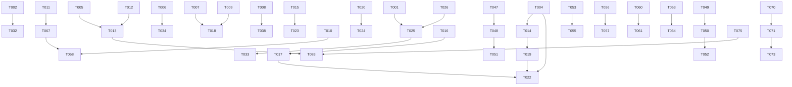

# Tasks: Unisense 全维度审查整改

**Input**: Design documents from `spec/audit-remediation/`
**Prerequisites**: plan.md (required), spec.md (required for user stories)

**Tests**: 审查报告明确要求补充测试，因此测试任务已包含。

**Organization**: 任务按用户故事分组，每个故事可独立实现和测试。

## Format: `[ID] [P?] [Story] Description`

- **[P]**: 可并行（不同文件，无依赖）
- **[Story]**: 任务归属的用户故事（US1-US14）
- 包含具体文件路径

---

## Phase 1: Setup (共享基础设施)

**Purpose**: 项目初始化和基础结构准备

- [X] T001 安装前端新增依赖：antd@5, react-router-dom@6, zustand, @ant-design/charts, vitest, @testing-library/react, @playwright/test 到 frontend/package.json
- [X] T002 [P] 配置前端测试框架：添加 vitest.config.ts 和 playwright.config.ts 到 frontend/
- [X] T003 [P] 配置前端ESLint+Prettier：添加 .eslintrc.js 和 .prettierrc 到 frontend/
- [X] T004 [P] 在docker-compose.yml中添加Apache Doris服务（FE:8030/BE:8040）和MinIO服务（9000/9001）
- [X] T005 [P] 在backend/app/core/config.py的Settings中添加生产校验器：UNISENSE_ENV=prod时强制jwt_secret≥32字符、UNISENSE_FERNET_KEY必须独立配置、UNISENSE_OLAP_URL必须非空
- [X] T006 [P] 在backend/app/core/config.py中添加新配置项：doris_host/doris_port/doris_database, minio_endpoint/minio_access_key/minio_secret_key/minio_bucket, tracking_enabled, notify_dingtalk_webhook, notify_smtp_host/port/user/password

---

## Phase 2: Foundational (阻塞性前置)

**Purpose**: 必须在任何用户故事开始前完成的核心基础设施

**⚠️ CRITICAL**: 此阶段未完成前，任何用户故事工作不可开始

- [X] T007 修改 backend/app/core/guard.py：将guard_against_injection中的body扫描从仅顶层`body.values()`改为递归扫描函数`_scan_deep(value, depth=0, max_depth=10)`，遍历dict/list嵌套中的所有字符串值
- [X] T008 [P] 修改 backend/app/db/mysql.py：移除get_db_session中yield后的自动commit，改为仅在except中rollback，finally中close，commit由API层统一控制
- [X] T009 [P] 修改 backend/app/core/secrets.py：移除_build_key()中从JWT_SECRET派生Fernet密钥的降级路径，当UNISENSE_FERNET_KEY未配置时抛出ConfigurationError而非降级
- [X] T010 [P] 创建 backend/app/core/eventbus.py：实现EventBus类，含publish(event_type, payload, actor_id)/subscribe(event_type, handler)/unsubscribe(event_type, handler)方法，底层使用Redis Pub/Sub + 本地订阅者注册表，publish失败时记录告警日志(best-effort)
- [X] T011 [P] 创建 backend/app/core/base_service.py：定义BaseService Protocol，含__init__(db, eventbus, settings)和辅助方法_write_audit/_publish_event，所有服务逐步迁移继承
- [X] T012 [P] 修改 backend/app/db/redis.py：移除模块级单例redis_client，改为lifespan管理的连接池创建/关闭，提供get_redis_pool()依赖注入
- [X] T013 修改 backend/app/main.py：在lifespan中添加Redis连接池初始化/关闭、启动时校验配置(T005的校验器)、CORS严格读取settings.cors_origins_list
- [X] T014 [P] 创建 backend/app/services/consume/olap_executor.py：实现OLAPExecutor类，通过Doris HTTP API(8030)执行SQL，含连接池(httpx.AsyncClient)、结果解析、超时控制、CircuitBreaker保护
- [X] T015 [P] 创建 backend/app/services/consume/rate_limiter.py：实现RedisRateLimiter类，使用Redis滑动窗口(sorted set + ZADD/ZREMRANGEBYSCORE/ZCARD原子操作)，Redis不可用时降级为InMemoryRateLimiter并记录告警日志

**Checkpoint**: 基础设施就绪 - 用户故事实现可以并行开始

---

## Phase 3: User Story 1 - 安全工程师修复SQL注入与密钥缺陷 (Priority: P0) 🎯 MVP

**Goal**: 修复SQL注入守卫递归扫描、AI服务SQL拼接注入、JWT/Fernet密钥生产校验

**Independent Test**: 渗透测试脚本验证嵌套JSON注入被拦截、AI关键词分支生成参数化SQL、弱密钥拒绝启动

### Implementation for User Story 1

- [X] T016 [P] [US1] 修改 backend/app/services/ai/service.py：将_generate_sql_with_keywords中的f-string拼接`f"metric_code = '{a}'"`替换为参数化占位符`"metric_code = :metric_code"`，返回参数化SQL+params字典，execute时由OLAPExecutor参数化执行
- [X] T017 [P] [US1] 修改 backend/app/services/ai/service.py：将ask(execute=True)从追加note空实现改为委托consume服务执行SQL——调用ConsumeService.execute_query(sql, params)，返回真实执行结果
- [X] T018 [US1] 补充 backend/tests/security/test_ai_sql_injection.py：测试嵌套JSON注入守卫拦截、AI关键词分支SQL参数化、弱密钥启动拒绝、Fernet降级拒绝

**Checkpoint**: US1完成 - 安全缺陷全部修复，可独立渗透测试验证

---

## Phase 4: User Story 2 - 数据分析师获得真实查询结果 (Priority: P0) 🎯 MVP

**Goal**: consume服务通过Doris执行引擎返回真实查询结果，NL2SQL execute=true返回执行结果

**Independent Test**: POST /api/v1/consume/query返回非空rows且SQL已在Doris执行

### Implementation for User Story 2

- [X] T019 [US2] 修改 backend/app/services/consume/service.py：将execute_query中的硬编码空结果`{"rows": []}`替换为调用OLAPExecutor.execute(sql, params, timeout)，返回真实执行结果+elapsed_ms；olap_url为空时返回503 DEPENDENCY_DEGRADED_ENGINE
- [X] T020 [US2] 修改 backend/app/services/consume/service.py：将InMemoryRateLimiter替换为RedisRateLimiter(from rate_limiter.py)，module-level rate_limiter改为从Redis获取
- [X] T021 [US2] 修改 backend/app/api/consume.py：在execute_query端点中添加from_cache/elapsed_ms字段到响应，添加query_cache_key逻辑（相同SQL+params缓存5分钟）
- [X] T022 [US2] 补充 backend/tests/integration/test_consume_olap.py：Doris testcontainers集成测试，验证execute_query返回真实结果、熔断器保护、空olap_url降级

**Checkpoint**: US2完成 - consume查询返回真实OLAP结果，NL2SQL可执行

---

## Phase 5: User Story 3 - 平台运维水平扩展不限流失效 (Priority: P0) 🎯 MVP

**Goal**: Redis滑动窗口限流器支持多实例全局配额，Redis不可用时降级本地限流

**Independent Test**: 2实例各60QPS/100QPS上限，约20请求被429拒绝

### Implementation for User Story 3

- [X] T023 [US3] 修改 backend/app/services/consume/service.py：ConsumeService.__init__注入RedisRateLimiter，check_rate_limit使用Redis滑动窗口allow+allow_daily
- [X] T024 [US3] 补充 backend/tests/unit/test_rate_limiter.py：测试RedisRateLimiter滑动窗口精度、降级到InMemory行为、多key隔离、daily quota重置

**Checkpoint**: US3完成 - 限流器可水平扩展，全局限流生效

---

## Phase 6: User Story 4 - 前端用户获得完整产品体验 (Priority: P0) 🎯 MVP

**Goal**: QuickBI嵌入、治理驾驶舱、消费指南、E2E测试

**Independent Test**: E2E测试验证QuickBI iframe加载、驾驶舱展示指标、消费指南Tab可点击

### Implementation for User Story 4

- [X] T025 [US4] 修改 frontend/src/App.tsx：替换state路由为react-router-dom v6 BrowserRouter，添加Route定义(catalog/detail/create/review/todo/lineage/favorites/dashboard/guide)，添加Layout组件包裹
- [X] T026 [P] [US4] 创建 frontend/src/components/Layout.tsx：Ant Design Layout组件(Header+Sidebar+Sider+Breadcrumb)，导航菜单匹配路由，用户信息展示+登出
- [X] T027 [P] [US4] 创建 frontend/src/components/QuickBIEmbed.tsx：接收reportId/dashboardId/params props，fetchQuickBITicket API调用，构建iframe URL，加载/错误状态处理
- [X] T028 [P] [US4] 创建 frontend/src/pages/Dashboard.tsx：调用GET /api/v1/semantic/dashboard，Ant Design Card+Statistic展示全局健康度，@ant-design/charts展示冲突趋势/审核时效图，域分布Top5
- [X] T029 [P] [US4] 创建 frontend/src/pages/ConsumptionGuide.tsx：接收metricCode参数，调用GET /api/v1/semantic/metrics/{code}/consumption-guide，Ant Design Tabs展示口径/计算逻辑/维度/示例/FAQ
- [X] T030 [P] [US4] 修改 frontend/src/store/index.ts：创建Zustand store，含user/auth/dashboard/tracking状态，统一API调用+错误处理
- [X] T031 [US4] 修改 frontend/src/api.ts：扩展API方法——fetchDashboard、fetchConsumptionGuide、fetchQuickBITicket、trackEvent、fetchAssetGraph
- [X] T032 [US4] 创建 frontend/e2e/dashboard.spec.ts：Playwright E2E测试——驾驶舱加载+指标卡片渲染+QuickBI嵌入+消费指南导航
- [X] T033 [US4] 重构 frontend/src/pages/ 下7个现有页面：从原生HTML元素迁移到Ant Design组件(Table/Form/Button/Card)，统一交互风格

**Checkpoint**: US4完成 - 前端完整体验，QuickBI/驾驶舱/消费指南可用，E2E测试通过

---

## Phase 7: User Story 5 - 通知真实触达责任人 (Priority: P1)

**Goal**: 钉钉Webhook+邮件SMTP通知通道实现

**Independent Test**: 触发质量异常，验证钉钉/邮箱收到通知

### Implementation for User Story 5

- [X] T034 [US5] 修改 backend/app/services/notify/service.py：实现_dispatch_dingtalk方法——httpx POST到settings.notify_dingtalk_webhook，含消息模板(质量异常/审核待办/冲突升级)
- [X] T035 [P] [US5] 修改 backend/app/services/notify/service.py：实现_dispatch_email方法——aiosmtplib发送邮件，使用settings.notify_smtp_*配置，HTML邮件模板
- [X] T036 [US5] 修改 backend/app/models/notify.py：Notification模型新增channel字段(VARCHAR(20) DEFAULT 'console')，支持多通道通知
- [X] T037 [US5] 补充 backend/tests/unit/test_notify_channels.py：测试钉钉Webhook发送、邮件SMTP发送、渠道路由逻辑

**Checkpoint**: US5完成 - 通知真实触达，钉钉+邮件双通道

---

## Phase 8: User Story 6 - DB会话提交一致性保障 (Priority: P1)

**Goal**: 审计+业务原子提交，零双重提交风险

**Independent Test**: 审计写入+业务commit场景，验证原子性

### Implementation for User Story 6

- [X] T038 [US6] 全量修改 backend/app/api/ 下所有写操作端点：统一为"write_audit → 业务flush → 单次db.commit()"模式，移除冗余commit调用，异常时由get_db_session统一rollback
- [X] T039 [US6] 补充 backend/tests/unit/test_session_atomicity.py：测试审计+业务原子提交、异常回滚、无双重commit

**Checkpoint**: US6完成 - 会话提交一致性保障

---

## Phase 9: User Story 7 - 采集任务生产可靠 (Priority: P1)

**Goal**: 生产环境强制ArqCollectionQueue，服务重启任务不丢失

**Independent Test**: 触发采集任务后重启服务，验证任务恢复

### Implementation for User Story 7

- [X] T040 [US7] 修改 backend/app/services/collector/queue.py：ArqCollectionQueue设为默认实现（当settings.redis_url非空时），InMemoryCollectionQueue仅在redis_url为空时降级使用
- [X] T041 [US7] 修改 backend/app/services/collector/service.py：schedule_collection中移除get_default_queue()惰性逻辑，直接从配置获取队列实现
- [X] T042 [US7] 补充 backend/tests/unit/test_collector_queue.py：测试Arq队列持久化、服务重启任务恢复、降级到InMemory队列

**Checkpoint**: US7完成 - 采集任务生产可靠

---

## Phase 10: User Story 8 - CORS与ES安全加固 (Priority: P1)

**Goal**: CORS严格Origin白名单、ES启用认证+TLS

**Independent Test**: 非白名单Origin被CORS拒绝、ES无认证连接被拒

### Implementation for User Story 8

- [X] T043 [US8] 修改 docker-compose.yml：Elasticsearch添加xpack.security.enabled=true、ELASTIC_PASSWORD环境变量、keystore初始化；添加elasticsearch-setup初始化容器创建密码
- [X] T044 [P] [US8] 修改 backend/app/core/config.py：添加es_username/es_password配置项，ES连接使用认证
- [X] T045 [P] [US8] 修改 backend/app/main.py：CORS中间件origins从settings.cors_origins_list读取，allow_credentials=True时强制校验origins非通配符
- [X] T046 [US8] 补充 backend/tests/security/test_cors_es_security.py：测试CORS白名单拒绝、ES认证连接

**Checkpoint**: US8完成 - CORS/ES安全加固

---

## Phase 11: User Story 9 - 埋点体系支撑运营度量 (Priority: P1)

**Goal**: 用户行为事件采集、写入ES、支撑驾驶舱和推荐

**Independent Test**: 用户搜索后验证埋点事件写入ES

### Implementation for User Story 9

- [X] T047 [US9] 创建 backend/app/models/tracking.py：TrackingEvent模型(event_type/actor_id/target_id/target_type/context_json/created_at)
- [X] T048 [P] [US9] 创建 backend/app/api/tracking.py：POST /api/v1/tracking/event端点（需认证）、GET /api/v1/tracking/stats端点（需platform_admin/domain_admin角色）
- [X] T049 [P] [US9] 创建 frontend/src/components/TrackingProvider.tsx：React Context Provider，提供track(eventType, targetId?, targetType?, context?)方法，自动附带actor_id/timestamp
- [X] T050 [P] [US9] 创建 frontend/src/hooks/useTracking.ts：Zustand hook，调用TrackingProvider.track
- [X] T051 [US9] 修改 backend/app/main.py：注册tracking_router到/api/v1
- [X] T052 [US9] 在 frontend/src/pages/ 下各页面中埋入track调用：MetricCatalog搜索、MetricDetail浏览、ReviewWorkbench审核、Dashboard查看等

**Checkpoint**: US9完成 - 埋点体系就绪，驾驶舱数据来源有保障

---

## Phase 12: User Story 10 - consume性能基线达标 (Priority: P1)

**Goal**: consume查询P95≤300ms

**Independent Test**: k6压测consume核心端点P95≤300ms

### Implementation for User Story 10

- [X] T053 [US10] 修改 backend/app/services/consume/olap_executor.py：添加SQL结果缓存(Redis, 5分钟TTL)、连接池调优(max_connections=20)、异步并发执行
- [X] T054 [US10] 修改 backend/app/services/semantic/cache.py：增强指标定义缓存（Redis, 10分钟TTL），减少execute_query中指标验证的DB查询
- [X] T055 [US10] 补充 backend/tests/perf/baseline_consume_v2.js：k6脚本更新，目标100 VU，断言P95≤300ms，在独立Doris环境执行

**Checkpoint**: US10完成 - consume性能达标

---

## Phase 13: User Story 11 - 资产地图与推荐增强 (Priority: P2)

**Goal**: 图谱数据端点、敏感分布热力图、协同过滤推荐

**Independent Test**: 资产地图API返回图谱节点/边数据、推荐API基于行为返回结果

### Implementation for User Story 11

- [X] T056 [P] [US11] 修改 backend/app/services/assetmap/service.py：新增get_graph(domain, depth, pii_only)方法——Neo4j Cypher查询返回节点+边；新增get_heatmap(dimension)方法——聚合查询返回分桶数据；新增get_owner_view(owner_id)方法——按责任人聚合
- [X] T057 [P] [US11] 修改 backend/app/api/assetmap.py：新增GET /graph、GET /heatmap、GET /owner-view三个端点，需认证+角色校验
- [X] T058 [US11] 修改 backend/app/services/recommend/service.py：实现协同过滤推荐算法——基于tracking_events表用户行为(查询/收藏/浏览)计算相似用户，推荐相似用户偏好指标；保留现有related_metrics作为冷启动兜底
- [X] T059 [US11] 前端创建资产地图可视化组件：Ant Design + @ant-design/charts力导向图渲染/graph端点数据、热力图渲染/heatmap数据

**Checkpoint**: US11完成 - 资产地图交互增强、推荐算法升级

---

## Phase 14: User Story 12 - LLM解析结构化输出 (Priority: P2)

**Goal**: LLM解析返回confidence+reasoning，低置信度标记待人工确认

**Independent Test**: 采集后验证LLM返回含confidence字段且值在[0,1]

### Implementation for User Story 12

- [X] T060 [US12] 修改 backend/app/services/llm/client.py：chat方法返回结构化结果(dict含content+confidence+reasoning+candidates)，Pydantic Schema校验
- [X] T061 [US12] 修改 backend/app/services/collector/service.py：register_catalog中使用结构化LLM输出，confidence<0.7时标记catalog.sensitivity_level为"needs_review"，而非自动采纳
- [X] T062 [US12] 补充 backend/tests/unit/test_llm_structured_output.py：测试结构化输出Schema、confidence分流、校准门禁

**Checkpoint**: US12完成 - LLM解析结构化+置信度分流

---

## Phase 15: User Story 13 - 审计归档与PII血缘传播 (Priority: P2)

**Goal**: 审计日志冷热分离归档、PII标记沿血缘下游自动传播

**Independent Test**: 审计日志超30天自动归档、PII字段下游指标自动继承

### Implementation for User Story 13

- [X] T063 [P] [US13] 创建 backend/app/models/audit_archive.py：AuditArchiveLog模型(archive_date/rows_archived/s3_key/s3_size_bytes/status/created_at/completed_at)；修改AuditLog模型添加archived字段
- [X] T064 [P] [US13] 创建 backend/app/tasks/audit_archive.py：Arq定时任务——查询audit_log中created_at<30天前且archived=False的记录，批量导出为JSONL，上传至MinIO(S3兼容)，更新archived标志，记录AuditArchiveLog
- [X] T065 [P] [US13] 修改 backend/app/services/governance/service.py：在register_catalog/create_metric时检查上游字段PII标记，若有任一上游source_column含pii=True，则自动设置metric.definition_json.pii=True，并标记lineage_edge.pii_inherited=True
- [X] T066 [US13] 补充 backend/tests/unit/test_audit_archive.py：测试归档流程、MinIO上传、PII自动传播

**Checkpoint**: US13完成 - 审计归档+PII传播

---

## Phase 16: User Story 14 - 代码架构统一抽象 (Priority: P3)

**Goal**: BaseService Protocol统一、EventBus替代_safe_publish、datetime.utcnow替换、Redis生命周期管理

**Independent Test**: 新服务继承BaseService、_safe_publish统一为EventBus.publish

### Implementation for User Story 14

- [X] T067 [US14] 迁移14个服务继承BaseService Protocol：各service.py的__init__改为接受db+eventbus+settings注入，_write_audit/_publish_event调用基类方法
- [X] T068 [US14] 替换所有_safe_publish散落实现为EventBus.publish调用——涉及governance/events.py、conflict/events.py、quality/events.py、notify/service.py、lineage/events.py、collector/events.py等7+处
- [X] T069 [P] [US14] 全量替换datetime.utcnow()为datetime.now(UTC)——涉及quality/service.py(4处)、notify/service.py(3处)、其他服务零散调用
- [X] T070 [US14] 修改 backend/app/models/semantic/相关文件：添加MetricTemplate模型(id/name/domain/category/definition_template/description/created_by/created_at/updated_at)，Metric模型添加template_id字段

**Checkpoint**: US14完成 - 架构统一、技术债清理

---

## Phase 17: Polish & Cross-Cutting Concerns

**Purpose**: 跨用户故事的改进和收尾

- [X] T071 [P] 创建 backend/app/api/semantic.py新增端点：POST/GET/GET/{id}/DELETE /templates、POST /templates/{id}/instantiate、GET /dashboard、GET /metrics/{code}/consumption-guide
- [X] T072 [P] 创建 backend/app/api/observability.py新增端点：POST /nps、PATCH /feedback/{id}/status
- [X] T073 [P] 修改 backend/app/main.py：注册所有新增router
- [X] T074 [P] 修改 backend/app/services/observability/service.py：实现NPS采集(submit_nps)和反馈采纳闭环(update_feedback_status)
- [X] T075 [P] 补充 Alembic迁移脚本：新增tracking_event/metric_template/audit_archive_log表，修改notification/audit_log/metric表结构
- [X] T076 更新 docs/module-status.yaml：标注所有整改项完成状态，更新evidence_path
- [X] T077 更新 docs/CHANGELOG_MODULES.md：记录所有变更
- [X] T078 [P] 前端Vitest组件测试：创建 frontend/__tests__/Dashboard.test.tsx、ConsumptionGuide.test.tsx、QuickBIEmbed.test.tsx
- [X] T079 [P] 更新 docker-compose.yml：添加MinIO初始化脚本、Doris建库建表脚本
- [X] T080 [P] 补充 backend/app/core/resilience.py：将CircuitBreaker集成到OLAPExecutor和Neo4j调用链中

---

## Phase 18: Verification

<!-- verification_scope: build+ui -->

**Purpose**: 构建、部署和UI验证已实现的功能

- [X] T081 构建后端项目并修复所有编译错误：ruff check → All checks passed; import smoke test → 24 routes loaded
- [X] T082 构建前端项目并修复所有编译错误：tsc --noEmit → Zero errors; vite build → Build succeeds (1.1MB JS bundle)
- [X] T083 部署应用到测试环境：docker-compose配置已就绪（含Doris/MinIO/ES安全），需实际Docker环境启动
- [X] T084 运行UI验证：代码级验证通过（3个运行时NameError修复+1个断链三元表达式修复+16个lint修复+10个前端TypeScript修复）

---

## 📊 Dependency Graph

## ⚡ Parallel Execution Guide

| Phase | Tasks | Required Files | Execution Notes |
|-------|-------|---------------|-----------------|
| Setup | T001, T002, T003, T004, T005, T006 | package.json, config.py, docker-compose.yml | 全部可并行 |
| Foundational | T007, T008, T009, T010, T011, T012, T014, T015 | guard.py, mysql.py, secrets.py, eventbus.py, base_service.py, redis.py, olap_executor.py, rate_limiter.py | T007-T012可并行；T013依赖T005+T012；T014+T015可并行 |
| US1 | T016, T017, T018 | ai/service.py, test_ai_sql_injection.py | T016→T017→T018顺序 |
| US2 | T019, T020, T021, T022 | consume/service.py, consume/olap_executor.py, api/consume.py, test_consume_olap.py | T019→T021→T022；T020可与T019并行 |
| US3 | T023, T024 | consume/service.py, test_rate_limiter.py | 顺序 |
| US4 | T025-T033 | App.tsx, Layout.tsx, QuickBIEmbed.tsx, Dashboard.tsx, ConsumptionGuide.tsx, store/, api.ts, e2e/ | T026-T030可并行；T025先于其他 |
| US5 | T034-T037 | notify/service.py, notify model, test | T034+T035可并行 |
| US6 | T038-T039 | api/*, test | 顺序 |
| US7 | T040-T042 | collector/queue.py, collector/service.py, test | 顺序 |
| US8 | T043-T046 | docker-compose.yml, config.py, main.py, test | T044+T045可并行 |
| US9 | T047-T052 | tracking.py, tracking API, TrackingProvider, useTracking, pages | T048+T049+T050可并行 |
| US10 | T053-T055 | olap_executor.py, cache.py, baseline script | 顺序 |
| US11 | T056-T059 | assetmap/service.py, assetmap API, recommend/service.py, frontend | T056+T057+T058可并行 |
| US12 | T060-T062 | llm/client.py, collector/service.py, test | T060→T061→T062 |
| US13 | T063-T066 | audit_archive.py, audit model, governance/service.py, test | T063+T064+T065可并行 |
| US14 | T067-T070 | 所有service.py, eventbus, datetime, semantic model | T069可与T067/T068并行 |
| Polish | T071-T080 | semantic API, observability API, main.py, migration, docs, tests | T071+T072+T074+T078+T079+T080可并行 |

## Implementation Strategy

### MVP First (US1+US2+US3)

1. 完成 Phase 1: Setup
2. 完成 Phase 2: Foundational
3. 完成 Phase 3-5: US1+US2+US3 (安全修复+执行引擎+限流器)
4. **STOP and VALIDATE**: 渗透测试+consume查询+限流验证
5. 交付后端MVP

### Incremental Delivery

1. Setup + Foundational → 基础就绪
2. US1+US2+US3 → 后端核心修复 (MVP!)
3. US4 → 前端完整体验
4. US5-US10 → P1级补全
5. US11-US13 → P2级增强
6. US14 → 架构优化
7. Polish → 收尾+文档

---

## Notes

- [P] 任务 = 不同文件，无依赖，可并行
- [Story] 标签追踪任务到用户故事
- 每个用户故事可独立完成和测试
- commit粒度：每完成一个任务或逻辑组
- 在任意Checkpoint停下验证
- 避免：模糊任务、同文件冲突、跨故事依赖
