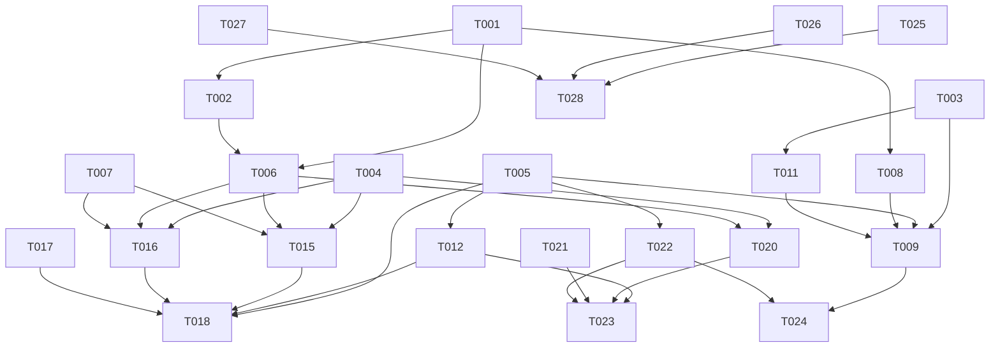

# Tasks: 采集目录 Schema 表格化展示 + LLM 推断字段描述 + 人工编辑

**Input**: Design documents from `spec/catalog-schema-view-edit/`
**Prerequisites**: plan.md (required), spec.md (required for user stories)

**Tests**: Not explicitly requested in spec, but the project has existing test infrastructure. Unit tests included for critical LLM inference logic.

**Organization**: Tasks grouped by user story for independent implementation and testing.

## Format: `[ID] [P?] [Story] Description`

- **[P]**: Can run in parallel (different files, no dependencies)
- **[Story]**: Which user story this task belongs to (e.g., US1, US2, US3, US4)
- Include exact file paths in descriptions

---

## Phase 1: Setup (Shared Infrastructure)

**Purpose**: 数据库模型 + migration + 类型定义，所有用户故事的前置基础设施

- [X] T001 新增 ColumnDescription ORM 模型（id/catalog_id/column_name/description/source/updated_by/created_at/updated_at/deleted_at）在 backend/app/models/data_source.py
- [X] T002 新增 Alembic migration 创建 column_descriptions 表（含唯一约束 uk_column_desc_catalog_col 和索引 idx_column_desc_source）在 backend/alembic/versions/
- [X] T003 [P] 新增前端类型定义：ColumnDescription 接口 + SchemaColumn 接口（含 description/description_source 字段）+ AssetEntityDetail.schema_summary 类型收窄为 SchemaColumn[] 在 frontend/src/types.ts
- [X] T004 [P] 新增后端 Pydantic schema：ColumnDescriptionResponse / InferDescriptionRequest / InferDescriptionResponse / InferBatchResponse / UpdateDescriptionRequest / UpdateDescriptionResponse 在 backend/app/services/collector/schemas.py

---

## Phase 2: Foundational (Blocking Prerequisites)

**Purpose**: 核心基础设施——通用 SchemaTable 组件 + 后端描述 CRUD + LLM 推断方法

**⚠️ CRITICAL**: 所有用户故事依赖此阶段完成

- [X] T005 新增 SchemaTable 通用组件：Ant Design Table 展示字段名/类型/描述（含来源Tag），支持 editable/inferable props，描述列可切换编辑态 在 frontend/src/components/SchemaTable.tsx
- [X] T006 新增 column_descriptions CRUD 方法：get_descriptions(catalog_id) / upsert_description(catalog_id, column_name, description, source, updated_by) / batch_upsert_descriptions 在 backend/app/services/collector/repository.py
- [X] T007 新增 _llm_infer_column_description 方法（复用 build_llm_client + 熔断器，输入表名+字段名+类型，返回推断描述+confidence）在 backend/app/services/collector/service.py
- [X] T008 增强 AssetMapRepository.get_entity_detail：查询 column_descriptions 表，按 manual>llm>schema 优先级合并 description 和 description_source 到 schema_summary 每条字段 在 backend/app/services/assetmap/repository.py

**Checkpoint**: 基础设施就绪，用户故事实现可并行展开

---

## Phase 3: User Story 1 - Schema 摘要表格化展示 (Priority: P1) 🎯 MVP

**Goal**: 资产地图实体详情抽屉中 Schema 摘要从嵌套 ObjectView 改为 Ant Design Table 展示

**Independent Test**: 资产地图→数据表→点详情→Schema摘要区域呈现为 Table 组件，含 Name/Type/Description 三列

### Implementation for User Story 1

- [X] T009 [US1] 修改 AssetMap.tsx 中 renderSchemaSummary 函数：判断 schema_summary 为数组时渲染 SchemaTable 组件（传入 columns/editable=false），字符串/空值保留兼容展示，移除 ObjectView 引用 在 frontend/src/pages/AssetMap.tsx
- [X] T010 [US1] 加宽资产地图详情抽屉宽度（560→720）以适配字段表格 在 frontend/src/pages/AssetMap.tsx
- [X] T011 [US1] 修改 AssetEntityDetail 类型中 schema_summary 从 `string | Record<string, unknown> | null` 收窄为 `SchemaColumn[] | string | null` 在 frontend/src/types.ts

**Checkpoint**: 资产地图 Schema 摘要以表格呈现，字段可读性大幅改善

---

## Phase 4: User Story 2 - 采集目录页查看字段详情 (Priority: P1)

**Goal**: Catalogs 页点击表行查看字段详情（抽屉展示 schema_def.columns）

**Independent Test**: Catalogs 页→点击表行"字段详情"→抽屉展示字段表格（名称/类型/描述/可空/默认值）

### Implementation for User Story 2

- [X] T012 [US2] 在 Catalogs 页增加字段详情抽屉：点击表行"字段详情"按钮打开 Drawer，调用 listCatalogs 获取 schema_def，解析 columns 为 SchemaColumn[] 传入 SchemaTable 组件（editable=false） 在 frontend/src/pages/Catalogs.tsx
- [X] T013 [US2] schema_incomplete 表格顶部显示警告标签"Schema 不完整"，schema_def 为空显示空状态 在 frontend/src/pages/Catalogs.tsx
- [X] T014 [US2] Catalogs 表格列增加"字段详情"操作按钮（带 EyeOutlined 图标） 在 frontend/src/pages/Catalogs.tsx

**Checkpoint**: 采集目录页可查看完整字段信息，schema 不完整有警告提示

---

## Phase 5: User Story 3 - LLM 推断缺失字段描述 (Priority: P2)

**Goal**: 手动按钮触发 LLM 推断空 comment 字段描述

**Independent Test**: 字段详情表格中空描述字段行点击"推断"按钮→LLM返回描述→实时更新表格

### Implementation for User Story 3

- [X] T015 [US3] 新增后端端点 POST /catalogs/{catalog_id}/columns/{column_name}/infer-description：调用 _llm_infer_column_description 推断后 upsert 到 column_descriptions 表（source=llm），返回推断结果 在 backend/app/api/collector.py
- [X] T016 [US3] 新增后端端点 POST /catalogs/{catalog_id}/infer-descriptions：批量推断该 catalog 所有空 comment 字段，逐字段推断并 upsert，返回 inferred/skipped/failed 统计 在 backend/app/api/collector.py
- [X] T017 [P] [US3] 新增前端 API 函数：inferColumnDescription / inferDescriptions 在 frontend/src/api.ts
- [X] T018 [US3] Catalogs 字段详情抽屉增强：SchemaTable editable=true，空描述字段行显示"推断"按钮，批量推断按钮在表格上方，推断中显示 Spin，推断失败友好提示 在 frontend/src/pages/Catalogs.tsx
- [X] T019 [P] [US3] 新增后端单测：_llm_infer_column_description 方法（mock LlmClient，验证正常推断/超时/格式错误降级） 在 backend/tests/unit/test_llm_description.py

**Checkpoint**: LLM 推断可用，空描述字段可一键推断，推断结果标记 source=llm

---

## Phase 6: User Story 4 - 人工编辑字段描述 (Priority: P2)

**Goal**: 字段详情表格中直接编辑描述，持久化到独立 column_descriptions 表

**Independent Test**: 字段详情表格点击编辑→输入新描述→保存→刷新后描述仍在

### Implementation for User Story 4

- [X] T020 [US4] 新增后端端点 PUT /catalogs/{catalog_id}/columns/{column_name}/description：upsert 到 column_descriptions 表（source=manual, updated_by=current_user.id），审计日志记录编辑操作 在 backend/app/api/collector.py
- [X] T021 [P] [US4] 新增前端 API 函数：updateColumnDescription 在 frontend/src/api.ts
- [X] T022 [US4] SchemaTable 组件增强：描述列点击编辑图标切换为 Input，确认后调 onEdit callback，source Tag 从"LLM 推断"更新为"人工编辑" 在 frontend/src/components/SchemaTable.tsx
- [X] T023 [US4] Catalogs 字段详情抽屉集成编辑：onEdit 调用 updateColumnDescription API，保存成功后刷新表格 在 frontend/src/pages/Catalogs.tsx
- [X] T024 [US4] AssetMap 详情抽屉也集成描述来源展示：SchemaTable 显示 description_source Tag（"LLM 推断"/"人工编辑"/"采集原始"） 在 frontend/src/pages/AssetMap.tsx

**Checkpoint**: 人工编辑可用，描述持久化且不被采集覆盖，manual>llm>schema 优先级链完整

---

## Phase 7: Polish & Cross-Cutting Concerns

**Purpose**: 跨用户故事的收尾工作

- [X] T025 [P] 更新 module-status.yaml：collector 服务新增 LLM 推断描述 + 编辑描述能力条目 在 docs/module-status.yaml
- [X] T026 [P] 更新 CHANGELOG_MODULES.md：记录本次特性变更 在 docs/CHANGELOG_MODULES.md
- [X] T027 [P] TD 文档同步：更新 TD §12.1（collector 服务新增端点说明）+ §4.1（column_descriptions 表定义） 在 docs/technical-design.md
- [X] T028 前端 TypeScript 类型检查通过：npx tsc --noEmit 在 frontend/
- [X] T029 后端 ruff 检查通过：ruff check + ruff format --check 在 backend/

---

## Phase 8: Verification

<!-- verification_scope: build+ui -->

**Purpose**: Build, deploy, and UI-verify the implemented feature

- [ ] T030 Build project and fix any compilation errors (invoke build_project; iterate fix → build until success)
- [ ] T031 Deploy application to device/emulator (invoke start_app)
- [ ] T032 Run UI verification against deployed application

---

## 📊 Dependency Graph

## ⚡ Parallel Execution Guide

| Phase | Tasks | Required Files | Execution Notes |
|-------|-------|---------------|-----------------|
| Setup | T003, T004 | types.ts, schemas.py | 前端类型 + 后端 schema 可并行 |
| Foundational | T005, T006, T007, T008 | SchemaTable.tsx, repository.py, service.py, repository.py | T005/006/007 可并行，T008 依赖 T001 |
| US1 | T009, T010, T011 | AssetMap.tsx, types.ts | T010 可与 T009 并行 |
| US2 | T012, T013, T014 | Catalogs.tsx | 顺序执行 |
| US3 | T015, T016, T017, T018, T019 | collector.py, api.ts, Catalogs.tsx, test | T015/T016 并行，T017/T019 并行 |
| US4 | T020, T021, T022, T023, T024 | collector.py, api.ts, SchemaTable.tsx, Catalogs.tsx, AssetMap.tsx | T020/T021 并行 |
| Polish | T025, T026, T027, T028, T029 | docs/, frontend/, backend/ | T025/T026/T027 并行 |

---

## Implementation Strategy

### MVP First (User Story 1 Only)

1. Complete Phase 1: Setup (T001-T004)
2. Complete Phase 2: Foundational (T005-T008)
3. Complete Phase 3: User Story 1 (T009-T011)
4. **STOP and VALIDATE**: 资产地图 Schema 表格化可用
5. Deploy/demo if ready

### Incremental Delivery

1. Setup + Foundational → 基础设施就绪
2. Add US1 → Schema 表格化 → Deploy (MVP!)
3. Add US2 → 采集目录字段详情 → Deploy
4. Add US3 → LLM 推断描述 → Deploy
5. Add US4 → 人工编辑 → Deploy (完整功能)
6. Polish + Verification → 最终交付
