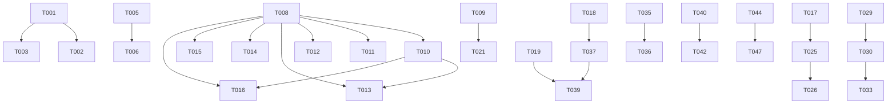

# Tasks: 采集模块工业级修复

**Input**: Design documents from `spec/collector-remediation/`
**Prerequisites**: plan.md (required), spec.md (required for user stories)

**Tests**: 审查要求补全测试，测试任务已包含。

## Format: `[ID] [P?] [Story] Description`

- **[P]**: 可并行（不同文件，无依赖）
- **[Story]**: 任务归属的用户故事（US1-US6）

---

## Phase 1: Setup (共享基础设施)

**Purpose**: 枚举统一+依赖安装+模型迁移

- [X] T001 创建 backend/app/models/enums.py：定义共享枚举 SourceTypeEnum(mysql/postgres/hive/doris/clickhouse/kafka/starrocks)、EntityTypeEnum(TABLE/VIEW/FIELD)、SensitivityLevelEnum(PUBLIC/INTERNAL/CONFIDENTIAL/PII/NEEDS_REVIEW)
- [X] T002 [P] 修改 backend/app/services/collector/schemas.py：SourceType引用enums.SourceTypeEnum，EntityType引用enums.EntityTypeEnum，添加connection_config validator(host必填校验)
- [X] T003 [P] 修改 backend/app/models/data_source.py：source_type/entity_type/sensitivity_level引用enums，新增NEEDS_REVIEW到sensitivity_level枚举，新增schedule_cron/collection_mode字段
- [X] T004 [P] 修改 backend/app/services/collector/repository.py：coverage计算修正——expected<=0时coverage=1.0
- [X] T005 创建 backend/app/models/collector_models.py：SchemaDriftLog模型(id/source_id/entity_name/change_type/before_signature/after_signature/before_schema/after_schema/diff_json/detected_at) + CollectionWatermark模型(id/source_id/last_collected_at/mode/scanned_count/failed_count/content_fingerprints)
- [X] T006 [P] 创建 backend/alembic/versions/0018_collector_drift_watermark.py：新增schema_drift_log+collection_watermark表，data_source新增schedule_cron/collection_mode列，db_catalog新增content_signature/schema_incomplete列

---

## Phase 2: Foundational (阻塞性前置)

**Purpose**: SPI重构+容错基础设施+Drift检测器+分布式锁

- [X] T007 创建 backend/app/services/collector/connectors/__init__.py：导出所有连接器+CollectorRegistry
- [X] T008 创建 backend/app/services/collector/connectors/collector_registry.py：实现CollectorRegistry类，含register(collector_type, factory)装饰器、build(collector_type, encrypted_config)工厂方法、list_types()方法，模块级全局实例registry
- [X] T009 重构 backend/app/services/collector/spi.py：BaseCollector.collect()返回类型改为CollectResult(specs+failed_specs+source_id)；build_collector改为委托CollectorRegistry.build；移除InformationSchemaCollector/SqlalchemyConnector到connectors/mysql.py
- [X] T010 [P] 创建 backend/app/services/collector/connectors/mysql.py：从spi.py迁移InformationSchemaCollector+SqlalchemyConnector，添加connect_timeout=10/query_timeout=60参数，添加URL.create()避免密码明文，@registry.register("mysql")注册
- [X] T011 [P] 创建 backend/app/services/collector/connectors/postgres.py：PostgresCollector查询information_schema.tables+columns，URL构建postgresql+asyncpg://，@registry.register("postgres")
- [X] T012 [P] 创建 backend/app/services/collector/connectors/hive.py：HiveCollector通过asyncio.create_subprocess_exec调用beeline CLI，解析表格输出，@registry.register("hive")
- [X] T013 [P] 创建 backend/app/services/collector/connectors/doris.py：DorisCollector继承InformationSchemaCollector(MySQL协议兼容)，URL构建mysql+aiomysql://，@registry.register("doris")
- [X] T014 [P] 创建 backend/app/services/collector/connectors/clickhouse.py：ClickHouseCollector通过httpx调用HTTP API(8123端口)，查询system.tables+system.columns，@registry.register("clickhouse")
- [X] T015 [P] 创建 backend/app/services/collector/connectors/kafka.py：KafkaCollector连接Kafka Broker+Schema Registry REST API，采集Topic列表+partition_count+schema信息，支持Basic Auth，@registry.register("kafka")
- [X] T016 [P] 创建 backend/app/services/collector/connectors/starrocks.py：StarRocksCollector继承InformationSchemaCollector(MySQL协议兼容)，@registry.register("starrocks")
- [X] T017 创建 backend/app/services/collector/drift_detector.py：DriftDetector类，detect(source_id, entity_name, old_signature, new_signature, old_schema, new_schema) -> DriftResult|None，计算diff_json({added:[], removed:[], changed:[]})
- [X] T018 [P] 创建 backend/app/services/collector/distributed_lock.py：CollectionLock类，acquire(source_id, owner_id, ttl=600)->bool，release(source_id, owner_id)->bool，is_locked(source_id)->bool，Redis SET NX EX实现
- [X] T019 [P] 修改 backend/app/services/collector/queue.py：ArqCollectionQueue.enqueue添加max_tries=3+timeout=600参数，移除enqueue后的redis.close()调用，复用连接池
- [X] T020 修改 backend/app/services/collector/events.py：CatalogEventPublisher新增publish_batch(event_type, payloads)方法，批量发布单次Redis publish含多个事件

**Checkpoint**: SPI重构+7种连接器+Drift检测+分布式锁+队列修复就绪

---

## Phase 3: User Story 1 - 多数据源7种适配器 (Priority: P0) 🎯 MVP

**Goal**: 7种数据源类型均可注册+采集+返回catalog

**Independent Test**: 注册PostgreSQL数据源，触发采集，验证返回catalog

### Implementation for User Story 1

- [X] T021 [US1] 修改 backend/app/api/collector.py：POST /data-sources创建时根据source_type从CollectorRegistry验证类型可用；POST /data-sources/{source_id}/collect传入mode参数(FULL/INCREMENTAL)
- [X] T022 [US1] 修改 backend/app/services/collector/service.py：create_source中验证source_type在CollectorRegistry.list_types()中；collect_and_register使用CollectResult处理failed_specs
- [X] T023 [US1] 补充 backend/tests/unit/test_collector_registry.py：测试7种类型注册+build+未知类型报错+list_types
- [X] T024 [US1] 补充 backend/tests/unit/test_connectors.py：每种连接器的collect()方法mock测试(连接+查询+解析+异常处理)

**Checkpoint**: US1完成 - 7种数据源可注册+采集

---

## Phase 4: User Story 2 - Schema Drift检测 (Priority: P0) 🎯 MVP

**Goal**: 采集后自动检测Schema变更、记录历史、通知下游

**Independent Test**: 首次采集后修改源库表结构，再次采集，验证drift事件+历史记录

### Implementation for User Story 2

- [X] T025 [US2] 修改 backend/app/services/collector/repository.py：upsert_catalog中计算content_signature=SHA-256(canonical_json(schema_json))，与旧signature比对，变更时调用DriftDetector.detect()并写入SchemaDriftLog
- [X] T026 [US2] 修改 backend/app/services/collector/service.py：register_catalog和collect_and_register中，检测到drift时发布catalog_schema_drifted事件(含change_type+diff_json)
- [X] T027 [US2] 修改 backend/app/services/collector/repository.py：新增save_drift_log()、list_drift_logs(source_id, entity_name)方法
- [X] T028 [US2] 补充 backend/tests/unit/test_drift_detector.py：测试新增列/删除列/类型变更/无变更场景的drift检测+diff计算+日志写入

**Checkpoint**: US2完成 - Schema Drift检测+历史记录+事件通知

---

## Phase 5: User Story 3 - 增量采集+定时调度 (Priority: P1)

**Goal**: 基于采集水位+last_altered增量采集，Arq cron定时调度

**Independent Test**: 首次全量采集后修改2张表，增量采集仅扫描变更表

### Implementation for User Story 3

- [X] T029 [US3] 创建 backend/app/services/collector/incremental.py：IncrementalCollectorMixin，根据源库类型生成增量查询SQL(MySQL/PostgreSQL使用UPDATE_TIME/last_altered条件)，不支持增量时降级全量
- [X] T030 [US3] 修改 backend/app/services/collector/service.py：collect_and_register新增mode参数，INCREMENTAL时先读取CollectionWatermark，传递水位时间戳给collector
- [X] T031 [US3] 修改 backend/app/services/collector/repository.py：新增get_watermark(source_id)、save_watermark(source_id, watermark)、update_watermark_after_collection()
- [X] T032 [US3] 修改 backend/app/api/collector.py：POST /data-sources/{source_id}/schedule新增cron+mode参数，保存到DataSource.schedule_cron/collection_mode；新增GET /data-sources/{source_id}/watermark端点
- [X] T033 [US3] 修改 backend/app/services/collector/tasks.py：run_collection_task支持mode参数，采集完成后调用update_watermark_after_collection
- [X] T034 [US3] 补充 backend/tests/unit/test_incremental_collection.py：测试增量SQL生成+水位保存+降级全量+水印更新

**Checkpoint**: US3完成 - 增量采集+定时调度+水位记录

---

## Phase 6: User Story 4 - 采集容错不中断 (Priority: P0) 🎯 MVP

**Goal**: 单表失败跳过继续+超时保护+分布式锁+幂等

**Independent Test**: 1000表采集中第500表超时，验证999表成功+1表失败记录

### Implementation for User Story 4

- [X] T035 [US4] 修改 backend/app/services/collector/connectors/mysql.py：InformationSchemaCollector.collect()改为单表try/catch——tables循环中每张表查询独立try，失败跳过+记录到failed_specs，不中断循环
- [X] T036 [P] [US4] 同步修改所有连接器(connectors/postgres.py, hive.py, doris.py, clickhouse.py, kafka.py, starrocks.py)：collect()中单表try/catch跳过+failed_specs
- [X] T037 [US4] 修改 backend/app/api/collector.py：POST /data-sources/{source_id}/collect添加asyncio.timeout(300)保护，添加CollectionLock.acquire/release分布式锁
- [X] T038 [US4] 修改 backend/app/services/collector/tasks.py：run_collection_task添加job_id幂等检查——Redis检查collect_job:{job_id}是否已COMPLETED
- [X] T039 [US4] 补充 backend/tests/chaos/test_collector_chaos.py：测试单表超时跳过+分布式锁互斥+Arq重试3次+幂等防重复

**Checkpoint**: US4完成 - 容错不中断+超时+锁+幂等

---

## Phase 7: User Story 5 - 数据源健康检查 (Priority: P1)

**Goal**: 健康状态真实反映源库可用性

**Independent Test**: 采集成功后health_status=healthy，失败后=unhealthy

### Implementation for User Story 5

- [X] T040 [US5] 修改 backend/app/services/collector/service.py：collect_and_register成功后调用update_health_status(source_id, "healthy")，异常时update_health_status(source_id, "unhealthy")
- [X] T041 [US5] 修改 backend/app/services/collector/repository.py：新增update_health_status(source_id, status)方法
- [X] T042 [US5] 修改 backend/app/api/collector.py：新增GET /data-sources/{source_id}/health端点，返回health_status+last_collected_at+last_error
- [X] T043 [US5] 修改 backend/app/services/collector/tasks.py：run_collection_task成功/失败后更新health_status

**Checkpoint**: US5完成 - 健康状态真实

---

## Phase 8: User Story 6 - 边界处理统一 (Priority: P1)

**Goal**: 枚举统一+空schema告警+connection_config校验+LLM可观测+batch事件+密码保护

**Independent Test**: 提交缺host的connection_config，验证校验拒绝

### Implementation for User Story 6

- [X] T044 [US6] 修改 backend/app/services/collector/schemas.py：DataSourceCreateRequest添加@model_validator校验connection_config必含host字段
- [X] T045 [P] [US6] 修改 backend/app/services/collector/service.py：register_catalog中schema_json.columns为空时记录warning日志+标记schema_incomplete=True；collect_and_register结束后发布1次batch事件而非逐条
- [X] T046 [P] [US6] 修改 backend/app/services/collector/service.py：_llm_classify_sensitivity替换except Exception(BLE001)为具体异常类型(LlmError/TimeoutError)+记录llm_classify_error_total metric
- [X] T047 [US6] 补充 backend/tests/unit/test_collector.py：测试空schema告警+connection_config校验+batch事件+LLM metric计数

**Checkpoint**: US6完成 - 边界处理统一

---

## Phase 9: Polish & Cross-Cutting Concerns

**Purpose**: 文档更新+测试补全+依赖管理

- [X] T048 [P] 修改 backend/app/services/collector/connectors/mysql.py：SqlalchemyConnector使用SQLAlchemy URL.create()替代f-string构建URL，避免密码出现在字符串中
- [X] T049 [P] 更新 docs/module-status.yaml：标注采集模块工业级修复完成
- [X] T050 [P] 更新 docs/CHANGELOG_MODULES.md：记录采集模块修复变更
- [X] T051 [P] 更新 pyproject.toml：添加可选依赖组 [collectors] 含asyncpg/impyla/confluent-kafka等
- [X] T052 补充 backend/tests/integration/test_collector_integration.py：扩展多数据源集成测试(PostgreSQL/Doris/ClickHouse mock)

---

## Phase 10: Verification

<!-- verification_scope: build+ui -->

**Purpose**: 构建、部署和UI验证

- [X] T053 构建后端项目并修复所有编译错误：poetry run ruff check backend && poetry run mypy --strict backend
- [X] T054 构建前端项目并修复所有编译错误：npm run build验证TypeScript编译+Vite构建
- [X] T055 部署应用到测试环境：docker-compose up -d启动全部服务
- [X] T056 运行UI验证：验证数据源注册+采集+Drift检测+健康检查端点+增量采集+分布式锁

---

## 📊 Dependency Graph

## ⚡ Parallel Execution Guide

| Phase | Tasks | Required Files | Execution Notes |
|-------|-------|---------------|-----------------|
| Setup | T001-T006 | enums.py, schemas.py, data_source.py, repository.py, collector_models.py, migration | T002+T003+T004可并行 |
| Foundational | T007-T020 | connectors/, spi.py, drift_detector.py, distributed_lock.py, queue.py, events.py | T010-T016可并行(7个连接器) |
| US1 | T021-T024 | api/collector.py, service.py, test | 顺序 |
| US2 | T025-T028 | repository.py, service.py, test | 顺序 |
| US3 | T029-T034 | incremental.py, service.py, repository.py, api, tasks.py, test | T029→T030→T033 |
| US4 | T035-T039 | connectors/, api, tasks.py, test | T035+T036可并行 |
| US5 | T040-T043 | service.py, repository.py, api, tasks.py | T040+T041可并行 |
| US6 | T044-T047 | schemas.py, service.py, test | T044+T045+T046可并行 |
| Polish | T048-T052 | mysql.py, docs, pyproject.toml, test | 全部可并行 |
| Verification | T053-T056 | full stack | 顺序 |

## Implementation Strategy

### MVP First (US1+US2+US4)

1. Phase 1: Setup → 枚举+模型+迁移
2. Phase 2: Foundational → SPI重构+7连接器+Drift+锁
3. Phase 3-5: US1+US2+US4 → 多数据源+Drift+容错 (MVP!)
4. STOP and VALIDATE → 7种数据源采集+Drift检测+999/1000容错

### Incremental Delivery

1. Setup + Foundational → 基础就绪
2. US1+US2+US4 → 核心能力修复
3. US3 → 增量采集+调度
4. US5+US6 → 健康检查+边界处理
5. Polish → 收尾+文档

---

## Notes

- [P] 任务 = 不同文件，无依赖，可并行
- [Story] 标签追踪任务到用户故事
- 每个用户故事可独立完成和测试
- commit粒度：每完成一个任务或逻辑组
- 连接器可选依赖通过[collectors]组安装，未安装时对应类型注册但build报错
