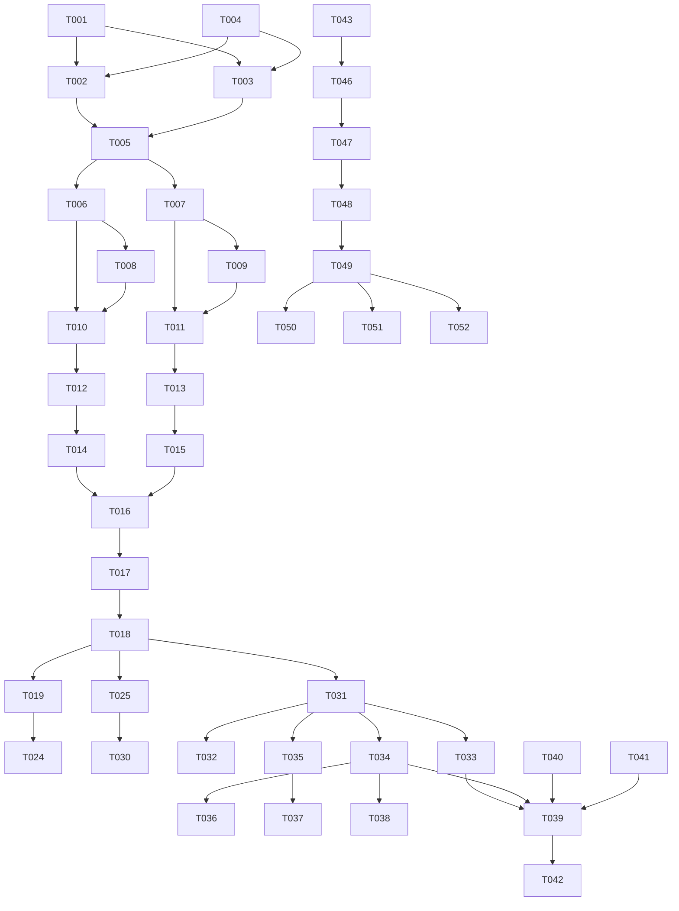

# Tasks: 主题域管理与指标注册全字段自动化

**Input**: Design documents from `spec/domain-registry-automation/`
**Prerequisites**: plan.md (required), spec.md (required for user stories)

**Tests**: 包含关键路径的单元测试和集成测试任务

**Organization**: Tasks are grouped by user story to enable independent implementation and testing of each story.

## Format: `[ID] [P?] [Story] Description`

- **[P]**: Can run in parallel (different files, no dependencies)
- **[Story]**: Which user story this task belongs to (e.g., US1, US2, US3)
- Include exact file paths in descriptions

## Path Conventions

- **Backend**: `backend/app/` (models, services, api)
- **Frontend**: `frontend/src/` (pages, api, types, components)
- **Migrations**: `backend/alembic/versions/`
- **Tests**: `backend/tests/unit/`, `backend/tests/integration/`
- **Scripts**: `backend/scripts/`

## Phase 1: Setup (Shared Infrastructure)

**Purpose**: 数据库迁移 + ORM 模型 + 枚举定义

- [X] T001 创建 Alembic 迁移脚本 0026_subject_domain_system_dict.py，新增 subject_domain 和 system_dict 两张表，在 backend/alembic/versions/
- [X] T002 [P] 创建 SubjectDomain ORM 模型（含 code/name/parent_id/level/path/sort_order/status/defaults_json/description/owner_id），在 backend/app/models/subject_domain.py
- [X] T003 [P] 创建 SystemDict ORM 模型（含 dict_type/code/label/sort_order/status/description + uk_dict_type_code 唯一约束），在 backend/app/models/system_dict.py
- [X] T004 [P] 在 backend/app/models/enums.py 新增 DomainStatusEnum(active/inactive) 和 DictStatusEnum(active/inactive) 及 DictTypeEnum（10种字典类型枚举）
- [X] T005 在 backend/app/models/__init__.py 注册 SubjectDomain 和 SystemDict 模型导入

---

## Phase 2: Foundational (Blocking Prerequisites)

**Purpose**: 主题域+系统字典的服务层、API层、初始化脚本——所有用户故事的前置依赖

**⚠️ CRITICAL**: No user story work can begin until this phase is complete

- [X] T006 [P] 创建主题域服务层骨架（repository.py/schemas.py/service.py），在 backend/app/services/subject_domain/
- [X] T007 [P] 创建系统字典服务层骨架（repository.py/schemas.py/service.py），在 backend/app/services/system_dict/
- [X] T008 [P] 实现主题域 Pydantic Schema（SubjectDomainCreate/Update/Response/TreeResponse/DefaultsUpdate），在 backend/app/services/subject_domain/schemas.py
- [X] T009 [P] 实现系统字典 Pydantic Schema（DictItemCreate/Update/Response/DictTypeResponse），在 backend/app/services/system_dict/schemas.py
- [X] T010 实现主题域 Repository（CRUD + 树查询 + 子树查询 + 关联指标计数 + 默认值读写），在 backend/app/services/subject_domain/repository.py
- [X] T011 实现系统字典 Repository（按类型查询 + 增删改 + 启停用 + 引用计数），在 backend/app/services/system_dict/repository.py
- [X] T012 实现主题域 Service（创建域/校验编码/校验3层限制/更新域/停用域/删除域(校验关联)/树查询/默认值CRUD），在 backend/app/services/subject_domain/service.py
- [X] T013 实现系统字典 Service（按类型查询/新增/更新/停用/删除(校验引用)/引用计数），在 backend/app/services/system_dict/service.py
- [X] T014 [P] 实现主题域 API 端点（8个: 树查询/详情/创建/更新/停用/删除/默认值读/默认值写），RBAC=platform_admin+domain_admin，在 backend/app/api/subject_domain.py
- [X] T015 [P] 实现系统字典 API 端点（8个: 按类型查询/全部查询/新增/更新/停用/删除/引用计数），RBAC=platform_admin，在 backend/app/api/system_dict.py
- [X] T016 在 backend/app/api/__init__.py 或 main.py 注册 subject_domain 和 system_dict 路由
- [X] T017 创建初始化 seed 脚本：预置6个标准主题域(sales/finance/user/product/marketing/logistics/uncategorized)+10类字典项，在 backend/scripts/seed_domains_dicts.py
- [X] T018 运行 Alembic 迁移 + seed 脚本，验证表和初始数据创建成功

**Checkpoint**: Foundation ready - 主题域和字典的完整后端 CRUD 可用

---

## Phase 3: User Story 1 - 主题域管理员维护域树 (Priority: P1) 🎯 MVP

**Goal**: 管理员可在前端创建/编辑/删除/停用主题域节点，配置域默认值

**Independent Test**: 在前端创建3层域树，配置默认值，验证停用/删除约束

- [X] T019 [US1] 创建前端主题域管理页（树组件+详情面板+新增/编辑/停用/删除/默认值配置弹窗），在 frontend/src/pages/SubjectDomain.tsx
- [X] T020 [US1] 在 frontend/src/api.ts 新增主题域相关 API 函数（listDomains/getDomain/createDomain/updateDomain/deactivateDomain/deleteDomain/getDefaults/updateDefaults）
- [X] T021 [US1] 在 frontend/src/types.ts 新增 SubjectDomain/DomainDefaults 类型定义
- [X] T022 [US1] 在 Layout.tsx NAV_GROUPS "指标资产"组新增"主题域管理"导航项（key=/domains, icon=ApartmentOutlined）
- [X] T023 [US1] 在 App.tsx 添加 /domains 路由指向 SubjectDomain 页面
- [X] T024 [US1] 编写主题域 Service 单元测试（创建/3层限制/删除约束/停用/默认值CRUD），在 backend/tests/unit/test_subject_domain_service.py

**Checkpoint**: 主题域管理页完整可用，可创建域树、配置默认值、停用/删除受约束

---

## Phase 4: User Story 3 - 系统字典管理 (Priority: P2)

**Goal**: 管理员可在前端维护粒度/单位/聚合等字典项

**Independent Test**: 新增/停用字典项，验证注册指标时下拉同步

- [X] T025 [US3] 创建前端字典管理页（Tab切换字典类型+表格展示+新增/编辑/停用/删除操作），在 frontend/src/pages/SystemDict.tsx
- [X] T026 [US3] 在 frontend/src/api.ts 新增字典相关 API 函数（listDicts/listAllDicts/createDictItem/updateDictItem/deactivateDictItem/deleteDictItem/getRefCount）
- [X] T027 [US3] 在 frontend/src/types.ts 新增 SystemDictItem/DictType 类型定义
- [X] T028 [US3] 在 Layout.tsx NAV_GROUPS "治理合规"组新增"字典管理"导航项（key=/dicts, icon=BookOutlined）
- [X] T029 [US3] 在 App.tsx 添加 /dicts 路由指向 SystemDict 页面
- [X] T030 [US3] 编写系统字典 Service 单元测试（CRUD/停用/删除约束/引用计数），在 backend/tests/unit/test_system_dict_service.py

**Checkpoint**: 字典管理页完整可用，注册指标前可预置字典数据

---

## Phase 5: User Story 4 + US2 - 指标编码半自动生成 + 全字段自动推断 (Priority: P1)

**Goal**: 注册指标时选域→自动推断编码和全部字段默认值，字典下拉替代自由输入

**Independent Test**: 选域后验证编码建议和默认值自动填入，字典下拉不可自由输入

- [X] T031 [US4] 实现自动推断引擎（输入域code+源表+度量列+统计周期→输出编码建议+域默认值+推断字段），在 backend/app/services/semantic/auto_fill.py
- [X] T032 [US4] 实现指标编码半自动生成逻辑（4段拼接+格式校验+保留词检测），复用 ConflictPrechecker.validate_code_format，在 backend/app/services/semantic/auto_fill.py
- [X] T033 [US4] 新增 auto-suggest API 端点（POST /metric-definitions/auto-suggest），在 backend/app/api/metrics.py
- [X] T034 [US2] 修改 MetricCreateRequest Schema：domain 增加 field_validator 校验值存在于 SubjectDomain；granularity/unit 增加 field_validator 校验值存在于 SystemDict；新增可选字段 source_table/measure_column/period，在 backend/app/services/semantic/schemas.py
- [X] T035 [US2] 修改 MetricService.create_metric：调用 auto_fill 引擎自动补全缺失字段；domain/granularity/unit 等字段在 Service 层二次校验字典存在性，在 backend/app/services/semantic/service.py
- [X] T036 [US2] 修改 MetricService.batch_register_metrics：适配字典校验，自动推断逻辑与单条注册一致，在 backend/app/services/semantic/service.py
- [X] T037 [US2] 编写 auto_fill 引擎单元测试（编码拼接/域默认值带入/推断逻辑），在 backend/tests/unit/test_auto_fill.py
- [X] T038 [US2] 编写注册指标字典校验集成测试（域不存在/字典值不存在/正常注册流程），在 backend/tests/integration/test_subject_domain_integration.py

**Checkpoint**: 后端自动推断+字典校验完整可用

---

## Phase 6: User Story 5 - 前端注册指标页重构 (Priority: P1)

**Goal**: 注册页改为级联域选择+字典下拉+自动推断，极简流程

**Independent Test**: 端到端注册指标，验证选域→自动填入→确认/覆盖完整流程

- [X] T039 [US5] 重构 MetricCreate.tsx：业务域改为级联树选择器（Cascader），选中域后调用 auto-suggest API 自动填入编码建议+默认值，在 frontend/src/pages/MetricCreate.tsx
- [X] T040 [US5] 重构 MetricCreate.tsx：粒度/单位/聚合/时间语义/新鲜度/数仓层/类型/可加性/服务模式/分级 全部改为 Select 下拉（options 来自字典 API），不可自由输入，在 frontend/src/pages/MetricCreate.tsx
- [X] T041 [US5] 重构 MetricCreate.tsx：指标编码改为半自动输入框（显示 auto-suggest 建议值，用户可覆盖，实时校验4段格式），在 frontend/src/pages/MetricCreate.tsx
- [X] T042 [US5] 在 frontend/src/api.ts 新增 autoSuggestMetric API 函数和 listDictItems 字典查询函数

**Checkpoint**: 前端注册指标页完整重构，选域→自动填入→确认/覆盖流程可用

---

## Phase 7: Polish & Cross-Cutting Concerns

**Purpose**: 存量迁移、文档更新、lint 修复

- [X] T043 运行 seed 脚本迁移存量指标 domain：扫描 Metric 表已有 domain 值，匹配 SubjectDomain.code，不匹配的归入 uncategorized 域
- [X] T044 [P] 更新 docs/module-status.yaml：新增 subject_domain 和 system_dict 模块状态
- [X] T045 [P] 更新 docs/CHANGELOG_MODULES.md：记录主题域+字典+自动推断变更
- [X] T046 ruff check + ruff format 修复所有新增/修改文件的 lint 问题
- [X] T047 运行全量单元测试 pytest，确保无回归

---

## Phase 8: Verification

<!-- verification_scope: build+ui -->

**Purpose**: Build, deploy, and UI-verify the implemented feature

- [X] T048 构建后端 Docker 镜像并部署（docker compose build backend && docker compose up -d backend），修复编译错误
- [X] T049 构建前端 Docker 镜像并部署（docker compose build frontend && docker compose up -d frontend），修复编译错误
- [X] T050 运行 UI 验证：登录后验证主题域管理页可创建3层域树+配置默认值
- [X] T051 运行 UI 验证：验证字典管理页可新增/停用字典项
- [X] T052 运行 UI 验证：验证注册指标页选域后自动填入编码+默认值，字典下拉不可自由输入，注册成功

---

## 📊 Dependency Graph



## ⚡ Parallel Execution Guide

| Phase | Tasks | Required Files | Execution Notes |
|-------|-------|---------------|-----------------|
| Setup | T002, T003, T004 | models/subject_domain.py, models/system_dict.py, models/enums.py | 三文件互不依赖，可并行 |
| Foundational | T006, T007 | services/subject_domain/, services/system_dict/ | 两服务骨架互不依赖 |
| Foundational | T008, T009 | schemas.py (两个服务) | 两 Schema 互不依赖 |
| Foundational | T014, T015 | api/subject_domain.py, api/system_dict.py | 两 API 互不依赖 |
| US1 vs US3 | T019-T024 vs T025-T030 | 前端两页面 | 互不依赖，可并行 |
| US4+US2 | T031-T038 | auto_fill.py + schemas.py + service.py | 依赖 Foundation 完成 |
| US5 | T039-T042 | MetricCreate.tsx + api.ts | 依赖 US4+US2 后端完成 |
| Polish | T044, T045 | docs/ 两文件 | 可并行 |

## Summary

- **Total tasks**: 52
- **US1 (域树管理)**: 6 tasks (T019-T024)
- **US2 (全字段自动推断)**: 5 tasks (T034-T038, shared with US4)
- **US3 (字典管理)**: 6 tasks (T025-T030)
- **US4 (编码半自动)**: 3 tasks (T031-T033, shared with US2)
- **US5 (前端重构)**: 4 tasks (T039-T042)
- **Setup+Foundation**: 18 tasks (T001-T018)
- **Polish+Verification**: 10 tasks (T043-T052)
- **Parallel opportunities**: Setup 3 tasks并行, Foundation 4对并行, US1/US3 前端并行
- **MVP scope**: Phase 1-3 (Setup+Foundation+US1) = 24 tasks → 可独立验证域树管理

---

## Dependencies & Execution Order

### Phase Dependencies

- **Setup (Phase 1)**: No dependencies - can start immediately
- **Foundational (Phase 2)**: Depends on Setup completion - BLOCKS all user stories
- **User Stories (Phase 3-6)**: All depend on Foundational phase completion
  - US1 (域树管理) and US3 (字典管理) can proceed in parallel
  - US4+US2 (编码+自动推断) depend on both US1 and US3 (需要域和字典都可用)
  - US5 (前端重构) depends on US4+US2 后端完成
- **Polish (Phase 7)**: Depends on all user stories being complete
- **Verification (Phase 8)**: Depends on Polish completion

### User Story Dependencies

- **US1 (P1)**: Can start after Foundational - No dependencies on other stories
- **US3 (P2)**: Can start after Foundational - No dependencies on other stories
- **US4+US2 (P1)**: Depends on US1 (主题域必须存在) and US3 (字典必须存在)
- **US5 (P1)**: Depends on US4+US2 (后端 auto-suggest API 必须就绪)

### Within Each User Story

- Models before services
- Services before API endpoints
- API endpoints before frontend pages
- Core implementation before integration tests

### Parallel Opportunities

- Setup: T002, T003, T004 可并行
- Foundation: T006/T007 并行, T008/T009 并行, T010/T011 并行, T014/T015 并行
- US1 vs US3: 前端两页面可并行开发
- Polish: T044/T045 并行

---

## Parallel Example: Foundation Phase

```bash
# Launch these model creation tasks in parallel:
Task: "创建 SubjectDomain ORM 模型 in backend/app/models/subject_domain.py"
Task: "创建 SystemDict ORM 模型 in backend/app/models/system_dict.py"
Task: "在 enums.py 新增枚举"

# Then launch these schema tasks in parallel:
Task: "实现主题域 Pydantic Schema in backend/app/services/subject_domain/schemas.py"
Task: "实现系统字典 Pydantic Schema in backend/app/services/system_dict/schemas.py"
```

---

## Implementation Strategy

### MVP First (User Story 1 Only)

1. Complete Phase 1: Setup (迁移+模型+枚举)
2. Complete Phase 2: Foundational (服务层+API+seed)
3. Complete Phase 3: US1 (域树管理前端)
4. **STOP and VALIDATE**: 管理员可创建3层域树+配置默认值
5. Deploy/demo if ready

### Incremental Delivery

1. Setup + Foundation → 主题域+字典后端可用
2. Add US1 → 域树管理前端可用 (MVP!)
3. Add US3 → 字典管理前端可用
4. Add US4+US2 → 编码半自动+字段自动推断后端可用
5. Add US5 → 注册指标页重构，端到端极简流程
6. Each story adds value without breaking previous stories

---

## Notes

- [P] tasks = different files, no dependencies
- [Story] label maps task to specific user story for traceability
- Each user story should be independently completable and testable
- Commit after each task or logical group
- Stop at any checkpoint to validate story independently
- Avoid: vague tasks, same file conflicts, cross-story dependencies that break independence
