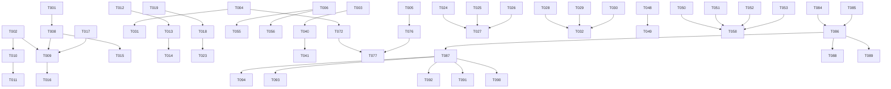

# Tasks: Unisense 全维度审查整改（2026-08-13 版）

**Input**: Design documents from `spec/full-audit-remediation/`
**Prerequisites**: plan.md (required), spec.md (required for user stories)

**Tests**: 本整改包含大量测试补全任务（TEST-01~09），测试任务内嵌于各用户故事中。

**Organization**: 任务按用户故事分组，每个故事可独立实施和测试。

## Format: `[ID] [P?] [Story] Description`

- **[P]**: 可并行执行（不同文件，无依赖）
- **[Story]**: 所属用户故事（US1~US9）
- 包含精确文件路径

---

## Phase 1: Setup（共享基础设施）

**Purpose**: 新增数据模型迁移 + 核心模块骨架

- [X] T001 创建 Alembic 迁移: KeyRotation/JwtBlacklist/DegradationEntry/FeatureFlag/DeadLetterEvent 表 in backend/alembic/versions/0032_audit_remediation_tables.py
- [X] T002 [P] 创建密钥轮换模块骨架 in backend/app/core/key_rotation.py
- [X] T003 [P] 创建死信队列模块骨架 in backend/app/core/dlq.py
- [X] T004 [P] 创建降级注册中心扩展 in backend/app/core/degradation_registry.py
- [X] T005 [P] 创建特性开关模块 in backend/app/core/feature_flags.py
- [X] T006 [P] 创建前端错误处理增强模块 in frontend/src/utils/apiErrorHandlers.ts
- [X] T007 [P] 创建前端 E2E 测试目录骨架 in frontend/e2e/

---

## Phase 2: Foundational（阻塞性前置条件）

**Purpose**: 核心安全修复，MUST 在所有用户故事之前完成

**⚠️ CRITICAL**: 密钥派生是P0项，必须优先完成

- [X] T008 SEC-01[P0]: 修复 secrets.py 密钥派生，改用 PBKDF2-HMAC-SHA256(salt≥16byte, iterations≥600000) in backend/app/core/secrets.py
- [X] T009 SEC-01[P0]: 实现密钥迁移逻辑（旧SHA256→新PBKDF2解密→重加密） in backend/app/core/key_rotation.py
- [X] T010 SEC-02[P1]: 实现密钥轮换协议（旧密钥→新密钥原子替换+90天过期策略） in backend/app/core/key_rotation.py
- [X] T011 SEC-02[P1]: 添加密钥轮换 API 端点 in backend/app/api/admin.py (或新增 admin_key_rotation.py)
- [X] T012 SEC-06[P1]: JWT 添加 jti(UUID4) 字段 in backend/app/core/security.py
- [X] T013 SEC-06[P1]: 实现 JWT 黑名单（Redis SET + jti + TTL） in backend/app/core/security.py
- [X] T014 SEC-06[P1]: logout 端点将 jti 加入黑名单 in backend/app/api/auth.py

---

## Phase 3: User Story 1 - 密钥派生致命缺陷修复 (Priority: P0) 🎯 MVP

**Goal**: P0缺陷清零，所有加密凭据使用安全密钥派生

**Independent Test**: 1) derive_key() 使用 PBKDF2；2) 旧数据可迁移；3) 密钥可轮换

- [X] T015 [US1] 补充密钥派生安全测试 in backend/tests/security/test_key_derivation.py
- [X] T016 [US1] 补充密钥轮换集成测试 in backend/tests/integration/test_key_rotation_integration.py
- [X] T017 [US1] 更新 secrets.py 的 Fernet 密钥加载逻辑支持多密钥共存（旧密钥解密列表） in backend/app/core/secrets.py

**Checkpoint**: P0 缺陷清零，密钥派生符合 NIST SP 800-132

---

## Phase 4: User Story 2 - 认证与审计链加固 (Priority: P1)

**Goal**: JWT可撤销、审计IP不可伪造、注入防护不误杀

**Independent Test**: 1) logout后token失效；2) XFF仅信任白名单；3) 日期参数不被拦截；4) 超10层嵌套被拦截

- [X] T018 [P] [US2] SEC-03: 修复 audit.py client_ip() 添加 trusted_proxies 白名单校验 in backend/app/core/audit.py
- [X] T019 [P] [US2] SEC-03: config.py 添加 trusted_proxies 配置项 in backend/app/core/config.py
- [X] T020 [P] [US2] SEC-04/PROD-01: 修复 guard.py SQL注入守卫排除日期上下文（前后为数字的--不视为注释） in backend/app/core/guard.py
- [X] T021 [P] [US2] SEC-05: 修复 guard.py 超深嵌套(>10层)拦截而非放行 in backend/app/core/guard.py
- [X] T022 [P] [US2] SEC-07: config.py CORS 校验增加内网地址(127.0.0.1/0.0.0.0)检查 in backend/app/core/config.py
- [X] T023 [US2] 补充认证审计安全回归测试 in backend/tests/security/test_auth_audit_security.py

**Checkpoint**: JWT可撤销、审计IP可信、注入防护正确

---

## Phase 5: User Story 3 - 事件循环阻塞消除 (Priority: P1)

**Goal**: 所有同步阻塞调用不阻塞事件循环

**Independent Test**: 10并发登录不串行阻塞；TCP探活异步

- [X] T024 [P] [US3] TECH-01: hash_password/verify_password 改用 asyncio.to_thread() 包装 in backend/app/core/security.py
- [X] T025 [P] [US3] TECH-02: Prometheus metrics.py path 标签路由归一化（去除动态ID段） in backend/app/core/metrics.py
- [X] T026 [P] [US3] TECH-03: _tcp_alive 改用 asyncio.open_connection() 异步探活 in backend/app/core/resilience.py
- [X] T027 [US3] 补充性能回归测试 in backend/tests/perf/test_async_no_blocking.py

**Checkpoint**: 事件循环无同步阻塞

---

## Phase 6: User Story 4 - 基础设施可观测 (Priority: P1)

**Goal**: 健康检查反映真实降级状态，优雅关闭释放所有连接，配置可热更新

**Independent Test**: Redis不可用时/health返回503；SIGTERM时所有连接池关闭；限流阈值热更新

- [X] T028 [P] [US4] OPS-01: 优雅关闭注册所有连接池(MySQL engine.dispose/Neo4j driver.close/ES client.close/Redis close) in backend/app/main.py
- [X] T029 [P] [US4] OPS-02: /health 端点检查 Redis/Neo4j/ES 连接状态，降级时返回 degraded(503) in backend/app/api/health.py
- [X] T030 [P] [US4] OPS-03: 关键配置项(限流阈值/OLAP超时/LLM端点)从 Redis Hash 读取，30s定时刷新 in backend/app/core/config.py
- [X] T031 [P] [US4] OPS-02: init_rate_limiter 失败时注册降级条目 in backend/app/core/degradation_registry.py
- [X] T032 [US4] 补充健康检查与优雅关闭集成测试 in backend/tests/integration/test_health_shutdown_integration.py

**Checkpoint**: 运维可观测降级状态，优雅关闭无连接泄漏

---

## Phase 7: User Story 5 - 安全细节修复 (Priority: P2)

**Goal**: 数据库密码不泄露、日志无PII、请求大小有限制

**Independent Test**: 日志密码被mask；PII被脱敏；>10MB返回413

- [X] T033 [P] [US5] SEC-07: 数据库连接串异常日志中 mask 密码 in backend/app/db/mysql.py
- [X] T034 [P] [US5] SEC-08: 生产环境 Redis 连接支持 TLS (rediss://) in backend/app/db/redis.py
- [X] T035 [P] [US5] SEC-09: beeline 密码临时文件使用 fd 直接写入+chmod后再关闭 in backend/app/services/collector/connectors/hive.py
- [X] T036 [P] [US5] SEC-10: structlog 添加 PII 脱敏 processor（邮箱/手机/IP→[REDACTED]） in backend/app/core/logging.py
- [X] T037 [P] [US5] SEC-11: 中间件添加请求 body 大小限制(≤10MB，超出413) in backend/app/core/middleware.py
- [X] T038 [P] [US5] SEC-12/FR-012: 缩短 JWT 有效期至15分钟 + refresh token 机制 in backend/app/core/security.py + backend/app/api/auth.py
- [X] T039 [US5] 补充安全细节回归测试 in backend/tests/security/test_security_details.py

**Checkpoint**: 纵深防御体系完整

---

## Phase 8: User Story 6 - 技术架构缺陷修复 (Priority: P2)

**Goal**: 事件总线退避、缓存锁上限、连接池健康检查、事务编排

**Independent Test**: 事件重试间隔指数增长；缓存锁有上限；MySQL pool_pre_ping 开启

- [X] T040 [P] [US6] TECH-04: 事件总线添加指数退避(1s→2s→4s→max 30s)，3次后写入死信队列 in backend/app/core/eventbus.py
- [X] T041 [P] [US6] TECH-04: 实现内存死信队列+定时重放 in backend/app/core/dlq.py
- [X] T042 [P] [US6] TECH-05: 缓存锁字典添加 LRU 上限(10,000) in backend/app/services/semantic/cache.py
- [X] T043 [P] [US6] TECH-07: MySQL 连接池添加 pool_pre_ping=True + pool_recycle=1800 in backend/app/db/mysql.py
- [ ] T044 [P] [US6] TECH-11: 服务层 32 处 except Exception 静默吞错添加 logger.warning() in backend/app/services/semantic/cache.py + olap_executor.py + parser.py + rate_limiter.py + events.py + tasks.py
- [X] T045 [P] [US6] TECH-13: tracking.py 日期参数格式错误返回 422 而非静默忽略 in backend/app/api/tracking.py
- [ ] T046 [P] [US6] TECH-09: ClickHouse 连接器查询改用参数化 in backend/app/services/collector/connectors/clickhouse.py
- [X] T047 [P] [US6] TECH-10: LLM 客户端添加重试(3次+指数退避)+熔断器 in backend/app/services/llm/client.py
- [ ] T048 [US6] TECH-12: UoW 渐进迁移 — P0/P1 相关 API 端点(metrics/collector/governance)的 db.commit() 迁移至 Service 层 in backend/app/api/metrics.py + backend/app/api/collector.py + backend/app/api/governance.py + backend/app/services/semantic/service.py + backend/app/services/collector/service.py + backend/app/services/governance/service.py
- [ ] T049 [US6] 补充技术架构回归测试 in backend/tests/unit/test_eventbus_dlq.py + test_cache_lock_limit.py + test_llm_retry.py

**Checkpoint**: 技术架构健壮性提升

---

## Phase 9: User Story 7 - 产品逻辑修正 (Priority: P2)

**Goal**: 指标编码锁定、冲突超时、规则校验、术语阈值可配置、批量废弃部分失败可见

**Independent Test**: 编码创建后不可改；冲突72h自动升级；无效规则被拒绝；207逐项展示

- [ ] T050 [P] [US7] PROD-02: 指标编码创建后仅DRAFT允许修改且需审批 in backend/app/services/semantic/service.py + backend/app/api/metrics.py
- [ ] T051 [P] [US7] PROD-04: 冲突仲裁 OPEN 超72小时自动升级 in backend/app/services/conflict/service.py + backend/app/tasks/conflict_tasks.py(新增定时任务)
- [X] T052 [P] [US7] PROD-05: 质量规则阈值格式异常拒绝创建(422) in backend/app/services/quality/service.py
- [ ] T053 [P] [US7] PROD-06: 术语同义词冲突阈值(80%)移入 system_dict 可配置 in backend/app/services/glossary/service.py
- [X] T054 [P] [US7] PROD-07: 被遗忘权 token 改用 secrets.token_hex(16) 不关联 user_id in backend/app/services/governance/service.py
- [X] T055 [P] [US7] PROD-08: 前端对 DEPENDENCY_DEGRADED_ENGINE 错误码展示降级提示 in frontend/src/utils/apiErrorHandlers.ts + frontend/src/pages/QueryWorkspace.tsx
- [ ] T056 [P] [US7] PROD-09: 前端对 207 Multi-Status 响应逐项解析展示 in frontend/src/utils/apiErrorHandlers.ts + frontend/src/pages/DataSources.tsx
- [X] T057 [P] [US7] PROD-03: 前端主题域树组件第3层节点禁止显示添加子域 in frontend/src/pages/SubjectDomain.tsx
- [ ] T058 [US7] 补充产品逻辑回归测试 in backend/tests/unit/test_conflict_timeout.py + test_quality_rule_validation.py + test_glossary_threshold.py

**Checkpoint**: 产品逻辑正确性保证

---

## Phase 10: User Story 8 - 测试覆盖补全 (Priority: P1)

**Goal**: 前端核心页面测试、API集成测试补全、安全回归测试

**Independent Test**: 前端核心页面有测试；全部API端点有集成测试；SEC-01~06有回归测试

- [X] T059 [P] [US8] TEST-01: 前端核心页面测试 — MetricDetail in frontend/src/__tests__/MetricDetail.test.tsx
- [X] T060 [P] [US8] TEST-01: 前端核心页面测试 — QueryWorkspace in frontend/src/__tests__/QueryWorkspace.test.tsx
- [X] T061 [P] [US8] TEST-01: 前端核心页面测试 — ConflictCenter in frontend/src/__tests__/ConflictCenter.test.tsx
- [X] T062 [P] [US8] TEST-01: 前端核心页面测试 — DataGovernance in frontend/src/__tests__/DataGovernance.test.tsx
- [X] T063 [P] [US8] TEST-02: API 集成测试补全 — tracking/health/audit 端点 in backend/tests/integration/test_tracking_integration.py + test_health_integration.py + test_audit_integration.py
- [X] T064 [P] [US8] TEST-03: SEC-01~06 安全回归测试 in backend/tests/security/test_key_derivation.py + test_jwt_blacklist.py + test_xff_trust.py + test_guard_date.py + test_guard_nested.py
- [X] T065 [P] [US8] TEST-04: 基础设施混沌测试(Redis/Neo4j/ES宕机) in backend/tests/chaos/test_infrastructure_chaos.py
- [X] T066 [P] [US8] TEST-05: 核心 API P99 延迟基准测试 in backend/tests/perf/test_api_latency.py
- [X] T067 [P] [US8] TEST-06: 语义服务异常分支单元测试 in backend/tests/unit/test_semantic_service_branches.py
- [X] T068 [P] [US8] TEST-07: 测试 conftest 添加独立事务隔离（每测试回滚） in backend/tests/conftest.py
- [X] T069 [P] [US8] TEST-08: 前端统一 API mock 层 in frontend/src/__tests__/mocks/apiMocks.ts
- [X] T070 [US8] TEST-09: E2E 测试 — 登录→指标创建→发布→查询 in frontend/e2e/core-flow.spec.ts

**Checkpoint**: 测试覆盖率大幅提升

---

## Phase 11: User Story 9 - 运营能力增强 (Priority: P2)

**Goal**: 迁移自动化验证、降级统一面板、灰度发布、审计容量预警

**Independent Test**: CI迁移幂等性通过；/health/degraded展示全局；管理员初始密码可配置

- [X] T071 [P] [US9] OPS-04: Alembic 迁移幂等性 CI 测试(upgrade→downgrade→upgrade) in scripts/test_migration_idempotent.py + .github/workflows/migration-test.yml(或CI配置)
- [X] T072 [P] [US9] OPS-05: 统一降级注册中心实现 + /health/degraded 端点 in backend/app/core/degradation_registry.py + backend/app/api/health.py
- [X] T073 [P] [US9] OPS-06: seed 脚本支持 ADMIN_INITIAL_PASSWORD 环境变量 in backend/scripts/seed_admin.py(或对应seed脚本)
- [ ] T074 [P] [US9] OPS-07: 核心业务维度 Prometheus 指标（指标发布数/天、冲突仲裁时长、查询成功率、LLM调用成功率） in backend/app/core/metrics.py
- [ ] T075 [P] [US9] OPS-08: 审计归档任务容量预警（审计表行数阈值告警） in backend/app/tasks/audit_archive.py
- [X] T076 [P] [US9] OPS-09: 特性开关框架实现（Redis存储+中间件检查+按域/用户灰度） in backend/app/core/feature_flags.py + backend/app/api/admin.py
- [X] T077 [US9] 补充运营能力集成测试 in backend/tests/integration/test_degradation_registry_integration.py + test_feature_flags_integration.py

**Checkpoint**: 运营可观测性和灵活性达标

---

## Phase 12: Polish & Cross-Cutting Concerns

**Purpose**: 跨故事改进和收尾

- [ ] T078 [P] 更新 module-status.yaml 反映整改完成 in docs/module-status.yaml
- [ ] T079 [P] 更新 CHANGELOG_MODULES.md 记录整改变更 in docs/CHANGELOG_MODULES.md
- [ ] T080 [P] 更新 technical-design.md §3/§4/§12 反映新增表和接口变更 in docs/technical-design.md
- [ ] T081 [P] 删除 audit-remediation 旧 spec 目录（已过时） in spec/audit-remediation/
- [ ] T082 [P] 代码格式化+lint 修复（ruff check + ruff format） in backend/
- [ ] T083 [P] 前端代码格式化+lint 修复 in frontend/

---

## Phase 13: Verification

<!-- verification_scope: build+ui -->

**Purpose**: 构建、部署、UI验证

- [ ] T084 构建后端 Docker 镜像并修复编译错误 in backend/ (docker build + pytest)
- [ ] T085 构建前端并修复编译错误 in frontend/ (npm run build)
- [ ] T086 Docker Compose 全栈部署并验证 in docker-compose.yml
- [ ] T087 运行全量后端测试套件(pytest)确认无回归 in backend/tests/
- [ ] T088 运行前端测试套件(vitest)确认无回归 in frontend/
- [ ] T089 运行安全测试套件确认 P0/P1 修复有效 in backend/tests/security/
- [ ] T090 UI 验证 — 密钥轮换管理界面 in frontend/
- [ ] T091 UI 验证 — 健康检查/降级面板 in frontend/
- [ ] T092 UI 验证 — 查询工作台降级提示 in frontend/
- [ ] T093 UI 验证 — 批量废弃207逐项展示 in frontend/
- [ ] T094 UI 验证 — 主题域3层限制 in frontend/

---

## 📊 Dependency Graph

## ⚡ Parallel Execution Guide

| Phase | Tasks | Required Files | Execution Notes |
|-------|-------|----------------|-----------------|
| Setup | T002,T003,T004,T005,T006,T007 | 各独立新文件 | 全部可并行 |
| Foundational | T008→T009→T010→T011, T012→T013→T014 | secrets.py, key_rotation.py, security.py | 密钥链串行，JWT链串行，两链可并行 |
| US2 | T018,T019,T020,T021,T022 | audit.py, config.py, guard.py | 全部可并行(不同文件) |
| US3 | T024,T025,T026 | security.py, metrics.py, resilience.py | 全部可并行 |
| US4 | T028,T029,T030,T031 | main.py, health.py, config.py, degradation_registry.py | 全部可并行 |
| US5 | T033,T034,T035,T036,T037,T038 | mysql.py, redis.py, hive.py, logging.py, middleware.py, security.py | 全部可并行 |
| US6 | T040,T041,T042,T043,T044,T045,T046,T047 | eventbus.py, dlq.py, cache.py, mysql.py, 各service, tracking.py, clickhouse.py, llm/client.py | 大部分可并行，T048需串行(多文件) |
| US7 | T050,T051,T052,T053,T054,T055,T056,T057 | 各service, 前端页面 | 全部可并行 |
| US8 | T059-T070 | 各测试文件 | 全部可并行 |
| US9 | T071,T072,T073,T074,T075,T076 | scripts, degradation_registry.py, metrics.py, audit_archive.py, feature_flags.py | 全部可并行 |

---

## Summary

- **Total tasks**: 94
- **Per story count**: US1:3, US2:6, US3:4, US4:5, US5:7, US6:10, US7:9, US8:12, US9:7, Setup:7, Foundational:7, Polish:6, Verification:11
- **Parallel opportunities**: Setup全部6任务并行；US2/US3/US4/US5/US7/US8/US9内部大部分任务并行
- **MVP scope**: US1(密钥派生P0修复) + US2(认证审计P1) = 最小安全合规基线
- **Critical path**: T001→T008→T009→T015(T016) — P0密钥修复必须最先完成
