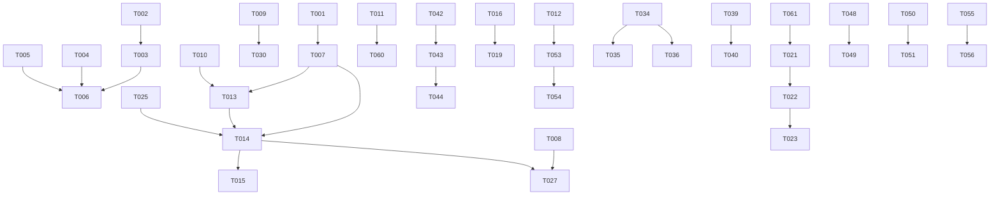

# Tasks: 语义建模模块工业级整改

**Input**: Design documents from `spec/semantic-remediation/`
**Prerequisites**: plan.md (required), spec.md (required for user stories)

## Format: `[ID] [P?] [Story] Description`

---

## Phase 1: Setup (枚举+模型+迁移)

**Purpose**: 统一状态枚举、新增数据模型、Alembic迁移

- [x] T001 创建 backend/app/services/semantic/state_machine.py：MetricStateMachine类含TRANSITIONS跃迁矩阵(dict[MetricState, dict[MetricState, str]])、validate_transition(from, to)→str|None、get_allowed_transitions(state)→list[MetricState]、MetricState枚举(DRAFT/REVIEW/PUBLISHED/EXPERIMENTAL/DEPRECATED/DATA_SOURCE_DROPPED)
- [x] T002 [P] 修改 backend/app/models/enums.py：新增MetricStateEnum(DRAFT/REVIEW/PUBLISHED/EXPERIMENTAL/DEPRECATED/DATA_SOURCE_DROPPED)、VersionStatusEnum(DRAFT/PENDING_CONFIRMATION/PUBLISHED/EXPERIMENTAL/ARCHIVED/CANCELLED)
- [x] T003 修改 backend/app/models/metric.py：Metric.status引用MetricStateEnum、新增字段emergency_publish(Boolean)+emergency_reason(Text)+gray_tenant_ids(JSON)+pending_conflict(Boolean)+pending_conflict_detail(JSON)、MetricVersion.status引用VersionStatusEnum、新增字段pending_deadline(DateTime)+extension_count(Integer)+effective_at(DateTime)
- [x] T004 [P] 创建 backend/app/models/metric_version.py：PendingVersionConfirmation模型(id/metric_id/version/consumer_id/status[PENDING/CONFIRMED/REJECTED/TIMEOUT_ACCEPTED]/reason/extension_count/deline/confirmed_at)、UniqueConstraint(metric_id,version,consumer_id)、Index(status,deadline)
- [x] T005 [P] 创建 backend/app/models/metric_health.py：MetricHealthScore模型(id/metric_id[UNIQUE]/score/level[EXCELLENT/GOOD/WARNING/CRITICAL]/completeness_score/activity_score/quality_score/owner_response_score/lineage_coverage_score/missing_dimensions[JSON]/calculated_at)、Index(level)+Index(score)
- [x] T006 创建 backend/alembic/versions/0019_semantic_state_machine.py：metric表新增emergency_publish+emergency_reason+gray_tenant_ids+pending_conflict+pending_conflict_detail列、metric_version表新增pending_deadline+extension_count+effective_at列、metric.status枚举扩展EXPERIMENTAL+DATA_SOURCE_DROPPED、metric_version.status枚举扩展PENDING_CONFIRMATION+EXPERIMENTAL+CANCELLED、新增pending_version_confirmation表+metric_health_score表

---

## Phase 2: Foundational (状态机+依赖校验+冲突预检+命名校验)

**Purpose**: 核心业务规则模块，阻塞所有用户故事

- [x] T007 扩展 backend/app/services/semantic/state_machine.py：实现完整跃迁矩阵(DRAFT→REVIEW[submit]/REVIEW→PUBLISHED[approve]/REVIEW→EXPERIMENTAL[approve_gray]/REVIEW→DRAFT[reject]/PUBLISHED→DEPRECATED[deprecate]/PUBLISHED→PENDING_CONFIRMATION[breaking_change]/EXPERIMENTAL→PUBLISHED[promote]/EXPERIMENTAL→PUBLISHED[rollback]/DATA_SOURCE_DROPPED→PUBLISHED[source_recovered]/DATA_SOURCE_DROPPED→DEPRECATED[confirm_deprecated])、非法跃迁返回409错误消息
- [x] T008 创建 backend/app/services/semantic/dependency_checker.py：DependencyChecker类、check_dependencies_published(definition_json)→list[str](未发布/已废弃的依赖code列表)、detect_cycle(metric_code, definition_json)→list[str]|None(环路径)、DFS三色标记法(white/gray/black)实现环检测、definition_json.dependencies字段提取+递归加载
- [x] T009 创建 backend/app/services/semantic/conflict_precheck.py：ConflictPrechecker类、RESERVED_WORDS frozenset({"test","temp","dummy","demo","tmp","sample","staging","todo"})、CODE_PATTERN正则^([a-z][a-z0-9]*)(_[a-z][a-z0-9]*){3}$、validate_code_format(code)→tuple[bool,str|None]、precheck(metric_code, definition_json)→dict|None(调conflict服务检测相似口径)
- [x] T010 修改 backend/app/services/semantic/schemas.py：metric_code validator替换为ConflictPrechecker.validate_code_format(严格4段+保留词)、新增MetricSubmitRequest(change_reason:str min4)、MetricApproveRequest(mode:Literal["standard","experimental"]+gray_tenant_ids:list[int]|None+target_version:int|None)、MetricRejectRequest(reason:str min4)、MetricEmergencyPublishRequest(reason:str min10+target_version:int|None)、VersionConfirmRequest(version:int)、VersionRejectRequest(version:int+reason:str min4)、VersionExtendRequest(version:int)、MetricCompareRequest(metric_codes:list[str] min2 max2)、MetricBatchRegisterRequest(source_table+measure_columns+dimension_mapping+llm_prefill+domain)、MetricTemplateCreateRequest(code+name+domain必填+各预设字段Optional)
- [x] T011 [P] 修改 backend/app/services/semantic/cache.py：缓存键格式改为metric:def:{code}:v{version}、get()/set()成功时调用self._breaker.record_success()、warm_up()改用redis.pipeline()批量写入、set()方法需接收version参数构建键
- [x] T012 [P] 修改 backend/app/services/semantic/repository.py：IntegrityError捕获(create_version)→ConflictError、assert updated is not None替换为if updated is None: raise SystemError、LIKE查询keyword转义(替换%→\%+ _→\_)、新增save_pending_confirmation()/get_pending_confirmations()/update_confirmation_status()方法、新增aggregate_dashboard()方法(单次CASE WHEN+GROUP BY聚合+deleted_at过滤)

**Checkpoint**: 状态机+依赖校验+冲突预检+缓存修复+仓库加固就绪

---

## Phase 3: US1 - 完整生命周期管理 (Priority: P0) 🎯 MVP

**Goal**: 6态状态机+8种跃迁全部可测试

**Independent Test**: 创建指标→submit→approve→PUBLISHED→reject回退DRAFT→非法跃迁409

### Implementation for User Story 1

- [x] T013 [US1] 修改 backend/app/services/semantic/service.py：create_metric发布metric.created事件、新增submit_metric(metric_code, request, actor_id)——校验DRAFT→REVIEW合法+MetricStateMachine.validate_transition+发布metric.submitted事件+通知domain_admin
- [x] T014 [US1] 修改 service.py：新增approve_metric(metric_code, request, actor_id)——校验REVIEW→PUBLISHED/EXPERIMENTAL+PII门禁+依赖校验(DependencyChecker)+状态机校验+同一事务更新metric.status+mark_version_published+发布metric.approved事件→lineage+search+notify
- [x] T015 [US1] 修改 service.py：新增reject_metric(metric_code, request, actor_id)——校验REVIEW→DRAFT+发布metric.rejected事件+通知Owner驳回原因
- [x] T016 [US1] 修改 service.py：deprecate_metric增加校验metric.status=="PUBLISHED"(仅PUBLISHED可废弃)+successor_code校验存在且PUBLISHED+发布metric.deprecated事件→notify下游消费方(经lineage反查)
- [x] T017 [US1] 修改 service.py：publish_metric重构——改为approve_metric的一部分(DRAFT→REVIEW→PUBLISHED不再跳步)、原publish_metric保留为内部兼容但标记deprecated
- [x] T018 [US1] 修改 backend/app/api/metrics.py：新增POST /metric-definitions/{code}/submit端点、POST /metric-definitions/{code}/approve端点、POST /metric-definitions/{code}/reject端点、原POST /{code}/publish改为调approve_metric(mode="standard")
- [x] T019 [US1] 修改 api/metrics.py：deprecate端点增加successor_code为必填+校验请求体
- [x] T020 [US1] 补充 backend/tests/unit/test_state_machine.py：测试全部8种合法跃迁+测试非法跃迁(DRAFT→PUBLISHED/DRAFT→DEPRECATED/PUBLISHED→DRAFT等)返回409+测试get_allowed_transitions

**Checkpoint**: US1完成 - 6态状态机+8种跃迁+submit/approve/reject端点

---

## Phase 4: US2+US13 - PENDING_VERSION缓冲+版本原子性 (Priority: P0) 🎯 MVP

**Goal**: 破坏性变更不直接生效，14天确认期+超时默认接受+延期+拒绝

**Independent Test**: PUBLISHED指标→PUT breaking→PENDING_VERSION旧版本CURRENT→confirm→新版本CURRENT→reject→取消→超时→默认接受

### Implementation for User Story 2

- [ ] T021 [US2] 创建 backend/app/services/semantic/pending_version_manager.py：PendingVersionManager类、create_pending(metric, new_version, consumer_ids)→创建PendingVersionConfirmation记录+设置deadline(14天)、confirm(metric_id, version, consumer_id)→更新confirmation status+检查全部confirmed→切换CURRENT、reject(metric_id, version, consumer_id, reason)→任一rejected→取消PENDING_VERSION+通知Owner、extend(metric_id, version)→延期+7天(最多1次)+检查extension_count、check_timeouts()→查超时确认→默认接受+切换CURRENT、pause_on_drift(metric_id, version, drift_detail)→暂停版本切换+通知Owner
- [ ] T022 [US2] 修改 service.py：update_metric重构——PUBLISHED状态+definition_json变更+is_breaking=True→调PendingVersionManager.create_pending(不直接生效)+version.status=PENDING_CONFIRMATION+发布metric.pending_version事件；is_breaking=False→直接生效(非破坏性)
- [ ] T023 [US2] 修改 api/metrics.py：新增POST /metric-definitions/{code}/confirm-version端点、POST /metric-definitions/{code}/reject-version端点、POST /metric-definitions/{code}/extend-version端点
- [ ] T024 [US2] 修改 service.py：新增confirm_version/reject_version/extend_version方法——委托PendingVersionManager
- [ ] T025 [US2] 修改 service.py：publish_metric(approve_metric)中metric.status更新与version.status转正必须在同一事务——先mark_version_published再update metric，任一步失败rollback
- [ ] T026 [US2] 补充 backend/tests/unit/test_pending_version.py：测试PENDING_VERSION创建+14天deadline+confirm→CURRENT+reject→取消+extend+7天(最多1次)+超时默认接受+Drift暂停

**Checkpoint**: US2+US13完成 - PENDING_VERSION缓冲+版本原子性

---

## Phase 5: US3 - 依赖指标递归校验与环检测 (Priority: P0) 🎯 MVP

**Goal**: 发布前校验依赖+环检测

**Independent Test**: 派生指标依赖DRAFT指标→拒绝；A→B→A环→拒绝；全部PUBLISHED→通过

### Implementation for User Story 3

- [ ] T027 [US3] 修改 service.py：approve_metric中增加依赖校验——type为derived/composite时调DependencyChecker.check_dependencies_published(definition_json)，未发布依赖→BusinessError拒绝；调DependencyChecker.detect_cycle(metric_code, definition_json)，检测到环→BusinessError拒绝
- [ ] T028 [US3] 修改 service.py：approve_metric成功后，type为derived/composite时发布metric.approved事件含dependencies字段→lineage写入DERIVED_FROM边到Neo4j
- [ ] T029 [US3] 补充 backend/tests/unit/test_dependency_checker.py：测试依赖未发布→拒绝+依赖已废弃→拒绝+A→B→A环→拒绝+3层依赖链→通过+复合指标多依赖→通过+PENDING_VERSION依赖→允许(依赖CURRENT)

**Checkpoint**: US3完成 - 依赖校验+环检测

---

## Phase 6: US4+US5 - 冲突预检+事件驱动双写 (Priority: P1)

**Goal**: 创建后异步冲突预检+发布/废弃/变更事件发布

**Independent Test**: 创建指标→pending_conflict标记→发布→metric.published事件→废弃→metric.deprecated事件→notify下游

### Implementation for User Story 4+5

- [ ] T030 [US4] 修改 service.py：create_metric中metric_code校验委托ConflictPrechecker.validate_code_format(严格4段+保留词)+创建后异步调ConflictPrechecker.precheck→命中相似→更新pending_conflict=True+pending_conflict_detail
- [ ] T031 [US5] 修改 service.py：approve_metric发布metric.approved事件(含metric_code+version+definition+type+dependencies)→EventBus分发到lineage(Neo4j)+search(ES)+notify；reject_metric发布metric.rejected事件→notify Owner；deprecate_metric发布metric.deprecated事件→lineage+notify下游(lineage反查consumer_ids)；PENDING_VERSION生成发布metric.pending_version事件→notify下游
- [ ] T032 [US5] 修改 service.py：所有事件发布用BaseService._publish_event(best-effort)+失败入Arq重试队列(app/services/semantic/tasks.py新增retry_event_publish任务)
- [ ] T033 [US4+US5] 补充 backend/tests/unit/test_conflict_precheck.py：测试4段格式校验+保留词拒绝+相似口径预检+命名规范+5段拒绝+单段拒绝

**Checkpoint**: US4+US5完成 - 冲突预检+事件驱动双写

---

## Phase 7: US6 - 灰度发布与回滚 (Priority: P1)

**Goal**: EXPERIMENTAL灰度+promote全量+rollback回退

**Independent Test**: approve灰度→EXPERIMENTAL→promote→PUBLISHED→rollback→回退

### Implementation for User Story 6

- [ ] T034 [US6] 修改 service.py：approve_metric支持mode="experimental"→status=EXPERIMENTAL+gray_tenant_ids保存→版本status=EXPERIMENTAL
- [ ] T035 [US6] 修改 service.py：新增promote_metric(metric_code, actor_id)——EXPERIMENTAL→PUBLISHED+清除gray_tenant_ids+发布metric.promoted事件→lineage+search+notify
- [ ] T036 [US6] 修改 service.py：新增rollback_metric(metric_code, actor_id)——EXPERIMENTAL→回退到上一PUBLISHED版本+EXPERIMENTAL版本标记ARCHIVED+发布metric.rolled_back事件→notify+audit
- [ ] T037 [US6] 修改 api/metrics.py：新增POST /metric-definitions/{code}/promote端点、POST /metric-definitions/{code}/rollback端点
- [ ] T038 [US6] 补充 backend/tests/unit/test_state_machine.py：增加灰度跃迁测试(EXPERIMENTAL→PUBLISHED[promote]/EXPERIMENTAL→PUBLISHED[rollback])

**Checkpoint**: US6完成 - 灰度发布+回滚

---

## Phase 8: US7 - 紧急发布快通道 (Priority: P1)

**Goal**: domain_admin紧急发布+EMERGENCY_PUBLISH审计+24h补审+PII门禁不可跳

**Independent Test**: 紧急发布→PUBLISHED+标记→24h补审→通过标记清除；含PII→合规门禁仍须通过

### Implementation for User Story 7

- [ ] T039 [US7] 修改 service.py：新增emergency_publish_metric(metric_code, request, actor_id)——校验domain_admin角色+DRAFT→PUBLISHED(跳REVIEW)+emergency_publish=True+emergency_reason记录+PII门禁不可跳(pii_flag=True+compliance_reviewed=False→仍拒绝)+合规官不可达→仅INTERNAL分级(serving_mode降级)+发布metric.emergency_published事件+审计EMERGENCY_PUBLISH标记
- [ ] T040 [US7] 修改 api/metrics.py：新增POST /metric-definitions/{code}/emergency-publish端点(MetricEmergencyPublishRequest)
- [ ] T041 [US7] 创建 backend/app/tasks/semantic_tasks.py：check_emergency_review_overdue(Arq cron每小时)——查emergency_publish=True+emergency_reviewed_at=None+created_at+24h已过→告警+通知domain_admin补审；新增check_experimental_expiry(Arq cron每日)——EXPERIMENTAL状态超30天→提醒Owner决策

**Checkpoint**: US7完成 - 紧急发布快通道

---

## Phase 9: US8 - 指标健康度评分 (Priority: P1)

**Goal**: 五维加权评分+分级+红橙进待办

**Independent Test**: 口径不完整→完整度降分→总分<55→红标+整改待办

### Implementation for User Story 8

- [ ] T042 [US8] 创建 backend/app/services/semantic/health_scorer.py：HealthScorer类、calculate(metric_id)→MetricHealthScore——五维计算(口径完整度:一等字段齐全率25%/活跃度:近30天consume查询归一化20%/质量:quality_event异常反比25%/Owner响应:审核时效15%/血缘覆盖:上游解析率15%)、维度数据缺失→记0+标missing_dimensions、分级(≥85EXCELLENT/70-84GOOD/55-69WARNING/<55CRITICAL)
- [ ] T043 [US8] 修改 repository.py：新增save_health_score()/get_health_score()/list_critical_metrics()方法
- [ ] T044 [US8] 修改 service.py：新增get_metric_health(metric_code)→MetricHealthScore、健康度CRITICAL/WARNING→发布metric.health_critical事件→notify.todo整改待办
- [ ] T045 [US8] 修改 api/metrics.py：新增GET /metric-definitions/{code}/health端点
- [ ] T046 [US8] 修改 semantic_tasks.py：新增refresh_health_scores(Arq cron每日凌晨)——批量重算全部指标健康度+CRITICAL/WARNING进整改待办
- [ ] T047 [US8] 补充 backend/tests/unit/test_health_scorer.py：测试口径完整度(齐全/缺失)/活跃度(高/零)/质量(异常多/无)/分级(85+优/55-危)/缺失维度标"数据不足"/批量计算

**Checkpoint**: US8完成 - 健康度评分引擎

---

## Phase 10: US9+US10 - 指标对比+批量注册 (Priority: P2)

**Goal**: 两指标并排diff+批量注册DRAFT+batch_id

**Independent Test**: 对比两指标→并排diff+差异标记；批量注册5指标→batch_id聚合

### Implementation for User Story 9+10

- [ ] T048 [US9] 修改 service.py：新增compare_metrics(metric_code_a, metric_code_b)→dict(并排对比definition/granularity/dimensions/unit/currency/source_tables/time_semantics/additivity+差异标记identical/similar/different)
- [ ] T049 [US9] 修改 api/metrics.py：新增POST /metric-definitions/compare端点(MetricCompareRequest)+权限校验(两指标查看权限)
- [ ] T050 [US10] 修改 service.py：新增batch_register_metrics(request, actor_id)→生成batch_id+LLM解析候选指标(llm_prefill=True)→逐条校验门禁→成功入库DRAFT(共享batch_id)+失败条目标记validation_error
- [ ] T051 [US10] 修改 api/metrics.py：新增POST /metric-definitions/batch-register端点(MetricBatchRegisterRequest)
- [ ] T052 [US10] 补充 backend/tests/unit/test_semantic_service.py：测试compare(相同/不同/无权限)+batch_register(成功/部分失败/LLM超时降级)

**Checkpoint**: US9+US10完成 - 对比+批量注册

---

## Phase 11: US11+US12 - Dashboard重构+缓存韧性+数据安全 (Priority: P1)

**Goal**: dashboard单次SQL+消费指南迁移Service+模板Schema校验+安全修复

**Independent Test**: dashboard单次聚合<500ms；消费指南缓存命中；模板缺必填→422

### Implementation for User Story 11+12

- [ ] T053 [US11] 修改 repository.py：新增aggregate_dashboard(domain, owner_id)方法——单次SELECT含CASE WHEN+GROUP BY条件聚合(total/by_status/by_tier/by_domain/pii_count)+deleted_at IS NULL过滤
- [ ] T054 [US11] 修改 api/semantic.py：dashboard端点改为调用MetricRepository.aggregate_dashboard()+MetricService包装，移除API层ORM查询
- [ ] T055 [US11] 修改 service.py：新增get_consumption_guide(metric_code)→自动生成消费指南(含PII/SEMI_ADDITIVE判断)+缓存结果
- [ ] T056 [US11] 修改 api/semantic.py：消费指南端点改为调用MetricService.get_consumption_guide()，移除API层硬编码逻辑
- [ ] T057 [US11] 修改 api/semantic.py：create_template改用MetricTemplateCreateRequest Schema校验替代裸dict、instantiate_template过滤merged字段为MetricCreateRequest接受字段集合
- [ ] T058 [US12] 修改 service.py：update_metric中PUBLISHED状态更新definition_json走PENDING_VERSION机制(FR-037)、dependencies比较用set()替代list直接!=(FR-046)、change_reason仅在口径变更时设置到版本记录(FR-022)
- [ ] T059 [US12] 修改 service.py：review_compliance增加pii_flag=True校验(非PII指标拒绝复核)(FR-040)
- [ ] T060 [US12] 补充 backend/tests/unit/test_semantic_cache.py：测试熔断复位(5次失败→成功record_success复位)+版本键(版本变更旧键过期)+pipeline预热+LIKE通配符转义

**Checkpoint**: US11+US12完成 - 架构重构+安全加固

---

## Phase 12: Arq定时任务补全

**Purpose**: PENDING_VERSION超时+健康度刷新+紧急补审+灰度超期

- [ ] T061 修改 semantic_tasks.py：新增check_pending_version_timeouts(Arq cron每分钟)——查pending_version_confirmation表status=PENDING且deadline已过→默认接受+切换CURRENT+发布metric.version_confirmed事件
- [ ] T062 [P] 修改 semantic_tasks.py：refresh_health_scores(Arq cron每日凌晨)——调HealthScorer.batch_calculate全部指标+CRITICAL/WARNING→notify.todo
- [ ] T063 [P] 修改 semantic_tasks.py：check_emergency_review_overdue+check_experimental_expiry——前述T041已定义，验证实现完整
- [ ] T064 补充 backend/tests/chaos/test_semantic_chaos.py：并发发布同一指标→乐观锁409+并发create_version→IntegrityError→ConflictError+Redis宕机→缓存降级DB+PENDING_VERSION并发confirm→幂等

---

## Phase 13: Polish (文档+依赖+集成测试)

**Purpose**: 文档更新+依赖管理+集成测试

- [ ] T065 [P] 更新 docs/module-status.yaml：标注语义模块工业级修复完成
- [ ] T066 [P] 更新 docs/CHANGELOG_MODULES.md：记录语义模块修复变更
- [ ] T067 [P] 补充 backend/tests/integration/test_semantic_integration.py：端到端集成测试——创建→submit→approve→PUBLISHED→PUT breaking→PENDING_VERSION→confirm→新CURRENT→deprecate→notify→灰度→promote→紧急发布→健康度评分
- [ ] T068 [P] 修改 service.py：MetricVersion拆为独立文件metric_version.py后更新import路径

---

## Phase 14: Verification

<!-- verification_scope: build+ui -->

**Purpose**: 构建、部署和UI验证

- [ ] T069 构建后端项目并修复所有编译错误：ruff check + mypy
- [ ] T070 构建前端项目并修复所有编译错误
- [ ] T071 部署应用到测试环境：docker-compose up -d
- [ ] T072 运行UI验证：验证完整状态机流程(submit/approve/reject)+PENDING_VERSION缓冲+依赖校验+灰度发布+紧急发布+健康度评分+指标对比+批量注册+dashboard+消费指南

---

## 📊 Dependency Graph

## ⚡ Parallel Execution Guide

| Phase | Tasks | Required Files | Execution Notes |
|-------|-------|---------------|-----------------|
| Setup | T001-T006 | state_machine.py, enums.py, metric.py, metric_version.py, metric_health.py, migration | T002+T004+T005可并行 |
| Foundational | T007-T012 | state_machine.py, dependency_checker.py, conflict_precheck.py, schemas.py, cache.py, repository.py | T008+T009+T011可并行 |
| US1 | T013-T020 | service.py, api/metrics.py, test | T013→T014→T015顺序 |
| US2+US13 | T021-T026 | pending_version_manager.py, service.py, api/metrics.py, test | T021→T022→T023顺序 |
| US3 | T027-T029 | service.py, test | 依赖T008 |
| US4+US5 | T030-T033 | service.py, test | T030+T031可并行 |
| US6 | T034-T038 | service.py, api/metrics.py, test | T034→T035+T036 |
| US7 | T039-T041 | service.py, api/metrics.py, semantic_tasks.py | 顺序 |
| US8 | T042-T047 | health_scorer.py, repository.py, service.py, api/metrics.py, test | T042→T043→T044 |
| US9+US10 | T048-T052 | service.py, api/metrics.py, test | T048+T050可并行 |
| US11+US12 | T053-T060 | repository.py, api/semantic.py, service.py, test | T053+T055+T057可并行 |
| Arq | T061-T064 | semantic_tasks.py, test | T061→T062+T063可并行 |
| Polish | T065-T068 | docs, test, imports | 全部可并行 |
| Verification | T069-T072 | full stack | 顺序 |

## Implementation Strategy

### 工业级全量交付(非MVP)

1. Phase 1-2: Setup+Foundational → 枚举+模型+状态机+依赖校验+冲突预检+缓存修复+仓库加固
2. Phase 3-5: US1+US2+US3+US13 → 状态机+PENDING_VERSION+依赖校验+原子性 (核心骨架)
3. Phase 6-9: US4+US5+US6+US7+US8 → 冲突预检+事件驱动+灰度+紧急发布+健康度 (完整能力)
4. Phase 10-12: US9+US10+US11+US12 → 对比+批量+重构+安全 (补齐+加固)
5. Phase 13-14: Polish+Verification → 收尾+验证

---

## Notes

- [P] 任务 = 不同文件，无依赖，可并行
- [Story] 标签追踪任务到用户故事
- 每个用户故事可独立完成和测试
- commit粒度：每完成一个任务或逻辑组
- 38项审查缺陷全覆盖：S-01~S-38
- TD §12.3合规目标：21/21=100%
